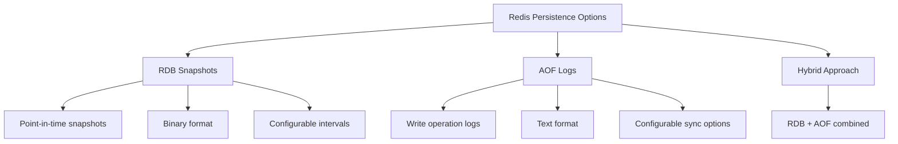

# Redis Persistence

## Introduction

Redis is commonly known as an in-memory data store, which means it primarily keeps all its data in RAM for extremely fast access. However, this raises an important question: what happens to your data when the Redis server restarts or crashes?

This is where **Redis Persistence** comes in. Persistence refers to the mechanisms Redis uses to save data to disk, ensuring it survives server restarts, crashes, or power failures. Without persistence, all data would be lost whenever Redis stops running.

In this guide, we'll explore:
- Why persistence is important
- The persistence options available in Redis
- How to configure and use each option
- Best practices for ensuring your data remains safe

## Why Persistence Matters

Redis' speed comes from storing data in memory, but this creates a trade-off with durability. Let's understand why persistence matters:

1. **Data Recovery**: Allows you to recover data after a restart or crash
2. **Backup**: Provides a way to create backups of your data
3. **Data Migration**: Enables moving data between Redis instances
4. **Disaster Recovery**: Helps in recovering from hardware failures

## Redis Persistence Options

Redis offers several persistence mechanisms, each with different trade-offs between performance and data safety:



Let's explore each option in detail.

## RDB (Redis Database) Persistence

RDB persistence works by taking snapshots of your dataset at specified intervals and saving them to disk as a single compact file.

### How RDB Works

1. Redis creates a point-in-time snapshot of the dataset
2. The snapshot is written to a temporary file
3. Once the write is complete, the temporary file replaces the previous snapshot
4. During this process, Redis continues serving requests using a child process for the dump

### Configuring RDB

RDB configuration is handled in the `redis.conf` file:

```
# Save a snapshot every 60 seconds if at least 1000 keys changed
save 60 1000

# Save a snapshot every 300 seconds if at least 10 keys changed
save 300 10

# Save a snapshot every 900 seconds if at least 1 key changed
save 900 1

# Filename for the RDB file
dbfilename dump.rdb

# Directory where the RDB file will be stored
dir /var/lib/redis
```

### Example: Enabling RDB in Redis CLI

You can also configure RDB settings dynamically using the Redis CLI:

```
> CONFIG SET save "900 1 300 10 60 1000"
OK
```

### Advantages of RDB

- **Compact files**: RDB creates a single compact file, ideal for backups
- **Performance**: Minimal impact on performance, especially with appropriate save intervals
- **Faster restarts**: Faster recovery when restarting as it loads a single file
- **Fork safety**: Uses fork() for creating snapshots without blocking the main process

### Disadvantages of RDB

- **Potential data loss**: You might lose data between snapshots if Redis crashes
- **Fork overhead**: The fork() operation can cause delays on systems with large datasets
- **Not suitable for real-time persistence**: Not appropriate when minimal data loss is required

## AOF (Append-Only File) Persistence

The AOF persistence logs every write operation received by the server. These operations can then be replayed when the server starts, reconstructing the original dataset.

### How AOF Works

1. Redis appends every write command to the AOF file
2. The file can be configured to sync at different intervals
3. On restart, Redis executes the commands in the AOF to rebuild the dataset

### Configuring AOF

AOF configuration in `redis.conf`:

```
# Enable AOF persistence
appendonly yes

# AOF filename
appendfilename "appendonly.aof"

# Fsync policy: always, everysec, or no
appendfsync everysec

# Automatic AOF rewriting
auto-aof-rewrite-percentage 100
auto-aof-rewrite-min-size 64mb
```

### AOF Sync Policies

Redis provides three options for syncing the AOF file:

1. **always**: Sync after every write for maximum durability (slower)
2. **everysec**: Sync once per second (good balance between safety and performance)
3. **no**: Let the OS decide when to sync (fastest but riskiest)

### Example: Enabling AOF with Redis CLI

```
> CONFIG SET appendonly yes
OK
> CONFIG SET appendfsync everysec
OK
```

### Advantages of AOF

- **Durability**: More durable than RDB, with configurable fsync policies
- **Automatic rewrites**: AOF files are automatically rewritten when they get too large
- **Easy to understand**: Contains actual Redis commands in plain text
- **More robust**: If the AOF file is corrupted, Redis includes tools to fix it

### Disadvantages of AOF

- **Larger files**: AOF files are typically larger than RDB files
- **Slower replication**: Can be slower than RDB for replication
- **Some commands may be slow to replay**: Complex operations take time to reconstruct

## AOF Rewriting

As the AOF file grows, Redis can automatically rewrite it to make it more compact while preserving the dataset:

```
> BGREWRITEAOF
Background append only file rewriting started
```

The rewrite process:
1. Creates a minimal set of commands needed to recreate the current dataset
2. Uses a child process to avoid blocking the main Redis process
3. Replaces the old file once rewriting is complete

## Hybrid Persistence (RDB + AOF)

Redis 4.0 and later support a hybrid persistence model:

```
# Enable hybrid persistence
aof-use-rdb-preamble yes
```

This approach:
1. Stores an RDB snapshot at the beginning of the AOF file
2. Appends AOF logs for commands executed after the snapshot
3. Combines the speed of RDB loading with the durability of AOF

## Example: Implementing Different Persistence Strategies

Let's look at some real-world scenarios and how to configure Redis accordingly:

### Example 1: High-performance Cache (Minimal Persistence)

For a Redis instance used primarily as a cache where data loss is acceptable:

```
# Disable AOF
appendonly no

# Take snapshots every 15 minutes if at least 1 key changed
save 900 1

# Other RDB saves disabled
save ""
save ""
```

### Example 2: Critical Data Store (Maximum Durability)

For storing important data where minimal loss is acceptable:

```
# Enable AOF
appendonly yes

# Sync after every command
appendfsync always

# Enable RDB as a backup
save 900 1
save 300 10
save 60 10000

# Use hybrid persistence
aof-use-rdb-preamble yes
```

## Checking Persistence Status

You can check the status of your persistence configuration using the `INFO` command:

```
> INFO persistence
# Persistence
loading:0
rdb_changes_since_last_save:0
rdb_bgsave_in_progress:0
rdb_last_save_time:1617984511
rdb_last_bgsave_status:ok
rdb_last_bgsave_time_sec:0
rdb_current_bgsave_time_sec:-1
rdb_last_cow_size:0
aof_enabled:1
aof_rewrite_in_progress:0
aof_rewrite_scheduled:0
aof_last_rewrite_time_sec:-1
aof_current_rewrite_time_sec:-1
aof_last_bgrewrite_status:ok
aof_last_write_status:ok
aof_last_cow_size:0
```

## Manually Creating RDB Snapshots

You can manually trigger an RDB snapshot using the `SAVE` or `BGSAVE` commands:

```
# Blocking save (not recommended in production)
> SAVE
OK

# Background save (recommended)
> BGSAVE
Background saving started
```

## Backing Up Redis Data

To back up Redis data:

1. For RDB: Copy the RDB file (default: `dump.rdb`)
2. For AOF: Copy the AOF file (default: `appendonly.aof`)
3. Use the `COPY` command if backing up to the same filesystem:

```bash
# On the server where Redis is running
cp /var/lib/redis/dump.rdb /backup/redis/dump-$(date +%Y%m%d).rdb
```

## Best Practices for Redis Persistence

1. **Use both RDB and AOF**: For important data, enable both persistence methods
2. **Tune save points**: Adjust RDB save points based on your write frequency
3. **Use everysec for AOF**: The `everysec` setting offers a good compromise between performance and data safety
4. **Monitor disk space**: Ensure you have enough disk space for both AOF and RDB files
5. **Regular backups**: Copy persistence files to external storage regularly
6. **Test recovery**: Regularly test recovering from persistence files

## Common Issues and Troubleshooting

### Issue: Redis Won't Start Due to Corrupted AOF

If Redis fails to start due to AOF corruption:

```bash
# Check Redis logs for errors
tail /var/log/redis/redis-server.log

# Use redis-check-aof to fix the AOF file
redis-check-aof --fix /var/lib/redis/appendonly.aof
```

### Issue: RDB Snapshots Taking Too Long

If RDB snapshots are causing performance issues:

1. Adjust the save points to be less frequent
2. Ensure your server has enough memory to handle the fork() operation
3. Consider using an instance with faster disks

## Summary

Redis persistence is a crucial aspect of using Redis in production environments. The key points to remember:

- **RDB** provides point-in-time snapshots with minimal performance impact
- **AOF** offers higher durability by logging every write operation
- **Hybrid approach** combines the benefits of both methods
- The right persistence strategy depends on your specific use case and requirements

By properly configuring Redis persistence, you can ensure your data remains safe while maintaining the performance benefits that make Redis popular.

## Practice Exercises

1. Configure Redis with different RDB save points and observe the impact on performance
2. Enable AOF persistence and compare different fsync policies
3. Simulate a server crash and practice recovering data using RDB and AOF files
4. Set up automated backups for your Redis persistence files
5. Experiment with the hybrid persistence mode and measure startup times

## Additional Resources

- [Redis Persistence Documentation](https://redis.io/topics/persistence)
- [Redis Configuration Documentation](https://redis.io/topics/config)
- [Redis Admin Guide](https://redis.io/topics/admin)