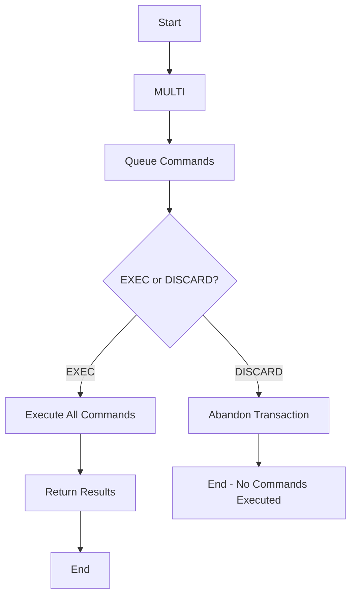

# Redis Transactions

## Introduction

When working with databases, you often need to execute multiple operations as a single atomic unit—either all commands succeed, or none of them do. Redis transactions provide a way to group multiple commands together and execute them sequentially, ensuring that no other client can interrupt the execution.

Unlike transactions in traditional relational databases, Redis transactions don't provide rollback capabilities but do guarantee command isolation and atomicity. This tutorial explains how Redis transactions work, when to use them, and provides practical examples to help you implement them in your applications.

## Understanding Redis Transactions

A Redis transaction is a sequence of commands that are executed as a single isolated operation. Redis transactions are centered around these key commands:

- `MULTI`: Marks the start of a transaction block
- `EXEC`: Executes all commands issued after MULTI
- `DISCARD`: Cancels the transaction, abandoning all commands issued after MULTI
- `WATCH`: Monitors keys for changes before transaction execution

Let's examine how these commands work together to create reliable transactions.

## Basic Transaction Example

Here's a simple example of a Redis transaction:

```redis
MULTI
SET user:1:balance 100
INCR user:1:balance
GET user:1:balance
EXEC
```

Output:
```
1) OK
2) (integer) 101
3) "101"
```

In this example:
1. `MULTI` starts the transaction
2. We queue up three commands without executing them yet
3. `EXEC` executes all commands in order and returns their results as an array

## Transaction Workflow



## Error Handling in Transactions

Redis transactions handle errors differently depending on when they occur:

### 1. Command Queuing Errors

If a command has syntax errors during the queuing phase, Redis will detect this before execution:

```redis
MULTI
SET key1 "Hello"
SYNTAX_ERROR
SET key2 "World"
EXEC
```

Output:
```
(error) ERR unknown command 'SYNTAX_ERROR'
```

In this case, the transaction is aborted before execution, and no commands are processed.

### 2. Execution Errors

If errors occur during execution (like wrong data types), Redis will still execute all other commands:

```redis
MULTI
SET counter "not_a_number"
INCR counter
GET counter
EXEC
```

Output:
```
1) OK
2) (error) ERR value is not an integer or out of range
3) "not_a_number"
```

Notice that:
- The `SET` command succeeds
- The `INCR` command fails (cannot increment a string that's not a number)
- The `GET` command still executes

This behavior is different from traditional database transactions where a rollback would occur.

## Optimistic Locking with WATCH

Redis provides optimistic locking through the `WATCH` command. This mechanism allows you to monitor specific keys and abort the transaction if any watched key is modified before the transaction executes.

```redis
WATCH account:1
val = GET account:1
MULTI
SET account:1 $newval
EXEC
```

If another client modifies `account:1` between the `WATCH` and `EXEC` commands, the transaction will fail and return `nil` (meaning the transaction was not executed).

### Example with WATCH

Let's see how `WATCH` works with a practical example of transferring money between accounts:

```redis
WATCH account:1 account:2
balance1 = GET account:1
balance2 = GET account:2

if (balance1 >= amount) {
    MULTI
    DECRBY account:1 amount
    INCRBY account:2 amount
    EXEC
} else {
    UNWATCH
}
```

This pattern ensures that if another client modifies either account balance before our transaction executes, our transaction will be aborted automatically.

## Real-World Applications

### Example 1: Implementing a Counter with Atomic Increment

```redis
MULTI
INCR pageviews
EXPIRE pageviews 300
EXEC
```

This transaction atomically increments a page view counter and sets its expiration time.

### Example 2: Managing a Leaderboard Update

```redis
MULTI
ZADD leaderboard 125 "player:1"
ZREM leaderboard "player:2"
ZRANK leaderboard "player:1"
EXEC
```

This transaction updates a sorted set leaderboard by adding one player's score, removing another player, and checking the rank of the first player.

### Example 3: User Registration with Validation

```javascript
// Pseudocode showing client-side implementation
function registerUser(username, email) {
  // Watch the keys to monitor for changes
  redis.watch(`user:${username}`, `email:${email}`);
  
  // Check if username or email already exists
  const usernameExists = redis.get(`user:${username}`);
  const emailExists = redis.get(`email:${email}`);
  
  if (usernameExists || emailExists) {
    redis.unwatch();
    return { success: false, message: "Username or email already taken" };
  }
  
  // Start transaction for atomic user creation
  const result = redis.multi()
    .set(`user:${username}`, email)
    .set(`email:${email}`, username)
    .sadd('users', username)
    .exec();
    
  if (result === null) {
    return { success: false, message: "Registration failed, please try again" };
  }
  
  return { success: true, message: "User registered successfully" };
}
```

## When to Use Redis Transactions

Redis transactions are ideal for:

1. **Ensuring atomicity** - When multiple operations must succeed or fail as a unit
2. **Avoiding race conditions** - When concurrent clients might access the same data
3. **Performance optimization** - When you need to minimize round-trips to the server

## When NOT to Use Redis Transactions

Redis transactions may not be suitable for:

1. **Complex business logic** - If you need complex conditional logic within transactions (consider Lua scripts instead)
2. **Cases requiring rollbacks** - Redis doesn't support true rollbacks like traditional databases
3. **Long-running operations** - Transactions block the server during execution

## Redis Transactions vs. Lua Scripts

Redis offers two ways to execute multiple commands atomically:

**Redis Transactions**:
- Simple to understand and use
- Support optimistic locking with WATCH
- Commands are visible in monitoring tools

**Lua Scripts**:
- Allow more complex logic (conditionals, loops)
- Execute as a single atomic operation
- Can be pre-loaded and called with a single command

Choose based on your complexity needs and performance requirements.

## Common Pitfalls and Best Practices

### Pitfalls to Avoid

1. **Assuming rollback capabilities**: Redis won't undo changes if a command fails during execution
2. **Forgetting to check EXEC results**: A `nil` result means the transaction was aborted
3. **Not using WATCH properly**: If you don't need optimistic locking, don't use WATCH unnecessarily
4. **Blocking the server**: Keep transactions short to avoid blocking the server for too long

### Best Practices

1. **Keep transactions small and focused**
2. **Always check EXEC return values**
3. **Handle optimistic locking failures gracefully**
4. **Consider Lua scripts for complex operations**
5. **Test transactions under concurrent load**

## Summary

Redis transactions provide a way to execute multiple commands atomically, with guarantees of isolation from other clients. While they don't offer rollback capabilities like traditional database systems, they provide powerful tools for ensuring data consistency through command grouping and optimistic locking.

Key takeaways:
- Use `MULTI`, `EXEC`, and `DISCARD` to manage transaction blocks
- Use `WATCH` for optimistic locking when needed
- Understand that Redis won't roll back changes if a command fails during execution
- Consider the alternatives (like Lua scripts) for complex operations

## Practice Exercises

1. Implement a simple inventory system that atomically updates product quantities and records the transaction
2. Create a rate-limiting system using Redis transactions that tracks API usage within time windows
3. Build a basic banking system with account transfers that use optimistic locking to prevent race conditions

## Additional Resources

- [Redis Official Documentation on Transactions](https://redis.io/docs/manual/transactions/)
- [Redis Lua Scripting Guide](https://redis.io/docs/manual/programmability/eval-intro/)
- [Redis Command Reference](https://redis.io/commands/)