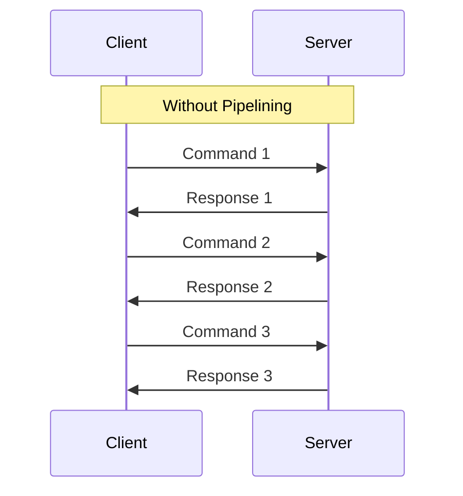
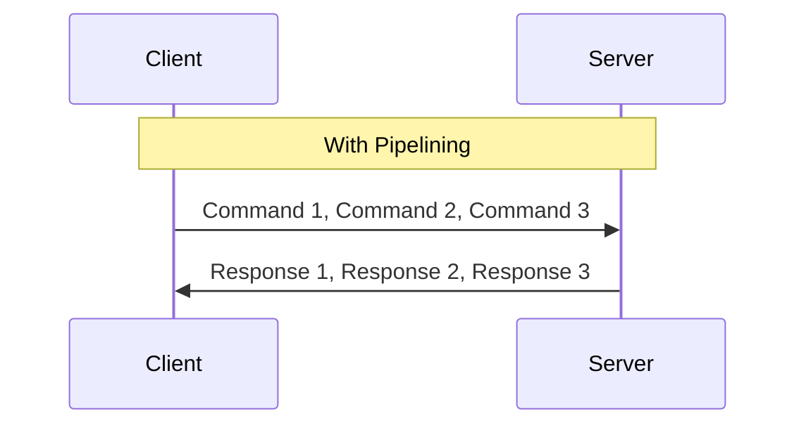

# Redis Pipelining

## Introduction

When working with Redis, each command you send typically requires a complete request-response cycle over the network. This back-and-forth communication introduces latency that can limit your application's performance, especially when executing many commands in sequence.

**Redis Pipelining** solves this problem by allowing you to send multiple commands to the Redis server without waiting for individual responses. The server processes all commands and returns all responses together, significantly reducing network overhead and improving throughput.

## Understanding Network Latency

Before diving into pipelining, let's understand why it's needed:



In this traditional approach, each command must complete its round trip before the next command begins. If the network round-trip time (RTT) is 1ms, then executing 1000 sequential commands would take at least 1000ms, even if each command's actual processing time is negligible.

## How Pipelining Works

With pipelining, multiple commands are sent in a single batch:



The client sends all commands at once without waiting for responses. The server processes them in sequence and returns all responses together, eliminating the network latency between commands.

## Basic Pipelining Example

Let's see how to use pipelining in different Redis clients:

### Using Redis-CLI

The Redis command line interface supports pipelining:

```bash
# Create a file with Redis commands
echo -e "SET key1 value1
SET key2 value2
GET key1
GET key2" > commands.txt

# Execute commands in a pipeline
cat commands.txt | redis-cli --pipe
```

Output:
```
All data transferred. Waiting for the last reply...
Last reply received from server.
errors: 0, replies: 4
```

### Using Node.js (with node-redis)

```javascript
const redis = require('redis');
const client = redis.createClient();

// Execute commands in a pipeline
const pipeline = client.pipeline();
pipeline.set('key1', 'value1');
pipeline.set('key2', 'value2');
pipeline.get('key1');
pipeline.get('key2');

// Execute the pipeline
pipeline.exec((err, results) => {
  if (err) {
    console.error('Pipeline failed:', err);
    return;
  }
  console.log('Pipeline results:', results);
  // results will be an array of responses: [OK, OK, 'value1', 'value2']
  
  client.quit();
});
```

### Using Python (with redis-py)

```python
import redis

r = redis.Redis()

# Execute commands in a pipeline
pipe = r.pipeline()
pipe.set('key1', 'value1')
pipe.set('key2', 'value2')
pipe.get('key1')
pipe.get('key2')

# Execute the pipeline
results = pipe.execute()
print(f"Pipeline results: {results}")
# Output: Pipeline results: [True, True, b'value1', b'value2']
```

## Performance Comparison

To demonstrate the performance benefits, let's compare the execution time of 10,000 SET operations with and without pipelining:

### Without Pipelining:

```python
import redis
import time

r = redis.Redis()

# Without pipelining
start_time = time.time()
for i in range(10000):
    r.set(f"key:{i}", f"value:{i}")
end_time = time.time()

print(f"Without pipelining: {end_time - start_time:.2f} seconds")
# Example output: Without pipelining: 10.24 seconds
```

### With Pipelining:

```python
import redis
import time

r = redis.Redis()

# With pipelining
start_time = time.time()
pipe = r.pipeline()
for i in range(10000):
    pipe.set(f"key:{i}", f"value:{i}")
pipe.execute()
end_time = time.time()

print(f"With pipelining: {end_time - start_time:.2f} seconds")
# Example output: With pipelining: 0.47 seconds
```

The pipelined version can be **20-50 times faster** depending on your network conditions.

## Best Practices and Considerations

### Pipeline Size

While pipelining improves performance, excessively large pipelines can consume significant memory on both client and server. A good rule of thumb:

- **Too small**: Less than 10 commands in a pipeline may not provide significant benefits
- **Comfortable range**: 50-1000 commands often provides optimal performance
- **Too large**: More than 10,000 commands may cause memory pressure

### Transactions in Pipelines

Redis pipelining can be combined with transactions using the `MULTI` and `EXEC` commands:

```python
import redis

r = redis.Redis()

# Pipelining with a transaction
pipe = r.pipeline(transaction=True)  # This is equivalent to sending MULTI before commands
pipe.set('transaction-key1', 'value1')
pipe.incr('counter')
pipe.set('transaction-key2', 'value2')
results = pipe.execute()  # This sends EXEC
print(f"Transaction results: {results}")
```

The transaction ensures all commands are executed atomically.

### When Not to Use Pipelining

Pipelining is not suitable when:

1. You need the result of one command to determine the next command
2. Commands have different failure handling requirements
3. Your application needs real-time responses for each command

### Error Handling

When an error occurs in a pipeline, the pipeline continues execution and reports errors in the results:

```python
import redis

r = redis.Redis()

pipe = r.pipeline()
pipe.set('valid-key', 'value')
pipe.hset('valid-key', 'field', 'value')  # This will fail since valid-key is a string, not a hash
pipe.get('valid-key')
results = pipe.execute(raise_on_error=False)
print(f"Results with error: {results}")
# Output: Results with error: [True, ResponseError("WRONGTYPE Operation against a key..."), b'value']
```

## Real-World Application: Bulk Data Loading

One common use case for pipelining is efficiently loading large datasets into Redis:

```python
import redis
import csv

r = redis.Redis()
pipe = r.pipeline()
counter = 0

# Load a large CSV file into Redis
with open('data.csv', 'r') as file:
    reader = csv.DictReader(file)
    for row in reader:
        user_id = row['user_id']
        pipe.hset(f"user:{user_id}", mapping=row)
        
        counter += 1
        # Execute in batches of 1000
        if counter % 1000 == 0:
            pipe.execute()
            print(f"Loaded {counter} records")
            pipe = r.pipeline()

# Execute any remaining commands
if counter % 1000 != 0:
    pipe.execute()
    
print(f"Total records loaded: {counter}")
```

## Real-World Application: Caching Multiple API Responses

When your application needs to cache multiple API responses at once:

```javascript
async function cacheMultipleApiResponses(endpoints) {
  const redis = require('redis');
  const { promisify } = require('util');
  const client = redis.createClient();
  const setAsync = promisify(client.set).bind(client);
  const pipeline = client.pipeline();
  
  // Fetch all API responses
  const results = await Promise.all(endpoints.map(url => fetch(url).then(res => res.json())));
  
  // Cache all results in a pipeline
  endpoints.forEach((url, index) => {
    const cacheKey = `api:${Buffer.from(url).toString('base64')}`;
    pipeline.set(cacheKey, JSON.stringify(results[index]), 'EX', 3600); // Expire in 1 hour
  });
  
  // Execute pipeline
  await new Promise((resolve, reject) => {
    pipeline.exec((err, results) => {
      if (err) reject(err);
      else resolve(results);
    });
  });
  
  client.quit();
  return results;
}
```

## Summary

Redis pipelining is a powerful technique that significantly improves performance by reducing network round trips. Key takeaways:

- Pipelining batches multiple commands to reduce latency
- It can improve performance by 10-50x for many sequential operations
- It works with all Redis clients and can be combined with transactions
- Optimal pipeline size is typically between 50-1000 commands
- Ideal for bulk operations like data loading and mass updates

## Further Learning

To deepen your understanding of Redis pipelining:

1. Try implementing the performance comparison yourself
2. Experiment with different pipeline sizes to find the optimal performance for your environment
3. Combine pipelining with Redis transactions for atomic operations
4. Practice implementing a real bulk data loader using pipelining

## Exercises

1. Modify the Python performance comparison to test different pipeline sizes (10, 100, 1000, 10000) and graph the results
2. Implement a function that uses pipelining to atomically increment multiple counters in a single round trip
3. Create a script that uses pipelining to efficiently export all keys matching a pattern to a JSON file
4. Implement a bulk delete function that efficiently removes thousands of keys with a specific prefix