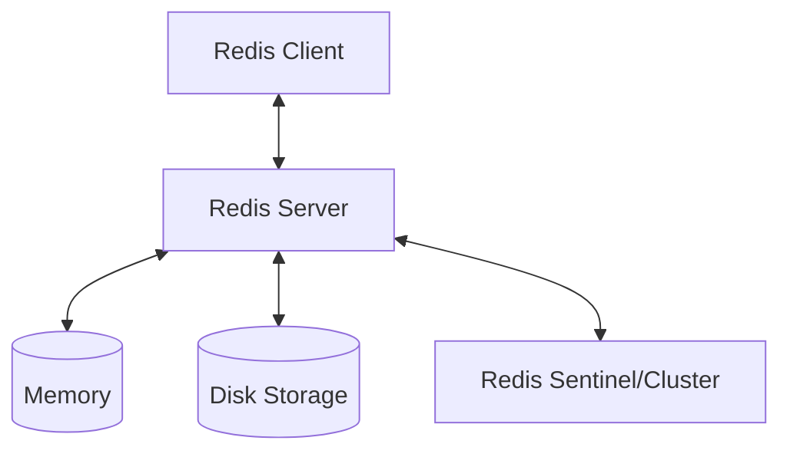
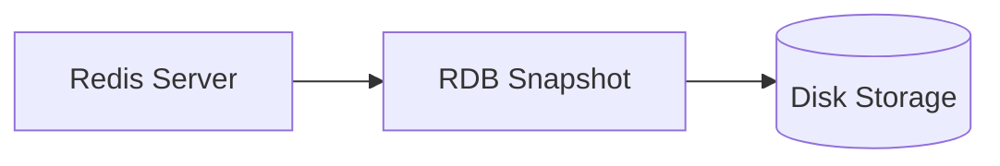
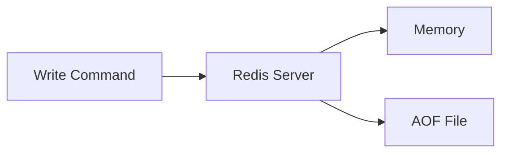
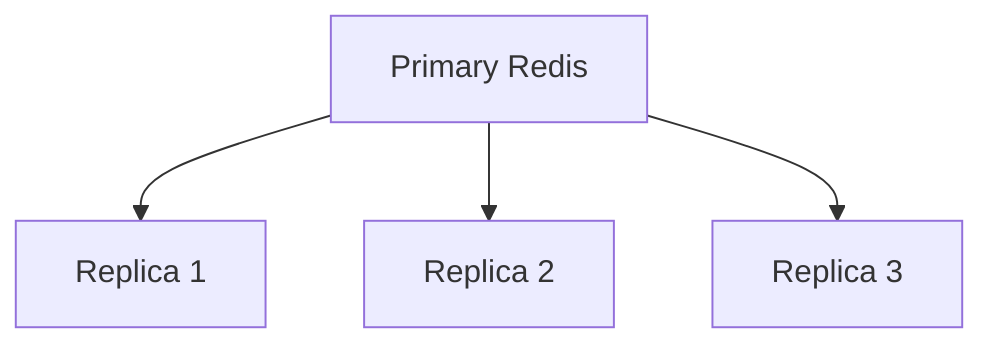
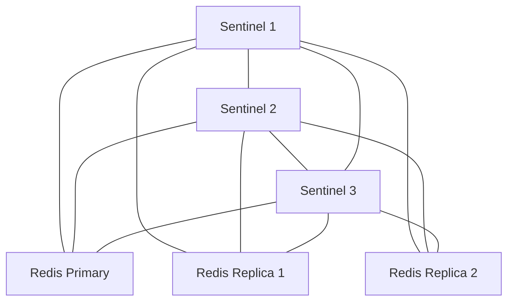
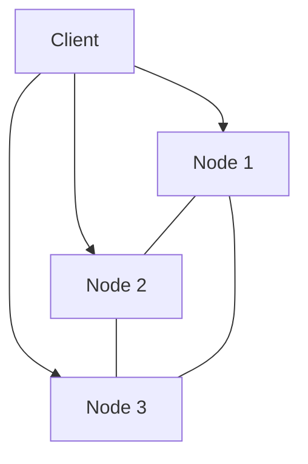
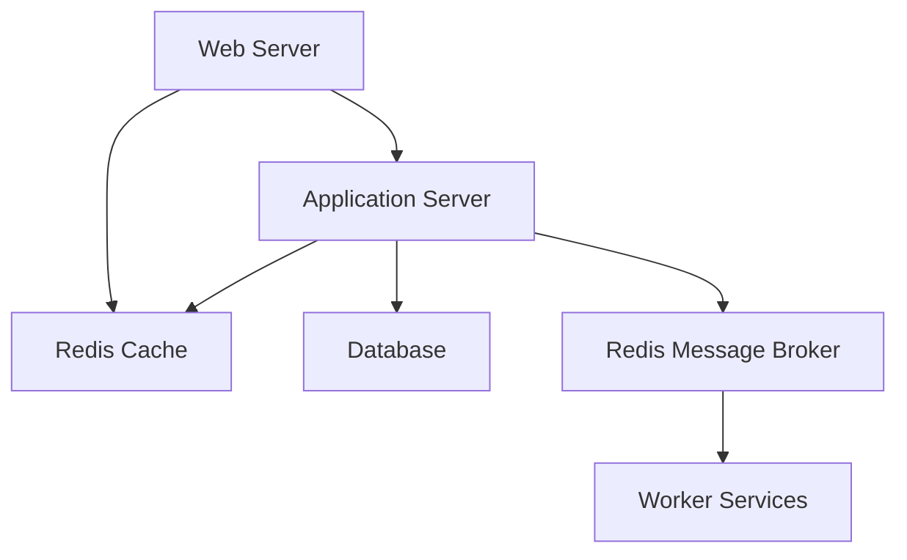

# Redis Architecture

## Introduction

Redis (Remote Dictionary Server) is an open-source, in-memory data structure store that can be used as a database, cache, message broker, and streaming engine. Unlike traditional disk-based databases, Redis keeps its entire dataset in memory, making it exceptionally fast for read and write operations.

In this article, we'll explore Redis's architecture, including its core components, data model, persistence mechanisms, and high availability features. By understanding how Redis is built, you'll be able to make better decisions about when and how to use it in your applications.

## Core Architectural Components

Redis follows a client-server architecture with a simple yet powerful design:



### Single-Threaded Event Loop

One of the most distinctive aspects of Redis's architecture is its primarily single-threaded nature:

- Redis processes commands one at a time, avoiding complex concurrency issues
- Uses an event loop to handle multiple client connections efficiently
- Achieves high performance through optimized data structures and efficient algorithms
- Recent versions of Redis use multiple threads for specific operations like I/O, but the core processing remains single-threaded

Let's see a simple example of how this affects Redis's behavior:

```javascript
// Multiple commands sent to Redis
client.set("counter", 0);
client.incr("counter");
client.incr("counter");
// These commands are processed sequentially, not concurrently
```

This single-threaded model means Redis operations are atomic by default, without needing complex locking mechanisms.

## Data Model and In-Memory Storage

Redis stores all data in RAM using specialized data structures:

### Key-Value Storage

At its core, Redis operates as a key-value store, where:

- Every piece of data has a unique key (string)
- Values can be of different data types (strings, lists, sets, etc.)
- Keys are organized in a flat namespace (no nesting)

Example of basic key-value storage:

```bash
# Setting and retrieving a simple string value
> SET user:1:name "John Doe"
OK
> GET user:1:name
"John Doe"
```

### Redis Data Structures

Redis supports various specialized data structures, each with dedicated commands:

1. **Strings**: The most basic data type
2. **Lists**: Linked lists of strings
3. **Sets**: Unordered collections of unique strings
4. **Sorted Sets**: Sets with a score for ordering
5. **Hashes**: Maps of field-value pairs
6. **Bitmaps and HyperLogLogs**: Special encodings for specific use cases
7. **Streams**: Append-only log data structures

Example of a hash data structure:

```bash
# Creating and accessing a hash that represents a user profile
> HSET user:1 name "John" age 30 country "USA"
(integer) 3
> HGETALL user:1
1) "name"
2) "John"
3) "age" 
4) "30"
5) "country"
6) "USA"
```

## Redis Persistence

While Redis is primarily an in-memory database, it offers several persistence options to ensure data durability:

### RDB (Redis Database)

RDB persistence performs point-in-time snapshots of your dataset at specified intervals:



Configuration example:

```bash
# Redis configuration for RDB
save 900 1      # Create a snapshot if at least 1 key changes in 900 seconds
save 300 10     # Create a snapshot if at least 10 keys change in 300 seconds
save 60 10000   # Create a snapshot if at least 10000 keys change in 60 seconds
```

### AOF (Append Only File)

AOF logs every write operation received by the server:



Configuration example:

```bash
# Redis configuration for AOF
appendonly yes
appendfsync everysec  # Sync AOF once per second
```

### Combined Persistence

Redis can use both RDB and AOF together for better durability and recovery capabilities:

```bash
# Redis using both persistence methods
appendonly yes
save 900 1
```

## Redis Replication

Redis supports primary-replica replication for enhanced data availability:



Setting up basic replication:

```bash
# On the replica server
replicaof 192.168.1.100 6379
```

Replication features:

- Asynchronous replication
- Multiple replicas per primary
- Replicas can have their own replicas
- Replicas accept read queries by default

## High Availability with Redis Sentinel

Redis Sentinel provides high availability for Redis through:

- Monitoring: Checking if primary and replica instances are working as expected
- Notification: Alerting administrators about problems
- Automatic failover: Promoting a replica to primary when the primary fails



Basic Sentinel configuration:

```bash
# sentinel.conf
sentinel monitor mymaster 127.0.0.1 6379 2
sentinel down-after-milliseconds mymaster 5000
sentinel failover-timeout mymaster 60000
```

## Scaling with Redis Cluster

For applications that need to scale beyond a single Redis server, Redis Cluster provides:

- Automatic data sharding across multiple nodes
- High availability during partitions
- Linear scalability up to 1000 nodes



Redis Cluster uses a concept called hash slots:

```bash
# Creating a simple 3-node cluster
redis-cli --cluster create 127.0.0.1:7000 127.0.0.1:7001 127.0.0.1:7002
```

The key space is divided into 16,384 hash slots distributed among the nodes.

## Memory Management

Being an in-memory database, Redis carefully manages its memory usage:

### Memory Policies

Redis offers several memory policies when the maximum memory limit is reached:

```bash
# Setting max memory and eviction policy
maxmemory 1gb
maxmemory-policy allkeys-lru  # Evict least recently used keys
```

Common policies include:

- **noeviction**: Return errors when memory limit is reached
- **allkeys-lru**: Evict least recently used keys
- **volatile-lru**: Evict least recently used keys with expiration set
- **allkeys-random**: Evict random keys
- **volatile-ttl**: Evict keys with shortest time-to-live first

### Memory Optimization

Redis implements several memory optimization techniques:

1. **Special Encoding**: Small integers are stored efficiently
2. **Shared Objects**: Common strings can be shared between keys
3. **Memory Compression**: Redis compresses certain data structures internally

## Practical Example: Building a Caching Layer

Let's implement a simple caching layer with Redis in Node.js:

```javascript
const redis = require('redis');
const client = redis.createClient();

async function fetchUserData(userId) {
  // Try to get data from cache first
  const cachedData = await client.get(`user:${userId}`);
  
  if (cachedData) {
    console.log('Cache hit!');
    return JSON.parse(cachedData);
  }
  
  console.log('Cache miss, fetching from database...');
  // Simulate database call
  const userData = await simulateDatabaseQuery(userId);
  
  // Store in cache for future requests (expires in 1 hour)
  await client.set(`user:${userId}`, JSON.stringify(userData), {
    EX: 3600
  });
  
  return userData;
}

async function simulateDatabaseQuery(userId) {
  // This would be a real database query in production
  return new Promise(resolve => {
    setTimeout(() => {
      resolve({
        id: userId,
        name: 'Example User',
        email: 'user@example.com',
        // more data...
      });
    }, 500); // Simulate 500ms database query
  });
}
```

This pattern dramatically improves application performance by reducing database load.

## Redis Architecture in Production

In a production environment, Redis architecture often involves:

1. **Frontend Cache**: Redis used for session storage and rate limiting
2. **Application Cache**: Reducing load on primary databases
3. **Message Broker**: Implementing pub/sub between services
4. **Data Storage**: For specific high-velocity data needs



## Summary

Redis's architecture is designed for speed, simplicity, and flexibility:

- **In-memory storage** provides exceptional performance
- **Single-threaded model** simplifies development with atomic operations
- **Rich data structures** enable versatile use cases
- **Persistence options** provide durability without sacrificing speed
- **High availability features** make Redis suitable for critical applications
- **Scalability through clustering** allows Redis to grow with your application

Understanding Redis's architecture helps you leverage its strengths while avoiding potential pitfalls. Redis excels at tasks requiring high-speed data access, real-time analytics, caching, and message brokering.

## Exercises

1. Set up a Redis server and experiment with different data structures.
2. Configure RDB and AOF persistence and observe how they affect performance.
3. Create a simple replica setup and test failover scenarios.
4. Implement a rate-limiting solution using Redis.
5. Build a simple message queue using Redis Lists.

## Additional Resources

- Redis Documentation: The official documentation provides comprehensive information about Redis commands and configuration options.
- Redis University: Free online courses covering different aspects of Redis.
- Redis Source Code: The Redis codebase is well-written and commented, making it an excellent learning resource.
- Redis Explained: Detailed explanations of Redis internals on the Redis Labs blog.