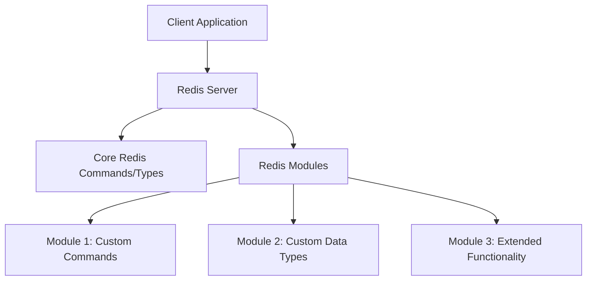

# Redis Modules

## Introduction

Redis Modules are powerful extensions that allow developers to enhance Redis with new commands and data types. While Redis offers a robust set of built-in functionality, modules provide a way to extend its capabilities to address specific use cases that aren't covered by the core Redis features.

Redis Modules were introduced in Redis 4.0 as a response to the growing need for customization while maintaining Redis' performance and simplicity. They're written in C and loaded into Redis at runtime, becoming an integral part of your Redis instance.

## Understanding Redis Modules

### What Are Redis Modules?

Redis Modules are dynamic libraries that extend Redis functionality. They allow you to:

- Add new commands to Redis
- Create custom data types with specialized operations
- Implement complex functionality that would be difficult with standard Redis commands
- Optimize for specific use cases with native C code performance

Let's visualize how Redis Modules fit into the Redis architecture:



### Why Use Redis Modules?

Redis Modules offer several advantages:

1. **Extensibility**: Add specialized functionality without waiting for features to be added to Redis core
2. **Performance**: Implement complex operations in C that run at native speed
3. **Simplicity**: Use purpose-built commands rather than complex Lua scripts
4. **Integration**: Bring external libraries and capabilities directly into Redis
5. **Maintainability**: Separate specialized code from your application logic

## Popular Redis Modules

Several modules have become widely used in the Redis ecosystem:

### RedisJSON

RedisJSON adds a JSON data type to Redis, allowing you to store, update, and retrieve JSON documents efficiently.

**Example: Storing and manipulating JSON data**

```
# Store a JSON document
>> JSON.SET user:1000 . '{"name":"John","email":"john@example.com","age":30,"address":{"city":"New York","zip":"10001"}}'
OK

# Get a specific field from the JSON document
>> JSON.GET user:1000 .name
"John"

# Update a nested field
>> JSON.SET user:1000 .address.city '"Boston"'
OK

# Get the updated document
>> JSON.GET user:1000
{"name":"John","email":"john@example.com","age":30,"address":{"city":"Boston","zip":"10001"}}
```

### RediSearch

RediSearch provides full-text search capabilities for Redis, including advanced querying, indexing, and aggregation.

**Example: Creating an index and searching**

```
# Create a search index on Redis hashes
>> FT.CREATE idx:users ON HASH PREFIX 1 user: SCHEMA name TEXT SORTABLE age NUMERIC SORTABLE city TEXT
OK

# Add some data
>> HSET user:1 name "John Doe" age 30 city "New York"
(integer) 3
>> HSET user:2 name "Jane Smith" age 27 city "Boston" 
(integer) 3
>> HSET user:3 name "Bob Johnson" age 35 city "New York"
(integer) 3

# Search for users in New York
>> FT.SEARCH idx:users "@city:\"New York\""
1) (integer) 2
2) "user:1"
3) 1) "name"
   2) "John Doe"
   3) "age"
   4) "30"
   5) "city"
   6) "New York"
4) "user:3"
5) 1) "name"
   2) "Bob Johnson"
   3) "age"
   4) "35"
   5) "city"
   6) "New York"
```

### RedisTimeSeries

RedisTimeSeries adds a time series data type to Redis, with built-in functionality for retention, downsampling, and aggregation.

**Example: Recording and querying time series data**

```
# Create a time series with retention policy and aggregation
>> TS.CREATE sensor:temp RETENTION 86400 DUPLICATE_POLICY LAST
OK

# Add some readings (timestamp in milliseconds, value)
>> TS.ADD sensor:temp 1577836800000 20.5
(integer) 1577836800000
>> TS.ADD sensor:temp 1577836860000 21.2
(integer) 1577836860000
>> TS.ADD sensor:temp 1577836920000 22.0
(integer) 1577836920000

# Get range with aggregation (average per 2 minutes)
>> TS.RANGE sensor:temp 1577836800000 1577837000000 AGGREGATION avg 120000
1) 1) (integer) 1577836800000
   2) "20.85"
2) 1) (integer) 1577836920000
   2) "22"
```

### RedisGraph

RedisGraph implements a graph database on top of Redis, with support for openCypher queries.

**Example: Creating and querying a graph**

```
# Create nodes and relationships
>> GRAPH.QUERY social "CREATE (:Person {name:'Alice', age:32})-[:KNOWS]->(:Person {name:'Bob', age:30})"
1) 1) "Labels added: 1"
   2) "Nodes created: 2"
   3) "Properties set: 4"
   4) "Relationships created: 1"

# Query the graph
>> GRAPH.QUERY social "MATCH (p:Person)-[:KNOWS]->(friend) RETURN p.name, friend.name"
1) 1) "p.name"
   2) "friend.name"
2) 1) 1) "Alice"
      2) "Bob"
```

## Creating Your Own Redis Module

While using existing modules is straightforward, creating your own module requires C programming knowledge. Let's explore the basic steps to create a simple Redis module.

### Module Structure

A Redis module typically follows this pattern:

```c
#include "redismodule.h"

// Command handler function
int MyCommand_RedisCommand(RedisModuleCtx *ctx, RedisModuleString **argv, int argc) {
    // Implementation goes here
    RedisModule_ReplyWithSimpleString(ctx, "Hello from my module!");
    return REDISMODULE_OK;
}

// Module initialization function
int RedisModule_OnLoad(RedisModuleCtx *ctx, RedisModuleString **argv, int argc) {
    // Initialize the module
    if (RedisModule_Init(ctx, "mymodule", 1, REDISMODULE_APIVER_1) == REDISMODULE_ERR)
        return REDISMODULE_ERR;

    // Register commands
    if (RedisModule_CreateCommand(ctx, "mymodule.hello", 
                                  MyCommand_RedisCommand, "readonly", 0, 0, 0) == REDISMODULE_ERR)
        return REDISMODULE_ERR;

    return REDISMODULE_OK;
}
```

### Building and Loading a Module

To build a module, you'll typically use a makefile that compiles your C code into a shared library:

```
gcc -shared -o mymodule.so -fPIC module.c
```

Then load it into Redis with:

```
>> MODULE LOAD /path/to/mymodule.so
OK

>> MYMODULE.HELLO
"Hello from my module!"
```

## Using Redis Modules in Practice

Let's explore a real-world example of how Redis Modules can solve practical problems.

### Example: Building a Product Recommendation System

Imagine you're building an e-commerce website and need to implement product recommendations. You could use:

1. **RedisGraph**: To model relationships between products and users
2. **RediSearch**: To search products by attributes and text
3. **RedisTimeSeries**: To track user behavior over time

**Implementation:**

```
# Create a product index with RediSearch
>> FT.CREATE idx:products ON HASH PREFIX 1 product: SCHEMA name TEXT SORTABLE category TAG SORTABLE price NUMERIC SORTABLE
OK

# Store product data
>> HSET product:1001 name "Smartphone X" category "electronics" price 699.99
(integer) 3

# Record user views with RedisTimeSeries
>> TS.CREATE user:1000:views:1001 RETENTION 2592000
OK
>> TS.ADD user:1000:views:1001 * 1
(integer) 1612345678000

# Create product relationship graph with RedisGraph
>> GRAPH.QUERY recommendations "CREATE (:Product {id:'1001'})-[:FREQUENTLY_BOUGHT_WITH {weight:0.8}]->(:Product {id:'1002'})"
```

Then, to generate recommendations for a user:

```
# Find similar products based on graph relationships
>> GRAPH.QUERY recommendations "MATCH (p:Product {id:'1001'})-[r:FREQUENTLY_BOUGHT_WITH]->(rec) RETURN rec.id, r.weight ORDER BY r.weight DESC"

# Find products in the same category using RediSearch
>> FT.SEARCH idx:products "@category:{electronics} @price:[500 800]" LIMIT 0 5

# Combine results for personalized recommendations
```

This example demonstrates how different Redis Modules can work together to implement complex functionality that would be difficult to achieve with core Redis alone.

## Loading and Managing Modules

### Loading Modules

You can load modules in Redis in several ways:

1. **At runtime using the MODULE LOAD command:**

```
>> MODULE LOAD /path/to/module.so [arg1 arg2 ...]
OK
```

2. **In the redis.conf file:**

```
loadmodule /path/to/module.so [arg1 arg2 ...]
```

3. **When starting Redis:**

```
redis-server --loadmodule /path/to/module.so [arg1 arg2 ...]
```

### Managing Loaded Modules

Redis provides commands to manage modules:

```
# List all loaded modules
>> MODULE LIST
1) 1) "name"
   2) "redisjson"
   3) "ver"
   4) (integer) 10213

# Unload a module
>> MODULE UNLOAD redisjson
OK
```

## Module Compatibility and Considerations

When using Redis Modules, keep these factors in mind:

1. **Version Compatibility**: Modules are built for specific Redis versions
2. **Memory Usage**: Modules may increase Redis memory footprint
3. **Performance Impact**: Some modules may affect overall Redis performance
4. **Cluster Support**: Not all modules work with Redis Cluster
5. **Persistence**: Consider how module data is persisted (RDB/AOF)

## Summary

Redis Modules provide a powerful way to extend Redis functionality beyond its core capabilities. They allow developers to implement custom commands and data types to solve specific problems while maintaining Redis' performance characteristics.

In this guide, we've covered:
- What Redis Modules are and why they're useful
- Popular modules like RedisJSON, RediSearch, RedisTimeSeries, and RedisGraph
- The basics of creating your own Redis Module
- Practical examples of using modules in real-world applications
- How to load and manage modules in Redis

Redis Modules transform Redis from a simple key-value store into a versatile platform that can address a wide range of data storage and processing needs.

## Additional Resources

- [Redis Modules API Documentation](https://redis.io/topics/modules-api-ref)
- [Redis Modules Hub](https://redis.io/modules)
- [Redis Stack Documentation](https://redis.io/docs/stack/)

## Exercises

1. Install and experiment with RedisJSON to store and manipulate complex JSON documents
2. Create a simple full-text search application using RediSearch
3. Build a real-time dashboard that displays time series data from RedisTimeSeries
4. Design a social network data model using RedisGraph
5. Try writing a simple "Hello World" Redis Module in C