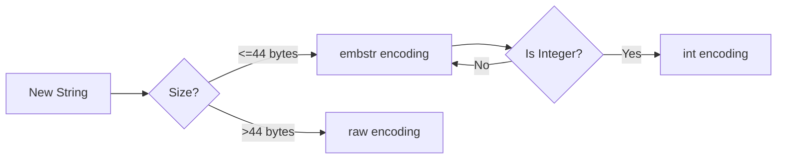

# Redis Strings

## Introduction

Strings are the most basic and versatile data type in Redis. Despite the name, Redis strings can store various types of data, including text, binary data, integers, and even serialized objects. They're perfect for storing simple values like user session data, counters, or cached HTML fragments.

In this guide, we'll explore Redis strings in depth, covering their characteristics, common operations, and practical use cases.

## Basic String Operations

### Setting and Getting Values

The most fundamental string operations are `SET` and `GET`:

```
SET key value
GET key
```

Example:

```
SET username "johndoe"
GET username
```

Output:
```
"johndoe"
```

You can also set multiple key-value pairs at once using `MSET` and retrieve multiple values using `MGET`:

```
MSET first_name "John" last_name "Doe" age 25
MGET first_name last_name age
```

Output:
```
1) "John"
2) "Doe"
3) "25"
```

### Setting Values with Expiration

Redis allows you to set a time-to-live (TTL) for keys, making them automatically expire after a specified time:

```
SET session:user123 "active" EX 3600  # Expires in 3600 seconds (1 hour)
```

You can also use `SETEX` as a shorthand:

```
SETEX temp_token 30 "a1b2c3d4"  # Key expires in 30 seconds
```

### Setting Values Conditionally

Redis provides options to set values only if the key exists or doesn't exist:

```
SET counter 10 NX  # Set only if key doesn't exist (useful for initialization)
SET counter 20 XX  # Set only if key already exists (useful for updates)
```

## String Commands for Numerical Operations

Redis strings can store integers and perform atomic operations on them:

### Incrementing and Decrementing

```
SET counter 10
INCR counter
GET counter
```

Output:
```
"11"
```

You can increment or decrement by specific values:

```
INCRBY counter 5
GET counter
```

Output:
```
"16"
```

```
DECR counter
GET counter
```

Output:
```
"15"
```

```
DECRBY counter 3
GET counter
```

Output:
```
"12"
```

Redis also supports float operations with `INCRBYFLOAT`:

```
SET pi 3.14
INCRBYFLOAT pi 0.01
GET pi
```

Output:
```
"3.15"
```

## String Size and Manipulation

### Getting String Length

```
SET message "Hello, Redis!"
STRLEN message
```

Output:
```
13
```

### Appending to Strings

```
SET greeting "Hello"
APPEND greeting ", World!"
GET greeting
```

Output:
```
"Hello, World!"
```

### Substring Operations

You can get a substring using `GETRANGE`:

```
SET message "Hello, Redis!"
GETRANGE message 0 4
```

Output:
```
"Hello"
```

And you can replace part of a string using `SETRANGE`:

```
SET message "Hello, World!"
SETRANGE message 7 "Redis!"
GET message
```

Output:
```
"Hello, Redis!"
```

## Memory Efficiency

Redis strings can hold up to 512MB of data, but they're typically used for smaller values. Redis uses a memory-efficient encoding for strings:

1. Strings containing integers that can be represented as a 64-bit signed integer are encoded as integers
2. Short strings (up to 44 bytes in Redis 6+) use an optimization called "embstr" encoding
3. Longer strings use the standard "raw" string encoding

This automatic optimization makes Redis strings efficient for storing various data types.



## Practical Use Cases

### User Session Storage

Redis strings are perfect for storing session data:

```
SET session:user123 "{\"user_id\":123,\"username\":\"johndoe\",\"last_active\":1634567890}" EX 3600
```

Later, you can retrieve the session:

```
GET session:user123
```

### Caching

Redis strings can cache expensive-to-compute data:

```
# Check if cached result exists
GET cache:homepage
# If not found, compute result and cache it
SET cache:homepage "<html>...</html>" EX 300
```

### Counters

Redis strings can implement high-performance counters:

```
# Track page views
INCR pageviews:homepage

# Track multiple metrics
MGET pageviews:homepage pageviews:about pageviews:contact
```

### Rate Limiting

You can implement a simple rate limiter using strings and expiration:

```
# Check if user has hit the rate limit
INCR ratelimit:user123
# Set expiration (first time only)
SET ratelimit:user123 1 EX 60 NX

# Later, check the count
GET ratelimit:user123
```

## Memory Usage Considerations

While strings can store up to 512MB, keep in mind Redis is an in-memory database. For large strings, consider:

1. Compressing the data before storing (e.g., using gzip)
2. Breaking large data into smaller chunks
3. Using external storage for very large objects and storing only references in Redis

## Summary

Redis strings are versatile, efficient, and powerful. They can store text, numbers, binary data, and serialized objects, making them suitable for various applications like caching, session storage, counters, and more.

Key takeaways:
- Use `SET` and `GET` for basic operations
- Use `INCR`/`DECR` for atomic counter operations
- Set expiration with `EX` or `SETEX` for temporary data
- Use `NX`/`XX` for conditional operations
- Redis automatically optimizes string storage based on content

## Practice Exercises

1. Create a visitor counter that expires daily
2. Implement a simple cache for API responses with a 5-minute TTL
3. Build a basic rate limiter allowing 10 requests per minute
4. Create a system that tracks the top 5 most viewed pages
5. Implement a token-based authentication system using expiring strings

## Additional Resources

- [Redis String Commands Documentation](https://redis.io/commands#string)
- [Redis Data Types Introduction](https://redis.io/topics/data-types-intro)
- [Redis Memory Optimization](https://redis.io/topics/memory-optimization)