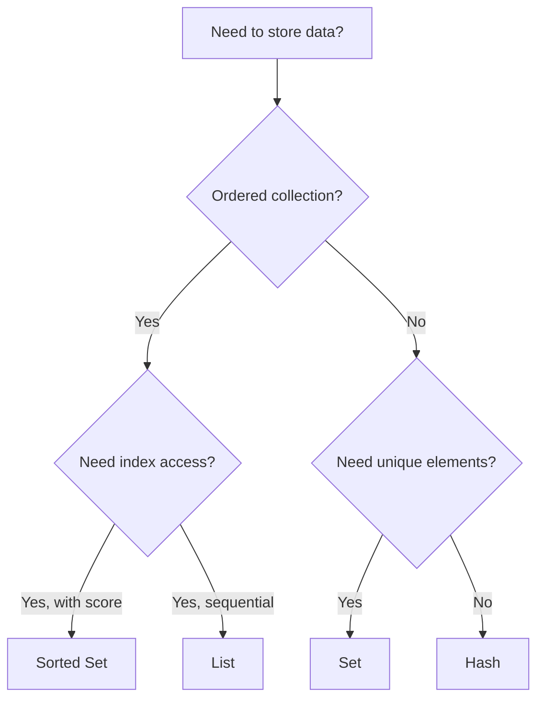

# Redis Lists

## Introduction

Redis Lists are one of the fundamental data structures offered by Redis. They provide a way to store and manage ordered collections of string elements. Unlike arrays in many programming languages, Redis Lists are implemented as linked lists, which makes them extremely efficient for operations that add or remove elements at the beginning or end of the list.

Lists in Redis can be used to implement various data structures like:
- Queues (FIFO - First In, First Out)
- Stacks (LIFO - Last In, First Out)
- Message queues
- Timelines (like social media feeds)

This makes them versatile for many use cases in application development.

## Basic Redis List Commands

Let's start by looking at the fundamental operations you can perform with Redis Lists.

### Adding elements to a list

Redis provides commands to add elements to either the beginning (left) or end (right) of a list:

- `LPUSH` - Inserts elements at the beginning (left) of the list
- `RPUSH` - Inserts elements at the end (right) of the list

```bash
# Adding elements to the beginning of a list
> LPUSH mylist "world"
(integer) 1
> LPUSH mylist "hello"
(integer) 2

# Adding elements to the end of a list
> RPUSH mylist "Redis"
(integer) 3
```

After these commands, the list `mylist` now contains: `["hello", "world", "Redis"]`

### Retrieving elements from a list

You can retrieve elements from Redis Lists using the following commands:

- `LRANGE` - Returns a range of elements from the list
- `LINDEX` - Gets an element by its index

```bash
# Get all elements in the list (0 to -1 means from the first to the last element)
> LRANGE mylist 0 -1
1) "hello"
2) "world"
3) "Redis"

# Get the first element (index 0)
> LINDEX mylist 0
"hello"

# Get the last element (index -1)
> LINDEX mylist -1
"Redis"
```

### Removing elements from a list

To remove elements from a list, you can use:

- `LPOP` - Removes and returns the first element (left)
- `RPOP` - Removes and returns the last element (right)

```bash
# Remove and return the first element
> LPOP mylist
"hello"

# Remove and return the last element
> RPOP mylist
"Redis"

# Check the list contents now
> LRANGE mylist 0 -1
1) "world"
```

## Advanced List Operations

Redis provides several advanced operations for working with lists.

### Blocking operations

Redis has blocking variants of the `POP` commands that can wait for elements to be available:

- `BLPOP` - Blocking left pop
- `BRPOP` - Blocking right pop

These are particularly useful for implementing reliable queues.

```bash
# This will block until an element is available or timeout (5 seconds) is reached
> BLPOP myqueue 5
# If no element available after 5 seconds:
(nil)

# In another Redis client, push an element to the queue
> LPUSH myqueue "new task"
(integer) 1

# The blocked BLPOP would now return:
1) "myqueue"
2) "new task"
```

### List trimming

You can trim a list to include only a specific range of elements:

```bash
# Create a list with 5 elements
> RPUSH numbers 1 2 3 4 5
(integer) 5

# Trim the list to keep only elements at index 1 to 3
> LTRIM numbers 1 3
OK

# Check the list contents now
> LRANGE numbers 0 -1
1) "2"
2) "3"
3) "4"
```

### Inserting elements at specific positions

You can insert elements at specific positions in a list:

```bash
> RPUSH mylist "A" "C" "E"
(integer) 3

# Insert "B" after "A"
> LINSERT mylist AFTER "A" "B"
(integer) 4

# Insert "D" before "E"
> LINSERT mylist BEFORE "E" "D"
(integer) 5

# Check the list contents
> LRANGE mylist 0 -1
1) "A"
2) "B"
3) "C"
4) "D"
5) "E"
```

## Time Complexity

Understanding the time complexity of Redis commands helps you use them efficiently:

| Command | Time Complexity |
|---------|----------------|
| LPUSH/RPUSH | O(1) per element |
| LPOP/RPOP | O(1) |
| LRANGE | O(S+N) where S is the start offset and N is the number of elements |
| LINSERT | O(N) where N is the number of elements to traverse before reaching the insertion point |
| LTRIM | O(N) where N is the number of elements removed |

This makes operations at the ends of lists very efficient (constant time), while operations in the middle can be slower for large lists.

## Practical Use Cases

Let's explore some practical applications of Redis Lists.

### Implementing a Simple Task Queue

```bash
# Producer: Add tasks to the queue
> RPUSH tasks "Send email to customer" "Process payment" "Generate report"
(integer) 3

# Consumer: Get the next task (FIFO order)
> LPOP tasks
"Send email to customer"

# Process more tasks
> LPOP tasks
"Process payment"
```

### Building a Social Media Timeline

```bash
# Add posts to a user's timeline (newest first)
> LPUSH user:1001:timeline "Post:5001" "Post:5002" "Post:5003"
(integer) 3

# Get the 10 most recent posts
> LRANGE user:1001:timeline 0 9
1) "Post:5003"
2) "Post:5002" 
3) "Post:5001"

# Trim the timeline to keep only the 100 most recent posts
> LTRIM user:1001:timeline 0 99
OK
```

### Creating a Bounded List (Capped Collection)

```bash
# Function to add items to a bounded list of max 10 elements
# 1. Add new element at the right
# 2. Trim the list to keep only the last 10 elements

> RPUSH recent_logs "Log entry 1"
(integer) 1
> LTRIM recent_logs -10 -1
OK

# After adding many entries...
> RPUSH recent_logs "Log entry 100"
(integer) 100
> LTRIM recent_logs -10 -1
OK

# Now the list only contains the 10 most recent entries
> LRANGE recent_logs 0 -1
1) "Log entry 91"
2) "Log entry 92"
...
10) "Log entry 100"
```

## Working with Redis Lists in Different Programming Languages

### Node.js with Node-Redis

```javascript
const redis = require('redis');
const client = redis.createClient();

async function workWithLists() {
  await client.connect();
  
  // Add elements to a list
  await client.lPush('user:queue', 'user1', 'user2', 'user3');
  
  // Get all elements
  const users = await client.lRange('user:queue', 0, -1);
  console.log('Users in queue:', users);
  
  // Process users one by one
  const nextUser = await client.lPop('user:queue');
  console.log('Processing user:', nextUser);
  
  await client.quit();
}

workWithLists().catch(console.error);
```

### Python with redis-py

```python
import redis

r = redis.Redis(host='localhost', port=6379, db=0)

# Add elements to a list
r.rpush('recent_products', 'product:1', 'product:2', 'product:3')

# Get the 5 most recent products
recent_products = r.lrange('recent_products', 0, 4)
print("Recent products:", recent_products)

# Implement a simple queue
r.lpush('tasks', 'task1')
task = r.rpop('tasks')
print("Processing task:", task)
```

## List vs Other Redis Data Types

Redis Lists are just one of several data structures provided by Redis. Here's a comparison with other Redis data types to help you choose the right one for your needs:



- **Redis Lists**: Ordered collections of strings, efficient for adding/removing at ends
- **Redis Sets**: Unordered collections of unique strings
- **Redis Sorted Sets**: Ordered collections by a score value
- **Redis Hashes**: Collections of field-value pairs (like dictionaries)

## Common Patterns and Best Practices

1. **Use the right end of the list**:
   - For queues: `LPUSH` to add, `RPOP` to remove (or vice versa)
   - For stacks: `LPUSH` to add, `LPOP` to remove (same end)

2. **Keep lists bounded**:
   - Use `LTRIM` to prevent unbounded growth
   - Example: `LTRIM mylist 0 999` keeps only the 1000 most recent elements

3. **Use atomic operations**:
   - `RPOPLPUSH` combines two operations atomically
   - Useful for reliable queue processing

4. **Cache awareness**:
   - Very large lists might not fully fit in memory
   - Consider sharding large lists across multiple keys

## Summary

Redis Lists are a versatile data structure that provide an efficient way to store and manipulate ordered collections of strings. Key points to remember:

- Lists in Redis are implemented as linked lists
- Operations at the ends (LPUSH/RPUSH/LPOP/RPOP) are very efficient (O(1))
- Lists can be used to implement queues, stacks, and capped collections
- Blocking operations (BLPOP/BRPOP) are useful for message processing and task queues
- Use LTRIM to keep lists bounded and prevent memory issues

Redis Lists shine in scenarios involving ordered data, especially when you need to frequently add or remove elements, or when implementing patterns like queues, stacks, or timelines.

## Exercises

1. Implement a simple chat room using Redis Lists where each room has its own list for messages.
2. Create a rate-limiting system using Redis Lists and LTRIM to track the most recent API requests.
3. Build a job processing queue with retry functionality by moving failed jobs to a separate list.
4. Implement a social media feed that combines posts from multiple users into a single timeline.
5. Create a "recent items viewed" feature for an e-commerce website using Redis Lists.

## Additional Resources

- [Redis Documentation on Lists](https://redis.io/docs/data-types/lists/)
- [Redis University - RU101: Introduction to Redis Data Structures](https://university.redis.com/)
- [Pattern: Reliable Queue](https://redis.com/redis-best-practices/data-patterns/reliable-queue/)
- [Pattern: Capped Collections](https://redis.com/redis-best-practices/data-patterns/capped-collections/)