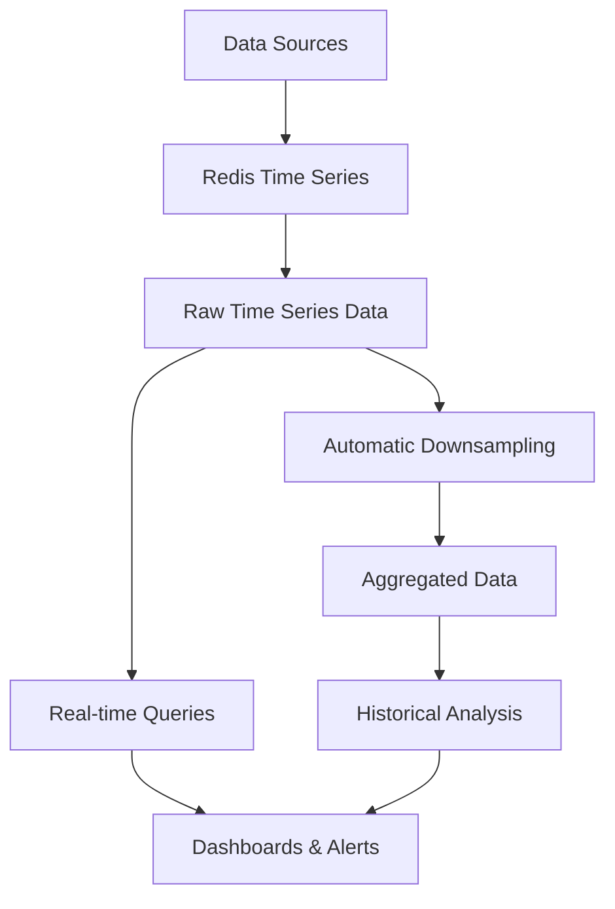

# Redis Time Series

## Introduction

Time series data is everywhere in our modern world - from stock prices and server metrics to IoT sensor readings and user activity logs. Redis Time Series is a powerful extension to Redis that enables efficient storage, querying, and analysis of time-series data directly within Redis.

In this guide, we'll explore how Redis Time Series works, why it's beneficial, and how to use it in your applications. By the end, you'll understand how to harness this specialized data type to build robust time-series applications.

## What is Time Series Data?

Before diving into Redis Time Series, let's understand what time series data is:

Time series data consists of data points collected sequentially over time. Each data point has:
- A timestamp (when the measurement was taken)
- A value (the measurement itself)
- Optional metadata (labels or tags)

Examples include:
- Temperature readings from a weather station every minute
- CPU utilization percentage of a server every 5 seconds
- Stock prices recorded throughout a trading day
- Blood pressure measurements of a patient over time

## Why Use Redis Time Series?

While you could store time series data using standard Redis data structures (like hashes or sorted sets), Redis Time Series offers specialized functionality:

1. **Efficient Storage**: Automatic compression to minimize memory usage
2. **Simplified Operations**: Built-in functions for common time-series operations
3. **Downsampling**: Automatic creation of aggregated lower-resolution data
4. **Retention Policies**: Automatic deletion of old data
5. **Label System**: Filter and group time-series data by metadata
6. **Range Queries**: Easily retrieve data within specific time ranges

## Getting Started with Redis Time Series

### Prerequisites

Redis Time Series is available as a Redis module. You can use it through:

1. Redis Stack (which includes the Time Series module)
2. Docker: `docker run -p 6379:6379 redis/redis-stack:latest`
3. Building from source: [RedisTimeSeries GitHub](https://github.com/RedisTimeSeries/RedisTimeSeries)

### Basic Commands

Let's start with the fundamental operations:

#### Creating a Time Series

```bash
> TS.CREATE sensor:temperature RETENTION 86400000 LABELS sensor_id 1 location kitchen
OK
```

This creates a time series key `sensor:temperature` with:
- A retention period of 86,400,000 milliseconds (1 day)
- Two labels: `sensor_id=1` and `location=kitchen`

#### Adding Data Points

```bash
> TS.ADD sensor:temperature 1577836800000 24.5
1577836800000
> TS.ADD sensor:temperature 1577836860000 25.1
1577836860000
> TS.ADD sensor:temperature 1577836920000 25.3
1577836920000
```

Each command adds a data point with a timestamp (in milliseconds since epoch) and a value.

#### Adding Data Points with Auto-Timestamp

```bash
> TS.ADD sensor:temperature * 25.7
1654251123000
```

The `*` tells Redis to use the current time as the timestamp.

#### Retrieving Data

Get the most recent value:

```bash
> TS.GET sensor:temperature
1) (integer) 1654251123000
2) "25.7"
```

Get values within a time range:

```bash
> TS.RANGE sensor:temperature 1577836800000 1577837000000
1) 1) (integer) 1577836800000
   2) "24.5"
2) 1) (integer) 1577836860000
   2) "25.1"
3) 1) (integer) 1577836920000
   2) "25.3"
```

You can also use `-` for the minimum possible timestamp and `+` for the maximum:

```bash
> TS.RANGE sensor:temperature - +
```

## Advanced Features

### Aggregation and Downsampling

Redis Time Series can aggregate data on-the-fly:

```bash
> TS.RANGE sensor:temperature 1577836800000 1577837000000 AGGREGATION avg 60000
```

This command retrieves data in the specified time range, aggregated by averaging values in 60-second buckets.

Supported aggregation functions include:
- `avg`: Average of all values
- `sum`: Sum of all values
- `min`: Minimum value
- `max`: Maximum value
- `count`: Count of samples
- `first`: First value in the bucket
- `last`: Last value in the bucket

### Automatic Downsampling

You can configure Redis Time Series to automatically create downsampled (aggregated) versions of your data:

```bash
> TS.CREATE sensor:temperature RETENTION 86400000 LABELS sensor_id 1 location kitchen DUPLICATE_POLICY LAST
OK
> TS.CREATERULE sensor:temperature sensor:temperature:hourly AGGREGATION avg 3600000
OK
```

This creates a rule that:
1. Takes data from `sensor:temperature`
2. Aggregates it by average in hourly buckets (3,600,000 ms)
3. Stores the results in `sensor:temperature:hourly`

### Filtering by Labels

One of the most powerful features is the ability to filter time series by their labels:

```bash
> TS.MRANGE - + FILTER location=kitchen
1) 1) "sensor:temperature"
   2) (empty array)
   3) 1) 1) (integer) 1654251123000
         2) "25.7"
```

This retrieves the latest data point for all time series with the label `location=kitchen`.

You can combine multiple filters:

```bash
> TS.MRANGE - + FILTER location=kitchen sensor_id=1
```

## Real-World Example: Monitoring System

Let's build a simple monitoring system that tracks CPU usage across multiple servers:

```bash
# Create time series for each server
> TS.CREATE server:1:cpu LABELS server_id 1 region us-east metric cpu
OK
> TS.CREATE server:2:cpu LABELS server_id 2 region us-west metric cpu
OK
> TS.CREATE server:3:cpu LABELS server_id 3 region eu-west metric cpu
OK

# Add some sample data
> TS.ADD server:1:cpu 1654251000000 45.2
1654251000000
> TS.ADD server:2:cpu 1654251000000 32.1
1654251000000
> TS.ADD server:3:cpu 1654251000000 28.7
1654251000000

# Add more data points
> TS.ADD server:1:cpu 1654251060000 48.3
1654251060000
> TS.ADD server:2:cpu 1654251060000 30.5
1654251060000
> TS.ADD server:3:cpu 1654251060000 27.9
1654251060000

# Query all CPU metrics from the US region
> TS.MRANGE 1654251000000 1654251060000 FILTER region=(us-east,us-west) metric=cpu
1) 1) "server:1:cpu"
   2) (empty array)
   3) 1) 1) (integer) 1654251000000
         2) "45.2"
      2) 1) (integer) 1654251060000
         2) "48.3"
2) 1) "server:2:cpu"
   2) (empty array)
   3) 1) 1) (integer) 1654251000000
         2) "32.1"
      2) 1) (integer) 1654251060000
         2) "30.5"

# Calculate average CPU by region
> TS.MRANGE 1654251000000 1654251060000 AGGREGATION avg 60000 FILTER metric=cpu GROUPBY region REDUCE avg
1) 1) "region=us-east"
   2) (empty array)
   3) 1) 1) (integer) 1654251000000
         2) "45.2"
      2) 1) (integer) 1654251060000
         2) "48.3"
2) 1) "region=us-west"
   2) (empty array)
   3) 1) 1) (integer) 1654251000000
         2) "32.1"
      2) 1) (integer) 1654251060000
         2) "30.5"
3) 1) "region=eu-west"
   2) (empty array)
   3) 1) 1) (integer) 1654251000000
         2) "28.7"
      2) 1) (integer) 1654251060000
         2) "27.9"
```

This example demonstrates:
1. Creating multiple time series with descriptive labels
2. Adding data to each series
3. Querying data with complex filters
4. Grouping and aggregating results

## Visualizing Time Series Data Flow

Here's a diagram showing how time series data flows through Redis Time Series:



## Performance Considerations

When working with Redis Time Series, keep these tips in mind:

1. **Timestamp Precision**: Redis Time Series uses millisecond precision. For many applications, you may not need this granularity.

2. **Retention Policy**: Set appropriate retention periods to avoid consuming excessive memory.

3. **Compaction Rules**: Use downsampling to keep historical data at lower resolution.

4. **Label Indexing**: Labels are indexed for fast filtering, but having too many unique label values can increase memory usage.

5. **Batch Operations**: Use `TS.MADD` to add multiple data points in a single command:

```bash
> TS.MADD server:1:cpu 1654251120000 42.1 server:2:cpu 1654251120000 31.2 server:3:cpu 1654251120000 29.3
1) (integer) 1654251120000
2) (integer) 1654251120000
3) (integer) 1654251120000
```

## Redis Time Series vs. Traditional Databases

Here's how Redis Time Series compares to other database solutions for time series data:

| Feature | Redis Time Series | Relational DB | NoSQL DB | Specialized TSDB |
|---------|------------------|--------------|----------|-----------------|
| Write Speed | Very High | Medium | High | High |
| Query Speed | Very High | Medium | Medium-High | High |
| Aggregations | Built-in | SQL-based | Limited | Advanced |
| Memory Usage | Optimized | High | Medium | Optimized |
| Scalability | Cluster-based | Limited | Good | Very Good |
| Complexity | Low | High | Medium | Medium-High |

Redis Time Series offers an excellent balance of simplicity, performance, and functionality, making it ideal for many time-series applications, especially those requiring real-time processing.

## Practical Use Cases

Redis Time Series excels in these scenarios:

1. **IoT Data Collection**: Store and analyze data from connected devices
2. **Monitoring Systems**: Track application and infrastructure metrics
3. **Financial Applications**: Store and analyze price movements
4. **User Analytics**: Track user behavior over time
5. **Real-time Dashboards**: Power live visualizations 

## Summary

Redis Time Series extends Redis with specialized capabilities for time-series data management. Its key advantages include:

- Efficient storage with automatic compression
- Built-in commands for time-series operations
- Powerful filtering by labels
- Automatic downsampling and data retention
- High performance for both writes and queries

These features make Redis Time Series an excellent choice for applications dealing with time-based measurements and events, especially when real-time analysis is important.

## Practice Exercises

1. Create a time series to track the temperature of three different rooms in a house.
2. Implement a rule to downsample the temperature data to hourly averages.
3. Write queries to:
   - Find the maximum temperature recorded in each room
   - Calculate the average temperature across all rooms 
   - Find periods where temperature increased by more than 5 degrees in an hour

## Additional Resources

- [Redis Time Series Documentation](https://redis.io/docs/stack/timeseries/)
- [Redis Time Series GitHub Repository](https://github.com/RedisTimeSeries/RedisTimeSeries)
- [Redis Stack](https://redis.io/docs/stack/)
- [Redis Time Series Client Libraries](https://redis.io/resources/clients/)