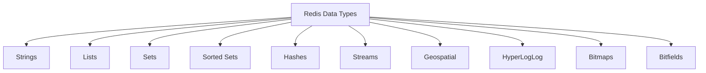

# Redis Data Type Selection

## Introduction

Redis offers a rich set of data structures that go beyond simple key-value storage. Understanding which data type to use for different scenarios is crucial for building efficient applications. This guide will help you navigate Redis data type selection with a focus on practical applications.

When working with Redis, choosing the right data structure is not just about storing data; it's about leveraging Redis's capabilities to solve problems elegantly. The correct data type can make your code more concise, improve performance, and reduce memory usage.

## Redis Data Types Overview

Before diving into selection criteria, let's quickly review the core Redis data types:



Each data type has specific operations, performance characteristics, and memory usage patterns that make it suitable for different use cases.

## Selection Criteria

When choosing a Redis data type, consider these factors:

1. **Data access patterns**: How will you query or manipulate the data?
2. **Data relationships**: How are your data elements related to each other?
3. **Performance requirements**: What operations need to be fast?
4. **Memory efficiency**: How much data are you storing?
5. **Atomic operations**: Do you need built-in atomic operations?

Let's explore how to select the appropriate data type based on common requirements.

## Strings: The Foundation

Strings are Redis's most basic data type, but they're surprisingly versatile.

### When to Use Strings

- **Simple key-value storage**
- **Caching objects** (serialized JSON, XML, etc.)
- **Counters** (using INCR/DECR commands)
- **Storing binary data** (images, files)

### Example: Using Strings as a Cache

```redis
> SET user:1000 "{\"name\":\"John\",\"email\":\"john@example.com\"}"
OK
> GET user:1000
"{\"name\":\"John\",\"email\":\"john@example.com\"}"

> SET pageviews 0
OK
> INCR pageviews
(integer) 1
> INCR pageviews
(integer) 2
```

### Real-world Application: Rate Limiting

```redis
> SET rate:ip:192.168.1.1 1
OK
> EXPIRE rate:ip:192.168.1.1 60
(integer) 1
> INCR rate:ip:192.168.1.1
(integer) 2
> INCR rate:ip:192.168.1.1
(integer) 3
```

This pattern can limit API requests by IP address, allowing only a certain number of requests within a time window.

## Lists: Ordered Collections

Redis lists are linked lists that allow for constant-time insertions and removals at both ends.

### When to Use Lists

- **Activity feeds**
- **Message queues**
- **Recent items** (latest posts, etc.)
- **Inter-process communication**

### Example: Simple Message Queue

```redis
> LPUSH tasks "{\"id\":1,\"type\":\"email\",\"data\":\"Welcome email for user 1000\"}"
(integer) 1
> LPUSH tasks "{\"id\":2,\"type\":\"notification\",\"data\":\"Payment received for order #123\"}"
(integer) 2
> RPOP tasks
"{\"id\":1,\"type\":\"email\",\"data\":\"Welcome email for user 1000\"}"
```

### Real-world Application: Twitter-like Timeline

```redis
> LPUSH timeline:user:1000 "Post A"
(integer) 1
> LPUSH timeline:user:1000 "Post B"
(integer) 2
> LPUSH timeline:user:1000 "Post C"
(integer) 3
> LRANGE timeline:user:1000 0 9
1) "Post C"
2) "Post B"
3) "Post A"
```

This pattern shows how to implement a simple timeline with the most recent posts appearing first.

## Sets: Unique Collections

Sets store unordered collections of unique strings and support operations like union and intersection.

### When to Use Sets

- **Unique item tracking**
- **Relationship modeling**
- **Tag systems**
- **IP blacklisting/whitelisting**

### Example: User Tags Management

```redis
> SADD user:1000:interests "programming" "redis" "databases"
(integer) 3
> SADD user:1001:interests "programming" "python" "web"
(integer) 3
> SINTER user:1000:interests user:1001:interests
1) "programming"
```

### Real-world Application: Friend Recommendation System

```redis
> SADD user:1000:friends 1001 1002 1003
(integer) 3
> SADD user:1001:friends 1000 1002 1004
(integer) 3
> SDIFF user:1001:friends user:1000:friends
1) "1004"
```

This allows you to find friends of friends who are not already friends with a user.

## Sorted Sets: Scored Collections

Sorted Sets combine Sets with a score for each element, keeping members sorted by their score.

### When to Use Sorted Sets

- **Leaderboards**
- **Priority queues**
- **Time-based data**
- **Range queries**

### Example: Leaderboard Implementation

```redis
> ZADD leaderboard 100 "player:1000"
(integer) 1
> ZADD leaderboard 125 "player:1001"
(integer) 1
> ZADD leaderboard 75 "player:1002"
(integer) 1
> ZREVRANGE leaderboard 0 2 WITHSCORES
1) "player:1001"
2) "125"
3) "player:1000"
4) "100"
5) "player:1002"
6) "75"
```

### Real-world Application: Task Scheduling

```redis
> ZADD scheduled_tasks 1614556800 "send-newsletter"
(integer) 1
> ZADD scheduled_tasks 1614643200 "database-backup"
(integer) 1
> ZRANGEBYSCORE scheduled_tasks 0 1614600000
1) "send-newsletter"
```

This pattern uses timestamps as scores to retrieve tasks that should be executed before a specific time.

## Hashes: Field-Value Pairs

Hashes are maps between string fields and string values, perfect for representing objects.

### When to Use Hashes

- **Storing objects with multiple fields**
- **Tracking multiple counters under one key**
- **User profiles or sessions**
- **Any structured data**

### Example: User Profile Storage

```redis
> HSET user:1000 name "John Doe" email "john@example.com" age 28
(integer) 3
> HGET user:1000 name
"John Doe"
> HGETALL user:1000
1) "name"
2) "John Doe"
3) "email"
4) "john@example.com"
5) "age"
6) "28"
```

### Real-world Application: Shopping Cart

```redis
> HSET cart:user:1000 product:101 2
(integer) 1
> HSET cart:user:1000 product:102 1
(integer) 1
> HINCRBY cart:user:1000 product:101 1
(integer) 3
> HGETALL cart:user:1000
1) "product:101"
2) "3"
3) "product:102"
4) "1"
```

In this example, we're storing a shopping cart where the keys are product IDs and the values are quantities.

## Streams: Append-Only Log

Streams are a newer data type that acts as an append-only log with consumer groups.

### When to Use Streams

- **Event sourcing**
- **Activity tracking**
- **Message brokers**
- **Time-series data**

### Example: Event Logging System

```redis
> XADD events * type "user_login" user_id 1000 ip "192.168.1.1"
"1614556800123-0"
> XADD events * type "purchase" user_id 1000 product_id 101 amount 29.99
"1614556802456-0"
> XRANGE events - + COUNT 2
1) 1) "1614556800123-0"
   2) 1) "type"
      2) "user_login"
      3) "user_id"
      4) "1000"
      5) "ip"
      6) "192.168.1.1"
2) 1) "1614556802456-0"
   2) 1) "type"
      2) "purchase"
      3) "user_id"
      4) "1000"
      5) "product_id"
      6) "101"
      7) "amount"
      8) "29.99"
```

### Real-world Application: Log Processing with Consumer Groups

```redis
> XGROUP CREATE events processors 0
OK
> XREADGROUP GROUP processors worker1 COUNT 1 STREAMS events >
1) 1) "events"
   2) 1) 1) "1614556800123-0"
         2) 1) "type"
            2) "user_login"
            3) "user_id"
            4) "1000"
            5) "ip"
            6) "192.168.1.1"
> XACK events processors 1614556800123-0
(integer) 1
```

This pattern demonstrates how to process events with multiple consumers, ensuring each event is processed exactly once.

## Specialized Data Types

Redis offers additional specialized data types for specific use cases:

### Geospatial Indexes

Perfect for location-based applications:

```redis
> GEOADD locations 13.361389 38.115556 "Palermo" 15.087269 37.502669 "Catania"
(integer) 2
> GEODIST locations "Palermo" "Catania" km
"166.2742"
> GEORADIUS locations 15 37 100 km
1) "Catania"
```

### HyperLogLog

Excellent for unique counts without storing all elements:

```redis
> PFADD daily_visitors "user:1000" "user:1001" "user:1002"
(integer) 1
> PFADD daily_visitors "user:1000" "user:1003"
(integer) 1
> PFCOUNT daily_visitors
(integer) 3
```

### Bitmaps

Efficient for status tracking with large user bases:

```redis
> SETBIT user:active:20230301 1000 1
(integer) 0
> SETBIT user:active:20230301 1001 1
(integer) 0
> BITCOUNT user:active:20230301
(integer) 2
```

## Decision Matrix: Choosing the Right Data Type

Here's a quick reference to help you choose the right data type:

| Use Case | Recommended Data Type | Alternative |
|----------|----------------------|-------------|
| Simple key-value store | String | Hash (for multiple fields) |
| Counters | String (with INCR) | Hash (for multiple counters) |
| Lists of items | List | Sorted Set (if ordering matters) |
| Unique collections | Set | Sorted Set (if ordering matters) |
| Rankings/leaderboards | Sorted Set | - |
| Object with properties | Hash | String (serialized) |
| Time-series events | Stream | Sorted Set (simpler cases) |
| Geo-location data | Geospatial | - |
| Counting unique values | HyperLogLog | Set (if you need the actual values) |
| Binary states for large sets | Bitmap | Set (if sparse) |

## Memory Optimization Considerations

Data type selection also impacts memory usage:

1. **Strings**: Consider using integers when possible (Redis optimizes these)
2. **Lists, Sets, Hashes**: For small collections (less than 512 elements), Redis uses a compact encoding
3. **Hashes vs. Multiple Keys**: Using a hash is generally more memory-efficient than using multiple string keys
4. **Expiration Policies**: Set TTL (Time To Live) for temporary data

## Common Selection Patterns

### Pattern: Session Storage

For user sessions, hashes are ideal:

```redis
> HSET session:user:1000 auth_token "a1b2c3" login_time "2023-03-01T14:30:00Z" data "{\"preferences\":{\"theme\":\"dark\"}}"
(integer) 3
> EXPIRE session:user:1000 3600
(integer) 1
```

### Pattern: Caching with Cache Aside

For database result caching:

```redis
> SET cache:query:recent_products "{\"products\":[...]}" EX 300
OK
```

### Pattern: Distributed Locking

For implementing distributed locks:

```redis
> SET lock:resource:1 "process:1000" NX EX 30
OK
# Do critical work...
> DEL lock:resource:1
(integer) 1
```

## Summary

Choosing the right Redis data type involves understanding:

1. Your access patterns and query requirements
2. The relationship between data elements
3. Performance needs for specific operations
4. Memory constraints and efficiency considerations

Redis's versatility comes from its rich data type system. By selecting the appropriate structure, you can simplify your application logic, improve performance, and reduce memory usage. Remember that Redis often allows multiple ways to model your data—choose the approach that best fits your specific needs.

## Further Learning

To deepen your understanding of Redis data types:

- Practice implementing different data models for common applications
- Experiment with Redis commands in the Redis CLI
- Try combining different data types to solve complex problems
- Measure performance implications of different data modeling choices

### Exercises

1. **Leaderboard Exercise**: Implement a leaderboard that tracks the top 10 players and updates scores in real-time
2. **Shopping Cart Exercise**: Create a shopping cart system using Redis Hashes that can add, remove, and update quantities
3. **Social Graph Exercise**: Model a social network's friendship connections using Redis Sets
4. **URL Shortener Exercise**: Build a URL shortener service using Redis Strings
5. **Real-time Analytics Exercise**: Implement a system to track page views by hour, day, and month using appropriate Redis data types