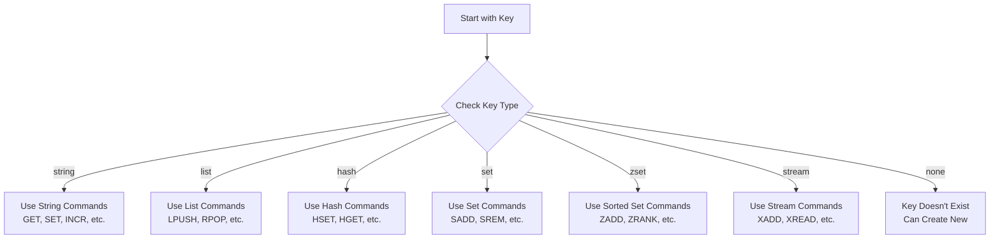

# Redis Type Commands

## Introduction

When working with Redis, understanding how to interact with different data types is crucial. Redis provides specific commands that help you identify, modify, and transform the types of values stored in your database. In this guide, we'll explore Redis type commands that allow you to examine and manipulate the fundamental characteristics of your Redis data.

Redis offers a rich set of commands for working with various data types, and sometimes you need to know what type you're dealing with or convert between types. The commands covered in this article help bridge that gap, serving as essential tools for effective Redis data management.

## The TYPE Command

The most basic type-related command in Redis is `TYPE`, which returns the data type of the value stored at a given key.

```bash
TYPE key
```

### Example:

```bash
> SET user:1:name "John"
OK
> TYPE user:1:name
string

> LPUSH notifications "New message"
(integer) 1
> TYPE notifications
list

> HSET user:1 name "John" age 30 city "New York"
(integer) 3
> TYPE user:1
hash
```

The possible return values from the `TYPE` command are:
- `string` - String value
- `list` - List value
- `set` - Set value
- `zset` - Sorted Set value
- `hash` - Hash value
- `stream` - Stream value
- `none` - Key does not exist

The `TYPE` command is particularly useful when working with applications where keys may contain different types of data, or when debugging an application's Redis interaction.

## The OBJECT Command

The `OBJECT` command provides low-level information about Redis object encoding. This is more advanced but can be helpful for optimization.

```bash
OBJECT subcommand [arguments [arguments ...]]
```

The most commonly used subcommands are:

### OBJECT ENCODING

Returns the internal representation used to store the value:

```bash
> SET mystring "Hello"
OK
> OBJECT ENCODING mystring
"embstr"

> LPUSH mylist 1 2 3
(integer) 3
> OBJECT ENCODING mylist
"quicklist"
```

Different encodings (like "embstr", "int", "hashtable", "ziplist", etc.) represent different internal storage methods that Redis uses to optimize memory usage.

### OBJECT IDLETIME

Returns the number of seconds since the key was last accessed:

```bash
> SET mykey "value"
OK
> OBJECT IDLETIME mykey
(integer) 10  # 10 seconds since last access
```

This can be useful for implementing your own key expiration policies.

### OBJECT REFCOUNT

Returns the number of references to the object:

```bash
> SET mykey "Hello"
OK
> OBJECT REFCOUNT mykey
(integer) 1
```

## Converting Between Types

Redis doesn't have direct "cast" operations like some programming languages, but there are patterns you can use to convert between types:

### String to Number

```bash
> SET counter "10"
OK
> INCR counter   # Converts string to number and increments
(integer) 11
```

### Number to String

```bash
> SET num 42
OK
> GET num        # When you GET a number, it's returned as a string
"42"
```

### List to Set

```bash
> LPUSH mylist "a" "b" "c" "a"
(integer) 4
> SMEMBERS myset  # Empty set initially
(empty array)
> LRANGE mylist 0 -1
1) "a"
2) "b"
3) "c"
4) "a"

# Script to convert (pseudo-code for the client):
> LRANGE mylist 0 -1 | forEach element -> SADD myset element

> SADD myset "a" "b" "c" "a"  # Note "a" will only be added once
(integer) 3
> SMEMBERS myset
1) "a"
2) "b"
3) "c"
```

## The MEMORY USAGE Command

While not strictly a type command, `MEMORY USAGE` helps you understand how much memory a key is using, which can vary based on the type:

```bash
> SET smallstr "hello"
OK
> MEMORY USAGE smallstr
(integer) 52  # Bytes, including overhead

> HSET user name "John" age 30
(integer) 2
> MEMORY USAGE user
(integer) 77  # Hash takes more space
```

## Real-World Applications

### Dynamic Caching System

Imagine building a caching system that stores different types of data. You can use `TYPE` to implement type-specific handling:

```bash
# Pseudo-code in your application
function getFromCache(key) {
  type = execute("TYPE", key)
  
  if (type == "none") {
    return null
  } else if (type == "string") {
    return execute("GET", key)
  } else if (type == "hash") {
    return execute("HGETALL", key)
  } else if (type == "list") {
    return execute("LRANGE", key, 0, -1)
  } else if (type == "set") {
    return execute("SMEMBERS", key)
  } else if (type == "zset") {
    return execute("ZRANGE", key, 0, -1, "WITHSCORES")
  }
}
```

### Memory Optimization

For applications with memory constraints, you can use `OBJECT ENCODING` and `MEMORY USAGE` to identify memory-intensive keys:

```bash
# Script to find the encoding of all keys (pseudo-code):
for key in execute("KEYS", "*") {
  type = execute("TYPE", key)
  encoding = execute("OBJECT", "ENCODING", key)
  memory = execute("MEMORY", "USAGE", key)
  print(f"Key: {key}, Type: {type}, Encoding: {encoding}, Memory: {memory}B")
}
```

This could help you identify opportunities for memory optimization, such as:
- Converting large hashes to hash ziplist encodings
- Using numeric IDs instead of string IDs
- Identifying unusually large values

### TTL Management Based on Access Patterns

Using `OBJECT IDLETIME`, you can implement a custom expiration policy:

```bash
# Script to expire keys not used in the last hour (pseudo-code):
for key in execute("KEYS", "*") {
  idleTime = execute("OBJECT", "IDLETIME", key)
  if (idleTime > 3600) {  # 1 hour in seconds
    execute("DEL", key)
    print(f"Deleted idle key: {key}")
  }
}
```

## Understanding Type Checking in Redis Scripts

In Lua scripts for Redis, you might need to check types to handle different data appropriately:

```lua
-- Example Lua script that behaves differently based on key type
local key = KEYS[1]
local keyType = redis.call("TYPE", key)["ok"]

if keyType == "string" then
  return redis.call("GET", key)
elseif keyType == "hash" then
  return redis.call("HGETALL", key)
elseif keyType == "none" then
  return nil
else
  return "Unsupported type: " .. keyType
end
```

You would call this script using `EVAL` or `EVALSHA`.

## Redis Type Flow Diagram

Here's a visualization of how Redis determines the command to use based on key types:



## Summary

Redis type commands provide essential functionality for working with different data structures in your Redis database:

- The `TYPE` command helps identify what kind of data is stored at a key
- The `OBJECT` command provides low-level details about Redis internal representations
- While Redis doesn't have direct type conversion commands, there are patterns to transform data between types
- Understanding type commands is crucial for building robust Redis applications

These commands form an important part of Redis's flexible data model, allowing you to work effectively with different data types based on your application's needs.

## Practice Exercises

1. Create different types of Redis data structures and use the `TYPE` command to identify each one.
2. Experiment with different-sized strings and use `OBJECT ENCODING` to see when Redis switches from "embstr" to "raw" encoding.
3. Create a Lua script that counts the number of keys of each type in your Redis database.
4. Build a simple program that converts a Redis list to a set, removing duplicates in the process.
5. Use `MEMORY USAGE` to compare the memory efficiency of different data structures for storing the same information.

## Additional Resources

- [Redis Command Reference](https://redis.io/commands)
- [Redis Data Types Documentation](https://redis.io/topics/data-types)
- [Redis Lua Scripting Guide](https://redis.io/commands/eval)
- [Redis Memory Optimization](https://redis.io/topics/memory-optimization)