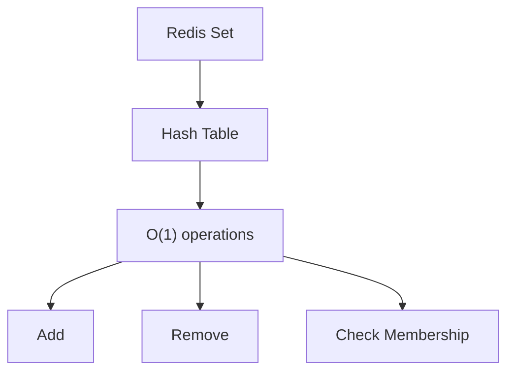

# Redis Sets

## Introduction

Redis Sets are unordered collections of unique strings, similar to the mathematical concept of sets. Think of them as a bag where each item can appear only once—if you try to add the same item twice, Redis will store it just once.

Sets are particularly useful when you need to:
- Store unique values
- Check if an item exists (with O(1) time complexity)
- Perform set operations like unions, intersections, and differences

## Basic Set Operations

### Adding Elements to a Set (SADD)

The `SADD` command adds one or more members to a set.

```
SADD myset "apple"
SADD myset "banana" "orange" "apple"
```

Output:
```
(integer) 1
(integer) 2
```

Note that "apple" was only counted once in the second command because it was already in the set.

### Viewing All Elements in a Set (SMEMBERS)

The `SMEMBERS` command returns all members of a set.

```
SMEMBERS myset
```

Output:
```
1) "apple"
2) "banana"
3) "orange"
```

### Checking if an Element Exists (SISMEMBER)

The `SISMEMBER` command checks if a value is a member of a set.

```
SISMEMBER myset "apple"
SISMEMBER myset "grape"
```

Output:
```
(integer) 1
(integer) 0
```

In Redis, 1 means true and 0 means false.

### Removing Elements (SREM)

The `SREM` command removes one or more members from a set.

```
SREM myset "orange"
SMEMBERS myset
```

Output:
```
(integer) 1
1) "apple"
2) "banana"
```

### Getting Set Size (SCARD)

The `SCARD` command returns the number of elements in a set.

```
SCARD myset
```

Output:
```
(integer) 2
```

## Advanced Set Operations

Redis sets shine when performing mathematical set operations:

### Set Intersection (SINTER)

The `SINTER` command returns the intersection of multiple sets (elements that exist in all specified sets).

```
SADD set1 "a" "b" "c"
SADD set2 "b" "c" "d"
SINTER set1 set2
```

Output:
```
1) "b"
2) "c"
```

### Set Union (SUNION)

The `SUNION` command returns the union of multiple sets (all unique elements from all sets combined).

```
SUNION set1 set2
```

Output:
```
1) "a"
2) "b"
3) "c"
4) "d"
```

### Set Difference (SDIFF)

The `SDIFF` command returns the difference between sets (elements in the first set that are not in the subsequent sets).

```
SDIFF set1 set2
SDIFF set2 set1
```

Output:
```
1) "a"
1) "d"
```

### Storing Results of Set Operations

Redis allows storing the results of set operations directly:

```
SINTERSTORE result set1 set2
SMEMBERS result
```

Output:
```
(integer) 2
1) "b"
2) "c"
```

Similarly, `SUNIONSTORE` and `SDIFFSTORE` commands store the results of unions and differences.

## Random Members and Popping

### Getting Random Members (SRANDMEMBER)

The `SRANDMEMBER` command returns random elements from a set:

```
SADD colors "red" "blue" "green" "yellow" "purple"
SRANDMEMBER colors 2
```

Output (may vary):
```
1) "blue"
2) "green"
```

### Popping Elements (SPOP)

The `SPOP` command removes and returns random elements from a set:

```
SPOP colors 1
```

Output (may vary):
```
1) "purple"
```

After this operation, "purple" is no longer in the set.

## Real-World Applications

### Example 1: User Tagging System

Imagine a social media platform where posts can have tags:

```
# Add tags to posts
SADD post:1:tags "redis" "database" "nosql"
SADD post:2:tags "redis" "caching" "performance"

# Find posts with specific tags
SINTER post:1:tags post:2:tags
```

Output:
```
1) "redis"
```

### Example 2: Unique Visitor Tracking

Track unique visitors to your website for a given day:

```
# Add user IDs to today's set
SADD visitors:2023-04-15 "user:1" "user:2" "user:3"
SADD visitors:2023-04-16 "user:2" "user:3" "user:4"

# Count unique visitors
SCARD visitors:2023-04-15
```

Output:
```
(integer) 3
```

To find users who visited on both days:

```
SINTER visitors:2023-04-15 visitors:2023-04-16
```

Output:
```
1) "user:2"
2) "user:3"
```

### Example 3: Friend Recommendation System

A simple friend recommendation system using common friends:

```
# Define friends for users
SADD friends:alice "bob" "carol" "dave"
SADD friends:bob "alice" "carol" "eve"

# Find common friends
SINTER friends:alice friends:bob
```

Output:
```
1) "carol"
```

To find friends of Bob that Alice doesn't know yet (potential recommendations):

```
SDIFF friends:bob friends:alice
```

Output:
```
1) "eve"
```

## Set Implementation in Redis

Redis Sets are implemented using hash tables, providing O(1) time complexity for basic operations like adding, removing, and checking membership.



This implementation ensures excellent performance even for large sets.

## Performance Considerations

- Sets provide O(1) time complexity for most operations
- Set operations (unions, intersections) can be computationally expensive with large sets
- Sets consume more memory than simple strings but provide much more functionality
- Consider using sorted sets if you need ordered elements with scores

## Summary

Redis Sets provide a powerful way to store unique elements and perform set operations efficiently. They're perfect for scenarios where you need to track uniqueness, perform set-based calculations, or implement features like tagging systems.

Basic set operations include adding (`SADD`), checking membership (`SISMEMBER`), viewing all elements (`SMEMBERS`), and removing elements (`SREM`). Advanced operations allow for mathematical set manipulations like intersection (`SINTER`), union (`SUNION`), and difference (`SDIFF`).

With O(1) time complexity for most operations, Redis Sets offer excellent performance characteristics while providing valuable functionality for many common programming scenarios.

## Practice Exercises

1. Create a set of your favorite fruits and practice adding, removing, and checking for specific fruits.
2. Build a simple tag-based filtering system using two or more sets.
3. Implement a basic online/offline user tracking system using sets.
4. Try the set operations with store commands and verify the results.
5. Create a basic friend recommendation system using three or more users.

## Further Reading

- Redis official documentation on Sets
- Set theory in mathematics
- Hash table implementation details
- Memory optimization techniques for Redis