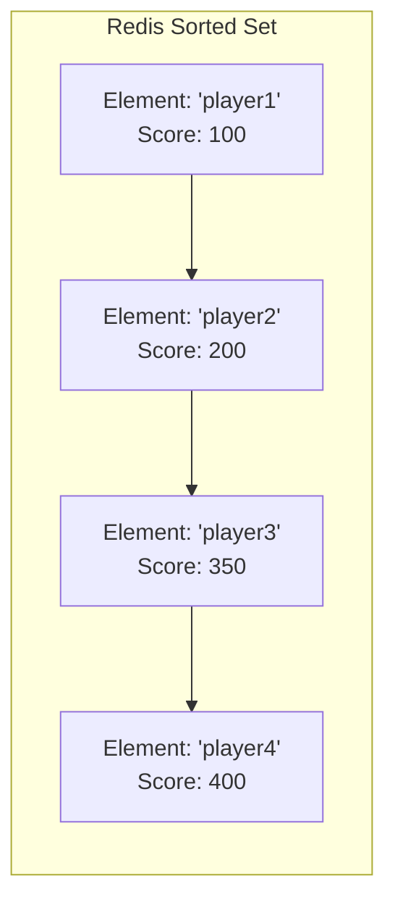

# Redis Sorted Sets

## Introduction

Redis Sorted Sets are one of Redis' most versatile and powerful data structures. They combine properties of both sets and ordered collections, allowing you to store unique string elements while associating each element with a floating-point score that determines its position in the sorted order.

Think of a Sorted Set as a smart collection that automatically keeps its elements in order based on their scores. This unique property makes Sorted Sets ideal for a wide range of applications, from leaderboards and priority queues to time-series data.

## Basic Concepts

A Redis Sorted Set has these key characteristics:

- Each element in the set is unique (like a regular Redis Set)
- Every element is associated with a score (a floating-point number)
- Elements are always kept in sorted order according to their scores
- Operations on Sorted Sets have predictable, efficient performance

Here's a visual representation of a Sorted Set:



## Working with Sorted Sets

### Adding Elements to a Sorted Set

The basic command to add elements to a Sorted Set is `ZADD`:

```
ZADD key score member [score member ...]
```

Let's create a leaderboard example:

```
> ZADD leaderboard 100 "player1"
(integer) 1
> ZADD leaderboard 200 "player2" 350 "player3" 400 "player4"
(integer) 3
```

Note that `ZADD` returns the number of new elements added to the set (not including elements that were already present and had their score updated).

### Updating Element Scores

You can update an element's score by simply performing another `ZADD` with the same element but a different score:

```
> ZADD leaderboard 450 "player1"
(integer) 0
```

The return value is `0` because the element was already in the set; we just updated its score.

### Retrieving Elements

Redis provides several commands to retrieve elements from a Sorted Set:

#### By Rank (Position)

Use `ZRANGE` to retrieve elements by their position (rank) in the sorted order:

```
> ZRANGE leaderboard 0 -1
1) "player2"
2) "player3"
3) "player4"
4) "player1"
```

This returns all elements from rank 0 (the lowest score) to rank -1 (the highest score). You can include scores in the output:

```
> ZRANGE leaderboard 0 -1 WITHSCORES
1) "player2"
2) "200"
3) "player3"
4) "350"
5) "player4"
6) "400"
7) "player1"
8) "450"
```

To retrieve elements in reverse order (highest to lowest score), use `ZREVRANGE`:

```
> ZREVRANGE leaderboard 0 2 WITHSCORES
1) "player1"
2) "450"
3) "player4"
4) "400"
5) "player3"
6) "350"
```

This returns the top 3 players (positions 0, 1, and 2).

#### By Score

Use `ZRANGEBYSCORE` to retrieve elements within a specific score range:

```
> ZRANGEBYSCORE leaderboard 300 500
1) "player3"
2) "player4"
3) "player1"
```

This returns all players with scores between 300 and 500.

### Finding an Element's Rank or Score

To find a specific element's rank:

```
> ZRANK leaderboard "player3"
(integer) 1
```

For the reverse rank (position from highest to lowest):

```
> ZREVRANK leaderboard "player3"
(integer) 2
```

To get an element's score:

```
> ZSCORE leaderboard "player3"
"350"
```

### Removing Elements

To remove elements from a Sorted Set:

```
> ZREM leaderboard "player2"
(integer) 1
```

To remove elements by rank:

```
> ZREMRANGEBYRANK leaderboard 0 0
(integer) 1
```

This would remove the element with the lowest score.

To remove elements by score:

```
> ZREMRANGEBYSCORE leaderboard 400 450
(integer) 2
```

This would remove all elements with scores between 400 and 450.

### Set Operations

Redis supports set operations on Sorted Sets:

#### Intersection

To find the intersection of multiple Sorted Sets with `ZINTERSTORE`:

```
> ZADD active_players 1 "player1" 1 "player3" 1 "player5"
(integer) 3
> ZINTERSTORE active_leaderboard 2 leaderboard active_players WEIGHTS 1 0
(integer) 2
> ZRANGE active_leaderboard 0 -1 WITHSCORES
1) "player3"
2) "350"
3) "player1"
4) "450"
```

This creates a new Sorted Set (`active_leaderboard`) containing elements that appear in both the `leaderboard` and `active_players` sets.

#### Union

Similarly, `ZUNIONSTORE` computes the union of multiple Sorted Sets:

```
> ZUNIONSTORE complete_leaderboard 2 leaderboard active_players
(integer) 4
```

## Practical Use Cases

### Leaderboards

Sorted Sets are perfect for implementing leaderboards, as we've already seen. You can:

- Add players with their scores
- Update scores as they change
- Retrieve top players quickly
- Find a player's position instantly
- Get players within certain score ranges

### Time-Series Data

Sorted Sets can store time-series data, using timestamps as scores:

```
> ZADD website:pageviews 1615362738 "homepage"
(integer) 1
> ZADD website:pageviews 1615362825 "about"
(integer) 1
> ZADD website:pageviews 1615362901 "products"
(integer) 1
```

You can then query events within specific time ranges:

```
> ZRANGEBYSCORE website:pageviews 1615362700 1615362900
1) "homepage"
2) "about"
```

### Priority Queues

You can implement priority queues where lower scores mean higher priority:

```
> ZADD tasks 1 "urgent-email" 2 "update-database" 3 "generate-report"
(integer) 3
```

To process the highest priority task:

```
> ZRANGE tasks 0 0
1) "urgent-email"
```

After processing, remove it:

```
> ZREM tasks "urgent-email"
(integer) 1
```

### Rate Limiting

You can use Sorted Sets for rate limiting by tracking API requests:

```
> ZADD rate:user:123 1615362738 "request1"
(integer) 1
> ZADD rate:user:123 1615362825 "request2"
(integer) 1
```

To check requests in the last minute (60 seconds):

```
> ZREMRANGEBYSCORE rate:user:123 0 (current_timestamp - 60)
```

Then count remaining entries:

```
> ZCARD rate:user:123
(integer) 1
```

## Performance Considerations

Redis Sorted Sets offer excellent performance characteristics:

- Adding elements: O(log(N))
- Removing elements: O(log(N))
- Updating scores: O(log(N))
- Range queries by score: O(log(N) + M) where M is the number of elements returned
- Range queries by rank: O(log(N) + M)

This makes Sorted Sets efficient even with large datasets.

## Common Commands Summary

| Command | Description |
|---------|-------------|
| `ZADD` | Add elements with scores to a Sorted Set |
| `ZRANGE` | Retrieve elements by rank (position) |
| `ZREVRANGE` | Retrieve elements by rank in reverse order |
| `ZRANGEBYSCORE` | Retrieve elements by score range |
| `ZREVRANGEBYSCORE` | Retrieve elements by score range in reverse order |
| `ZRANK` | Get an element's rank |
| `ZREVRANK` | Get an element's reverse rank |
| `ZSCORE` | Get an element's score |
| `ZREM` | Remove elements |
| `ZREMRANGEBYRANK` | Remove elements by rank range |
| `ZREMRANGEBYSCORE` | Remove elements by score range |
| `ZCARD` | Count elements in the Sorted Set |
| `ZCOUNT` | Count elements with scores in a given range |
| `ZINCRBY` | Increment an element's score |
| `ZINTERSTORE` | Store the intersection of multiple Sorted Sets |
| `ZUNIONSTORE` | Store the union of multiple Sorted Sets |

## Summary

Redis Sorted Sets are a powerful and versatile data structure that combine the uniqueness of sets with automatic sorting by score. They excel in scenarios requiring ordered data with efficient access patterns, such as leaderboards, time-series data, priority queues, and rate limiting.

Working with Sorted Sets is intuitive, with commands for adding, retrieving, removing, and operating on elements. Their excellent performance characteristics make them suitable for applications of all sizes.

## Practice Exercises

1. Create a movie ranking system where movies are scored by rating
2. Implement a task scheduler with due dates as scores
3. Build a system to track the most frequent website visitors
4. Design a social media trending topics feature using Sorted Sets
5. Create a time-windowed analytics system tracking page views

## Additional Resources

- [Redis Sorted Sets Commands](https://redis.io/commands/?group=sorted_set)
- [Redis Documentation](https://redis.io/docs/data-types/sorted-sets/)
- [Redis University](https://university.redis.com/) offers courses on Redis data structures