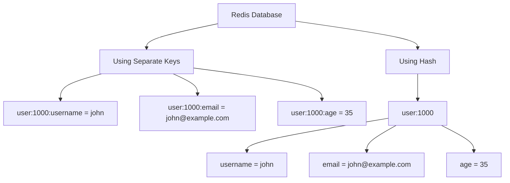

# Redis Hashes

## Introduction

Redis Hashes are map-like data structures that store collections of field-value pairs under a single key. Think of them as miniature Redis databases within a Redis database—each hash can store multiple related fields and their values, all associated with one key.

Hashes are particularly useful when you need to represent objects or entities with multiple attributes, making them perfect for storing user profiles, product information, configuration settings, and more.

## Basic Hash Operations

### Creating and Updating Hashes

Let's start by learning how to create and update hash fields using the `HSET` command:

```bash
# Syntax: HSET key field value [field value ...]
HSET user:1000 username john email john@example.com age 35
```

This creates a hash called `user:1000` with three fields: `username`, `email`, and `age`.

### Retrieving Hash Values

To retrieve a single field's value from a hash, use `HGET`:

```bash
# Syntax: HGET key field
HGET user:1000 username
```

Output:
```
"john"
```

To retrieve multiple fields at once, use `HMGET`:

```bash
# Syntax: HMGET key field [field ...]
HMGET user:1000 username email
```

Output:
```
1) "john"
2) "john@example.com"
```

To get all fields and values in a hash, use `HGETALL`:

```bash
# Syntax: HGETALL key
HGETALL user:1000
```

Output:
```
1) "username"
2) "john"
3) "email"
4) "john@example.com"
5) "age"
6) "35"
```

### Checking if Fields Exist

You can check if a field exists in a hash using `HEXISTS`:

```bash
# Syntax: HEXISTS key field
HEXISTS user:1000 username
```

Output:
```
(integer) 1
```

```bash
HEXISTS user:1000 address
```

Output:
```
(integer) 0
```

### Deleting Fields

To remove fields from a hash, use `HDEL`:

```bash
# Syntax: HDEL key field [field ...]
HDEL user:1000 age
```

Output:
```
(integer) 1
```

## Advanced Hash Operations

### Incrementing Numeric Values

Redis allows you to increment numeric hash field values using `HINCRBY` for integers:

```bash
# Syntax: HINCRBY key field increment
HSET product:101 price 25 inventory 100
HINCRBY product:101 inventory -5
```

Output:
```
(integer) 95
```

For floating-point values, use `HINCRBYFLOAT`:

```bash
# Syntax: HINCRBYFLOAT key field increment
HINCRBYFLOAT product:101 price 4.99
```

Output:
```
"29.99"
```

### Getting All Fields or Values

To get just the field names or values:

```bash
# Get all field names
HKEYS user:1000
```

Output:
```
1) "username"
2) "email"
```

```bash
# Get all values
HVALS user:1000
```

Output:
```
1) "john"
2) "john@example.com"
```

### Counting Fields

To count the number of fields in a hash:

```bash
# Syntax: HLEN key
HLEN user:1000
```

Output:
```
(integer) 2
```

## When to Use Redis Hashes

Redis Hashes shine in these scenarios:

1. **Storing object data**: When you need to store multiple attributes of an object
2. **Reducing memory overhead**: Hashes are more memory-efficient than storing each field as a separate key
3. **Atomic operations**: When you need to update or retrieve multiple fields in a single operation
4. **Partial updates**: When you need to update only certain fields of an object

## Practical Examples

### User Profile Management

```bash
# Create a user profile
HSET user:1001 username alice email alice@example.com created_at 1628761200 last_login 1636537200 status active

# Update specific fields
HSET user:1001 last_login 1636623600 status idle

# Get user information
HGETALL user:1001
```

### Shopping Cart Implementation

```bash
# Add items to a shopping cart
HSET cart:user:1001 item:101 2 item:203 1 item:305 3

# Update quantity
HINCRBY cart:user:1001 item:101 1

# Remove an item
HDEL cart:user:1001 item:203

# Get cart contents
HGETALL cart:user:1001
```

### Configuration Management

```bash
# Store application settings
HSET config:app:1 debug false log_level info max_connections 100 timeout 30

# Check a setting
HGET config:app:1 debug

# Update settings
HSET config:app:1 debug true log_level debug
```

## Hash vs. Separate Keys

Let's visualize the difference between using hashes and using separate keys for user data:



Using hashes is generally more efficient for both memory usage and operations when dealing with related data fields.

## Performance Considerations

- Hashes are very efficient for storing objects with a small to moderate number of fields
- For hashes with fewer than 512 fields (by default), Redis uses a special memory-efficient encoding
- Operations on hashes have O(1) time complexity for single field operations and O(n) for operations on multiple fields, where n is the number of fields being accessed

## Hash Limitations

- Maximum number of fields: 2³² - 1 (over 4 billion)
- Maximum size of field names and values: 512 MB
- No automatic expiration of individual hash fields (only the entire hash)

## Summary

Redis Hashes provide an elegant way to store structured data within Redis. They allow you to:

- Group related fields under a single key
- Perform operations on individual fields or multiple fields at once
- Save memory compared to using separate keys
- Represent complex objects in a Redis-friendly way

Hashes are one of the most versatile data types in Redis, making them essential for building efficient and well-structured Redis applications.

## Exercises

1. Create a hash to store product information with fields for name, price, category, and stock level.
2. Write commands to increment a view counter for a product and decrease its stock level when purchased.
3. Create a hash to store the configuration for your application, then write commands to retrieve and update specific settings.
4. Implement a simple leaderboard using hashes, where each player's score, rank, and achievements are stored in a hash.
5. Compare the memory usage when storing 1000 users with 5 attributes each using hashes versus separate keys.