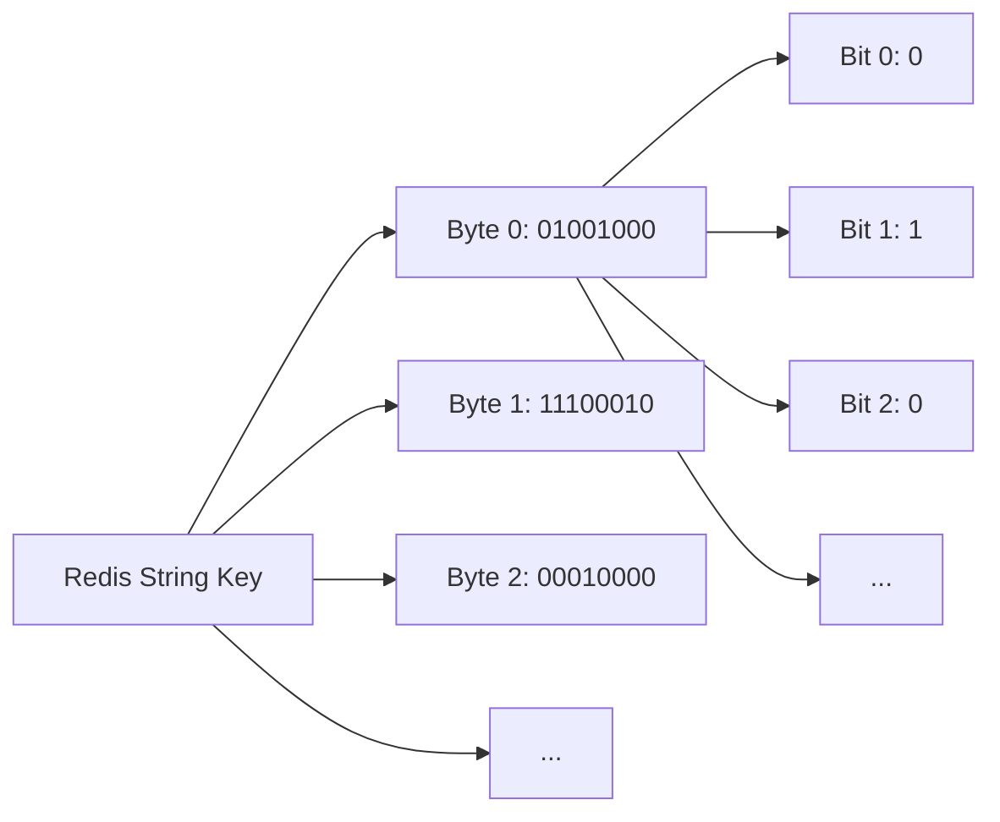

# Redis Bitmaps

## Introduction

Redis Bitmaps aren't actually a separate data type in Redis, but rather a set of specialized commands that operate on the String data type at the bit level. These commands allow you to treat Redis strings as arrays of bits, making them extremely memory-efficient for certain use cases.

Bitmaps are perfect for scenarios where you need to keep track of binary states (yes/no, on/off, true/false) for a large number of elements. They provide a space-efficient way to store this information and perform operations like counting, setting, and checking individual bits.

## Understanding Bitmaps

At their core, bitmaps in Redis are strings where each bit can be addressed individually. This approach enables extremely memory-efficient storage for certain types of data.

### Key Advantages

1. **Space Efficiency**: A bitmap requires only 1 bit per element, compared to traditional data structures that might use bytes or more
2. **Performance**: Bit operations are very fast and can operate on millions of bits simultaneously
3. **Simplicity**: The API is straightforward and intuitive

## Basic Operations

Let's explore the fundamental operations you can perform with Redis bitmaps.

### Setting Bits

The `SETBIT` command allows you to set a specific bit in a bitmap:

```
SETBIT key offset value
```

Where:
- `key` is the name of the bitmap
- `offset` is the bit position (0-based)
- `value` is either 0 or 1

Example:

```
> SETBIT user:visits:2023 100 1
(integer) 0
```

This command sets the 101st bit (offset 100) in the bitmap to 1, indicating perhaps that user ID 100 visited your website in 2023.

### Getting Bits

The `GETBIT` command retrieves the value of a specific bit:

```
GETBIT key offset
```

Example:

```
> GETBIT user:visits:2023 100
(integer) 1
> GETBIT user:visits:2023 101
(integer) 0
```

This tells us that user 100 has visited, while user 101 has not.

### Counting Bits

The `BITCOUNT` command returns the count of bits set to 1:

```
BITCOUNT key [start end]
```

Where `start` and `end` are optional byte-level (not bit-level) range parameters.

Example:

```
> SETBIT users:active 5 1
(integer) 0
> SETBIT users:active 10 1
(integer) 0
> SETBIT users:active 15 1
(integer) 0
> BITCOUNT users:active
(integer) 3
```

This indicates there are 3 active users (at positions 5, 10, and 15).

### Operations Between Bitmaps

Redis provides commands to perform operations across multiple bitmaps:

```
BITOP operation destkey key [key ...]
```

Where `operation` can be AND, OR, XOR, or NOT.

Example:

```
> SETBIT users:day1 1 1
(integer) 0
> SETBIT users:day1 2 1
(integer) 0
> SETBIT users:day1 3 1
(integer) 0
> SETBIT users:day2 2 1
(integer) 0
> SETBIT users:day2 3 1
(integer) 0
> SETBIT users:day2 4 1
(integer) 0
> BITOP AND users:both_days users:day1 users:day2
(integer) 1
> BITCOUNT users:both_days
(integer) 2
```

The result shows that 2 users (at positions 2 and 3) were active on both days.

## Use Cases

Let's explore some practical applications of Redis bitmaps:

### 1. User Activity Tracking

Tracking which users are active on which days with minimal memory usage:

```
# User with ID 123 was active today (day 731 of our service)
> SETBIT user:activity:123 731 1
(integer) 0

# Check if user 123 was active on day 731
> GETBIT user:activity:123 731
(integer) 1

# Count how many days user 123 was active 
> BITCOUNT user:activity:123
(integer) 1
```

This approach is extremely memory-efficient. Even tracking activity for millions of users over years would use relatively little memory.

### 2. Real-time Analytics

Counting unique visitors per day:

```
# User with IP 172.16.254.1 visited today
> SETBIT visitors:20230501 172.16.254.1 1
(integer) 0

# Count unique visitors today
> BITCOUNT visitors:20230501
(integer) 1
```

In this example, we're using the IP address as the offset. While this is simplified, it demonstrates the concept.

### 3. Feature Flags

Managing feature availability for users:

```
# Enable feature 'new_ui' for user 1001
> SETBIT feature:new_ui 1001 1
(integer) 0

# Check if feature is enabled for user 1001
> GETBIT feature:new_ui 1001
(integer) 1

# Check if feature is enabled for user 1002
> GETBIT feature:new_ui 1002
(integer) 0
```

This provides a memory-efficient way to manage feature flags for millions of users.

## Advanced Usage

### Bitmap Performance Considerations

Bitmaps work well when your offsets are relatively small integers (like user IDs starting from 0 or 1). However, be careful when using very large offsets, as Redis will allocate memory for the entire range:

```
# This will allocate a string of ~1MB
> SETBIT sparsemap 8388608 1
(integer) 0
```

For cases where your offsets are sparse and large, consider using other Redis data structures like hashes.

### Finding First Bit Set

The `BITPOS` command helps you find the position of the first bit set to a specific value:

```
BITPOS key bit [start [end]]
```

Example:

```
> SETBIT users:online 10 1
(integer) 0
> SETBIT users:online 100 1
(integer) 0
> BITPOS users:online 1 0 -1
(integer) 10
```

This returns 10, the position of the first bit set to 1.

### Bitmap Representation

Let's visualize how Redis represents bitmaps internally:



Each byte in the string can represent 8 individual bits, making this extremely space-efficient.

## Practical Example: Online User Tracking

Let's implement a complete example of tracking online users for a week:

```
# User 123 logs in on Monday
> SETBIT users:online:mon 123 1
(integer) 0

# User 456 logs in on Monday
> SETBIT users:online:mon 456 1
(integer) 0

# User 123 logs in on Tuesday
> SETBIT users:online:tue 123 1
(integer) 0

# User 789 logs in on Tuesday
> SETBIT users:online:tue 789 1
(integer) 0

# Find users who were online on both days
> BITOP AND users:online:mon_and_tue users:online:mon users:online:tue
(integer) 96  # Size of the resulting string in bytes

# Count how many users were online both days
> BITCOUNT users:online:mon_and_tue
(integer) 1

# Find users who were online on either day
> BITOP OR users:online:mon_or_tue users:online:mon users:online:tue
(integer) 99  # Size of the resulting string in bytes

# Count users who were online on at least one of the days
> BITCOUNT users:online:mon_or_tue
(integer) 3
```

This approach makes it easy to answer complex questions about user activity patterns with minimal memory usage and excellent performance.

## Summary

Redis Bitmaps provide a powerful and memory-efficient way to store and manipulate binary data. They excel in scenarios where you need to track binary states for large numbers of elements:

- **User activity tracking**: daily active users, session tracking
- **Feature flag management**: controlling feature availability for users
- **Real-time analytics**: counting unique visitors, tracking actions
- **Data mining**: maintaining sets of attributes for large datasets

The bit-level operations in Redis make it possible to perform complex calculations across these datasets with excellent performance.

## Additional Resources

1. Redis documentation on Bitmaps: [Redis.io Bitmaps](https://redis.io/docs/data-types/bitmaps/)
2. Redis commands reference:
   - [SETBIT](https://redis.io/commands/setbit/)
   - [GETBIT](https://redis.io/commands/getbit/)
   - [BITCOUNT](https://redis.io/commands/bitcount/)
   - [BITOP](https://redis.io/commands/bitop/)
   - [BITPOS](https://redis.io/commands/bitpos/)

## Exercises

1. Create a system that tracks user logins for 30 days and can answer: "How many users logged in for at least 20 days?"
2. Implement a bitmap-based approach to track which emails in a mailing list have been opened.
3. Build a simple A/B testing system using bitmaps to track which users have seen which version of a feature.
4. Design a bitmap-based cache for storing the results of expensive calculations that return boolean values.