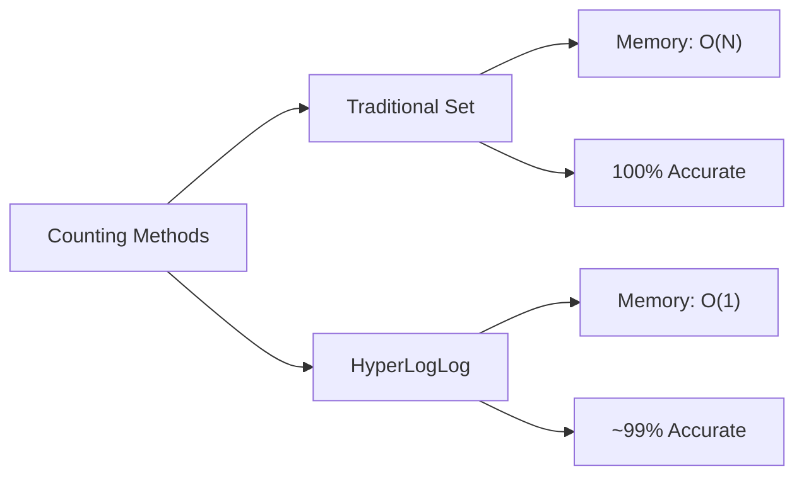

# Redis HyperLogLogs

## Introduction

HyperLogLog is one of Redis' most fascinating data structures, yet it's often overlooked by beginners. It solves a very specific problem: **efficiently counting unique elements in a dataset** (also known as calculating the "cardinality" of a set).

While this might sound simple—after all, couldn't you just use a Redis Set and count its members?—HyperLogLog shines when dealing with **massive datasets** where memory efficiency becomes critical.

## What Makes HyperLogLog Special?

HyperLogLog is a probabilistic data structure that estimates the number of unique elements with remarkable accuracy while using minimal memory:

- Uses only **12KB** of memory per HyperLogLog
- Provides accuracy with an error rate of just **0.81%**
- Can count billions of unique elements without increasing memory usage

Let's compare this to traditional methods:



## Basic HyperLogLog Operations

HyperLogLog supports a handful of commands that are simple to use but powerful in application.

### Creating and Adding Elements

To add elements to a HyperLogLog, we use the `PFADD` command:

```
PFADD visitors user1 user2 user3
```

This command:
1. Creates the HyperLogLog if it doesn't exist
2. Adds the specified elements
3. Returns 1 if the estimated cardinality changed, 0 otherwise

### Counting Unique Elements

To get the estimated count of unique elements, use `PFCOUNT`:

```
PFCOUNT visitors
```

This returns the approximate number of unique elements added to the HyperLogLog.

### Merging Multiple HyperLogLogs

One of the most powerful features is the ability to merge multiple HyperLogLogs:

```
PFMERGE result visitors1 visitors2 visitors3
```

This merges the unique counts from multiple sources into a single HyperLogLog.

## Practical Example: Tracking Website Visitors

Let's implement a simple visitor tracking system using HyperLogLogs:

```js
// Imagine this function runs when a user visits your website
function trackUserVisit(userId, page) {
  // Track unique visitors per page
  redis.pfadd(`page:${page}:visitors`, userId);
  
  // Track unique visitors for the whole site
  redis.pfadd('site:visitors', userId);
  
  // Track unique visitors for today
  const today = new Date().toISOString().split('T')[0];
  redis.pfadd(`site:visitors:${today}`, userId);
}

// To get unique visitor counts
async function getVisitorStats() {
  const [siteTotal, todayTotal] = await Promise.all([
    redis.pfcount('site:visitors'),
    redis.pfcount(`site:visitors:${new Date().toISOString().split('T')[0]}`)
  ]);
  
  return {
    allTime: siteTotal,
    today: todayTotal
  };
}
```

### Memory Efficiency in Action

If you were to track 10 million unique visitors using traditional Redis Sets:
- Set approach: ~400MB (40 bytes per user ID)
- HyperLogLog approach: 12KB (constant regardless of unique count)

That's a **33,000x memory saving**!

## Real-World Applications

HyperLogLog is especially useful for:

1. **Analytics systems**: Counting unique visitors, page views, etc.
2. **Network monitoring**: Tracking unique IP addresses
3. **Database systems**: Estimating query result sizes
4. **Ad tech**: Counting unique impressions across campaigns
5. **Social media**: Approximating reach metrics

## Common Mistakes and Limitations

While powerful, HyperLogLogs have some important limitations to keep in mind:

1. **They're probabilistic**: You trade perfect accuracy for memory efficiency
2. **They're write-only**: You can't retrieve the elements you've added, only count them
3. **They only count uniques**: They don't track frequency or other metrics
4. **Commands start with PF**: Named after Philippe Flajolet, inventor of the algorithm

## Extended Example: User Activity Tracking

Let's build a more complex example tracking daily and weekly active users:

```js
// Track user activity
async function trackUserActivity(userId) {
  const today = new Date().toISOString().split('T')[0];
  const weekNumber = getWeekNumber(new Date()); // Helper function to get week number
  
  // Record this user's activity for today and this week
  await redis.pfadd(`users:active:day:${today}`, userId);
  await redis.pfadd(`users:active:week:${weekNumber}`, userId);
}

// Get daily active users for the past week
async function getDailyActiveUsers() {
  const days = [];
  const counts = [];
  
  // Generate the past 7 days
  for (let i = 0; i < 7; i++) {
    const date = new Date();
    date.setDate(date.getDate() - i);
    const day = date.toISOString().split('T')[0];
    days.push(day);
  }
  
  // Get DAU counts for each day
  for (const day of days) {
    const count = await redis.pfcount(`users:active:day:${day}`);
    counts.push({ day, count });
  }
  
  return counts;
}

// Calculate daily to weekly active user ratio
async function getDAU_WAU_Ratio() {
  const today = new Date().toISOString().split('T')[0];
  const currentWeek = getWeekNumber(new Date());
  
  const [dau, wau] = await Promise.all([
    redis.pfcount(`users:active:day:${today}`),
    redis.pfcount(`users:active:week:${currentWeek}`)
  ]);
  
  return {
    dau,
    wau,
    ratio: wau > 0 ? (dau / wau) : 0
  };
}
```

## HyperLogLog Under the Hood

While the full algorithm is complex, here's a simplified explanation of how HyperLogLog works:

1. It uses a hash function to convert input elements to binary numbers
2. It focuses on patterns in these numbers (specifically, the position of the leftmost '1' bit)
3. By tracking these patterns across many inputs, it can estimate cardinality
4. Multiple estimators are combined to improve accuracy

This approach is based on the observation that the pattern of leading zeros in randomly distributed hash values follows a predictable distribution.

## Summary

Redis HyperLogLogs provide an incredibly memory-efficient way to count unique elements in large datasets. While they sacrifice perfect accuracy for efficiency, their ~99% accuracy is more than sufficient for most applications.

Key points to remember:
- Use HyperLogLogs when you need to count unique items in very large datasets
- They use constant memory regardless of the number of elements counted
- Commands are prefixed with `PF` (PFADD, PFCOUNT, PFMERGE)
- They're write-only; you can't retrieve the original elements

## Additional Resources

Here are some exercises to practice working with HyperLogLogs:

1. Build a simple CLI tool that tracks unique words in text files using Redis HyperLogLogs
2. Implement a basic analytics system that tracks unique visitors per page and across your entire site
3. Compare the memory and performance differences between using Redis Sets and HyperLogLogs for tracking unique items
4. Create a system that tracks unique user actions across different time windows (hour, day, week, month)

## Practice Exercises

1. **Unique Word Counter**: Create a function that counts unique words in a text using HyperLogLog
2. **IP Address Tracker**: Build a system that tracks unique IP addresses accessing a web server
3. **Multi-dimensional Analytics**: Track unique users across different dimensions (device, country, page)
4. **Approximate Joins**: Use HyperLogLogs to estimate the size of database join operations before executing them