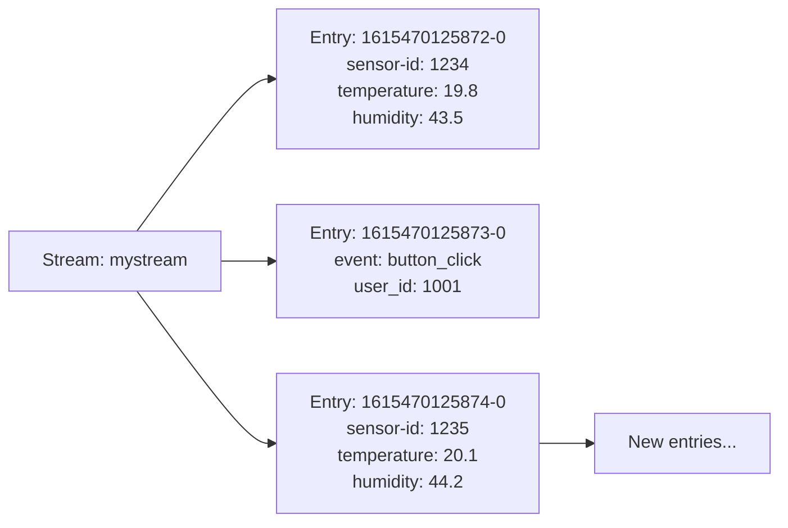
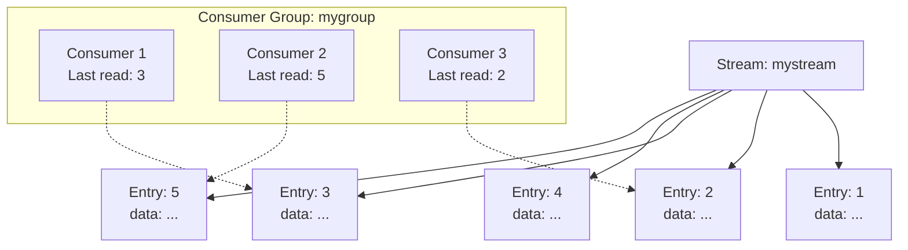

# Redis Streams

## Introduction

Redis Streams is one of the most sophisticated data types in Redis, introduced in Redis 5.0. It's designed to solve the common problem of recording and processing ordered sequences of events or messages. Unlike other Redis messaging capabilities like Pub/Sub (which provides a "fire and forget" mechanism), Streams offers persistence, consumer groups, and the ability to replay messages.

Think of Redis Streams as a log where entries are appended and identified by a timestamp. This makes them perfect for:

- Building messaging systems
- Activity feeds
- Event sourcing patterns
- IoT data collection
- Real-time analytics

## Basic Concepts

Before diving deeper, let's understand the fundamental concepts of Redis Streams:

### Entries

Each entry in a stream contains:
- A unique ID (typically time-based)
- One or more field-value pairs representing the data

The ID format is `timestamp-sequence`, where:
- `timestamp` is the creation time in milliseconds
- `sequence` is a sequence number for entries created in the same millisecond

### Commands Structure

Redis Streams comes with a rich set of commands, all prefixed with `X`:

- `XADD`: Add new entries
- `XREAD`: Read entries from one or multiple streams
- `XRANGE`/`XREVRANGE`: Read a range of entries
- `XLEN`: Get the length of a stream
- `XDEL`: Delete specific entries
- `XTRIM`: Limit the stream length

Let's examine each of these commands with examples.

## Working with Redis Streams

### Adding Entries with `XADD`

The `XADD` command is used to append new entries to a stream:

```
XADD mystream * sensor-id 1234 temperature 19.8 humidity 43.5
```

Output:
```
"1615470125872-0"
```

In this example:
- `mystream` is the stream name
- `*` means generate an ID automatically
- The rest are field-value pairs: `sensor-id`, `temperature`, and `humidity` with their respective values

You can also provide a custom ID:

```
XADD mystream 1615470125873-0 event "button_click" user_id 1001
```

### Reading from Streams with `XREAD`

To read entries from a stream:

```
XREAD COUNT 2 STREAMS mystream 0
```

Output:
```
1) 1) "mystream"
   2) 1) 1) "1615470125872-0"
         2) 1) "sensor-id"
            2) "1234"
            3) "temperature"
            4) "19.8"
            5) "humidity"
            6) "43.5"
      2) 1) "1615470125873-0"
         2) 1) "event"
            2) "button_click"
            3) "user_id"
            4) "1001"
```

In this command:
- `COUNT 2` limits the result to 2 entries
- `STREAMS mystream 0` specifies we want to read from `mystream` starting from ID `0` (the beginning of the stream)

### Blocking Reads

One powerful feature is the ability to block until new data arrives:

```
XREAD BLOCK 10000 STREAMS mystream $
```

This command will:
- Block for up to 10 seconds (10000 milliseconds)
- Read from `mystream`
- Only return entries with IDs greater than the last ID (`$` is a special ID meaning "last ID")

### Reading Ranges with `XRANGE` and `XREVRANGE`

To read a specific range of entries:

```
XRANGE mystream 1615470125872-0 1615470125873-0
```

Or to read in reverse order:

```
XREVRANGE mystream 1615470125873-0 1615470125872-0
```

### Stream Length with `XLEN`

To get the number of entries in a stream:

```
XLEN mystream
```

Output:
```
(integer) 2
```

### Deleting Entries with `XDEL`

To delete specific entries:

```
XDEL mystream 1615470125872-0
```

Output:
```
(integer) 1
```

### Trimming Streams with `XTRIM`

To limit the size of a stream:

```
XTRIM mystream MAXLEN 1000
```

This command ensures the stream won't exceed 1000 entries.

## Consumer Groups

Redis Streams truly shines with its Consumer Groups feature, which enables:
- Multiple consumers reading from the same stream
- Distribution of entries among consumers
- Tracking of acknowledged and pending entries

### Creating a Consumer Group

```
XGROUP CREATE mystream mygroup $
```

This creates a consumer group named `mygroup` that starts reading from the last ID (`$`).

### Reading as Part of a Consumer Group

```
XREADGROUP GROUP mygroup consumer1 COUNT 1 STREAMS mystream >
```

Output (assuming there are unread messages):
```
1) 1) "mystream"
   2) 1) 1) "1615470125873-0"
         2) 1) "event"
            2) "button_click"
            3) "user_id"
            4) "1001"
```

In this command:
- `GROUP mygroup consumer1` specifies the group and consumer names
- `>` is a special ID meaning "give me entries that were never delivered to any consumer"

### Acknowledging Processing with `XACK`

After processing an entry, you should acknowledge it:

```
XACK mystream mygroup 1615470125873-0
```

### Inspecting Pending Entries

To check entries that have been delivered but not acknowledged:

```
XPENDING mystream mygroup
```

## Visualizing Redis Streams

Redis Streams can be visualized as an append-only log with entries containing multiple field-value pairs:



Consumer groups can be visualized as different consumers reading from different positions:



## Practical Applications

### Real-time Analytics Dashboard

Redis Streams can power real-time analytics by collecting events and processing them in real-time:

```
// Collect user events
XADD user_events * user_id 1001 action "page_view" page "/products"
XADD user_events * user_id 1002 action "add_to_cart" product_id 5678
XADD user_events * user_id 1001 action "checkout" amount 129.99

// Process events for dashboard
XREAD COUNT 1000 BLOCK 0 STREAMS user_events 0
```

A background process can read these events, calculate metrics, and update a dashboard in real-time.

### Chat Application

Redis Streams can be used to implement a chat system:

```
// User sends a message
XADD chat_room:general * user "alice" message "Hello everyone!"

// Other users read messages
XREAD BLOCK 0 STREAMS chat_room:general $
```

### IoT Data Collection

For IoT applications, streams can efficiently collect and process sensor data:

```
// Sensor reports temperature
XADD sensors * device_id "temp_sensor_1" temperature 22.5 timestamp 1615470125

// Process sensor data in batches
XREADGROUP GROUP processors worker1 COUNT 100 STREAMS sensors >
```

## Performance Considerations

When working with Redis Streams, keep these performance tips in mind:

1. Use `MAXLEN` with `XADD` to automatically trim streams:
   ```
   XADD mystream MAXLEN ~ 10000 * field value
   ```
   The `~` makes it approximate, which is more efficient.

2. For high-throughput applications, batch your reads and writes.

3. Remember that consumer groups add overhead, so use them only when needed.

4. Long-running blocked `XREAD` commands might impact Redis performance under certain conditions.

## Summary

Redis Streams provides a powerful and flexible way to handle time-series data, implement messaging systems, and build real-time applications. Its key features include:

- Append-only data structures for recording sequential events
- Powerful reading capabilities with blocking operations
- Consumer groups for distributed processing
- Built-in message acknowledgment and tracking
- Efficient range queries

By combining Redis Streams with other Redis data types, you can create sophisticated, high-performance applications that handle real-time data with ease.

## Exercises

1. Create a simple message queue using Redis Streams:
   - Producer adds messages to a stream
   - Consumer reads and processes messages
   - Implement acknowledgment of processed messages

2. Build a basic monitoring system that:
   - Collects system metrics (CPU, memory, disk) using `XADD`
   - Uses `XRANGE` to analyze metrics over specific time periods
   - Implements alerting when metrics exceed thresholds

3. Implement a simple chat application with multiple rooms:
   - Each room is a separate stream
   - Users can join rooms and read messages
   - Messages show timestamp and sender information

## Additional Resources

- [Redis Streams Documentation](https://redis.io/topics/streams-intro)
- [Redis Commands Reference](https://redis.io/commands#stream)
- [Redis University Courses](https://university.redis.com/)