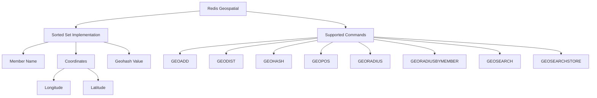

# Redis Geospatial

## Introduction

Redis Geospatial is a powerful feature that allows you to store and query geographical data within Redis. Introduced in Redis 3.2, this feature enables you to build location-aware applications with the ability to:

- Store locations (latitude and longitude coordinates)
- Calculate distances between points
- Find locations within a specified radius
- Find locations within a specified rectangular area
- Sort locations by distance from a reference point

This functionality is perfect for various applications including location-based services, ride-sharing platforms, nearby point-of-interest searches, and spatial analytics.

## Understanding Geospatial Data in Redis

At its core, Redis Geospatial uses a specialized data structure built on top of the Sorted Set data type. Locations are stored with:

- A member name (identifying the location)
- Longitude and latitude coordinates
- A geohash value (used internally for efficient spatial indexing)



## Basic Geospatial Commands

### Storing Locations with GEOADD

The `GEOADD` command adds geographical locations to a specified key:

```
GEOADD key longitude latitude member [longitude latitude member ...]
```

Example - Adding cafe locations to a "cafes" key:

```
GEOADD cafes -73.9822 40.7484 "Empire State Cafe" -74.0060 40.7128 "Downtown Coffee" -73.9632 40.7799 "Central Park Brews"
```

Output:
```
(integer) 3
```

### Retrieving Coordinates with GEOPOS

Once locations are stored, you can retrieve their coordinates:

```
GEOPOS key member [member ...]
```

Example:

```
GEOPOS cafes "Empire State Cafe" "Downtown Coffee"
```

Output:
```
1) 1) "-73.98220092058181763"
   2) "40.74840360703913625"
2) 1) "-74.00600105524063110"
   2) "40.71279966259346770"
```

### Getting Geohash Strings with GEOHASH

The `GEOHASH` command returns Geohash strings which encode coordinates into a single string:

```
GEOHASH key member [member ...]
```

Example:

```
GEOHASH cafes "Empire State Cafe" "Downtown Coffee"
```

Output:
```
1) "dr5r5cpm3g0"
2) "dr5r1z7ss10"
```

### Calculating Distance with GEODIST

You can calculate the distance between two locations:

```
GEODIST key member1 member2 [unit]
```

The unit parameter can be:
- **m** (meters, default)
- **km** (kilometers)
- **mi** (miles)
- **ft** (feet)

Example:

```
GEODIST cafes "Empire State Cafe" "Downtown Coffee" km
```

Output:
```
"4.1197"
```

## Radius and Area Searches

### Finding Locations Within a Radius

The `GEORADIUS` command finds locations within a specific radius from given coordinates:

```
GEORADIUS key longitude latitude radius unit [WITHCOORD] [WITHDIST] [WITHHASH] [COUNT count] [ASC|DESC] [STORE key] [STOREDIST key]
```

Example - Finding cafes within 5 kilometers of specific coordinates:

```
GEORADIUS cafes -74.0000 40.7500 5 km WITHDIST
```

Output:
```
1) 1) "Empire State Cafe"
   2) "1.5958"
2) 1) "Downtown Coffee"
   2) "4.1991"
```

### Searching by Member

The `GEORADIUSBYMEMBER` command finds locations within a radius from an existing member:

```
GEORADIUSBYMEMBER key member radius unit [WITHCOORD] [WITHDIST] [WITHHASH] [COUNT count] [ASC|DESC] [STORE key] [STOREDIST key]
```

Example:

```
GEORADIUSBYMEMBER cafes "Empire State Cafe" 5 km WITHDIST
```

Output:
```
1) 1) "Empire State Cafe"
   2) "0.0000"
2) 1) "Downtown Coffee"
   2) "4.1197"
3) 1) "Central Park Brews"
   2) "3.5049"
```

### Advanced Searching with GEOSEARCH (Redis 6.2+)

Redis 6.2 introduced more flexible searching with `GEOSEARCH`:

```
GEOSEARCH key [FROMMEMBER member | FROMLONLAT longitude latitude] [BYRADIUS radius unit | BYBOX width height unit] [ASC|DESC] [COUNT count] [WITHCOORD] [WITHDIST] [WITHHASH]
```

Example - Search in a rectangular area:

```
GEOSEARCH cafes FROMLONLAT -74.0000 40.7500 BYBOX 5 5 km WITHDIST
```

Output:
```
1) 1) "Empire State Cafe"
   2) "1.5958"
2) 1) "Downtown Coffee"
   2) "4.1991"
3) 1) "Central Park Brews"
   2) "3.2960"
```

### Storing Search Results

`GEOSEARCHSTORE` allows you to store the results of a search:

```
GEOSEARCHSTORE destination source [FROMMEMBER member | FROMLONLAT longitude latitude] [BYRADIUS radius unit | BYBOX width height unit] [ASC|DESC] [COUNT count] [STOREDIST]
```

Example:

```
GEOSEARCHSTORE nearby_cafes cafes FROMMEMBER "Empire State Cafe" BYRADIUS 3 km
```

Output:
```
(integer) 1
```

## Practical Examples

### Building a "Nearby Places" Feature

Here's how you might build a "find nearby places" feature for a mobile app:

```js
// Example using Node.js with redis client
const redis = require('redis');
const client = redis.createClient();

async function findNearbyPlaces(lat, lon, radiusKm) {
  await client.connect();
  
  // Get places within radius
  const nearbyPlaces = await client.sendCommand([
    'GEORADIUS', 
    'places', 
    lon.toString(), 
    lat.toString(), 
    radiusKm.toString(), 
    'km', 
    'WITHDIST'
  ]);
  
  // Format results
  const results = nearbyPlaces.map(place => ({
    name: place[0],
    distance: parseFloat(place[1])
  }));
  
  await client.disconnect();
  return results;
}

// Example usage
findNearbyPlaces(40.7484, -73.9857, 2)
  .then(places => console.log('Nearby places:', places))
  .catch(err => console.error('Error:', err));
```

### Ride-Sharing Driver Tracking

Here's how a ride-sharing service might track and match drivers with riders:

```js
// Store driver's current position
async function updateDriverPosition(driverId, lat, lon) {
  await client.connect();
  
  await client.sendCommand([
    'GEOADD', 
    'active_drivers', 
    lon.toString(), 
    lat.toString(), 
    driverId
  ]);
  
  await client.disconnect();
  return true;
}

// Find nearby drivers for a rider
async function findNearbyDrivers(riderLat, riderLon, radiusKm) {
  await client.connect();
  
  const drivers = await client.sendCommand([
    'GEORADIUS', 
    'active_drivers', 
    riderLon.toString(), 
    riderLat.toString(), 
    radiusKm.toString(), 
    'km', 
    'WITHDIST', 
    'ASC'
  ]);
  
  await client.disconnect();
  
  return drivers.map(driver => ({
    driverId: driver[0],
    distanceKm: parseFloat(driver[1])
  }));
}
```

### Geofencing with Redis

Example of creating a geofence to track when a device enters or exits a defined area:

```js
// Check if device is in a geofenced area
async function checkGeofence(deviceId, lat, lon) {
  await client.connect();
  
  // First update device position
  await client.sendCommand([
    'GEOADD', 
    'device_positions', 
    lon.toString(), 
    lat.toString(), 
    deviceId
  ]);
  
  // Check if within any geofenced areas
  const areas = await client.sendCommand([
    'GEORADIUS', 
    'geofenced_areas', 
    lon.toString(), 
    lat.toString(), 
    '0.5', // 500 meter radius check
    'km'
  ]);
  
  await client.disconnect();
  
  return {
    deviceId,
    inGeofencedAreas: areas,
    timestamp: new Date().toISOString()
  };
}
```

## Performance Considerations

Redis Geospatial commands offer excellent performance, but here are some considerations:

1. **Memory Usage**: Each entry in a geospatial index requires approximately 32 bytes of memory (excluding the member name).

2. **Indexing Speed**: `GEOADD` operations have O(log(N)) complexity where N is the number of elements in the sorted set.

3. **Search Performance**: Radius searches scale with the number of matching elements, not the total size of the dataset.

4. **Radius Size**: Very large radius searches may impact performance. Consider using the COUNT option to limit results.

5. **Maximum Precision**: Redis geospatial operations have a maximum precision of about 0.7 meters.

## Limitations

While powerful, Redis Geospatial has some limitations:

1. **Valid Coordinates**: Redis only accepts coordinates within the standard latitude (-85.05112878 to 85.05112878) and longitude (-180 to 180) ranges.

2. **No Multi-Polygon Support**: Complex geometric shapes aren't supported natively.

3. **No Altitude**: Redis Geospatial only handles 2D coordinates (latitude and longitude), with no support for altitude/elevation.

4. **Earth-Based**: Calculations assume Earth's shape and aren't suitable for other planetary bodies or custom coordinate systems.

## Summary

Redis Geospatial provides a powerful set of features for working with location data:

- Fast storage and retrieval of geographical coordinates
- Distance calculations between points
- Efficient radius and area searches
- Sorting results by distance

These capabilities make Redis an excellent choice for location-based services, from finding nearby points of interest to tracking moving objects in real-time applications.

## Additional Resources and Exercises

### Resources

- [Redis Geospatial Commands Documentation](https://redis.io/commands/?group=geo)
- [Redis Geospatial Introduction](https://redis.io/docs/data-types/geospatial/)

### Exercises

1. **Build a Store Locator**: Create a simple application that finds the nearest stores to a given location.

2. **Implement Geofencing**: Build a system that tracks when objects enter or leave predefined areas.

3. **Proximity Chat**: Design a chat system where users can only communicate with others within a certain physical distance.

4. **Performance Testing**: Compare the performance of Redis Geospatial commands with traditional database spatial queries.

5. **Route Optimization**: Use Redis Geospatial to find the optimal route between multiple points based on proximity.