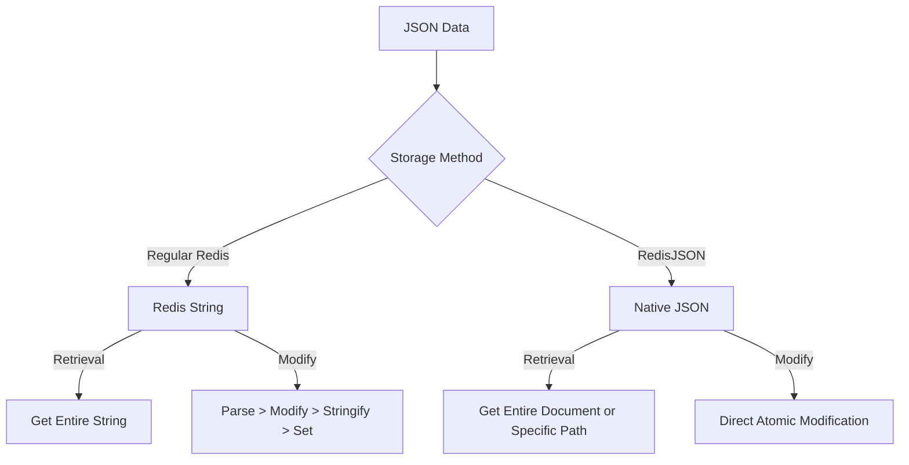

# Redis JSON

## Introduction

Redis JSON is a Redis module that adds native JSON support to Redis, allowing you to store, update, and retrieve JSON documents in Redis with atomic operations. This powerful combination brings together Redis's exceptional performance with the flexibility and ease of use of the JSON data format.

As a beginner, you might be wondering why this is important. Well, JSON (JavaScript Object Notation) has become one of the most popular data formats for storing and exchanging information, especially in web applications. By adding native JSON support to Redis, developers can work with complex nested data structures without having to serialize and deserialize JSON manually.

In this guide, we'll explore Redis JSON, its benefits, and how to use it effectively in your applications.

## Prerequisites

Before diving into Redis JSON, make sure you have:
- Basic understanding of Redis
- Familiarity with JSON format
- Redis installed with the RedisJSON module

## Getting Started with Redis JSON

### Installation

Redis JSON is not included in the standard Redis distribution. You'll need to install it as a module.

For Docker users:
```bash
docker run -p 6379:6379 --name redis-redisjson redislabs/rejson:latest
```

For Redis Stack (includes RedisJSON and other modules):
```bash
docker run -p 6379:6379 --name redis-stack redis/redis-stack
```

### Verifying Installation

Let's connect to Redis and check if RedisJSON is properly installed:

```bash
redis-cli
```

Once connected, run:
```bash
MODULE LIST
```

You should see the RedisJSON module in the output, similar to:
```
1) 1) "name"
   2) "ReJSON"
   3) "ver"
   4) (integer) 20004
```

## Basic Redis JSON Operations

### Storing JSON Documents

To store a JSON document in Redis, use the `JSON.SET` command:

```redis
JSON.SET user:1 $ '{"name":"John","age":30,"email":"john@example.com","address":{"city":"New York","zip":"10001"}}'
```

Let's break this down:
- `JSON.SET` is the command
- `user:1` is the key where the JSON document will be stored
- `$` represents the root path (we'll explore paths more later)
- The last parameter is the JSON document as a string

Output:
```
OK
```

### Retrieving JSON Documents

To retrieve a JSON document, use the `JSON.GET` command:

```redis
JSON.GET user:1
```

Output:
```
"{\"name\":\"John\",\"age\":30,\"email\":\"john@example.com\",\"address\":{\"city\":\"New York\",\"zip\":\"10001\"}}"
```

To get a specific field, specify the path:

```redis
JSON.GET user:1 $.name
```

Output:
```
"[\"John\"]"
```

### Updating JSON Documents

To update a specific field in a JSON document:

```redis
JSON.SET user:1 $.age 31
```

Output:
```
OK
```

Let's verify the update:

```redis
JSON.GET user:1 $.age
```

Output:
```
"[31]"
```

### Deleting Fields or Documents

To delete a field from a JSON document:

```redis
JSON.DEL user:1 $.email
```

Output:
```
(integer) 1
```

To delete an entire document:

```redis
JSON.DEL user:1 $
```

Output:
```
(integer) 1
```

## Understanding JSON Path

Redis JSON uses a path syntax to specify locations within JSON documents. This is powerful for targeting specific parts of your documents.

### Basic Path Syntax

- `$`: Refers to the root of the document
- `$.name`: Refers to the "name" field at the root level
- `$.address.city`: Refers to the "city" field nested within "address"
- `$.tags[0]`: Refers to the first element of the "tags" array

Let's create a more complex document to demonstrate:

```redis
JSON.SET product:1 $ '{"id":"p1","name":"Laptop","price":999.99,"specs":{"cpu":"i7","ram":"16GB","storage":"512GB SSD"},"tags":["electronics","computer","premium"],"stock":{"warehouse1":10,"warehouse2":5}}'
```

Now, let's try different paths:

```redis
JSON.GET product:1 $.name
JSON.GET product:1 $.specs.cpu
JSON.GET product:1 $.tags[1]
JSON.GET product:1 $.stock.warehouse1
```

Output:
```
"[\"Laptop\"]"
"[\"i7\"]"
"[\"computer\"]"
"[10]"
```

### Array Operations

Redis JSON has special commands for array manipulation:

Adding an element to an array:
```redis
JSON.ARRAPPEND product:1 $.tags "sale"
```

Output:
```
(integer) 4
```

Getting array length:
```redis
JSON.ARRLEN product:1 $.tags
```

Output:
```
(integer) 4
```

## Numeric Operations

Redis JSON supports atomic numeric operations:

Incrementing a number:
```redis
JSON.NUMINCRBY product:1 $.price 100
```

Output:
```
"1099.99"
```

Multiplying a number:
```redis
JSON.NUMMULTBY product:1 $.stock.warehouse1 2
```

Output:
```
"20"
```

## Real-World Examples

### User Profile Management

Let's implement a simple user profile system:

```redis
# Create user profile
JSON.SET user:john $ '{"username":"john_doe","email":"john@example.com","profile":{"fullName":"John Doe","age":28,"location":"San Francisco"},"preferences":{"theme":"dark","notifications":true},"loginHistory":[]}'

# Update user preferences
JSON.SET user:john $.preferences.theme "light"

# Add login timestamp to history
JSON.ARRAPPEND user:john $.loginHistory '{"timestamp":"2023-07-15T14:30:00Z","ip":"192.168.1.1"}'

# Get user profile information
JSON.GET user:john '$.profile'
```

Output:
```
"[{\"fullName\":\"John Doe\",\"age\":28,\"location\":\"San Francisco\"}]"
```

### Product Inventory System

Let's create a simple product inventory system:

```redis
# Create product with inventory info
JSON.SET inventory:laptop $ '{"product":"Laptop Pro","category":"Electronics","price":1299.99,"stock":{"total":100,"locations":{"store1":30,"store2":45,"warehouse":25}},"specs":{"cpu":"i7","ram":"16GB","storage":"1TB"}}'

# Update stock after a sale of 5 units from store1
JSON.NUMINCRBY inventory:laptop $.stock.locations.store1 -5

# Check updated inventory for store1
JSON.GET inventory:laptop $.stock.locations.store1
```

Output:
```
"[25]"
```

### Shopping Cart Implementation

```redis
# Create a new shopping cart
JSON.SET cart:user123 $ '{"userId":"user123","items":[],"created":"2023-07-15T10:00:00Z"}'

# Add an item to the cart
JSON.ARRAPPEND cart:user123 $.items '{"productId":"p100","name":"Wireless Headphones","price":79.99,"quantity":1}'

# Add another item
JSON.ARRAPPEND cart:user123 $.items '{"productId":"p200","name":"Bluetooth Speaker","price":129.99,"quantity":1}'

# Update item quantity
JSON.SET cart:user123 $.items[0].quantity 2

# Calculate total (in your application logic, after retrieving the cart)
JSON.GET cart:user123 $.items
```

Output:
```
"[[{\"productId\":\"p100\",\"name\":\"Wireless Headphones\",\"price\":79.99,\"quantity\":2},{\"productId\":\"p200\",\"name\":\"Bluetooth Speaker\",\"price\":129.99,\"quantity\":1}]]"
```

## Performance Considerations

When working with Redis JSON, keep these performance tips in mind:

1. **Document Size**: While Redis JSON can handle large documents, performance is better with smaller documents. Consider breaking up very large documents if possible.

2. **Path Complexity**: Complex path expressions can be powerful but might impact performance. Keep paths as simple as possible for frequently accessed operations.

3. **Atomic Operations**: Use Redis JSON's atomic operations like `NUMINCRBY` instead of getting, modifying, and setting the document again.

4. **Selective Retrieval**: Only retrieve the parts of the document you need using specific paths, especially for large documents.

## Understanding Redis JSON vs. Regular Redis

Let's visualize the difference between storing JSON in regular Redis vs. using RedisJSON:



## Common Patterns and Best Practices

### Document Design

1. **Keep documents reasonably sized**: While Redis JSON can handle large documents, smaller documents are more efficient.

2. **Use meaningful keys**: Follow the same Redis key naming conventions you would use for other Redis data types.

3. **Consider denormalization**: Unlike relational databases, Redis JSON works well with denormalized data for faster access.

Example of good document design:

```redis
JSON.SET order:1001 $ '{
  "id": "1001",
  "customer": {
    "id": "cust123",
    "name": "Alice Johnson",
    "email": "alice@example.com"
  },
  "items": [
    {"product": "Laptop", "price": 1299.99, "quantity": 1},
    {"product": "Mouse", "price": 24.99, "quantity": 1}
  ],
  "total": 1324.98,
  "status": "pending",
  "created": "2023-07-15T10:30:00Z"
}'
```

### Indexing with RediSearch

If you're using Redis Stack, you can leverage RediSearch to index and query your JSON documents:

```redis
FT.CREATE idx:orders ON JSON PREFIX 1 order: SCHEMA $.customer.name AS customer_name TEXT $.total AS total NUMERIC $.status AS status TAG
```

Then you can perform powerful searches:

```redis
FT.SEARCH idx:orders "@customer_name:Alice @status:{pending} @total:[1000 2000]"
```

## Summary

Redis JSON extends Redis's capabilities by adding native JSON support, allowing you to store, retrieve, and manipulate JSON documents efficiently. Key benefits include:

- Native JSON data type with atomic operations
- Path-based access to nested values
- Array and numeric operations
- Simplified development for applications working with JSON data

By using Redis JSON, you can combine the performance and features of Redis with the flexibility of JSON documents, making it an excellent choice for many modern application scenarios including user profiles, shopping carts, real-time analytics, and more.

## Exercises

1. Create a JSON document representing a blog post with title, content, author information, and comments.

2. Implement a simple to-do list application where each user has a list of tasks stored as a JSON document.

3. Build a basic social media profile system where users can update their profile information and add posts to their timeline.

4. Create a product catalog with categories, subcategories, and products, all stored using Redis JSON.

## Additional Resources

- [Redis JSON Official Documentation](https://redis.io/docs/stack/json/)
- [JSONPath Syntax](https://goessner.net/articles/JsonPath/)
- [Redis University Courses](https://university.redis.com/)