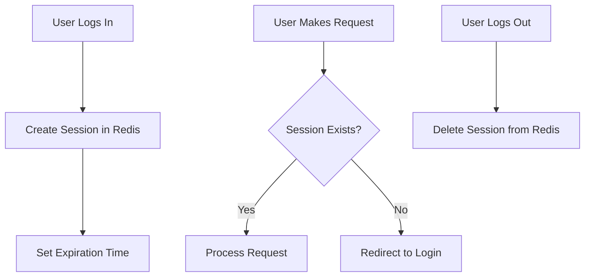

# Redis CRUD Operations

## Introduction

Redis (Remote Dictionary Server) is an open-source, in-memory data structure store that can be used as a database, cache, message broker, and streaming engine. One of the key aspects of working with Redis is understanding how to perform CRUD operations - Create, Read, Update, and Delete - which form the foundation of any data manipulation task.

In this guide, we'll explore how to perform these fundamental operations in Redis using its command-line interface and Node.js with the `redis` client library. By the end, you'll have a solid understanding of how to manage data in Redis effectively.

## Redis Data Model Basics

Before diving into CRUD operations, it's important to understand that Redis operates differently from traditional relational databases:

- Redis is primarily a key-value store
- All Redis keys are strings
- Values can be strings, lists, sets, sorted sets, hashes, and more
- There are no tables, rows, or columns in the traditional sense

This unique data model gives Redis its exceptional speed and flexibility.

## CRUD Operations in Redis

Let's explore how to perform each CRUD operation in Redis:

### Create Operations

Creating data in Redis involves storing values using various data structures. Here are the most common creation commands:

#### String Values

```bash
SET key value
```

Example:

```bash
SET user:1001 "John Doe"
```

Output:
```
OK
```

#### Hash Values (for storing objects)

```bash
HSET key field value [field value ...]
```

Example:

```bash
HSET user:1001 name "John Doe" email "john@example.com" age 30
```

Output:
```
(integer) 3
```

#### Lists

```bash
LPUSH key value [value ...]  # Add to the left (beginning)
RPUSH key value [value ...]  # Add to the right (end)
```

Example:

```bash
RPUSH notifications:1001 "New friend request" "New message" "System update"
```

Output:
```
(integer) 3
```

#### Sets

```bash
SADD key member [member ...]
```

Example:

```bash
SADD interests:1001 "programming" "music" "hiking"
```

Output:
```
(integer) 3
```

#### Sorted Sets

```bash
ZADD key score member [score member ...]
```

Example:

```bash
ZADD leaderboard 100 "player1" 85 "player2" 95 "player3"
```

Output:
```
(integer) 3
```

### Read Operations

Reading data from Redis involves retrieving stored values using their keys:

#### String Values

```bash
GET key
```

Example:

```bash
GET user:1001
```

Output:
```
"John Doe"
```

#### Hash Values

```bash
HGET key field           # Get a single field
HGETALL key              # Get all fields and values
```

Example:

```bash
HGET user:1001 email
```

Output:
```
"john@example.com"
```

```bash
HGETALL user:1001
```

Output:
```
1) "name"
2) "John Doe"
3) "email"
4) "john@example.com"
5) "age"
6) "30"
```

#### Lists

```bash
LRANGE key start stop
```

Example:

```bash
LRANGE notifications:1001 0 -1  # Get all items (0 to -1 means all)
```

Output:
```
1) "New friend request"
2) "New message"
3) "System update"
```

#### Sets

```bash
SMEMBERS key
```

Example:

```bash
SMEMBERS interests:1001
```

Output:
```
1) "programming"
2) "music"
3) "hiking"
```

#### Sorted Sets

```bash
ZRANGE key start stop [WITHSCORES]
```

Example:

```bash
ZRANGE leaderboard 0 -1 WITHSCORES
```

Output:
```
1) "player2"
2) "85"
3) "player3"
4) "95"
5) "player1"
6) "100"
```

### Update Operations

Updating data in Redis involves modifying existing values:

#### String Values

```bash
SET key value  # Overwrites existing value
```

Example:

```bash
SET user:1001 "Jane Doe"  # Overwrites "John Doe"
```

Output:
```
OK
```

#### Hash Values

```bash
HSET key field value  # Updates a specific field
```

Example:

```bash
HSET user:1001 age 31  # Updates age from 30 to 31
```

Output:
```
(integer) 0  # 0 means the field was updated, not created
```

#### Lists

```bash
LSET key index value  # Update an item at a specific position
```

Example:

```bash
LSET notifications:1001 1 "Updated message"  # Updates the second item
```

Output:
```
OK
```

#### Sets

For sets, updates are typically handled by removing and adding items:

```bash
SREM key member  # Remove the old value
SADD key member  # Add the new value
```

Example:

```bash
SREM interests:1001 "hiking"
SADD interests:1001 "swimming"
```

Output:
```
(integer) 1
(integer) 1
```

#### Sorted Sets

```bash
ZADD key score member  # Updates score if member exists
```

Example:

```bash
ZADD leaderboard 110 "player1"  # Updates player1's score from 100 to 110
```

Output:
```
(integer) 0  # 0 means the member was updated, not added
```

### Delete Operations

Deleting data in Redis can be done at different levels:

#### Delete entire keys

```bash
DEL key [key ...]
```

Example:

```bash
DEL user:1001
```

Output:
```
(integer) 1  # Number of keys removed
```

#### Delete fields from hashes

```bash
HDEL key field [field ...]
```

Example:

```bash
HDEL user:1001 email
```

Output:
```
(integer) 1  # Number of fields removed
```

#### Remove items from lists

```bash
LREM key count value
```

Example:

```bash
LREM notifications:1001 1 "Updated message"
```

Output:
```
(integer) 1  # Number of items removed
```

#### Remove members from sets

```bash
SREM key member [member ...]
```

Example:

```bash
SREM interests:1001 "music"
```

Output:
```
(integer) 1  # Number of members removed
```

#### Remove members from sorted sets

```bash
ZREM key member [member ...]
```

Example:

```bash
ZREM leaderboard "player2"
```

Output:
```
(integer) 1  # Number of members removed
```

## Setting Expiration on Keys

Redis allows you to set expiration times on keys, which is especially useful for caching:

```bash
EXPIRE key seconds
EXPIREAT key timestamp
TTL key  # Check remaining time-to-live
```

Example:

```bash
SET session:user123 "active"
EXPIRE session:user123 3600  # Expires in 1 hour
```

Output:
```
OK
(integer) 1
```

```bash
TTL session:user123
```

Output:
```
(integer) 3598  # Seconds remaining
```

## Practical Example: User Session Management

Let's look at a real-world example of using Redis for managing user sessions:



### Implementation with Node.js

Here's how to implement basic user session management using Node.js and Redis:

```javascript
const redis = require('redis');
const client = redis.createClient();

// Connect to Redis
client.connect()
  .then(() => console.log('Connected to Redis'))
  .catch(err => console.error('Redis connection error:', err));

// Create a user session
async function createSession(userId, userData) {
  const sessionId = `session:${userId}`;
  
  // Store user data as a hash
  await client.hSet(sessionId, userData);
  
  // Set expiration (e.g., 1 hour)
  await client.expire(sessionId, 3600);
  
  return sessionId;
}

// Get session data
async function getSession(userId) {
  const sessionId = `session:${userId}`;
  
  // Get all session data
  const sessionData = await client.hGetAll(sessionId);
  
  // If empty object is returned, session doesn't exist
  if (Object.keys(sessionData).length === 0) {
    return null;
  }
  
  return sessionData;
}

// Update session data
async function updateSession(userId, field, value) {
  const sessionId = `session:${userId}`;
  
  // Update specific field
  await client.hSet(sessionId, field, value);
  
  // Reset expiration time
  await client.expire(sessionId, 3600);
}

// Delete session
async function deleteSession(userId) {
  const sessionId = `session:${userId}`;
  await client.del(sessionId);
}

// Example usage
async function example() {
  try {
    // User logs in
    await createSession('user123', {
      username: 'johndoe',
      email: 'john@example.com',
      lastLogin: Date.now()
    });
    console.log('Session created');
    
    // Get session data
    const session = await getSession('user123');
    console.log('Session data:', session);
    
    // Update last activity
    await updateSession('user123', 'lastActivity', Date.now());
    console.log('Session updated');
    
    // User logs out
    await deleteSession('user123');
    console.log('Session deleted');
    
    // Verify session is gone
    const checkSession = await getSession('user123');
    console.log('Session after deletion:', checkSession);
  } catch (err) {
    console.error('Error:', err);
  } finally {
    // Close Redis connection
    await client.quit();
  }
}

example();
```

## Best Practices for Redis CRUD Operations

1. **Use descriptive key names**: Follow conventions like `object-type:id` (e.g., `user:1001`) for clarity and organization.

2. **Be mindful of memory usage**: Redis stores everything in memory, so be judicious about what you store.

3. **Set appropriate expiration times**: Use TTL for cache data and temporary records to manage memory automatically.

4. **Use the right data structures**: 
   - Strings for simple values and binary data
   - Hashes for objects with multiple fields
   - Lists for ordered collections
   - Sets for unique collections
   - Sorted sets for ranked data

5. **Use transactions when necessary**: The `MULTI` and `EXEC` commands allow for atomic operations.

6. **Implement proper error handling**: Always handle Redis connection and operation errors in your application.

7. **Consider using pipelining**: For bulk operations to reduce network overhead.

## Summary

Redis CRUD operations provide a powerful and flexible way to manage data with exceptional performance. In this guide, we've covered:

- Creating data using various Redis data structures
- Reading data efficiently
- Updating existing data
- Deleting data at different levels
- Setting expirations for automatic cleanup
- A practical example of session management

Redis's simplicity and speed make it an excellent choice for caching, session storage, real-time analytics, and many other use cases where performance is critical.

## Exercises

1. Build a simple task list application that stores tasks in Redis using lists
2. Implement a leaderboard system using Redis sorted sets
3. Create a user profile system using Redis hashes
4. Build a simple caching system that automatically expires data after a specified time
5. Implement a session management system similar to the example but add features like tracking active devices

## Additional Resources

- [Redis Official Documentation](https://redis.io/documentation)
- [Redis Command Reference](https://redis.io/commands)
- [Redis Node.js Client Documentation](https://github.com/redis/node-redis)
- [Redis University](https://university.redis.com/) - Free online courses
- [Redis Stack](https://redis.io/docs/stack/) - Extended Redis functionality