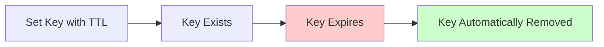

# Redis Expiration

Redis provides powerful functionality to automatically expire keys after a certain period. This feature is essential for creating caching mechanisms, handling temporary data, and managing time-sensitive information in your applications.

## What is Redis Expiration?

Redis expiration allows you to set a time-to-live (TTL) for keys in your Redis database. When a key expires, Redis will automatically remove it, freeing up memory and ensuring your database doesn't accumulate stale data.



## Setting Expiration Times

Redis provides several commands to set expiration times on keys:

### EXPIRE Command

The most straightforward way to set expiration is with the `EXPIRE` command:

```redis
SET user:session:123 "session_data"
EXPIRE user:session:123 3600  # Expires in 3600 seconds (1 hour)
```

### EXPIREAT Command

`EXPIREAT` sets an absolute Unix timestamp for when a key should expire:

```redis
SET user:temp:456 "temporary_data"
EXPIREAT user:temp:456 1672531200  # Expires at specific Unix timestamp
```

### Setting Expiration During Key Creation

You can also set expiration when creating a key:

```redis
SET cache:result:789 "cached_calculation" EX 60  # Expires in 60 seconds
```

Or with millisecond precision:

```redis
SET analytics:recent "recent_data" PX 5000  # Expires in 5000 milliseconds
```

## Checking Expiration Status

To check if a key has an expiration set and how much time is left:

### TTL Command

```redis
TTL user:session:123
```

Possible return values:
- A positive integer: remaining time to live in seconds
- `-1`: key exists but has no expiration set
- `-2`: key does not exist

### PTTL Command

For millisecond precision:

```redis
PTTL user:session:123
```

## Removing Expiration

To remove an expiration setting from a key:

```redis
PERSIST user:session:123  # Remove expiration, key will remain until explicitly deleted
```

## Example: Implementing a Simple Cache

Let's build a simple caching system using Redis expiration:

```python
import redis
import json

# Connect to Redis
r = redis.Redis(host='localhost', port=6379, db=0)

def get_user_data(user_id):
    # Try to get cached data first
    cache_key = f"cache:user:{user_id}"
    cached_data = r.get(cache_key)
    
    if cached_data:
        print("Cache hit! Using cached data")
        return json.loads(cached_data)
    
    # Simulate expensive database operation
    print("Cache miss! Fetching from database...")
    user_data = {
        "id": user_id,
        "name": "Example User",
        "email": "user@example.com",
        "preferences": {"theme": "dark", "notifications": True}
    }
    
    # Cache the result for 5 minutes (300 seconds)
    r.set(cache_key, json.dumps(user_data), ex=300)
    print("Data cached for 5 minutes")
    
    return user_data

# First call - data fetched from "database" and cached
result1 = get_user_data(42)
print(result1)

# Second call within 5 minutes - data retrieved from cache
result2 = get_user_data(42)
print(result2)
```

Output:
```
Cache miss! Fetching from database...
Data cached for 5 minutes
{'id': 42, 'name': 'Example User', 'email': 'user@example.com', 'preferences': {'theme': 'dark', 'notifications': True}}
Cache hit! Using cached data
{'id': 42, 'name': 'Example User', 'email': 'user@example.com', 'preferences': {'theme': 'dark', 'notifications': True}}
```

## Real-world Applications

Redis expiration is used in many practical scenarios:

### Session Management

Store user sessions with an appropriate timeout:

```javascript
// Store user session after login
function loginUser(userId, sessionData) {
  const sessionKey = `session:${userId}`;
  // Store session for 24 hours
  redis.set(sessionKey, JSON.stringify(sessionData), 'EX', 86400);
  return sessionKey;
}

// Check if session is valid
async function validateSession(sessionKey) {
  const session = await redis.get(sessionKey);
  return session !== null;
}
```

### Rate Limiting

Implement API rate limiting with expiring keys:

```python
def rate_limit(user_id, limit=10, period=60):
    """
    Limit users to 'limit' requests per 'period' seconds
    """
    rate_key = f"ratelimit:{user_id}"
    
    # Get current count
    count = r.get(rate_key)
    
    if count is None:
        # First request in this period
        r.set(rate_key, 1, ex=period)
        return True
    
    count = int(count)
    
    if count < limit:
        # Increment counter
        r.incr(rate_key)
        return True
    
    # Rate limit exceeded
    ttl = r.ttl(rate_key)
    print(f"Rate limit exceeded. Try again in {ttl} seconds")
    return False
```

### Temporary Data Storage

Store short-lived data like one-time verification codes:

```python
def create_verification_code(user_id):
    # Generate a 6-digit code
    code = str(random.randint(100000, 999999))
    
    # Store the code with a 10-minute expiration
    code_key = f"verification:{user_id}"
    r.set(code_key, code, ex=600)
    
    return code

def verify_code(user_id, submitted_code):
    code_key = f"verification:{user_id}"
    stored_code = r.get(code_key)
    
    if stored_code and stored_code.decode() == submitted_code:
        # Code is correct, delete it so it can't be reused
        r.delete(code_key)
        return True
    
    return False
```

## Redis Expiration Policies

When Redis has keys set to expire, it handles their removal in two ways:

1. **Passive expiration**: When a client tries to access a key, Redis checks if it's expired before returning it.

2. **Active expiration**: Redis periodically samples a subset of keys with expiration times set to determine if they should be deleted.

This two-pronged approach balances CPU usage with memory efficiency. Redis won't use excessive CPU time cleaning up all expired keys immediately, but it also won't let too many expired keys accumulate.

## Performance Considerations

- Setting expiration on a key does not affect its performance when accessed.
- Redis processes expiration checks efficiently, even with millions of keys.
- For very large datasets with many expiring keys, consider using Redis 6.0+ with improved expiration algorithms.

## Working with Multiple Expiring Keys

If you need to expire multiple related keys at once, consider using Redis Hash structures with a single expiration time, or leverage Redis transactions:

```redis
MULTI
SET user:profile:123 "profile_data"
SET user:prefs:123 "preference_data"
SET user:stats:123 "statistics_data"
EXPIRE user:profile:123 3600
EXPIRE user:prefs:123 3600
EXPIRE user:stats:123 3600
EXEC
```

## Summary

Redis expiration provides a powerful mechanism for managing the lifetime of data in your Redis database. By setting appropriate expiration times:

- You can implement efficient caching strategies
- Manage temporary data like sessions and tokens
- Create rate-limiting and throttling systems
- Prevent your Redis instance from accumulating stale data

Properly using expirations helps maintain Redis performance and ensures your application works with fresh, relevant data.

## Practice Exercises

1. Create a distributed lock system that automatically releases locks after a timeout period.
2. Implement a "recently viewed items" feature that expires items after 24 hours.
3. Build a leaderboard that automatically removes entries after a contest period ends.
4. Develop a cache invalidation strategy using Redis expiration combined with event-based updates.

## Advanced Techniques

For more complex scenarios, explore:

- Using Redis Lua scripts to manage complex expiration logic
- Combining expiration with Redis Streams for time-windowed analytics
- Implementing sliding window expiration patterns for session management