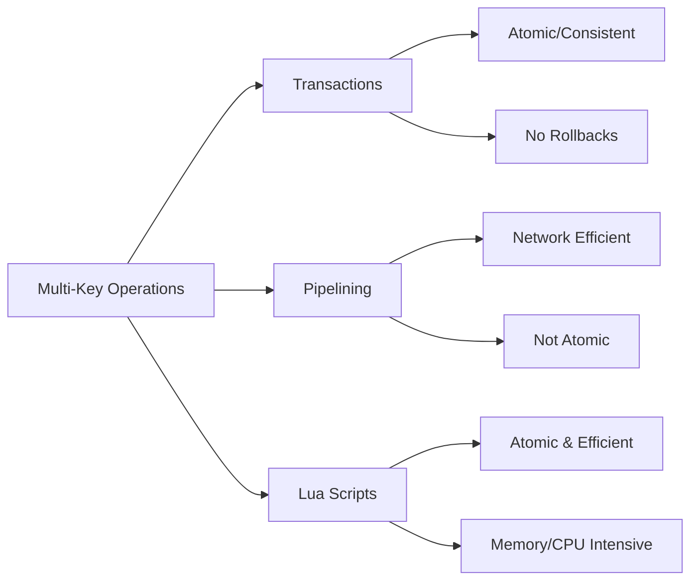

# Redis Multi-Key Operations

Redis is known for its speed and simplicity when working with individual keys, but many real-world applications require operations that span multiple keys. This guide explores the various approaches to perform multi-key operations in Redis, including transactions, pipelining, and Lua scripting.

## Introduction

While Redis is primarily a key-value store that excels at single-key operations, it provides several mechanisms to work with multiple keys atomically or efficiently:

1. **Transactions** - Group commands to ensure they execute without interruption
2. **Pipelining** - Batch commands to reduce network overhead
3. **Lua Scripting** - Execute complex multi-key logic atomically
4. **Built-in Multi-Key Commands** - Use Redis commands designed to work with multiple keys

Let's explore each approach in detail.

## Redis Transactions with MULTI/EXEC

Redis transactions allow you to execute a group of commands as a single isolated operation. Commands in a transaction are guaranteed to be executed sequentially and without interruptions from other clients.

### Basic Transaction Example

```redis
> MULTI
OK
> SET user:1:name "John"
QUEUED
> SET user:1:email "john@example.com"
QUEUED
> SADD active_users 1
QUEUED
> EXEC
1) OK
2) OK
3) (integer) 1
```

In this example:
- `MULTI` starts a transaction block
- Commands are queued but not executed immediately
- `EXEC` executes all queued commands as a single atomic operation

### Important Transaction Characteristics

- Redis transactions are **not** like traditional database transactions:
  - They don't support rollbacks
  - They don't check for errors until execution time
  - They are primarily focused on isolation, not ACID compliance

### WATCH Command for Optimistic Locking

The `WATCH` command allows you to implement optimistic locking:

```redis
> WATCH user:1:counter
OK
> GET user:1:counter
"5"
> MULTI
OK
> INCR user:1:counter
QUEUED
> SET user:1:last_updated "2023-01-01"
QUEUED
> EXEC
1) (integer) 6
2) OK
```

If another client modifies `user:1:counter` between your `WATCH` and `EXEC` commands, the transaction will fail and return `nil`.

## Pipelining for Efficiency

Pipelining allows you to send multiple commands to Redis at once without waiting for each response, significantly reducing network overhead. Unlike transactions, pipelining doesn't provide atomicity but improves performance.

### Pipelining Example (Using Redis-CLI)

```bash
$ (echo -en "SET key1 value1\r
SET key2 value2\r
GET key1\r
GET key2\r
") | redis-cli --pipe
```

### Pipelining in Node.js

```javascript
// Using node-redis client
async function pipelineExample() {
  const pipeline = client.pipeline();
  
  pipeline.set('product:123:name', 'Gaming Laptop');
  pipeline.set('product:123:price', '999.99');
  pipeline.sadd('product:categories', '123');
  pipeline.incr('product:counter');
  
  const results = await pipeline.exec();
  console.log(results);
}
```

### Pipelining vs. Transactions

- **Pipelining**: Optimizes network performance by batching commands
- **Transactions**: Ensures commands execute without interruption
- **Combined use**: You can use both together with `client.multi().pipeline()`

## Lua Scripting for Complex Operations

Lua scripts in Redis execute atomically and can operate on multiple keys, making them ideal for complex multi-key operations.

### Basic Lua Script Example

```redis
> EVAL "return redis.call('SET', KEYS[1], ARGV[1]) and redis.call('SADD', KEYS[2], KEYS[1])" 2 user:100 active_users "John Doe"
OK
```

This script:
1. Sets `user:100` to "John Doe"
2. Adds `user:100` to the `active_users` set
3. Executes both operations atomically

### More Complex Example: Implementing a Counter with Expiry

```redis
> EVAL "
  local current = redis.call('GET', KEYS[1]) or 0
  current = tonumber(current) + 1
  redis.call('SET', KEYS[1], current)
  redis.call('EXPIRE', KEYS[1], ARGV[1])
  return current
" 1 visitor:counter 3600
(integer) 1
```

### Loading Scripts with SCRIPT LOAD

For frequently used scripts, load them once and call by hash:

```redis
> SCRIPT LOAD "return redis.call('GET', KEYS[1]) + redis.call('GET', KEYS[2])"
"a42059b356c875f0717db19a51f6aaca9ae659ea"
> EVALSHA a42059b356c875f0717db19a51f6aaca9ae659ea 2 counter1 counter2
(integer) 15
```

### Benefits of Lua Scripting

- **Atomicity**: Scripts execute as a single operation
- **Reduced network overhead**: Multiple operations in a single round-trip
- **Programmability**: Implement complex logic server-side
- **Deterministic**: Scripts always produce the same output for the same input

## Built-in Multi-Key Commands

Redis also offers several commands that natively operate on multiple keys:

### MSET and MGET

```redis
> MSET user:1:name "Alice" user:1:email "alice@example.com" user:1:age 30
OK
> MGET user:1:name user:1:email user:1:age
1) "Alice"
2) "alice@example.com"
3) "30"
```

### Key Pattern Operations

```redis
> KEYS user:1:*
1) "user:1:name"
2) "user:1:email"
3) "user:1:age"

> SCAN 0 MATCH user:1:* COUNT 10
1) "0"
2) 1) "user:1:name"
   2) "user:1:email"
   3) "user:1:age"
```

:::caution
Avoid using `KEYS` in production environments as it can block the Redis server. Use `SCAN` instead.
:::

### Set Operations

```redis
> SADD team:engineering 101 102 103
(integer) 3
> SADD team:marketing 104 105
(integer) 2
> SADD project:alpha 101 104 105
(integer) 3
> SINTER team:engineering project:alpha
1) "101"
```

## Real-World Applications

### Example 1: User Session Management

Managing a user login with atomic updates to multiple keys:

```redis
> MULTI
OK
> HMSET user:session:abc123 user_id 1001 login_time 1640995200 ip "192.168.1.1"
QUEUED
> EXPIRE user:session:abc123 3600
QUEUED
> SADD active_sessions abc123
QUEUED
> EXEC
1) OK
2) (integer) 1
3) (integer) 1
```

### Example 2: Leaderboard Update with Lua

Updating a game leaderboard and user statistics together:

```redis
> EVAL "
  local score = tonumber(ARGV[1])
  local user_id = KEYS[1]
  local leaderboard = KEYS[2]
  
  -- Update user stats
  redis.call('HINCRBY', 'user:' .. user_id .. ':stats', 'total_score', score)
  redis.call('HINCRBY', 'user:' .. user_id .. ':stats', 'games_played', 1)
  
  -- Update leaderboard
  redis.call('ZADD', leaderboard, score, user_id)
  
  return redis.call('ZREVRANK', leaderboard, user_id)
" 2 1001 game:leaderboard 500
(integer) 3
```

### Example 3: Inventory Management System

Using transactions for product inventory updates:

```javascript
async function purchaseProduct(productId, quantity, userId) {
  const client = await getRedisClient();
  
  try {
    // Start watching the inventory key
    await client.watch(`product:${productId}:inventory`);
    
    // Get current inventory
    const currentStock = parseInt(await client.get(`product:${productId}:inventory`));
    
    if (currentStock < quantity) {
      return { success: false, message: "Insufficient stock" };
    }
    
    // Execute transaction
    const results = await client.multi()
      .decrby(`product:${productId}:inventory`, quantity)
      .hincrby(`product:${productId}:stats`, 'times_purchased', 1)
      .hincrby(`product:${productId}:stats`, 'units_sold', quantity)
      .sadd(`user:${userId}:purchases`, productId)
      .lpush(`recent_sales`, `${productId}:${quantity}:${userId}:${Date.now()}`)
      .exec();
      
    return { success: true, message: "Purchase successful" };
  } catch (error) {
    return { success: false, message: "Transaction failed", error };
  }
}
```

## Multi-Key Operations Performance Considerations

When working with multiple keys in Redis, consider these performance implications:



### Best Practices:

1. **Use pipelining** for independent operations where you need efficiency
2. **Use transactions** when you need operations to execute without interruption
3. **Use Lua scripts** for complex operations that need atomicity
4. **Minimize script complexity** to avoid blocking the Redis server
5. **Consider key distribution** when using Redis Cluster, as keys in multi-key operations should be in the same hash slot

## Summary

Redis provides several mechanisms for working with multiple keys:

- **Transactions (MULTI/EXEC)** offer isolation and atomicity
- **Pipelining** reduces network overhead for multiple commands
- **Lua scripting** enables complex atomic operations across keys
- **Built-in multi-key commands** like MSET, MGET, and set operations provide efficient operations

Choose the appropriate approach based on your specific requirements for atomicity, performance, and complexity.

## Exercises

1. Create a basic shopping cart system using Redis transactions that:
   - Adds items to a user's cart
   - Updates the inventory count
   - Tracks popular items

2. Implement a rate limiter using Lua scripting that:
   - Tracks requests per IP address
   - Enforces different limits for registered vs. anonymous users

3. Build a simple social media post counter that uses pipelining to:
   - Increment a user's post count
   - Add the post to a timeline
   - Update the "last active" timestamp

## Additional Resources

- [Redis Transactions Documentation](https://redis.io/topics/transactions)
- [Redis Pipelining Guide](https://redis.io/topics/pipelining)
- [Redis Lua Scripting](https://redis.io/commands/eval)
- [Redis Command Reference](https://redis.io/commands)