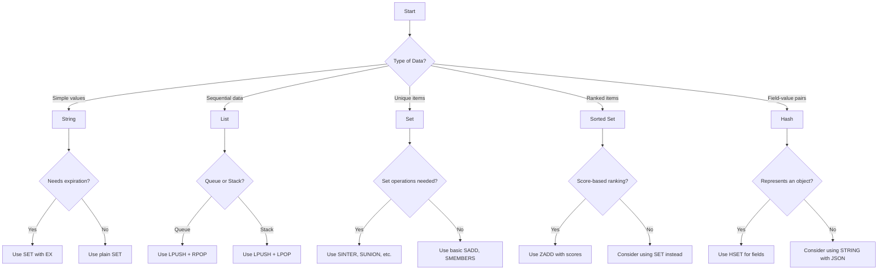

# Redis Data Manipulation

## Introduction

Redis (Remote Dictionary Server) is an open-source, in-memory data structure store that can be used as a database, cache, message broker, and streaming engine. One of Redis's most powerful features is its ability to store and manipulate different data structures efficiently. This guide will walk you through the essential commands and techniques for manipulating data in Redis, helping you leverage its capabilities for your applications.

Redis supports several data structures, including:

- Strings
- Lists
- Sets
- Sorted Sets
- Hashes
- Streams
- Geospatial indexes
- Bitmaps
- HyperLogLogs

In this tutorial, we'll focus on the most common data structures and how to manipulate them effectively.

## Prerequisites

- Redis installed on your system
- Basic understanding of command-line interfaces
- Familiarity with key-value databases (helpful but not required)

## Redis String Operations

Strings are the most basic Redis data type. They can hold text, numbers, or even binary data (up to 512MB).

### Setting and Getting String Values

```bash
# Set a simple string value
SET username "johndoe"

# Get the value
GET username
```

**Output:**
```
"johndoe"
```

### String Manipulation Commands

```bash
# Set multiple values at once
MSET first_name "John" last_name "Doe" age "28"

# Get multiple values at once
MGET first_name last_name age
```

**Output:**
```
1) "John"
2) "Doe"
3) "28"
```

#### Incrementing and Decrementing Numbers

Redis can handle numeric operations on string values that contain numbers:

```bash
# Set a numeric value
SET counter 10

# Increment by 1
INCR counter
GET counter
```

**Output:**
```
"11"
```

```bash
# Increment by custom amount
INCRBY counter 5
GET counter
```

**Output:**
```
"16"
```

```bash
# Decrement operations
DECR counter
DECRBY counter 2
GET counter
```

**Output:**
```
"13"
```

### Setting String Values with Expiration

```bash
# Set value with expiration (in seconds)
SET session_token "abc123xyz" EX 3600  # Expires in 1 hour

# Check how much time is left before expiration
TTL session_token
```

**Output:**
```
(integer) 3598  # Seconds remaining before expiration
```

## Redis List Operations

Lists in Redis are linked lists that allow you to store and manipulate a sequence of strings.

### Basic List Operations

```bash
# Push values to the right end of a list
RPUSH tasks "Send email" "Write report" "Call client"

# Get all elements in the list
LRANGE tasks 0 -1
```

**Output:**
```
1) "Send email"
2) "Write report"
3) "Call client"
```

```bash
# Push values to the left end of a list
LPUSH tasks "Update database"

# Check the list again
LRANGE tasks 0 -1
```

**Output:**
```
1) "Update database"
2) "Send email"
3) "Write report"
4) "Call client"
```

### Removing Elements from Lists

```bash
# Remove and return an element from the right
RPOP tasks
```

**Output:**
```
"Call client"
```

```bash
# Remove and return an element from the left
LPOP tasks
```

**Output:**
```
"Update database"
```

### List as a Queue or Stack

Lists can be used as queues (FIFO - First In, First Out):

```bash
# Producer adds jobs to the queue
RPUSH job_queue "job1" "job2" "job3"

# Consumer takes jobs from the queue
LPOP job_queue  # Takes the oldest job first
```

**Output:**
```
"job1"
```

Lists can also function as stacks (LIFO - Last In, First Out):

```bash
# Push to stack
LPUSH document_stack "page1" "page2" "page3"

# Pop from stack (last item added is first one out)
LPOP document_stack
```

**Output:**
```
"page3"
```

### Blocking Operations on Lists

Redis supports blocking operations, which are useful for implementing message queues:

```bash
# Block until an element is available, with timeout in seconds
BLPOP job_queue 10
```

## Redis Set Operations

Sets are unordered collections of unique strings in Redis.

### Basic Set Operations

```bash
# Add members to a set
SADD colors "red" "blue" "green"

# Check all members
SMEMBERS colors
```

**Output:**
```
1) "blue"
2) "red"
3) "green"
```

```bash
# Check if a member exists
SISMEMBER colors "blue"
SISMEMBER colors "yellow"
```

**Output:**
```
(integer) 1  # True
(integer) 0  # False
```

### Set Operations

Redis provides commands for standard set operations like union, intersection, and difference:

```bash
# Create two sets
SADD set1 "a" "b" "c" "d"
SADD set2 "c" "d" "e" "f"

# Set union
SUNION set1 set2
```

**Output:**
```
1) "a"
2) "b"
3) "c"
4) "d"
5) "e"
6) "f"
```

```bash
# Set intersection
SINTER set1 set2
```

**Output:**
```
1) "c"
2) "d"
```

```bash
# Set difference
SDIFF set1 set2
```

**Output:**
```
1) "a"
2) "b"
```

## Redis Hash Operations

Hashes are maps between string fields and string values, making them perfect for representing objects.

### Basic Hash Operations

```bash
# Set multiple fields in a hash
HSET user:1000 username "johndoe" email "john@example.com" age 28

# Get a specific field
HGET user:1000 username
```

**Output:**
```
"johndoe"
```

```bash
# Get all fields and values
HGETALL user:1000
```

**Output:**
```
1) "username"
2) "johndoe"
3) "email"
4) "john@example.com"
5) "age"
6) "28"
```

### Manipulating Hash Fields

```bash
# Check if a field exists
HEXISTS user:1000 email
```

**Output:**
```
(integer) 1  # True
```

```bash
# Increment numeric values in a hash
HINCRBY user:1000 age 1
HGET user:1000 age
```

**Output:**
```
"29"
```

```bash
# Get multiple fields
HMGET user:1000 username email
```

**Output:**
```
1) "johndoe"
2) "john@example.com"
```

## Redis Sorted Set Operations

Sorted sets are similar to sets, but each member has an associated score that is used to sort the elements.

### Basic Sorted Set Operations

```bash
# Add members with scores
ZADD leaderboard 100 "player1" 85 "player2" 95 "player3" 110 "player4"

# Get members by rank (lowest to highest)
ZRANGE leaderboard 0 -1
```

**Output:**
```
1) "player2"
2) "player3"
3) "player1"
4) "player4"
```

```bash
# Get members by rank with scores
ZRANGE leaderboard 0 -1 WITHSCORES
```

**Output:**
```
1) "player2"
2) "85"
3) "player3"
4) "95"
5) "player1"
6) "100"
7) "player4"
8) "110"
```

### Querying Sorted Sets

```bash
# Get members by score range
ZRANGEBYSCORE leaderboard 90 105
```

**Output:**
```
1) "player3"
2) "player1"
```

```bash
# Get the rank of a member
ZRANK leaderboard "player1"
```

**Output:**
```
(integer) 2  # Zero-based index
```

```bash
# Get the score of a member
ZSCORE leaderboard "player1"
```

**Output:**
```
"100"
```

### Incrementing Scores

```bash
# Increment a member's score
ZINCRBY leaderboard 15 "player2"
ZSCORE leaderboard "player2"
```

**Output:**
```
"100"
```

## Real-world Examples

Let's look at some practical examples of how Redis data manipulation can be used in real applications.

### Example 1: User Session Management

```bash
# Store user session with expiration
SET session:user:1234 "{\"user_id\":1234,\"name\":\"John\",\"role\":\"admin\"}" EX 3600

# Extend session expiration time
EXPIRE session:user:1234 7200

# Check if session exists and retrieve it
EXISTS session:user:1234
GET session:user:1234
```

### Example 2: Caching Database Results

```bash
# Cache a query result with expiration
SET cache:users:active "{\"count\":542,\"last_updated\":\"2023-10-15T14:30:00Z\"}" EX 300

# Use this pattern to implement the cache-aside pattern
# 1. Check if data exists in cache
EXISTS cache:users:active

# 2. If not in cache, fetch from database and store in Redis
# (Simulated here - in a real app this would be your database query)
SET cache:users:active "{\"count\":542,\"last_updated\":\"2023-10-15T14:30:00Z\"}" EX 300
```

### Example 3: Implementing a Leaderboard

```bash
# Add players with their scores
ZADD game:leaderboard 1200 "player1" 982 "player2" 1500 "player3" 1100 "player4"

# Get top 3 players
ZREVRANGE game:leaderboard 0 2 WITHSCORES
```

**Output:**
```
1) "player3"
2) "1500"
3) "player1"
4) "1200"
5) "player4"
6) "1100"
```

```bash
# Get player rank (zero-based index, so add 1 for human-readable rank)
ZREVRANK game:leaderboard "player2"
```

**Output:**
```
(integer) 3  # This means 4th place when counting from 1
```

### Example 4: Rate Limiting API Requests

```bash
# Record an API request with sliding window
MULTI
INCR api:requests:user:1234
EXPIRE api:requests:user:1234 60
EXEC

# Check number of requests in the last minute
GET api:requests:user:1234
```

## Data Structure Selection Guide

Choosing the right data structure is crucial for efficient Redis operations:



## Performance Considerations

When manipulating data in Redis, keep these performance tips in mind:

1. **Use pipelining** to reduce network roundtrips for multiple commands:

```bash
# Without pipelining: each command requires a round trip
SET key1 "value1"
SET key2 "value2"
SET key3 "value3"

# With pipelining (using redis-cli):
cat << EOF | redis-cli
SET key1 "value1"
SET key2 "value2"
SET key3 "value3"
EOF
```

2. **Use MSET/MGET** for multiple strings instead of individual SET/GET commands.

3. **Be mindful of key expiration** - expired keys consume memory until Redis cleans them up.

4. **Consider using SCAN** instead of KEYS for production environments as KEYS can block the server.

5. **Monitor memory usage** with the INFO command:

```bash
INFO memory
```

## Working with Transactions

Redis provides a simple transaction mechanism with MULTI/EXEC:

```bash
# Start a transaction
MULTI

# Queue commands (they're not executed yet)
SET account:1 100
SET account:2 200
INCRBY account:1 50
DECRBY account:2 50

# Execute the transaction (all commands run atomically)
EXEC
```

**Output:**
```
1) OK
2) OK
3) (integer) 150
4) (integer) 150
```

## Summary

Redis data manipulation provides powerful tools for handling various types of data. We've covered:

- String operations for simple values
- List operations for sequential data
- Set operations for unique collections
- Hash operations for field-value pairs
- Sorted set operations for ranked data
- Real-world examples showing practical applications

These data structures and operations make Redis an extremely versatile tool for caching, real-time analytics, message queuing, and more. The right data structure choice can significantly impact the performance and simplicity of your application.

## Practice Exercises

To reinforce your Redis data manipulation skills, try these exercises:

1. Implement a simple Twitter-like timeline using Redis Lists
2. Create a tag system for blog posts using Redis Sets
3. Build a basic e-commerce inventory system using Redis Hashes
4. Develop a real-time analytics dashboard using Redis Sorted Sets
5. Design a rate-limiting system for an API using Redis Strings with expiration

## Additional Resources

- [Redis Official Documentation](https://redis.io/docs/)
- [Redis University](https://university.redis.com/) - Free online courses
- [Redis Data Types Tutorial](https://redis.io/topics/data-types-intro)
- [Redis Command Reference](https://redis.io/commands)