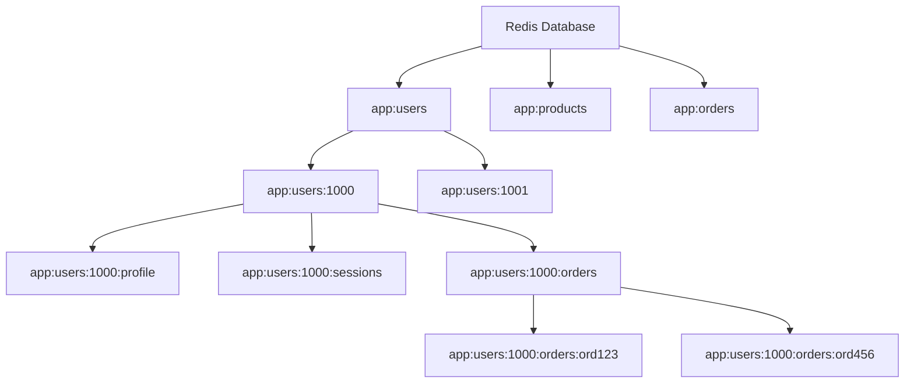

# Redis Key Patterns

When working with Redis, one of the most critical design decisions you'll make is how to structure your keys. Proper key design impacts Redis performance, memory usage, and application maintainability. In this article, we'll explore Redis key patterns and best practices to help you design effective key structures for your applications.

## Introduction to Redis Keys

Redis is a key-value store, which means that every piece of data is associated with a key that can be used to retrieve it. Unlike traditional databases with tables and columns, Redis relies entirely on keys to organize and access data.

Keys in Redis:
- Are binary safe strings (can contain any binary sequence)
- Have a maximum size of 512MB (though using such large keys is impractical)
- Should be designed carefully for efficient data access patterns

## Key Naming Conventions

### Object-Type Prefix

One of the most common patterns is to prefix keys with the object type. This helps in organizing keys and understanding what kind of data they store.

```
user:1000
product:xyz123
order:ord123456
```

The format typically follows: `object-type:identifier`

This approach makes it easier to:
- Group related objects
- Identify keys in debugging
- Apply commands to similar keys (using pattern matching)

### Colon Separator Convention

The colon (`:`) is commonly used as a separator in Redis keys. This convention allows for creating hierarchical structures.

```
app:users:1000:profile
app:users:1000:sessions
app:products:xyz123:inventory
```

You can incorporate multiple levels of information in your keys:
```
environment:application:object-type:identifier:field
```

For example:
```
prod:shopapp:user:1000:email
dev:shopapp:user:1000:email
```

### Using Meaningful Identifiers

Whenever possible, use meaningful identifiers rather than auto-incremented numbers:

```
user:john.doe@example.com  // Better than user:1000 in some cases
product:red-t-shirt-large  // Better than product:123
```

## Handling Data Relationships

Redis doesn't have built-in relationship management like relational databases, so relationships are modeled through key patterns.

### One-to-Many Relationships

Use sets or lists to manage one-to-many relationships:

```js
// Store all user IDs in a set
SADD users:all 1000 1001 1002

// Store orders for a specific user in a set
SADD user:1000:orders order123 order456 

// Query orders for user 1000
SMEMBERS user:1000:orders
// Output: 1) "order123" 2) "order456" 
```

### Many-to-Many Relationships

Use sets for both sides of the relationship:

```js
// Users who liked product xyz123
SADD product:xyz123:liked_by user:1000 user:1001

// Products liked by user 1000
SADD user:1000:liked_products product:xyz123 product:abc456

// Check if user 1000, likes product xyz123
SISMEMBER product:xyz123:liked_by user:1000
// Output: (integer) 1 (indicating true)
```

## Time-Based Keys

For data with temporal significance, incorporate time elements in the key:

### Global Counters by Time

```
pageviews:20240310  // Page views for March 10, 2024
pageviews:202403    // Page views for March 2024
pageviews:2024      // Page views for the year 2024
```

### User Activity Timeline

```
user:1000:logins:20240310
user:1000:purchases:2024Q1
```

Accessing these with pattern matching:

```js
// Get all login records for user 1000 in March 2024
KEYS user:1000:logins:202403*
// Output: 1) "user:1000:logins:20240301" 2) "user:1000:logins:20240315" ...

// Note: KEYS should not be used in production due to performance issues
// Instead, use SCAN or design keys that can be constructed without pattern matching
```

## Key Expiration Strategies

Redis allows setting TTL (Time To Live) on keys, which is useful for caching and ephemeral data.

### Session Keys

```js
// Set a session key with 30-minute expiration
SET session:abc123 "user_data_here" EX 1800

// Check remaining TTL in seconds
TTL session:abc123
// Output: (integer) 1745
```

### Rate Limiting

```js
// Increment counter and set expiration if it doesn't exist
INCR ratelimit:user:1000:api:20240310:hour12
EXPIRE ratelimit:user:1000:api:20240310:hour12 3600

// Check current count
GET ratelimit:user:1000:api:20240310:hour12
// Output: "5"
```

## Practical Examples

Let's look at some real-world examples of Redis key patterns:

### User Profile System

```js
// Store user profile as a hash
HSET user:1000 username "johndoe" email "john@example.com" created_at "2024-03-01"

// Store user preferences separately
HSET user:1000:preferences theme "dark" notifications "enabled"

// Store session information with expiration
SET session:user:1000:abc123 "{\"ip\":\"192.168.1.1\",\"user_agent\":\"Mozilla\"}" EX 3600

// Retrieve user profile
HGETALL user:1000
/* Output:
1) "username"
2) "johndoe"
3) "email" 
4) "john@example.com"
5) "created_at"
6) "2024-03-01"
*/
```

### E-commerce Product Catalog

```js
// Store product basic info
HSET product:xyz123 name "Wireless Headphones" price "99.99" stock "45"

// Store product categories as a set
SADD product:xyz123:categories "electronics" "audio" "wireless"

// Store products by category
SADD category:electronics:products product:xyz123 product:abc456

// Get all categories for a product
SMEMBERS product:xyz123:categories
/* Output:
1) "electronics"
2) "audio"
3) "wireless"
*/

// Get all products in electronics category
SMEMBERS category:electronics:products
/* Output:
1) "product:xyz123"
2) "product:abc456"
*/
```

### Caching System

```js
// Cache a database query result with 10-minute expiration
SET cache:query:users:active:page1 "[{\"id\":1,\"name\":\"John\"},{\"id\":2,\"name\":\"Jane\"}]" EX 600

// Invalidate all cache entries for "active users" queries
DEL cache:query:users:active:page1 cache:query:users:active:page2

// Check if cache exists before performing expensive operation
EXISTS cache:query:users:active:page1
// Output: (integer) 1
```

## Key Pattern Visualization

Here's a visualization of the hierarchical key structure we discussed:



## Best Practices and Considerations

### 1. Key Length

- Shorter keys use less memory
- But keys should still be descriptive and meaningful
- Balance between brevity and clarity is important

### 2. Avoid Using KEYS Command in Production

The `KEYS` command (for pattern matching) blocks Redis until it completes, which can cause performance issues. Instead:

- Use `SCAN` for iterative scanning
- Design your key structure to avoid needing pattern matching
- Use sets to store collections of keys that you need to retrieve together

### 3. Namespace Your Keys

If multiple applications share the same Redis instance, use namespaces to prevent collisions:

```
appname:environment:object-type:id
```

For example:
```
shopapp:prod:user:1000
blogapp:prod:user:1000
```

### 4. Consider Performance Implications

- Keys with high cardinality may impact memory usage
- Very complex key hierarchies can make maintenance difficult
- Balance between normalization and denormalization based on access patterns

## Summary

Effective Redis key design is crucial for building performant and maintainable applications. By following these patterns and best practices, you can create an organized key structure that:

- Makes your data easier to access and manage
- Improves application performance
- Reduces memory usage
- Enhances code readability and maintainability

Remember that the best key pattern depends on your specific use case and access patterns. The guidelines provided here should help you make informed decisions when designing your Redis data structure.

## Exercises

1. Design a key pattern for a social media application that needs to store:
   - User profiles
   - User posts
   - Follower relationships
   - Likes on posts

2. Implement a leaderboard system using Redis sorted sets with appropriate key naming.

3. Create a caching layer for a web application, with proper cache invalidation strategies based on key patterns.

## Additional Resources

- [Redis Documentation on Keys](https://redis.io/docs/data-types/keys/)
- [Redis Data Types](https://redis.io/docs/data-types/)
- [Redis Command Reference](https://redis.io/commands/)
- [Redis University](https://university.redis.com/) - Free online courses on Redis

Remember that mastering Redis key patterns takes practice. Start with simple patterns and refine them as you gain more experience with Redis and understand your application's needs better.