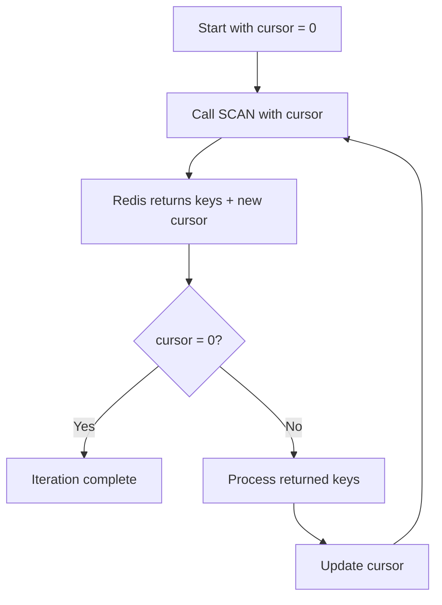

# Redis Scanning

## Introduction

When working with Redis databases, you'll often need to search through your keys to find specific patterns or to perform operations on groups of related keys. While Redis provides the `KEYS` command for this purpose, it can cause performance issues in production environments. This is where Redis scanning commands come in - they provide an efficient way to iterate through keys without blocking your Redis server.

In this guide, you'll learn:
- Why traditional key retrieval methods can be problematic
- How Redis scanning works
- How to use the SCAN, HSCAN, SSCAN, and ZSCAN commands
- Best practices for scanning in production environments

## Why We Need Scanning Commands

Before diving into scanning, let's understand why we need these specialized commands.

### The Problem with KEYS

Redis provides a simple `KEYS` command that takes a pattern and returns all matching keys:

```bash
KEYS user:*
```

However, this command has a significant drawback: **it blocks the Redis server** while it searches for matches. In a database with millions of keys, this could freeze your application for seconds or even minutes!

Consider this typical scenario:

```bash
# In a large production database
KEYS *           # 🛑 Dangerous! Could block server for seconds
```

This is where scanning commands provide a better alternative.

## Understanding SCAN

The `SCAN` command allows you to incrementally iterate through Redis keys using a cursor-based approach. Instead of returning all keys at once, it returns a small batch of keys along with a cursor position for the next call.

### Basic SCAN Syntax

The basic syntax of the SCAN command is:

```bash
SCAN cursor [MATCH pattern] [COUNT count] [TYPE type]
```

Where:
- `cursor`: The position to start scanning from (use 0 for the first call)
- `MATCH pattern`: Optional pattern to filter keys
- `COUNT count`: Optional hint for batch size (default is 10)
- `TYPE type`: Optional filter for specific key types

### How Cursor-Based Iteration Works

Let's visualize how cursor-based scanning works:



## Basic SCAN Example

Here's a simple example of how to use the SCAN command:

```bash
# Initial call with cursor 0
127.0.0.1:6379> SCAN 0
1) "17"                                    # Next cursor
2) 1) "user:1000"                          # Returned keys
   2) "user:1001"
   3) "product:5"

# Continue with returned cursor
127.0.0.1:6379> SCAN 17
1) "0"                                     # Cursor 0 means we're done
2) 1) "user:1002"
   2) "counter:visits"
   3) "product:6"
```

In this example:
1. We start with cursor 0
2. Redis returns some keys and a new cursor (17)
3. We call SCAN again with the new cursor
4. Redis returns more keys and cursor 0, indicating we've completed the iteration

## Filtering with MATCH and COUNT

You can filter keys using the MATCH option with glob-style patterns:

```bash
# Filter for user keys only
127.0.0.1:6379> SCAN 0 MATCH user:*
1) "17"
2) 1) "user:1000"
   2) "user:1001"

# Continue scanning
127.0.0.1:6379> SCAN 17 MATCH user:*
1) "0"
2) 1) "user:1002"
```

The COUNT option gives Redis a hint about how many keys to return per batch:

```bash
# Request larger batches
127.0.0.1:6379> SCAN 0 COUNT 100
```

## Scanning in Node.js

Here's how you might implement scanning in a Node.js application using the `redis` package:

```javascript
const redis = require('redis');
const client = redis.createClient();

async function scanAllKeys(pattern = '*') {
  let cursor = '0';
  const allKeys = [];
  
  do {
    // Execute SCAN command
    const [nextCursor, keys] = await client.SCAN(
      cursor, 
      { MATCH: pattern, COUNT: 100 }
    );
    
    // Store found keys
    allKeys.push(...keys);
    
    // Update cursor for next iteration
    cursor = nextCursor;
  } while (cursor !== '0');
  
  return allKeys;
}

// Usage
async function main() {
  await client.connect();
  
  console.log('Scanning for user keys...');
  const userKeys = await scanAllKeys('user:*');
  console.log(`Found ${userKeys.length} user keys`);
  
  await client.disconnect();
}

main().catch(console.error);
```

## Scanning Hash, Set, and Sorted Set Data Types

Redis also provides specialized scanning commands for data structures:

### HSCAN - Scanning Hash Fields

HSCAN iterates fields and values in a hash:

```bash
# Scan fields in a user profile hash
127.0.0.1:6379> HSCAN user:profile:1000 0
1) "0"
2) 1) "name"
   2) "John Doe"
   3) "email"
   4) "john@example.com"
   5) "last_login"
   6) "1614556800"
```

### SSCAN - Scanning Set Members

SSCAN iterates members of a set:

```bash
# Scan members in a tags set
127.0.0.1:6379> SSCAN product:5:tags 0
1) "12"
2) 1) "electronics"
   2) "gadgets"
   
127.0.0.1:6379> SSCAN product:5:tags 12
1) "0"
2) 1) "mobile"
```

### ZSCAN - Scanning Sorted Set Members

ZSCAN iterates members and scores in a sorted set:

```bash
# Scan leaderboard entries
127.0.0.1:6379> ZSCAN leaderboard 0
1) "0"
2) 1) "player:1001"
   2) "125"
   3) "player:1002"
   4) "310"
   5) "player:1003"
   6) "95"
```

## Real-World Use Cases

Let's explore some practical applications of Redis scanning:

### Case 1: Database Migration

When migrating data between Redis instances, you can use SCAN to efficiently process keys in batches:

```javascript
async function migrateDatabase(sourceClient, targetClient) {
  let cursor = '0';
  let migratedKeys = 0;
  
  do {
    // Get batch of keys
    const [nextCursor, keys] = await sourceClient.SCAN(cursor, { COUNT: 1000 });
    
    if (keys.length > 0) {
      // For each key in batch
      for (const key of keys) {
        // Get key type
        const type = await sourceClient.TYPE(key);
        
        switch (type) {
          case 'string':
            const value = await sourceClient.GET(key);
            await targetClient.SET(key, value);
            break;
          case 'hash':
            const hash = await sourceClient.HGETALL(key);
            await targetClient.HSET(key, hash);
            break;
          // Handle other types similarly
        }
      }
      
      migratedKeys += keys.length;
      console.log(`Migrated ${migratedKeys} keys so far...`);
    }
    
    cursor = nextCursor;
  } while (cursor !== '0');
  
  console.log(`Migration complete. Total keys: ${migratedKeys}`);
}
```

### Case 2: Implementing Key Expiration for a Cache

Using SCAN to find and expire old cache entries:

```javascript
async function expireOldCacheEntries(prefix, maxAgeInSeconds) {
  const now = Math.floor(Date.now() / 1000);
  let cursor = '0';
  let expiredCount = 0;
  
  do {
    // Find cache entries
    const [nextCursor, keys] = await client.SCAN(cursor, { 
      MATCH: `${prefix}:*`,
      COUNT: 100
    });
    
    for (const key of keys) {
      // Get last access time from metadata hash
      const lastAccess = parseInt(await client.HGET(`${key}:meta`, 'lastAccess'));
      
      if (now - lastAccess > maxAgeInSeconds) {
        // Expired - delete both data and metadata
        await client.DEL(key, `${key}:meta`);
        expiredCount++;
      }
    }
    
    cursor = nextCursor;
  } while (cursor !== '0');
  
  console.log(`Expired ${expiredCount} cache entries`);
}
```

## Best Practices and Considerations

When using Redis scanning commands, keep these tips in mind:

### 1. Adjust COUNT Based on Your Data

The `COUNT` parameter affects performance:
- Too small: More network round trips
- Too large: Potentially longer blocking times

For most applications, values between 100-1000 work well.

### 2. Be Aware of Pattern Matching Cost

The `MATCH` option filters keys after they're fetched:

```bash
# This still scans all keys internally, then filters
SCAN 0 MATCH user:1000:*
```

For very specific patterns, consider using key naming conventions that allow you to narrow the search.

### 3. Handling Long-Running Scans

For large databases, a complete scan might take time. Design your code to handle interruptions:

```javascript
// Store cursor between application restarts
async function resumableScan() {
  // Get saved cursor from persistent storage
  let cursor = await storage.get('scan:resume:cursor') || '0';
  
  try {
    // Process some batches
    for (let i = 0; i < 10; i++) {
      const [nextCursor, keys] = await client.SCAN(cursor, { COUNT: 1000 });
      
      // Process keys...
      
      cursor = nextCursor;
      
      // Save progress
      await storage.set('scan:resume:cursor', cursor);
      
      if (cursor === '0') {
        break; // Scan complete
      }
    }
  } catch (error) {
    console.error('Scan interrupted:', error);
  }
  
  return cursor === '0'; // Return whether scan is complete
}
```

### 4. Scanning in Production

Always prefer scanning commands over `KEYS` in production environments. While scanning doesn't block the server completely, large COUNT values can still affect performance.

## Performance Comparison

| Command | Performance | Blocking | Use Case |
|---------|-------------|----------|----------|
| KEYS    | O(N)        | Yes      | Development, small datasets |
| SCAN    | O(1) per call | No     | Production, any dataset size |

## Summary

Redis scanning commands provide an efficient way to iterate through Redis keys without blocking the server. They use a cursor-based approach that returns keys in batches, allowing your application to process data incrementally.

Key points to remember:
- Always use SCAN instead of KEYS in production
- The cursor-based approach lets you iterate through all keys efficiently
- Use MATCH to filter keys by pattern
- Adjust the COUNT parameter based on your performance needs
- Specialized commands (HSCAN, SSCAN, ZSCAN) let you scan within specific data structures

## Exercise: Implementing a Redis Key Explorer

Try implementing a simple Redis key explorer that:
1. Connects to a Redis database
2. Scans for keys matching a user-provided pattern
3. Groups keys by their type (string, hash, set, etc.)
4. Displays sample values for each key type

This exercise will help you understand how scanning works in a practical application.

## Additional Resources

- [Redis SCAN Command Documentation](https://redis.io/commands/scan)
- [Redis Node.js Client Documentation](https://github.com/redis/node-redis)