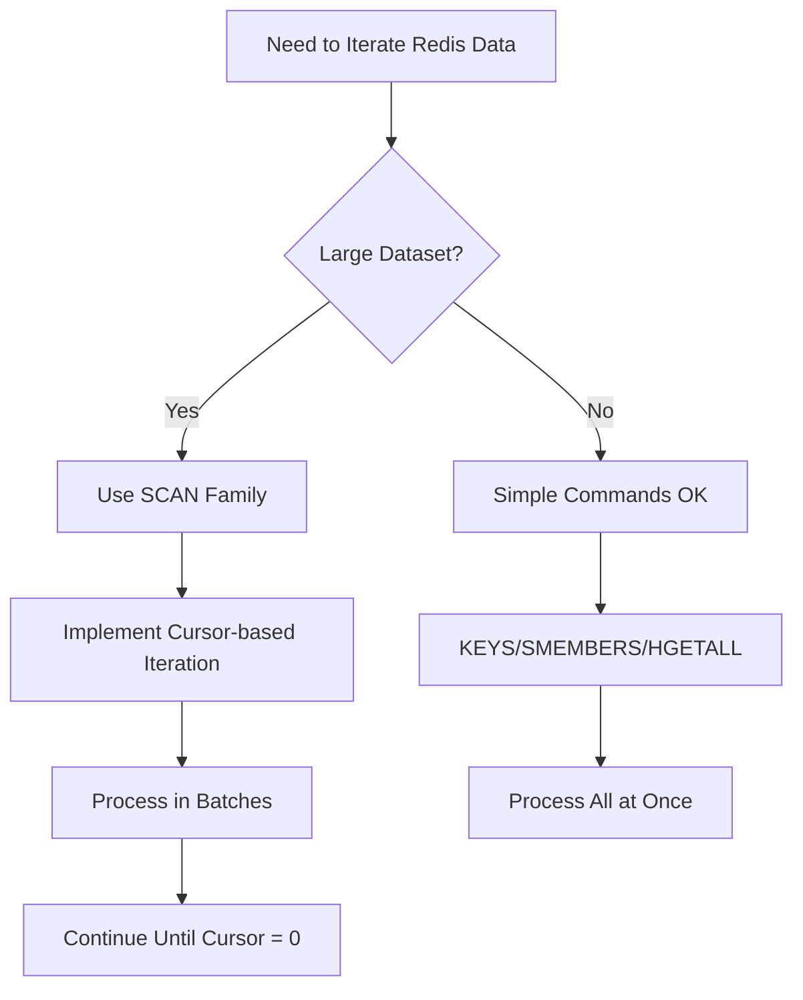

# Redis Iteration

## Introduction

Iteration is a fundamental concept when working with any database, and Redis is no exception. As you build applications with Redis, you'll often need to retrieve and process multiple keys or values. However, Redis has unique approaches to iteration that differ from traditional databases due to its in-memory nature and data structure design.

In this tutorial, we'll explore various methods for iterating through Redis data structures, from basic scanning techniques to more advanced iteration patterns. Whether you're managing a few dozen keys or millions of records, understanding these iteration approaches will help you build more efficient and robust Redis applications.

## Understanding Redis Iteration Challenges

Before diving into solutions, let's understand why iteration in Redis requires special consideration:

1. **Redis is single-threaded** - Long-running operations can block other requests
2. **Memory efficiency** - Redis stores data in memory, so inefficient iteration can cause memory spikes
3. **Large datasets** - Redis can handle millions of keys, making naive iteration approaches problematic

## Basic Key Iteration with KEYS and SCAN

### The KEYS Command (Not Recommended for Production)

The simplest way to iterate through Redis keys is using the `KEYS` command with a pattern:

```bash
KEYS pattern
```

For example:

```bash
KEYS user:*
```

Output:
```
1) "user:1000"
2) "user:1001" 
3) "user:1002"
4) "user:1003"
```

**Warning**: While `KEYS` is straightforward, it's **not recommended for production** environments because:
- It blocks the Redis server until completion
- Runtime complexity is O(N) with N being the number of keys in the database
- With large datasets, it can cause significant performance issues

### The SCAN Command (Recommended Approach)

For production environments, the `SCAN` command provides a safer alternative:

```bash
SCAN cursor [MATCH pattern] [COUNT count] [TYPE type]
```

The `SCAN` command works through iteration, returning a cursor that you use in subsequent calls:

```bash
# First call
SCAN 0 MATCH user:* COUNT 2
```

Output:
```
1) "3"  # Next cursor
2) 1) "user:1000"
   2) "user:1001"
```

```bash
# Next call with returned cursor
SCAN 3 MATCH user:* COUNT 2
```

Output:
```
1) "0"  # 0 indicates iteration complete
2) 1) "user:1002"
   2) "user:1003"
```

The `SCAN` command:
- Returns a cursor and a portion of matching keys
- Does not block the Redis server for long periods
- Uses COUNT to hint at how many elements to return (not exact)
- Returns cursor 0 when iteration is complete

Here's a complete example using Node.js and the `ioredis` library:

```javascript
const Redis = require('ioredis');
const redis = new Redis();

async function scanAllKeys(pattern) {
  let cursor = '0';
  const allKeys = [];
  
  do {
    // Scan with the current cursor
    const [nextCursor, keys] = await redis.scan(cursor, 'MATCH', pattern, 'COUNT', 100);
    cursor = nextCursor;
    
    // Add found keys to our result array
    allKeys.push(...keys);
    
    // Continue until cursor is 0
  } while (cursor !== '0');
  
  return allKeys;
}

// Usage
scanAllKeys('user:*')
  .then(keys => console.log('Found keys:', keys))
  .catch(err => console.error('Error:', err));
```

## Iterating Through Hash Fields with HSCAN

For Redis Hash data structures, the `HSCAN` command works similarly to `SCAN` but for hash fields:

```bash
HSCAN key cursor [MATCH pattern] [COUNT count]
```

Example of iterating through a user profile hash:

```bash
# First add some user data
HSET user:1000 username "johndoe" email "john@example.com" city "New York" age "32" status "active"

# Then iterate through the fields
HSCAN user:1000 0 COUNT 2
```

Output:
```
1) "3"  # Next cursor
2) 1) "username"
   2) "johndoe"
   3) "email"
   4) "john@example.com"
```

```bash
# Continue with returned cursor
HSCAN user:1000 3 COUNT 2
```

Output:
```
1) "0"  # Iteration complete
2) 1) "city"
   2) "New York"
   3) "age"
   4) "32"
   5) "status"
   6) "active"
```

Example with Python `redis` library:

```python
import redis

r = redis.Redis(host='localhost', port=6379, db=0)

def scan_hash(hash_key, pattern='*'):
    cursor = 0
    all_fields = {}
    
    while True:
        cursor, fields = r.hscan(hash_key, cursor, match=pattern)
        all_fields.update(fields)
        
        if cursor == 0:
            break
            
    return all_fields

# Usage
user_data = scan_hash('user:1000')
print("User data:", user_data)
```

## List Iteration with LRANGE

For Redis Lists, the `LRANGE` command is the primary iteration method:

```bash
LRANGE key start stop
```

Example:

```bash
# Create a list
RPUSH notifications:user:1000 "New message from Alice" "Payment received" "Account updated"

# Iterate through all items (0 to -1 means all elements)
LRANGE notifications:user:1000 0 -1
```

Output:
```
1) "New message from Alice"
2) "Payment received"
3) "Account updated"
```

For large lists, you can paginate using ranges:

```bash
# First page (0-9)
LRANGE very_long_list 0 9

# Second page (10-19)
LRANGE very_long_list 10 19
```

Ruby example for paginated list access:

```ruby
require 'redis'

redis = Redis.new

def get_paginated_list(list_key, page_size = 10)
  list_length = redis.llen(list_key)
  pages = (list_length.to_f / page_size).ceil
  
  (0...pages).map do |page|
    start_idx = page * page_size
    end_idx = start_idx + page_size - 1
    redis.lrange(list_key, start_idx, end_idx)
  end
end

# Usage
pages = get_paginated_list('notifications:user:1000', 5)
pages.each_with_index do |items, index|
  puts "Page #{index + 1}:"
  items.each { |item| puts "- #{item}" }
end
```

## Set Iteration with SSCAN

For Redis Sets, use the `SSCAN` command:

```bash
SSCAN key cursor [MATCH pattern] [COUNT count]
```

Example:

```bash
# Create a set of tags
SADD product:tags "electronics" "laptop" "gaming" "high-performance" "sale"

# Iterate through tags
SSCAN product:tags 0 COUNT 3
```

Output:
```
1) "3"  # Next cursor
2) 1) "electronics"
   2) "laptop"
   3) "gaming"
```

```bash
# Continue iteration
SSCAN product:tags 3 COUNT 3
```

Output:
```
1) "0"  # Iteration complete
2) 1) "high-performance"
   2) "sale"
```

Java example:

```java
import redis.clients.jedis.Jedis;
import redis.clients.jedis.ScanParams;
import redis.clients.jedis.ScanResult;

import java.util.HashSet;
import java.util.List;
import java.util.Set;

public class SetScanner {
    public static Set<String> scanSet(Jedis jedis, String key, String pattern) {
        Set<String> allMembers = new HashSet<>();
        String cursor = "0";
        ScanParams params = new ScanParams().match(pattern).count(100);
        
        do {
            ScanResult<String> scanResult = jedis.sscan(key, cursor, params);
            cursor = scanResult.getCursor();
            List<String> members = scanResult.getResult();
            allMembers.addAll(members);
        } while (!cursor.equals("0"));
        
        return allMembers;
    }
    
    public static void main(String[] args) {
        try (Jedis jedis = new Jedis("localhost", 6379)) {
            Set<String> tags = scanSet(jedis, "product:tags", "*");
            System.out.println("Product tags: " + tags);
        }
    }
}
```

## Sorted Set Iteration with ZSCAN and ZRANGE

Redis Sorted Sets provide multiple iteration approaches:

### Using ZSCAN

```bash
ZSCAN key cursor [MATCH pattern] [COUNT count]
```

Similar to other SCAN variants, it returns a cursor and members with scores.

### Using ZRANGE (by index)

```bash
ZRANGE key start stop [WITHSCORES]
```

Example:

```bash
# Create a leaderboard
ZADD leaderboard 100 "player1" 85 "player2" 95 "player3" 120 "player4"

# Get top 3 players
ZRANGE leaderboard 0 2 REV WITHSCORES
```

Output:
```
1) "player4"
2) "120"
3) "player1"
4) "100"
5) "player3"
6) "95"
```

### Using ZRANGEBYSCORE (by score)

```bash
ZRANGEBYSCORE key min max [WITHSCORES] [LIMIT offset count]
```

Example:

```bash
# Get players with scores between 90 and 110
ZRANGEBYSCORE leaderboard 90 110 WITHSCORES
```

Output:
```
1) "player3"
2) "95"
3) "player1"
4) "100"
```

PHP example for paginated leaderboard:

```php
<?php
$redis = new Redis();
$redis->connect('127.0.0.1', 6379);

function getLeaderboardPage($page = 1, $pageSize = 10) {
    global $redis;
    
    $startIdx = ($page - 1) * $pageSize;
    $endIdx = $startIdx + $pageSize - 1;
    
    // Get paginated leaderboard (reversed for highest first)
    $players = $redis->zRevRange('leaderboard', $startIdx, $endIdx, true);
    
    $result = [];
    $rank = $startIdx + 1;
    foreach ($players as $player => $score) {
        $result[] = [
            'rank' => $rank,
            'player' => $player,
            'score' => $score
        ];
        $rank++;
    }
    
    return $result;
}

// Usage
$page1 = getLeaderboardPage(1, 2);
echo "Top Players:
";
foreach ($page1 as $entry) {
    echo "#{$entry['rank']}: {$entry['player']} - {$entry['score']} points
";
}
?>
```

## Stream Iteration with XREAD and XRANGE

Redis Streams (available in Redis 5.0+) provide powerful iteration capabilities:

### Using XRANGE

```bash
XRANGE key start end [COUNT count]
```

Example:

```bash
# Add events to a stream
XADD events * type login user_id 1001
XADD events * type logout user_id 1002
XADD events * type payment user_id 1001 amount 29.99

# Read all events
XRANGE events - +
```

Output:
```
1) 1) "1631234567890-0"
   2) 1) "type"
      2) "login"
      3) "user_id"
      4) "1001"
2) 1) "1631234569123-0"
   2) 1) "type"
      2) "logout"
      3) "user_id"
      4) "1002"
3) 1) "1631234571456-0"
   2) 1) "type"
      2) "payment"
      3) "user_id"
      4) "1001"
      5) "amount"
      6) "29.99"
```

### Using XREAD for "live" iteration

```bash
XREAD [COUNT count] [BLOCK milliseconds] STREAMS key [key ...] id [id ...]
```

Example of a GO program that processes events in real-time:

```go
package main

import (
	"fmt"
	"github.com/go-redis/redis/v8"
	"context"
	"time"
)

func main() {
	ctx := context.Background()
	rdb := redis.NewClient(&redis.Options{
		Addr: "localhost:6379",
	})
	
	// Process new events as they arrive
	lastID := "0-0" // Start from beginning
	
	for {
		// Read new messages, blocking for up to 5 seconds
		streams, err := rdb.XRead(ctx, &redis.XReadArgs{
			Streams: []string{"events", lastID},
			Count:   10,
			Block:   5 * time.Second,
		}).Result()
		
		if err != nil {
			if err == redis.Nil {
				// No new messages
				continue
			}
			fmt.Printf("Error: %v
", err)
			break
		}
		
		// Process messages
		for _, stream := range streams {
			for _, message := range stream.Messages {
				fmt.Printf("ID: %s, Data: %v
", message.ID, message.Values)
				
				// Update last seen ID
				lastID = message.ID
			}
		}
	}
}
```

## Performance Best Practices

When implementing iteration in Redis, keep these best practices in mind:

1. **Use SCAN variants instead of KEYS/SMEMBERS/HGETALL** for large datasets
2. **Adjust COUNT parameter** based on your dataset size (higher for sparse data)
3. **Process in batches** rather than collecting all data before processing
4. **Consider key naming conventions** that make pattern matching more efficient
5. **Monitor memory usage** during large iterations
6. **Use Redis Pipelines** to batch commands when iterating



## Real-World Example: User Session Cleanup

Let's build a practical example of iterating through active user sessions to remove expired ones:

```javascript
const Redis = require('ioredis');
const redis = new Redis();

async function cleanupExpiredSessions(olderThanHours = 24) {
  console.log(`Starting cleanup of sessions older than ${olderThanHours} hours...`);
  
  const now = Date.now();
  const cutoffTime = now - (olderThanHours * 60 * 60 * 1000);
  let cursor = '0';
  let scannedCount = 0;
  let deletedCount = 0;
  
  // Begin scan iterations
  do {
    // Scan for session keys
    const [nextCursor, keys] = await redis.scan(
      cursor, 
      'MATCH', 
      'session:*',
      'COUNT',
      1000
    );
    cursor = nextCursor;
    scannedCount += keys.length;
    
    if (keys.length === 0) continue;
    
    // Use pipeline for efficiency
    const pipeline = redis.pipeline();
    
    // First get all last accessed timestamps
    keys.forEach(key => {
      pipeline.hget(key, 'lastAccessed');
    });
    
    const results = await pipeline.exec();
    const keysToDelete = [];
    
    // Check which sessions are expired
    results.forEach((result, index) => {
      const [err, lastAccessed] = result;
      if (err) return;
      
      const lastAccessedTime = parseInt(lastAccessed, 10);
      if (lastAccessedTime && lastAccessedTime < cutoffTime) {
        keysToDelete.push(keys[index]);
      }
    });
    
    // Delete expired sessions
    if (keysToDelete.length > 0) {
      await redis.del(...keysToDelete);
      deletedCount += keysToDelete.length;
    }
    
    console.log(`Progress: Scanned ${scannedCount}, Deleted ${deletedCount}`);
  } while (cursor !== '0');
  
  console.log(`Cleanup complete. Scanned ${scannedCount} sessions, deleted ${deletedCount} expired sessions.`);
  return { scanned: scannedCount, deleted: deletedCount };
}

// Usage
cleanupExpiredSessions(48)
  .then(result => console.log('Cleanup result:', result))
  .catch(err => console.error('Error during cleanup:', err));
```

## Summary

Redis iteration strategies vary depending on the data structure you're working with:

| Data Structure | Command to Use | Notes |
|----------------|---------------|-------|
| All keys | SCAN | Safe for production, cursor-based |
| Hash | HSCAN | Iterates through field-value pairs |
| List | LRANGE | Can be paginated with start/stop |
| Set | SSCAN | Similar to SCAN but for set members |
| Sorted Set | ZSCAN, ZRANGE, ZRANGEBYSCORE | Multiple options based on needs |
| Stream | XRANGE, XREAD | Powerful for time-series data |

Understanding these iteration patterns is crucial for efficiently working with Redis at scale. By choosing the right technique for your specific use case, you can maintain Redis performance even when dealing with large datasets.

## Exercises

1. **Basic Iteration**: Write a script that counts all keys in a Redis database using the SCAN command.
2. **Pattern Matching**: Use SCAN with a pattern to find all user-related keys and report how many users have email addresses.
3. **Hash Analysis**: Iterate through a large hash using HSCAN to find the field with the largest value.
4. **Leaderboard Pagination**: Implement a function that returns paginated results from a Redis sorted set (leaderboard).
5. **Data Migration**: Write a script that iterates through all keys matching a pattern and copies them to a new prefix.

## Additional Resources

- [Redis Documentation on SCAN command](https://redis.io/commands/scan)
- [Redis Streams introduction](https://redis.io/topics/streams-intro)
- [Redis Data Types documentation](https://redis.io/topics/data-types)
- [Redis Best Practices](https://redis.io/topics/memory-optimization)