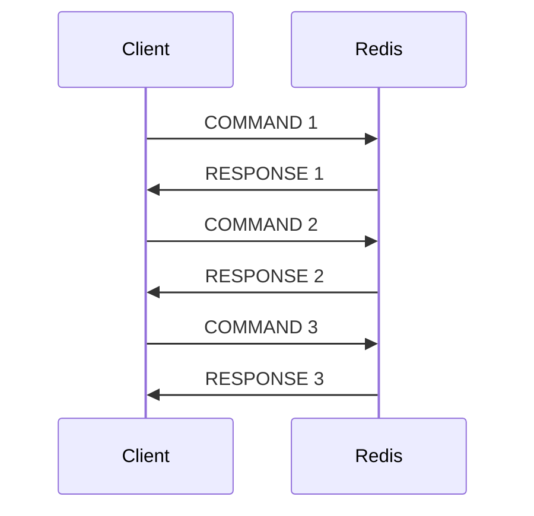
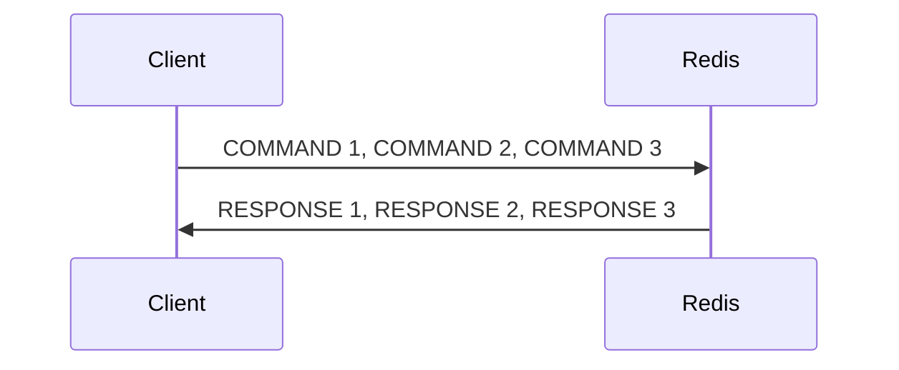

# Redis Batch Operations

## Introduction

When working with Redis, performing operations one at a time can be inefficient, especially when you need to execute multiple commands in sequence. Redis batch operations allow you to group multiple commands and send them to the server in a single request, which can significantly improve performance and reduce network overhead.

In this tutorial, we'll explore two primary ways to perform batch operations in Redis:

1. **Pipelining** - A technique to send multiple commands to the server without waiting for the responses
2. **Transactions** - A way to execute a group of commands as an atomic operation

By the end of this tutorial, you'll understand how to use these techniques to optimize your Redis operations and make your applications more efficient.

## Prerequisites

- Basic knowledge of Redis and its commands
- Redis server installed and running
- A Redis client library for your programming language (we'll use Node.js with `redis` library and Python with `redis-py` in our examples)

## Understanding Redis Pipelining

### What is Pipelining?

Pipelining is a technique to send multiple commands to Redis in one go, without waiting for the response to each command. This significantly reduces the network round-trip time and improves throughput.

### Why Use Pipelining?

Without pipelining, each command requires a complete round-trip:



With pipelining, multiple commands are sent in a batch:



### Pipelining Examples

#### Node.js Example

```javascript
const redis = require('redis');
const client = redis.createClient();

// Connect to Redis
await client.connect();

// Without pipelining
console.time('Without Pipeline');
await client.set('key1', 'value1');
await client.set('key2', 'value2');
await client.set('key3', 'value3');
await client.get('key1');
await client.get('key2');
await client.get('key3');
console.timeEnd('Without Pipeline');

// With pipelining
console.time('With Pipeline');
const pipeline = client.multi();
pipeline.set('key1', 'value1');
pipeline.set('key2', 'value2');
pipeline.set('key3', 'value3');
pipeline.get('key1');
pipeline.get('key2');
pipeline.get('key3');
const results = await pipeline.exec();
console.timeEnd('With Pipeline');

console.log('Pipeline results:', results);
// Output: ['OK', 'OK', 'OK', 'value1', 'value2', 'value3']

await client.quit();
```

#### Python Example

```python
import redis
import time

# Connect to Redis
r = redis.Redis(host='localhost', port=6379, db=0)

# Without pipelining
start = time.time()
r.set('key1', 'value1')
r.set('key2', 'value2')
r.set('key3', 'value3')
r.get('key1')
r.get('key2')
r.get('key3')
end = time.time()
print(f"Without Pipeline: {end - start} seconds")

# With pipelining
start = time.time()
pipe = r.pipeline()
pipe.set('key1', 'value1')
pipe.set('key2', 'value2')
pipe.set('key3', 'value3')
pipe.get('key1')
pipe.get('key2')
pipe.get('key3')
results = pipe.execute()
end = time.time()
print(f"With Pipeline: {end - start} seconds")

print(f"Pipeline results: {results}")
# Output: [True, True, True, b'value1', b'value2', b'value3']
```

### Performance Benefits

Pipelining can provide significant performance improvements:

- Reduces network round trips
- Minimizes latency impact
- Can be 5-10x faster for multiple operations

## Redis Transactions with MULTI/EXEC

### What are Redis Transactions?

Redis transactions allow you to execute a group of commands as an atomic operation. This means either all commands execute or none do.

Unlike traditional database transactions, Redis transactions don't provide rollback capabilities if a command fails due to a syntax error or other issues.

### How Redis Transactions Work

Redis transactions use three main commands:

1. `MULTI` - Marks the start of a transaction
2. `EXEC` - Executes all commands issued after MULTI
3. `DISCARD` - Cancels the transaction

Between `MULTI` and `EXEC`, Redis queues up all commands without executing them. When `EXEC` is called, all commands are executed sequentially.

### Transaction Examples

#### Node.js Example

```javascript
const redis = require('redis');
const client = redis.createClient();

// Connect to Redis
await client.connect();

// Simple transaction
const transaction = client.multi();
transaction.set('user:1:name', 'Alice');
transaction.set('user:1:email', 'alice@example.com');
transaction.incr('user:count');
const results = await transaction.exec();

console.log('Transaction results:', results);
// Output: ['OK', 'OK', 1]

// Check if the commands were executed
const name = await client.get('user:1:name');
const email = await client.get('user:1:email');
const count = await client.get('user:count');

console.log(`Name: ${name}, Email: ${email}, Count: ${count}`);
// Output: Name: Alice, Email: alice@example.com, Count: 1

await client.quit();
```

#### Python Example

```python
import redis

# Connect to Redis
r = redis.Redis(host='localhost', port=6379, db=0)

# Simple transaction
pipe = r.pipeline(transaction=True)  # Enable transaction mode
pipe.set('user:2:name', 'Bob')
pipe.set('user:2:email', 'bob@example.com')
pipe.incr('user:count')
results = pipe.execute()

print(f"Transaction results: {results}")
# Output: [True, True, 2]

# Check if the commands were executed
name = r.get('user:2:name')
email = r.get('user:2:email')
count = r.get('user:count')

print(f"Name: {name.decode()}, Email: {email.decode()}, Count: {count.decode()}")
# Output: Name: Bob, Email: bob@example.com, Count: 2
```

### Transactions vs. Pipelining

While both techniques batch commands, they have different purposes:

| Feature | Pipelining | Transactions |
|---------|------------|--------------|
| Purpose | Performance optimization | Data consistency |
| Atomicity | No | Yes |
| Command Execution | Immediate | After EXEC |
| Error Handling | Continues execution | Aborts all commands |
| Use Case | Bulk operations where atomicity isn't required | When operations must succeed or fail together |

## Practical Use Cases

### 1. Bulk Data Loading

When importing large datasets into Redis:

```javascript
// Node.js bulk loading example
async function bulkLoad(dataArray) {
  const pipeline = client.multi();
  
  for (const item of dataArray) {
    pipeline.hSet(`product:${item.id}`, {
      name: item.name,
      price: item.price,
      quantity: item.quantity
    });
  }
  
  return await pipeline.exec();
}

// Example usage
const products = [
  { id: 1, name: 'Laptop', price: '999.99', quantity: '10' },
  { id: 2, name: 'Phone', price: '499.99', quantity: '20' },
  { id: 3, name: 'Tablet', price: '299.99', quantity: '15' },
  // ... thousands more items
];

const results = await bulkLoad(products);
console.log(`Loaded ${results.length} products into Redis`);
```

### 2. Atomic Counter Updates

Using transactions to increment multiple counters atomically:

```python
# Python example for atomic counter updates
def update_page_stats(page_id, user_id):
    pipe = r.pipeline(transaction=True)
    pipe.incr(f'page:{page_id}:views')
    pipe.sadd(f'page:{page_id}:visitors', user_id)
    pipe.zadd('pages:popular', {page_id: 1}, incr=True)
    return pipe.execute()

# Example usage
result = update_page_stats('home', 'user123')
print(f"Updated stats: Views={result[0]}, Visitor added={result[1]}, Score={result[2]}")
```

### 3. Implementing a Simple Queue

Using Redis lists with transactions for a reliable queue:

```javascript
// Node.js example for a simple queue
async function enqueueJobs(jobs) {
  const transaction = client.multi();
  
  for (const job of jobs) {
    transaction.lPush('job_queue', JSON.stringify(job));
    transaction.incr('stats:pending_jobs');
  }
  
  return await transaction.exec();
}

async function dequeueJob() {
  const transaction = client.multi();
  transaction.rPopLPush('job_queue', 'job_processing');
  transaction.decr('stats:pending_jobs');
  transaction.incr('stats:processing_jobs');
  
  const results = await transaction.exec();
  return results[0] ? JSON.parse(results[0]) : null;
}

// Example usage
const jobs = [
  { id: 1, type: 'email', payload: { to: 'user1@example.com', subject: 'Welcome!' } },
  { id: 2, type: 'notification', payload: { userId: 'user2', message: 'New message' } }
];

await enqueueJobs(jobs);
const job = await dequeueJob();
console.log('Processing job:', job);
```

## Best Practices

1. **Use Pipelining for Bulk Operations**: When sending multiple commands that don't need to be atomic, use pipelining for better performance.

2. **Use Transactions for Atomic Operations**: When operations need to succeed or fail together, use transactions.

3. **Limit Batch Size**: Don't put too many commands in a single pipeline or transaction. A good rule of thumb is to keep batches under 1,000 commands.

4. **Handle Results Carefully**: Pipeline and transaction results come as arrays in the order of the commands.

5. **Watch for Memory Usage**: Large pipelines can increase memory usage on both client and server.

6. **Error Handling**: Properly handle errors from batched commands. In pipelining, one command may fail while others succeed.

## Common Pitfalls

1. **Forgetting to Execute**: Make sure to call `.exec()` or `.execute()` to actually run the batched commands.

2. **Misunderstanding Atomicity**: Redis transactions guarantee commands will execute as a batch, but don't provide rollback if a command fails due to a logical error.

3. **Using Both When One Would Do**: Don't use transactions when you only need performance optimization, and don't use pipelining when you need atomicity.

4. **Not Considering WATCH**: For complex scenarios requiring optimistic locking, remember the `WATCH` command with transactions.

## Summary

Redis batch operations provide powerful techniques to optimize your application's interaction with Redis:

- **Pipelining** reduces network overhead by sending multiple commands at once
- **Transactions** ensure groups of commands are executed atomically
- Both approaches significantly improve performance over sending individual commands

By understanding when and how to use these batch operations, you can make your Redis-based applications more efficient and reliable.

## Additional Resources

- [Redis Official Documentation on Pipelining](https://redis.io/topics/pipelining)
- [Redis Transactions Documentation](https://redis.io/topics/transactions)
- [Redis Command Reference](https://redis.io/commands)

## Exercises

1. **Performance Testing**: Create a simple benchmark that compares the execution time of 100 SET operations using:
   - Individual commands
   - Pipelining
   - Transactions

2. **Inventory System**: Implement a simple inventory system that uses transactions to update product quantities and track sales atomically.

3. **Leaderboard Implementation**: Create a leaderboard for a game using sorted sets, and use pipelining to efficiently update scores for multiple players.

4. **Error Handling**: Experiment with causing errors in both pipelined commands and transactions to understand how Redis behaves in each case.