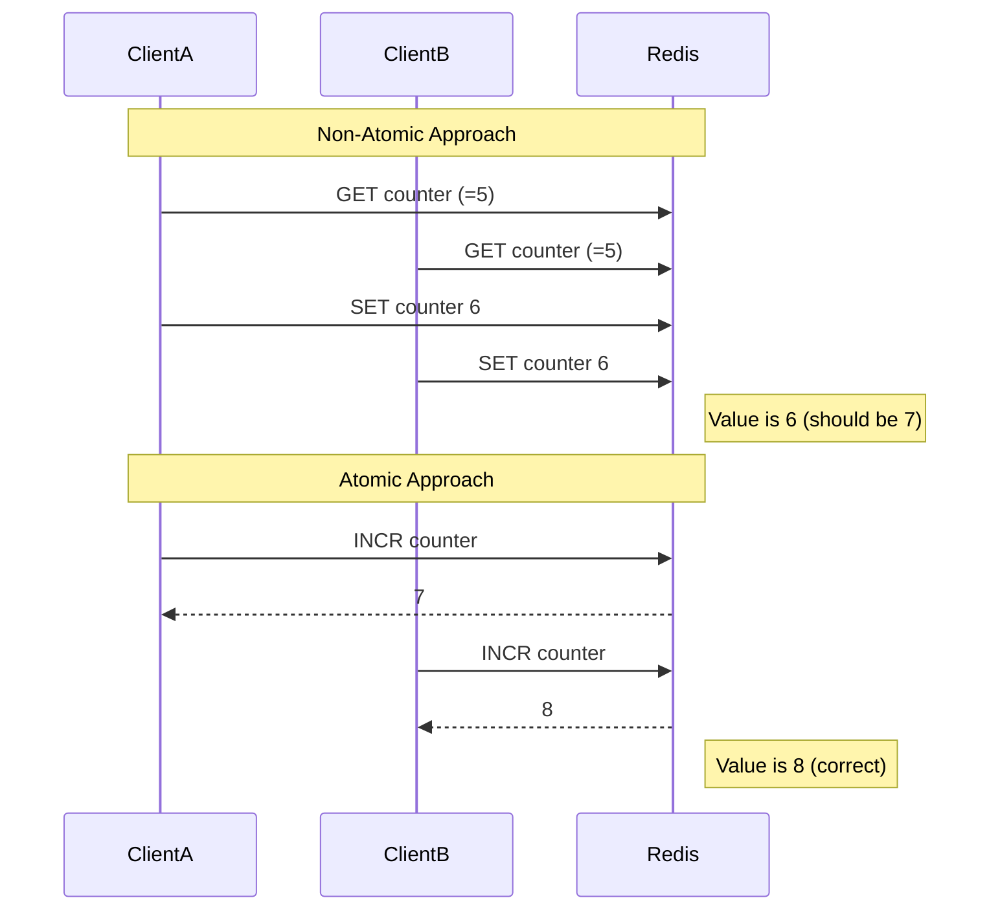

# Redis Atomic Operations

## Introduction

When working with databases in a multi-user environment, ensuring data consistency is crucial. Redis, an in-memory data structure store, provides atomic operations that help maintain data integrity even when multiple clients are accessing and modifying data simultaneously.

In this guide, we'll explore Redis atomic operations, understand why they're important, and learn how to use them effectively in your applications.

## What Are Atomic Operations?

An atomic operation is an indivisible and irreducible series of operations that either completes entirely or doesn't execute at all. Think of it as a single unit of work that cannot be interrupted.

For example, when you increment a counter, two operations happen:
1. The current value is read
2. The value is incremented and stored back

If these operations aren't atomic, two clients might read the same value simultaneously, increment it separately, and both write the same new value—resulting in one increment being lost.

Redis ensures that its commands execute atomically, preventing such race conditions.

## Basic Atomic Operations in Redis

### Increment and Decrement Operations

Redis provides built-in atomic increment and decrement operations:

```bash
# Increment a key by 1
> INCR counter
(integer) 1

# Increment again
> INCR counter
(integer) 2

# Increment by a specific amount
> INCRBY counter 5
(integer) 7

# Decrement a value
> DECR counter
(integer) 6

# Decrement by a specific amount
> DECRBY counter 3
(integer) 3
```

These operations are atomic, ensuring that concurrent increments are handled correctly.

### Working with Floating-Point Numbers

Redis also supports atomic operations on floating-point numbers:

```bash
> SET pi 3.14
OK

> INCRBYFLOAT pi 0.01
"3.15"
```

### String Manipulation

Atomic operations for strings include:

```bash
# Append to a string
> SET greeting "Hello"
OK
> APPEND greeting " World"
(integer) 11
> GET greeting
"Hello World"

# Set a value only if it doesn't exist
> SETNX newkey "This will be set"
(integer) 1
> SETNX newkey "This will NOT be set"
(integer) 0
> GET newkey
"This will be set"
```

## Multi-Key Atomic Operations with Transactions

For operations that involve multiple keys, Redis provides transactions using `MULTI`, `EXEC`, and `WATCH` commands:

```bash
# Start a transaction
> MULTI
OK

# Queue commands (not executed yet)
> SET account:A 50
QUEUED
> SET account:B 80
QUEUED

# Execute all commands atomically
> EXEC
1) OK
2) OK
```

This ensures that all commands in the transaction are executed without interruption.

## Implementing Atomic Patterns

### Implementing a Counter

Let's implement a page view counter:

```javascript
// Using Node.js with redis client
const redis = require("redis");
const client = redis.createClient();

async function incrementPageView(pageId) {
  // Atomic increment operation
  const views = await client.incr(`page:${pageId}:views`);
  console.log(`Page ${pageId} has been viewed ${views} times`);
  return views;
}
```

### Implementing a Rate Limiter

Here's how to implement a simple rate limiter using Redis atomic operations:

```javascript
async function checkRateLimit(userId, limit = 10, windowSeconds = 60) {
  const key = `ratelimit:${userId}`;
  
  // Increment the counter atomically
  const count = await client.incr(key);
  
  // Set expiration if this is the first request in window
  if (count === 1) {
    await client.expire(key, windowSeconds);
  }
  
  // Check if user has exceeded the limit
  if (count > limit) {
    return false; // rate limit exceeded
  }
  
  return true; // request allowed
}
```

### Implementing a Distributed Lock

Distributed locks can help coordinate access to resources across different services:

```javascript
async function acquireLock(resourceId, timeout = 10) {
  // Try to set a key with NX option (only if it doesn't exist)
  const lockKey = `lock:${resourceId}`;
  const result = await client.set(lockKey, "1", {
    NX: true,
    EX: timeout
  });
  
  return result === "OK";
}

async function releaseLock(resourceId) {
  const lockKey = `lock:${resourceId}`;
  await client.del(lockKey);
}

async function performWithLock(resourceId, action) {
  // Try to acquire the lock
  if (await acquireLock(resourceId)) {
    try {
      // Execute the action
      return await action();
    } finally {
      // Always release the lock after the operation
      await releaseLock(resourceId);
    }
  } else {
    throw new Error("Could not acquire lock");
  }
}
```

## Conditional Updates with WATCH

The `WATCH` command allows for optimistic locking, enabling conditional updates:

```bash
> WATCH account:A
OK

> GET account:A
"100"

# In another client, someone modifies the value
# (this would cause our transaction to fail)

> MULTI
OK
> DECRBY account:A 20
QUEUED
> EXEC
(nil) # Transaction failed because account:A was modified
```

This mechanism helps prevent race conditions when implementing complex operations.

## Common Atomic Operations Use Cases

1. **Counters**: Page views, likes, inventory counts
2. **Rate Limiting**: API request throttling
3. **Distributed Locks**: Resource coordination
4. **Leaderboards**: Atomic score updates
5. **Shopping Carts**: Inventory management
6. **User Session Management**: Tracking concurrent users

## Performance Considerations

- Atomic operations are fast in Redis, often executing in microseconds
- Transactions have minimal overhead
- Consider using Lua scripts for complex atomic operations
- Scale with Redis Cluster for high-load scenarios

## Best Practices

1. **Keep Operations Simple**: Focus on operations that can be completed quickly
2. **Use the Right Tool**: Choose the appropriate Redis feature for your needs:
   - Simple counters: Use `INCR`/`DECR`
   - Multi-key operations: Use transactions
   - Complex logic: Use Lua scripting

3. **Handle Failures**: Always account for potential failures, especially with distributed locks
4. **Avoid Long-Running Operations**: Redis is single-threaded; long operations block others

## Using Lua Scripts for Custom Atomic Operations

For more complex atomic operations, Redis allows executing Lua scripts:

```bash
> EVAL "local current = redis.call('get', KEYS[1]) or 0; 
        if tonumber(current) < tonumber(ARGV[1]) then 
          redis.call('set', KEYS[1], ARGV[1]); 
          return 1; 
        else 
          return 0; 
        end" 1 mykey 10
(integer) 1
```

This script atomically updates a value only if the new value is greater than the current one.

## Flow Diagram: Redis Atomic Operation vs. Non-Atomic



## Summary

Redis atomic operations ensure data consistency in concurrent environments by making operations indivisible. They provide:

- Built-in atomic counters and string operations
- Transactions for multi-key operations
- Optimistic locking with WATCH
- Custom atomic operations using Lua scripts

By leveraging these atomic operations, you can build reliable, concurrent applications without worrying about race conditions.

## Practice Exercises

1. Implement a visitor counter for different website pages
2. Create a simple rate limiter to protect your API
3. Build a basic inventory management system that handles concurrent purchases
4. Implement a distributed lock for a shared resource
5. Create a leaderboard system with atomic score updates

## Additional Resources

- Redis Documentation: [Redis Commands](https://redis.io/commands)
- Redis Transactions: [Redis Transactions Guide](https://redis.io/topics/transactions)
- Redis Lua Scripting: [Redis Scripting](https://redis.io/commands/eval)