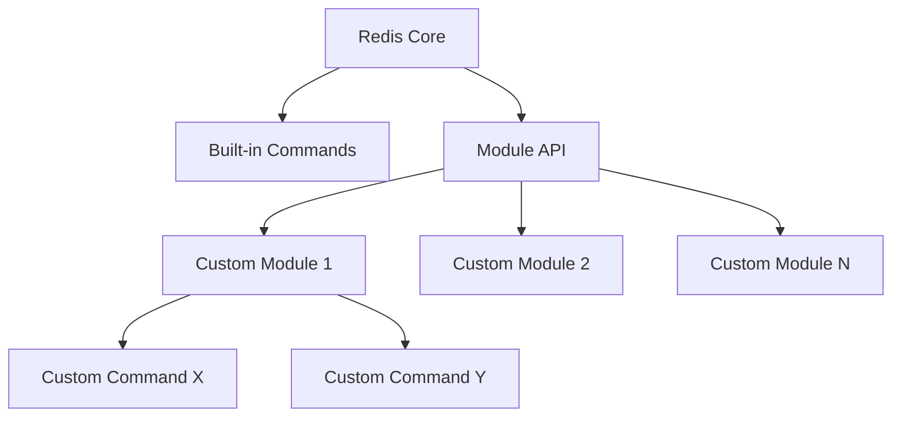

# Redis Command Creation

## Introduction

Redis is a powerful, open-source, in-memory data structure store that can be used as a database, cache, message broker, and more. While Redis comes with a rich set of built-in commands, there are scenarios where you might need to extend its functionality with custom commands to better suit your specific application requirements.

In this guide, we'll explore how to create custom Redis commands through Redis modules. This powerful feature allows you to extend Redis with new functionality written in C, giving you the ability to implement operations that aren't available in the standard command set.

## Understanding Redis Modules

Redis modules are dynamic libraries that can be loaded into Redis at startup or runtime, adding new commands and data types. This modular architecture enables developers to extend Redis's functionality without modifying the Redis core.



## Prerequisites

Before diving into creating Redis commands, you'll need:

1. Basic knowledge of C programming language
2. Redis server installed (version 4.0 or later)
3. Development tools (gcc, make, etc.)
4. Understanding of Redis data structures and commands

## Creating Your First Redis Module

Let's start by creating a simple "HELLO" command that returns a greeting message.

### Step 1: Set up the project structure

Create a directory for your module:

```bash
mkdir redis-hello-module
cd redis-hello-module
```

### Step 2: Create the module source file

Create a file named `hello.c` with the following content:

```c
#include "redismodule.h"
#include <string.h>

/* HELLO [name] - Return a greeting to the user */
int HelloCommand(RedisModuleCtx *ctx, RedisModuleString **argv, int argc) {
    if (argc < 2) {
        return RedisModule_WrongArity(ctx);
    }
    
    RedisModuleString *name = argv[1];
    size_t len;
    const char *nameStr = RedisModule_StringPtrLen(name, &len);
    
    RedisModule_ReplyWithSimpleString(ctx, nameStr ? 
                                      RedisModule_StringPtrLen(name, &len) : 
                                      "world");
    
    return REDISMODULE_OK;
}

/* Module initialization */
int RedisModule_OnLoad(RedisModuleCtx *ctx, RedisModuleString **argv, int argc) {
    /* Register the module with Redis */
    if (RedisModule_Init(ctx, "hello", 1, REDISMODULE_APIVER_1) == REDISMODULE_ERR) {
        return REDISMODULE_ERR;
    }
    
    /* Register the HELLO command */
    if (RedisModule_CreateCommand(ctx, "HELLO", 
                                  HelloCommand, 
                                  "readonly", 
                                  1, 1, 1) == REDISMODULE_ERR) {
        return REDISMODULE_ERR;
    }
    
    return REDISMODULE_OK;
}
```

### Step 3: Get the Redis module header file

Download the Redis module header file:

```bash
wget https://raw.githubusercontent.com/redis/redis/unstable/src/redismodule.h
```

### Step 4: Compile the module

Create a Makefile:

```makefile
CC=gcc
CFLAGS=-fPIC -Wall -std=c99 -O2
MODULE=hello.so
SOURCE=hello.c
DEPS=redismodule.h

all: $(MODULE)

$(MODULE): $(SOURCE) $(DEPS)
	$(CC) $(CFLAGS) -shared -o $@ $<

clean:
	rm -f $(MODULE)
```

Then compile the module:

```bash
make
```

### Step 5: Load the module into Redis

Start Redis with the module:

```bash
redis-server --loadmodule ./hello.so
```

Or load it at runtime:

```bash
redis-cli MODULE LOAD /path/to/hello.so
```

### Step 6: Test your new command

Connect to Redis and try your new command:

```
127.0.0.1:6379> HELLO Alice
"Alice"
```

## Understanding the Code

Let's break down the key components of our module:

1. **Module Header**: We include `redismodule.h` which provides the interface to Redis's module API.

2. **Command Function**: `HelloCommand` is the implementation of our command. It:
   - Checks for the correct number of arguments
   - Extracts the name argument
   - Returns a greeting using Redis's reply API

3. **Module Initialization**: `RedisModule_OnLoad` is called when the module is loaded. It:
   - Initializes the module with Redis
   - Registers our command with Redis

4. **Command Registration**: `RedisModule_CreateCommand` registers our command with Redis, specifying:
   - Command name ("HELLO")
   - Implementation function (HelloCommand)
   - Command flags ("readonly")
   - Allowed first key, last key, and step count for key extraction (1, 1, 1)

## Creating More Complex Commands

Let's create a more practical command that performs a useful operation not available in Redis by default.

### Example: MOVINGAVG Command

This command calculates the moving average of values in a list.

```c
/* MOVINGAVG key window - Calculate the moving average of values in a list */
int MovingAvgCommand(RedisModuleCtx *ctx, RedisModuleString **argv, int argc) {
    if (argc != 3) {
        return RedisModule_WrongArity(ctx);
    }
    
    RedisModuleKey *key = RedisModule_OpenKey(ctx, argv[1], REDISMODULE_READ);
    long long window;
    
    /* Parse the window size */
    if (RedisModule_StringToLongLong(argv[2], &window) != REDISMODULE_OK || window <= 0) {
        RedisModule_ReplyWithError(ctx, "ERR invalid window size");
        RedisModule_CloseKey(key);
        return REDISMODULE_ERR;
    }
    
    /* Check if key exists and is a list */
    if (RedisModule_KeyType(key) == REDISMODULE_KEYTYPE_EMPTY) {
        RedisModule_ReplyWithError(ctx, "ERR key does not exist");
        RedisModule_CloseKey(key);
        return REDISMODULE_ERR;
    } else if (RedisModule_KeyType(key) != REDISMODULE_KEYTYPE_LIST) {
        RedisModule_ReplyWithError(ctx, REDISMODULE_ERRORMSG_WRONGTYPE);
        RedisModule_CloseKey(key);
        return REDISMODULE_ERR;
    }
    
    /* Get list length */
    size_t len = RedisModule_ValueLength(key);
    if (len == 0) {
        RedisModule_ReplyWithError(ctx, "ERR list is empty");
        RedisModule_CloseKey(key);
        return REDISMODULE_ERR;
    }
    
    /* Cap window size to list length */
    if (window > len) window = len;
    
    /* Calculate moving average */
    double sum = 0;
    for (size_t i = 0; i < window; i++) {
        RedisModuleString *elem;
        RedisModule_ListGet(key, len - 1 - i, &elem);
        
        long long val;
        if (RedisModule_StringToLongLong(elem, &val) != REDISMODULE_OK) {
            RedisModule_ReplyWithError(ctx, "ERR list contains non-numeric values");
            RedisModule_CloseKey(key);
            return REDISMODULE_ERR;
        }
        
        sum += val;
    }
    
    double avg = sum / window;
    
    RedisModule_CloseKey(key);
    RedisModule_ReplyWithDouble(ctx, avg);
    
    return REDISMODULE_OK;
}
```

## Redis Command Guidelines

When creating Redis commands, follow these best practices:

1. **Command Naming**:
   - Use uppercase letters (by convention)
   - Choose clear, descriptive names
   - Use a prefix for related commands (e.g., `HELLO.WORLD`, `HELLO.NAME`)

2. **Command Arguments**:
   - Validate all arguments carefully
   - Provide clear error messages for invalid inputs
   - Support optional arguments when appropriate

3. **Error Handling**:
   - Check return values of Redis Module API functions
   - Close keys and free resources in error cases
   - Use descriptive error messages

4. **Performance Considerations**:
   - Be mindful of time complexity
   - Avoid blocking operations in commands
   - Consider using threaded commands for CPU-intensive operations

## Real-World Applications

Custom Redis commands are useful in various scenarios:

### Example 1: Enhanced Analytics

```c
/* TIMESERIES.INCREMENTBY key timestamp value - Add a value to a time series */
int TimeSeriesIncrementBy(RedisModuleCtx *ctx, RedisModuleString **argv, int argc) {
    // Implementation details omitted for brevity
    // This would create or update a sorted set with scores representing timestamps
    // and increment the value at the given timestamp
}
```

### Example 2: Domain-Specific Validations

```c
/* VALIDATE.EMAIL email - Check if an email is valid */
int ValidateEmailCommand(RedisModuleCtx *ctx, RedisModuleString **argv, int argc) {
    // Implementation details omitted for brevity
    // This would check if the provided string is a valid email address
    // and return 1 if valid, 0 otherwise
}
```

### Example 3: Custom Data Types

```c
/* GRAPH.ADDEDGE graph source target [properties] - Add an edge to a graph */
int GraphAddEdgeCommand(RedisModuleCtx *ctx, RedisModuleString **argv, int argc) {
    // Implementation details omitted for brevity
    // This would add an edge to a custom graph data type
}
```

## Deployment and Distribution

Once you've created your Redis module, you can:

1. **Package it for distribution**:
   - Create a README file explaining your module
   - Add a LICENSE file
   - Publish your module on GitHub or other platforms

2. **Configure it for production**:
   - Add configuration options to your module
   - Create initialization scripts
   - Document the command's behavior and performance characteristics

3. **Load it automatically**:
   - Configure Redis to load your module at startup
   - Add the module to a Redis Stack or Redis Enterprise setup

## Summary

Creating custom Redis commands through modules is a powerful way to extend Redis's functionality to meet your specific application needs. By writing C code and following Redis's module API, you can add new commands that work seamlessly with the rest of Redis.

In this guide, we've learned:
- How Redis modules work and how they extend Redis
- How to create and register custom Redis commands
- Best practices for command implementation
- Real-world applications of custom Redis commands

Custom Redis commands allow you to leverage the performance and reliability of Redis while adding domain-specific functionality that might not be available in the core Redis command set.

## Additional Resources

- [Redis Modules API Documentation](https://redis.io/topics/modules-api-ref)
- [Redis Modules GitHub Repository](https://github.com/redis/redis-modules-sdk)
- [Sample Redis Modules for Learning](https://github.com/redis/redis-modules-sdk/tree/master/examples)

## Exercises

1. Create a Redis module with a command that reverses a string.
2. Implement a command that calculates the median of a list of numbers.
3. Create a command that performs set operations with custom logic not available in Redis's built-in commands.
4. Build a command that validates data according to a specific schema.
5. Implement a command that performs a complex calculation on multiple data structures.