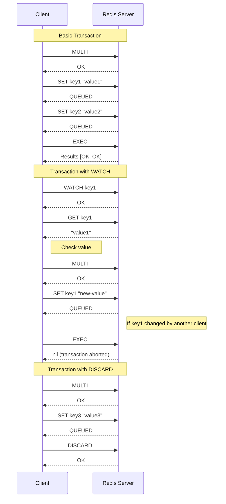

# Redis Transactions

## Introduction

When building applications with Redis, you'll often need to execute multiple commands together as a single operation. Redis transactions allow you to group commands and execute them sequentially and atomically, ensuring that either all commands are processed or none of them are.

In this tutorial, you'll learn:
- What Redis transactions are and why they're useful
- How to use the `MULTI`, `EXEC`, and `DISCARD` commands
- How optimistic locking works with the `WATCH` command
- Practical examples of transactions in real-world scenarios

## Understanding Redis Transactions

A Redis transaction is a sequence of commands that are executed as a single isolated operation. Redis transactions are different from traditional database transactions in a few key ways:

1. Commands in a Redis transaction are executed sequentially (not interleaved with commands from other clients)
2. Either all commands in a transaction are processed, or none are processed
3. Redis does not provide rollback capabilities if a command fails during execution

Let's dive into how transactions work in Redis.

## Basic Transaction Commands

Redis provides three main commands for handling transactions:

- `MULTI` - Marks the start of a transaction block
- `EXEC` - Executes all commands issued after `MULTI`
- `DISCARD` - Discards all commands issued after `MULTI`

Let's see a simple example:

```redis
> MULTI
OK
> SET user:1:name "John"
QUEUED
> SET user:1:email "john@example.com"
QUEUED
> INCR user:1:visits
QUEUED
> EXEC
1) OK
2) OK
3) (integer) 1
```

In this example:
1. We start a transaction with `MULTI`
2. We queue three commands (two `SET` and one `INCR`)
3. Each command returns "QUEUED" to indicate it has been added to the transaction
4. When we call `EXEC`, all three commands are executed, and their results are returned in order

If we decide not to execute our queued commands, we can use `DISCARD`:

```redis
> MULTI
OK
> SET user:2:name "Alice"
QUEUED
> DISCARD
OK
> GET user:2:name
(nil)
```

As you can see, after using `DISCARD`, the `SET` command is not executed.

## Command Errors During Transactions

There are two types of errors that can occur in a Redis transaction:

1. **Queue-time errors**: Errors detected when a command is queued (before `EXEC`)
2. **Execution-time errors**: Errors detected when a command is executed (after `EXEC`)

### Queue-time Errors

If Redis detects a queue-time error (like a syntax error), it will reject the command and the transaction can still continue:

```redis
> MULTI
OK
> SET user:3:name "Bob"
QUEUED
> INCORRECT_COMMAND
(error) ERR unknown command 'INCORRECT_COMMAND'
> SET user:3:email "bob@example.com"
QUEUED
> EXEC
1) OK
2) OK
```

In this case, the invalid command is rejected, but other valid commands are still executed when `EXEC` is called.

### Execution-time Errors

If a command fails during execution (after `EXEC`), Redis will still execute all other commands in the transaction:

```redis
> MULTI
OK
> SET user:4:name "Charlie"
QUEUED
> INCR user:4:name  # This will fail because we're trying to increment a string
QUEUED
> SET user:4:email "charlie@example.com"
QUEUED
> EXEC
1) OK
2) (error) ERR value is not an integer or out of range
3) OK
```

Notice that even though the `INCR` command failed during execution, the other commands still executed successfully. This is an important difference from traditional database transactions, which would roll back all changes if any command fails.

## Optimistic Locking with WATCH

Redis provides an optimistic locking mechanism with the `WATCH` command. It allows you to monitor one or more keys and ensure they haven't changed before executing a transaction.

Here's how it works:

1. You `WATCH` one or more keys
2. You check their values
3. Based on those values, you decide what commands to include in your transaction
4. If any of the watched keys are modified before your transaction executes (`EXEC`), the transaction is aborted

Let's look at an example:

```redis
> SET balance 100
OK
> WATCH balance
OK
> GET balance
"100"
# At this point, we decide to decrement the balance by 20
> MULTI
OK
> DECRBY balance 20
QUEUED
> EXEC
1) (integer) 80
```

Now, let's see what happens if another client modifies the watched key before `EXEC` is called:

Client 1:
```redis
> WATCH balance
OK
> GET balance
"80"
# Client 1 decides to decrement balance by 20
> MULTI
OK
> DECRBY balance 20
QUEUED
# Before calling EXEC, Client 2 modifies the balance
```

Client 2:
```redis
> INCR balance
(integer) 81
```

Client 1 (continuing):
```redis
> EXEC
(nil)
```

Client 1's transaction was aborted (returning `nil`) because the watched key was modified by Client 2 before the transaction was executed. This helps prevent race conditions and ensures your transaction logic is based on the most current data.

## Real-world Example: Implementing a Simple Counter

Let's implement a simple view counter for a blog post using Redis transactions:

```javascript
const redis = require('redis');
const client = redis.createClient();

async function incrementViewCount(postId) {
  try {
    // Start a transaction
    await client.multi()
      .incr(`post:${postId}:views`)
      .zadd('popular_posts', { score: Date.now(), value: postId })
      .exec();
    
    console.log(`View count incremented for post ${postId}`);
  } catch (error) {
    console.error('Error incrementing view count:', error);
  }
}

// Usage
incrementViewCount('12345');
```

In this example:
1. We increment the view count for a specific post
2. We update a sorted set that tracks popular posts based on recent views
3. Both operations happen atomically in a single transaction

## Real-world Example: Implementing a Simple Transfer System

Let's implement a more complex example: a system for transferring points between users:

```javascript
const redis = require('redis');
const client = redis.createClient();

async function transferPoints(fromUser, toUser, amount) {
  let success = false;
  let retries = 3;
  
  while (!success && retries > 0) {
    try {
      // Watch the balances
      await client.watch(`user:${fromUser}:points`, `user:${toUser}:points`);
      
      // Get current balances
      const fromBalance = parseInt(await client.get(`user:${fromUser}:points`)) || 0;
      const toBalance = parseInt(await client.get(`user:${toUser}:points`)) || 0;
      
      // Check if sender has enough points
      if (fromBalance < amount) {
        console.log(`User ${fromUser} doesn't have enough points.`);
        await client.unwatch();
        return false;
      }
      
      // Execute transaction
      const results = await client.multi()
        .decrby(`user:${fromUser}:points`, amount)
        .incrby(`user:${toUser}:points`, amount)
        .exec();
      
      // If transaction succeeded
      if (results !== null) {
        console.log(`Transferred ${amount} points from user ${fromUser} to user ${toUser}`);
        success = true;
        return true;
      } else {
        console.log('Transaction aborted. Retrying...');
        retries--;
      }
    } catch (error) {
      console.error('Error transferring points:', error);
      retries--;
    }
  }
  
  if (!success) {
    console.log('Failed to transfer points after multiple attempts');
    return false;
  }
}

// Usage
transferPoints('user1', 'user2', 50);
```

In this example:
1. We use `WATCH` to monitor both users' point balances
2. We check if the sender has enough points
3. We execute a transaction that decrements the sender's balance and increments the receiver's balance
4. If the transaction fails (e.g., if another client modified either balance), we retry

## Visualizing Redis Transactions



## Limitations of Redis Transactions

While Redis transactions are powerful, they have some limitations:

1. **No rollback capability**: If a command fails during execution, Redis won't undo previous commands in the transaction
2. **No nested transactions**: You can't start a new transaction inside an existing one
3. **No conditional execution**: Unlike SQL's `IF` statements, Redis can't conditionally execute commands within a transaction based on the result of previous commands
4. **Limited isolation**: While a transaction is executing, other clients can still read data (but they'll see the data as it was before the transaction)

## Best Practices

1. **Keep transactions short**: Long-running transactions can block other clients
2. **Handle transaction failures**: Always check the result of `EXEC` and retry if necessary
3. **Use `WATCH` carefully**: Watching too many keys increases the chance of transaction abortion
4. **Consider Lua scripts**: For more complex operations, Redis Lua scripts might be a better option than transactions

## Summary

Redis transactions provide a way to execute multiple commands atomically, ensuring that all commands are executed sequentially without interference from other clients. Key points to remember:

- Use `MULTI` to start a transaction, `EXEC` to execute it, and `DISCARD` to cancel it
- Redis doesn't provide rollback capabilities if a command fails during execution
- Use `WATCH` for optimistic locking to ensure data consistency
- Redis transactions are useful for operations that need to be executed together, like transferring points between users or updating related counters

## Exercises

1. Implement a rate limiter using Redis transactions
2. Create a simple leaderboard system that atomically updates scores and rankings
3. Build a shopping cart system that checks inventory levels before completing a purchase
4. Implement a basic reservation system using optimistic locking with `WATCH`

## Additional Resources

- [Redis Transactions Documentation](https://redis.io/topics/transactions)
- [Redis Commands Reference](https://redis.io/commands)
- [Lua Scripting in Redis](https://redis.io/commands/eval)