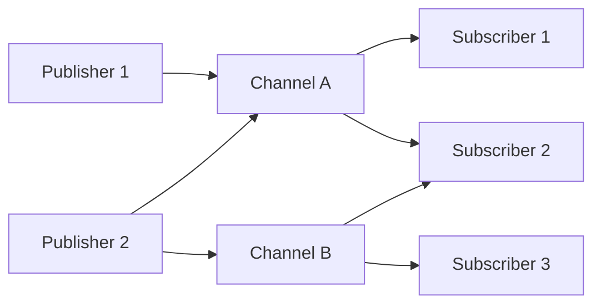

# Redis Pub/Sub

## Introduction

Redis Pub/Sub (Publish/Subscribe) is a messaging pattern where publishers send messages to channels without knowing who will receive them, while subscribers express interest in channels to receive messages without knowing who sent them. This decoupled communication model is perfect for building real-time applications like chat systems, notification services, and data streaming pipelines.

In this tutorial, we'll explore how Redis implements the Pub/Sub pattern and how you can leverage this powerful feature in your applications.

## Understanding the Publish/Subscribe Pattern

Before diving into Redis, let's understand the core concepts of the Pub/Sub pattern:

- **Publishers**: Entities that send messages to specific channels
- **Subscribers**: Entities that receive messages from channels they've subscribed to
- **Channels**: Named message queues that act as intermediaries between publishers and subscribers

The beauty of this pattern lies in its simplicity and scalability:



## Redis Pub/Sub Commands

Redis provides simple commands to implement the Pub/Sub pattern:

| Command | Description |
|---------|-------------|
| `PUBLISH` | Sends a message to a channel |
| `SUBSCRIBE` | Subscribes to channels to receive messages |
| `PSUBSCRIBE` | Subscribes to channels matching a pattern |
| `UNSUBSCRIBE` | Unsubscribes from channels |
| `PUNSUBSCRIBE` | Unsubscribes from patterns |
| `PUBSUB` | Inspects the state of the Pub/Sub system |

## Basic Usage: Publishing and Subscribing

Let's start with a simple example of how to publish and subscribe to messages in Redis.

### Subscribing to Channels

To subscribe to a channel, you use the `SUBSCRIBE` command:

```bash
SUBSCRIBE notifications
```

Once subscribed, your client enters a special mode where it can only execute a limited set of commands (primarily related to subscription management).

Here's what the response looks like:

```
1) "subscribe"
2) "notifications"
3) (integer) 1
```

### Publishing Messages

From another client or connection, you can publish messages to the channel:

```bash
PUBLISH notifications "Hello, Redis Pub/Sub!"
```

The `PUBLISH` command returns the number of clients that received the message:

```
(integer) 1
```

### Receiving Messages

The subscriber will automatically receive messages published to the channel:

```
1) "message"
2) "notifications"
3) "Hello, Redis Pub/Sub!"
```

## Pattern-Based Subscriptions

Redis allows subscribing to multiple channels using patterns with the `PSUBSCRIBE` command:

```bash
PSUBSCRIBE user:*
```

This subscribes to all channels that match the pattern `user:*` (like `user:1`, `user:2`, etc.).

When receiving messages from pattern-matched channels, the response includes the pattern:

```
1) "pmessage"
2) "user:*"
3) "user:1"
4) "User 1 has logged in"
```

## Implementing Redis Pub/Sub in Node.js

Let's see how to implement Pub/Sub in a Node.js application using the `redis` package:

### Subscriber Example

```javascript
const redis = require('redis');

// Create a subscriber client
const subscriber = redis.createClient();

subscriber.on('connect', () => {
  console.log('Subscriber connected to Redis');
});

subscriber.on('error', (err) => {
  console.error('Subscriber error:', err);
});

// Subscribe to channels
subscriber.subscribe('news', 'updates');

// Handle incoming messages
subscriber.on('message', (channel, message) => {
  console.log(`Received message from ${channel}: ${message}`);
  
  // Process the message based on the channel
  if (channel === 'news') {
    console.log('News update received!');
  }
});
```

### Publisher Example

```javascript
const redis = require('redis');

// Create a publisher client
const publisher = redis.createClient();

publisher.on('connect', () => {
  console.log('Publisher connected to Redis');
});

publisher.on('error', (err) => {
  console.error('Publisher error:', err);
});

// Function to publish a message
function publishMessage(channel, message) {
  publisher.publish(channel, message, (err, count) => {
    if (err) {
      console.error('Failed to publish message:', err);
    } else {
      console.log(`Message published to ${count} subscribers`);
    }
  });
}

// Publish example messages
publishMessage('news', 'Breaking news: Redis Pub/Sub tutorial released!');
publishMessage('updates', 'New version 1.2 available for download');
```

## Real-World Use Cases

Redis Pub/Sub is versatile and can be used in various scenarios:

### 1. Real-Time Chat Application

```javascript
// Chat server (publisher)
function broadcastMessage(username, message) {
  const chatMessage = JSON.stringify({
    username,
    message,
    timestamp: Date.now()
  });
  publisher.publish('chat:general', chatMessage);
}

// Chat client (subscriber)
subscriber.subscribe('chat:general');
subscriber.on('message', (channel, message) => {
  const { username, message: text, timestamp } = JSON.parse(message);
  console.log(`[${new Date(timestamp).toLocaleTimeString()}] ${username}: ${text}`);
});
```

### 2. Notification System

```javascript
// Send notification (publisher)
function sendNotification(userId, notification) {
  const payload = JSON.stringify({
    type: notification.type,
    content: notification.content,
    timestamp: Date.now()
  });
  publisher.publish(`notifications:${userId}`, payload);
}

// Receive notifications (subscriber)
function subscribeToUserNotifications(userId) {
  subscriber.subscribe(`notifications:${userId}`);
}

subscriber.on('message', (channel, message) => {
  const { type, content, timestamp } = JSON.parse(message);
  displayNotification(type, content);
});
```

### 3. Distributed Cache Invalidation

```javascript
// Invalidate cache (publisher)
function invalidateCache(key) {
  publisher.publish('cache:invalidate', key);
}

// Cache server (subscriber)
subscriber.subscribe('cache:invalidate');
subscriber.on('message', (channel, key) => {
  console.log(`Invalidating cache for key: ${key}`);
  cache.delete(key);
});
```

## Limitations and Considerations

While Redis Pub/Sub is powerful, it has some limitations to be aware of:

1. **No Persistence**: Messages are not stored and will be lost if there are no subscribers when they are published.

2. **At-Most-Once Delivery**: Redis doesn't guarantee message delivery, especially during network issues or client disconnections.

3. **No Message Queueing**: Unlike message brokers like RabbitMQ or Kafka, Redis doesn't queue messages for offline subscribers.

4. **No Acknowledgments**: Redis doesn't provide built-in acknowledgment mechanisms for message delivery.

For applications requiring guaranteed delivery or message persistence, consider using Redis Streams (introduced in Redis 5.0) or dedicated message brokers.

## Redis Streams vs. Pub/Sub

Redis Streams (introduced in Redis 5.0) addresses some limitations of Pub/Sub:

| Feature | Pub/Sub | Streams |
|---------|---------|---------|
| Message Persistence | No | Yes |
| Consumer Groups | No | Yes |
| Message Acknowledgment | No | Yes |
| Message History | No | Yes |
| Fan-out Capability | Yes | Yes |

## Building a Complete Pub/Sub System

Let's create a more complete example of a notification system using Redis Pub/Sub:

```javascript
// server.js
const express = require('express');
const redis = require('redis');
const bodyParser = require('body-parser');

const app = express();
const publisher = redis.createClient();

app.use(bodyParser.json());

// API to send notifications
app.post('/notify', (req, res) => {
  const { channel, message } = req.body;
  
  if (!channel || !message) {
    return res.status(400).json({ error: 'Channel and message are required' });
  }
  
  publisher.publish(channel, JSON.stringify({
    content: message,
    timestamp: Date.now()
  }));
  
  res.json({ success: true });
});

app.listen(3000, () => {
  console.log('Notification server running on port 3000');
});
```

```javascript
// client.js
const redis = require('redis');
const subscriber = redis.createClient();

// Subscribe to specific channels
function subscribeToChannels(channels) {
  subscriber.subscribe(...channels);
  console.log(`Subscribed to channels: ${channels.join(', ')}`);
}

// Handle incoming messages
subscriber.on('message', (channel, message) => {
  try {
    const data = JSON.parse(message);
    console.log(`[${channel}] ${new Date(data.timestamp).toLocaleTimeString()}: ${data.content}`);
    
    // Process based on channel
    switch(channel) {
      case 'system:alerts':
        displaySystemAlert(data);
        break;
      case 'user:notifications':
        showUserNotification(data);
        break;
      default:
        console.log(`Received message on channel: ${channel}`);
    }
  } catch (err) {
    console.error('Error processing message:', err);
  }
});

// Example functions to handle different types of notifications
function displaySystemAlert(data) {
  console.log(`🚨 SYSTEM ALERT: ${data.content}`);
}

function showUserNotification(data) {
  console.log(`📬 NOTIFICATION: ${data.content}`);
}

// Subscribe to channels
subscribeToChannels(['system:alerts', 'user:notifications']);
```

## Summary

Redis Pub/Sub provides a simple yet powerful way to implement real-time messaging in your applications. Its lightweight nature and scalability make it perfect for scenarios where you need quick, non-persistent communication between different parts of your system.

In this tutorial, we've covered:

- The fundamentals of the Publish/Subscribe pattern
- Redis commands for publishing and subscribing
- Pattern-based subscriptions
- Implementing Pub/Sub in Node.js applications
- Real-world use cases and examples
- Limitations and considerations
- Comparison with Redis Streams

## Exercises

1. Create a simple chat room application using Redis Pub/Sub where users can join different rooms.
2. Implement a real-time dashboard that displays system metrics published by different services.
3. Build a notification system that allows users to subscribe to different topics.
4. Extend the examples to handle reconnection and error scenarios.
5. Experiment with pattern-based subscriptions for a dynamic topic system.

## Further Reading

- Redis official documentation on Pub/Sub
- Redis Streams documentation (for more advanced messaging needs)
- Comparison of messaging systems (Redis Pub/Sub, RabbitMQ, Kafka)
- Design patterns for scalable real-time applications