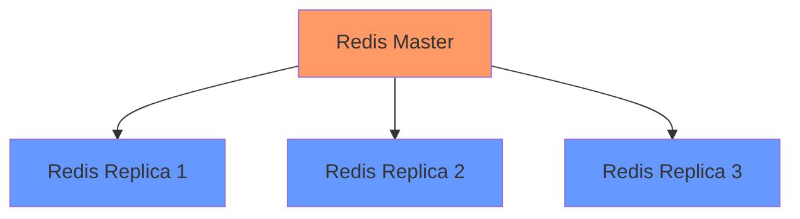
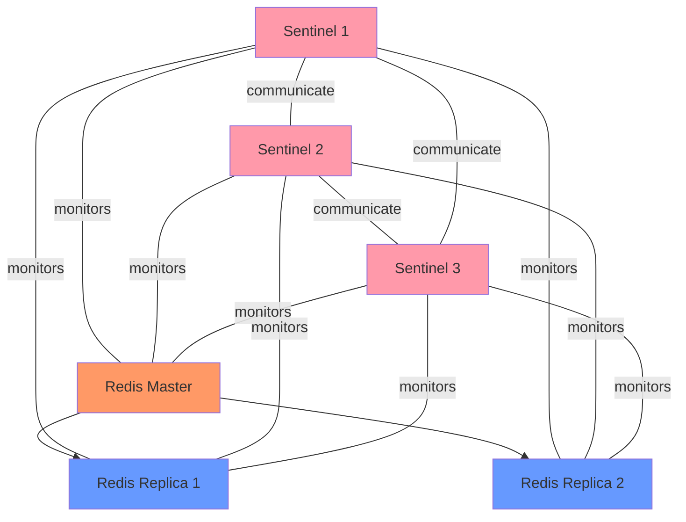
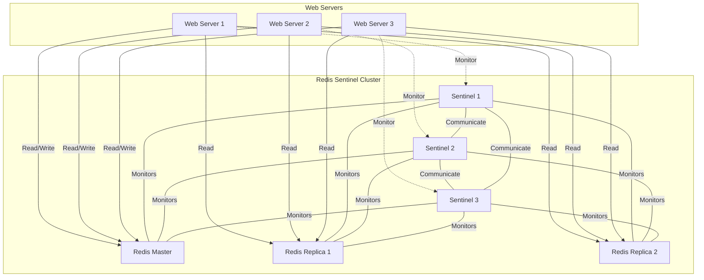

# Redis Sentinel

## Introduction

Redis Sentinel is a distributed system designed to help manage Redis instances, providing high availability for Redis deployments. If you're building applications that rely on Redis as a critical component, understanding Sentinel becomes essential to ensure your system remains operational even when individual Redis instances fail.

Sentinel serves several crucial functions:

- **Monitoring**: Constantly checks if your Redis master and replica instances are working as expected
- **Notification**: Alerts system administrators or other programs about problems in your Redis instances
- **Automatic failover**: If a master is not working properly, Sentinel promotes a replica to master, reconfigures other replicas, and informs clients about the new address
- **Configuration provider**: Clients connect to Sentinels to ask for the address of the current Redis master

Let's dive deeper into Redis Sentinel and learn how to set it up and use it effectively.

## How Redis Sentinel Works

### The Redis Replication Architecture

Before understanding Sentinel, let's quickly review Redis replication:



In a Redis replication setup:
- The master handles writes and distributes data changes to replicas
- Replicas serve read operations and provide redundancy
- If the master fails, manual intervention is needed to promote a replica

This is where Sentinel comes in, automating the failover process.

### Sentinel Architecture

Sentinel instances work together to form a distributed system:



The Sentinel system requires:
- Multiple Sentinel instances for reliability (typically 3 or 5)
- Each Sentinel monitors the master and all replicas
- Sentinels communicate with each other to detect failures and coordinate failovers

## Setting Up Redis Sentinel

### Prerequisites

To follow along, make sure you have:
- Redis installed (version 2.8 or higher)
- Basic knowledge of Redis replication
- Multiple servers or virtual machines for a realistic setup

### Step 1: Set Up Redis Replication

First, let's set up a basic Redis replication with one master and two replicas.

**Master Configuration (redis-master.conf):**

```
port 6379
bind 0.0.0.0
daemonize yes
logfile "/var/log/redis/redis-master.log"
dir "/var/lib/redis"
```

**Replica Configuration (redis-replica-1.conf):**

```
port 6380
bind 0.0.0.0
daemonize yes
logfile "/var/log/redis/redis-replica-1.log"
dir "/var/lib/redis"
replicaof 127.0.0.1 6379
```

**Replica Configuration (redis-replica-2.conf):**

```
port 6381
bind 0.0.0.0
daemonize yes
logfile "/var/log/redis/redis-replica-2.log"
dir "/var/lib/redis"
replicaof 127.0.0.1 6379
```

Start the Redis instances:

```bash
redis-server /path/to/redis-master.conf
redis-server /path/to/redis-replica-1.conf
redis-server /path/to/redis-replica-2.conf
```

Verify that replication is working:

```bash
redis-cli -p 6379 info replication
```

Expected output:

```
# Replication
role:master
connected_slaves:2
slave0:ip=127.0.0.1,port=6380,state=online,offset=42,lag=0
slave1:ip=127.0.0.1,port=6381,state=online,offset=42,lag=0
...
```

### Step 2: Configure Sentinel

Create a Sentinel configuration file for each Sentinel instance.

**Sentinel Configuration (sentinel-1.conf):**

```
port 26379
daemonize yes
logfile "/var/log/redis/sentinel-1.log"
dir "/var/lib/redis"
sentinel monitor mymaster 127.0.0.1 6379 2
sentinel down-after-milliseconds mymaster 5000
sentinel failover-timeout mymaster 60000
sentinel parallel-syncs mymaster 1
```

**Sentinel Configuration (sentinel-2.conf and sentinel-3.conf):**
Create similar files with different port numbers (26380, 26381) and log files.

Let's break down these settings:

- `sentinel monitor mymaster 127.0.0.1 6379 2`: Monitors a master named "mymaster" at IP 127.0.0.1 port 6379, requiring 2 Sentinels to agree before declaring the master down
- `sentinel down-after-milliseconds mymaster 5000`: If the master doesn't respond for 5 seconds, it's considered down
- `sentinel failover-timeout mymaster 60000`: Maximum time for failover process (60 seconds)
- `sentinel parallel-syncs mymaster 1`: Only reconfigure one replica at a time during failover

### Step 3: Start Sentinel Instances

Launch the Sentinel instances:

```bash
redis-sentinel /path/to/sentinel-1.conf
redis-sentinel /path/to/sentinel-2.conf
redis-sentinel /path/to/sentinel-3.conf
```

Verify that Sentinel is running:

```bash
redis-cli -p 26379 info sentinel
```

Expected output:

```
# Sentinel
sentinel_masters:1
sentinel_tilt:0
sentinel_running_scripts:0
sentinel_scripts_queue_length:0
sentinel_simulate_failure_flags:0
master0:name=mymaster,status=ok,address=127.0.0.1:6379,slaves=2,sentinels=3
```

## Testing Failover

Now let's simulate a master failure to see how Sentinel performs automatic failover:

1. Shut down the master:

```bash
redis-cli -p 6379 shutdown
```

2. Watch the Sentinel logs:

```bash
tail -f /var/log/redis/sentinel-1.log
```

You should see something like:

```
1:X 01 Jan 2023 12:00:00.000 # +sdown master mymaster 127.0.0.1 6379
1:X 01 Jan 2023 12:00:00.123 # +odown master mymaster 127.0.0.1 6379 #quorum 2/2
1:X 01 Jan 2023 12:00:00.234 # +new-epoch 1
1:X 01 Jan 2023 12:00:00.345 # +try-failover master mymaster 127.0.0.1 6379
1:X 01 Jan 2023 12:00:00.456 # +vote-for-leader a87c62766d64ac16d0a1f2a1fbdae5490ec8a37c 1
1:X 01 Jan 2023 12:00:00.567 # +elected-leader master mymaster 127.0.0.1 6379
1:X 01 Jan 2023 12:00:00.678 # +failover-state-select-slave master mymaster 127.0.0.1 6379
1:X 01 Jan 2023 12:00:00.789 # +selected-slave slave 127.0.0.1:6380
...
1:X 01 Jan 2023 12:00:01.123 # +failover-end master mymaster 127.0.0.1 6379
1:X 01 Jan 2023 12:00:01.234 # +switch-master mymaster 127.0.0.1 6379 127.0.0.1 6380
```

3. Verify the new master:

```bash
redis-cli -p 6380 info replication
```

Expected output:

```
# Replication
role:master
connected_slaves:1
slave0:ip=127.0.0.1,port=6381,state=online,offset=1234,lag=0
...
```

## Using Sentinel in Your Applications

To make your application Sentinel-aware, you'll need to:

1. Connect to Sentinel instead of directly to Redis
2. Ask Sentinel for the current master
3. Connect to that master
4. Reconnect when necessary

Here's a simple example using Node.js:

```javascript
const redis = require('redis');
const RedisSentinel = require('redis-sentinel');

// Configure Sentinel endpoints
const sentinels = [
  { host: '127.0.0.1', port: 26379 },
  { host: '127.0.0.1', port: 26380 },
  { host: '127.0.0.1', port: 26381 }
];

// Create a sentinel client
const sentinel = new RedisSentinel(sentinels, { name: 'mymaster' });

// Get a Redis client through Sentinel
const client = sentinel.createClient((err, redisClient) => {
  if (err) {
    console.error('Failed to connect to Redis master:', err);
    return;
  }
  
  // Now you can use the redisClient
  redisClient.set('key', 'value', (err, reply) => {
    if (err) {
      console.error('Error setting key:', err);
      return;
    }
    console.log('Set key successfully:', reply);
  });
});

// Handle reconnection events
client.on('reconnecting', (details) => {
  console.log('Reconnecting to Redis...', details);
});
```

For Python applications, you can use the `redis-py` library:

```python
from redis.sentinel import Sentinel

# Configure Sentinel endpoints
sentinel = Sentinel([
    ('127.0.0.1', 26379),
    ('127.0.0.1', 26380),
    ('127.0.0.1', 26381),
], socket_timeout=0.5)

# Get the current master
master = sentinel.master_for('mymaster', socket_timeout=0.5)

# Use the master for writing
master.set('key', 'value')

# Get a replica for reading
replica = sentinel.slave_for('mymaster', socket_timeout=0.5)
value = replica.get('key')
print(f"Read from replica: {value}")
```

## Best Practices

### Sentinel Deployment

1. **Use multiple Sentinels**: Deploy at least 3 Sentinels, preferably 5 for larger deployments
2. **Distribute Sentinels**: Place Sentinels on different physical machines or availability zones
3. **Quorum setting**: Set the quorum to (N/2)+1 where N is the total number of Sentinels
4. **Monitor network partitions**: Be aware that network partitions can cause split-brain situations

### Configuration Tips

1. **Adjust down-after-milliseconds**: Set this based on your network reliability (higher for less reliable networks)
2. **Set parallel-syncs carefully**: Lower values are safer but slower for failover
3. **Use notification-script**: Configure scripts to alert your monitoring systems
4. **Regular testing**: Periodically test failover to ensure it works as expected

### Security Considerations

1. **Use authentication**: Configure both Redis and Sentinel with authentication:

```
requirepass "strong_password"
masterauth "strong_password"

# In Sentinel config
sentinel auth-pass mymaster "strong_password"
```

2. **Network security**: Use firewalls and private networks to restrict access
3. **TLS encryption**: For sensitive data, consider using Redis with TLS support

## Common Issues and Troubleshooting

### Issue: Sentinel won't failover

**Possible causes and solutions:**
- Not enough Sentinels agree the master is down (check quorum setting)
- Network connectivity issues between Sentinels (check network)
- Incorrect configuration (verify all settings)

**Diagnostic commands:**

```bash
redis-cli -p 26379 sentinel masters
redis-cli -p 26379 sentinel ckquorum mymaster
```

### Issue: Split-brain situation

**Possible causes and solutions:**
- Network partition causing multiple masters (adjust timeout settings)
- Too few Sentinels (increase the number of Sentinels)

### Issue: Replicas won't sync with new master

**Possible causes and solutions:**
- Authentication issues (check masterauth setting)
- Network connectivity (check firewall settings)
- Disk space issues (verify available disk space)

## Real-world Example: E-commerce Application

Let's consider a real-world e-commerce application using Redis for caching and session management:



In this architecture:
1. Web servers connect to Sentinel to discover the current master
2. Write operations go to the master, reads can be distributed to replicas
3. If the master fails, Sentinel promotes a replica automatically
4. The application reconnects to the new master

Implementation highlights:
- Session data is stored in Redis with appropriate expiration
- Product catalog cache uses Redis with read operations distributed across replicas
- Shopping cart data is written to the master with high consistency requirements

## Summary

Redis Sentinel provides a robust high availability solution for Redis deployments, enabling:

- Automatic monitoring of Redis instances
- Notification of failures
- Automatic failover when the master becomes unavailable
- Service discovery for clients

By implementing Sentinel properly, you can ensure your Redis-dependent applications remain available even during instance failures.

## Further Learning

To expand your knowledge of Redis Sentinel, consider exploring:

1. Advanced Sentinel configuration options
2. Integration with container orchestration systems like Kubernetes
3. Redis Cluster as an alternative scalability solution
4. Sentinel API for programmatic interaction

## Exercises

1. Set up a local Redis Sentinel environment with one master and two replicas
2. Write a simple script that connects to Sentinel, gets the master, and performs operations
3. Simulate a master failure and observe the failover process
4. Implement a notification script that sends an email when failover occurs
5. Create a monitoring dashboard for your Sentinel setup

With these skills, you'll be well-prepared to build resilient applications that can handle Redis instance failures gracefully.