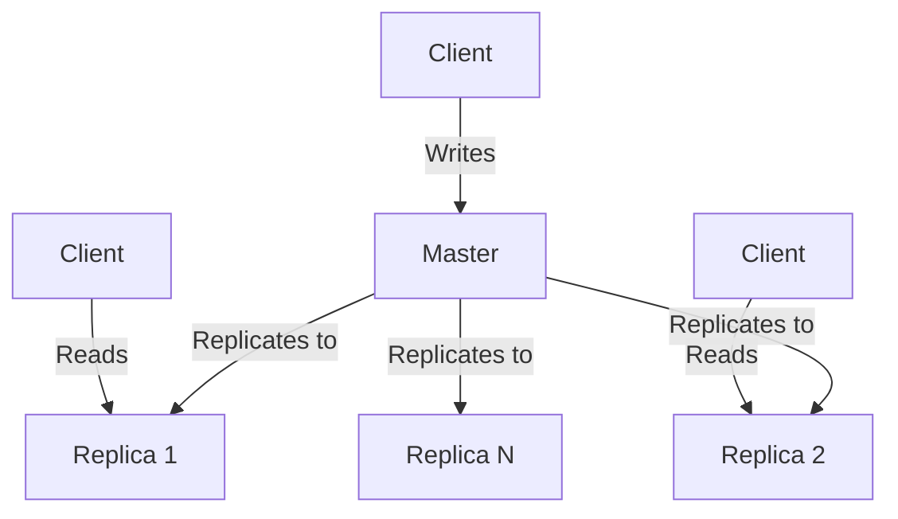
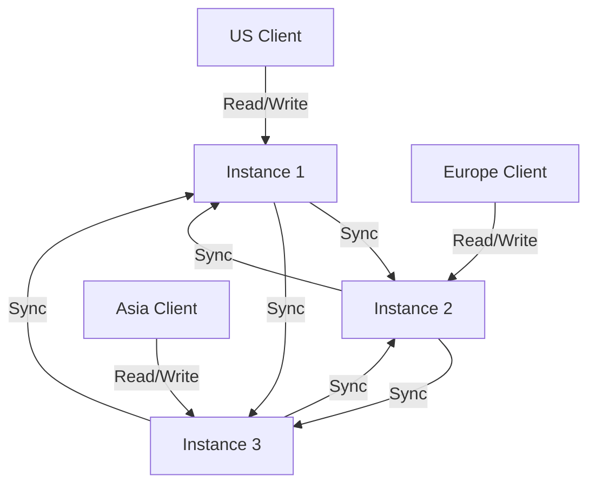

# Redis Active-Active Replication

## Introduction

Redis is a popular in-memory data structure store used as a database, cache, and message broker. While Redis is known for its speed and simplicity, scaling Redis across multiple geographic regions can be challenging. This is where **Redis Active-Active Replication** comes into play.

Active-Active replication (also known as multi-master replication) allows multiple Redis instances to accept write operations simultaneously, with changes being synchronized across all instances. This enables you to build globally distributed applications with low-latency data access regardless of where your users are located.

In this guide, we'll explore how Redis Active-Active replication works, when to use it, and how to implement it in your applications.

## Understanding Redis Replication Models

Before diving into Active-Active replication, let's understand the different replication models in Redis:

### Single-Master Replication (Active-Passive)

In the traditional Redis replication model:

- One Redis instance (master) accepts write operations
- Multiple replica instances synchronize data from the master
- Replicas handle read operations but cannot accept writes



This model works well for scaling reads and providing high availability, but all writes must go through a single master, creating a potential bottleneck and single point of failure for write operations.

### Active-Active Replication

With Active-Active replication:

- Multiple Redis instances accept write operations simultaneously
- Changes from each instance are synchronized to all other instances
- Applications can read from and write to their nearest Redis instance



## Redis Active-Active Implementation: Redis Enterprise

Active-Active replication in Redis is primarily available through **Redis Enterprise**, which is the commercial offering from Redis Inc. In Redis Enterprise, this feature is implemented through **Conflict-Free Replicated Data Types (CRDTs)** and is called **Redis Enterprise Active-Active Geo-Distribution** or **Redis CRDTs**.

### Key Concepts

1. **Conflict-Free Replicated Data Types (CRDTs)**: Special data structures designed to handle concurrent updates without conflicts.

2. **Conflict Resolution**: Automatic resolution of conflicting writes based on predefined rules.

3. **Vector Clocks**: Method for tracking the chronological order of events in a distributed system.

4. **Geo-Distributed Database**: A single logical database instance that spans multiple geographic locations.

## How Redis Active-Active Replication Works

Redis Enterprise implements Active-Active replication through these steps:

1. **Local Operations**: Each instance processes write operations locally.

2. **Metadata Attachment**: Each operation is tagged with metadata (vector clocks).

3. **Asynchronous Propagation**: Changes are asynchronously sent to all other instances.

4. **Conflict Detection**: The system uses vector clocks to detect concurrent operations.

5. **Automatic Resolution**: Conflicting operations are resolved using CRDT algorithms.

### Supported Data Types

Redis Enterprise's Active-Active implementation supports several Redis data types as CRDTs:

- Strings
- Sets
- Sorted Sets
- Lists
- Hashes
- Hyperloglog
- Streams

Each data type uses specific conflict resolution strategies appropriate for its semantics.

## Setting Up Redis Active-Active Replication

Below is a high-level overview of setting up Active-Active replication with Redis Enterprise:

### Prerequisites

- Redis Enterprise software installed on servers in different regions
- Network connectivity between all regions
- DNS setup for each location

### Configuration Steps

1. **Create an Active-Active Database**:

Using the Redis Enterprise UI:

```
1. Navigate to "Databases" and click "Create Database"
2. Select "Redis Database"
3. Enable "Active-Active" option
4. Add participating clusters
5. Configure memory limit, sharding, and other settings
6. Create the database
```

2. **Add Participating Clusters**:

```
1. In the Active-Active settings, click "Add participating cluster"
2. Enter the cluster URL for each geographic location
3. Provide authentication credentials
4. Define replication endpoints
```

3. **Configure Applications**:

Applications should connect to their local Redis Enterprise instance:

```javascript
// Node.js example with ioredis
const Redis = require('ioredis');

// US application connects to US instance
const redisClient = new Redis({
  host: 'us-redis.example.com',
  port: 6379,
  password: 'password'
});

// Europe application connects to Europe instance
const europeRedisClient = new Redis({
  host: 'eu-redis.example.com',
  port: 6379,
  password: 'password'
});
```

## Conflict Resolution in Redis Active-Active

Understanding conflict resolution is crucial when working with Active-Active databases:

### Example: Last-Writer-Wins for Strings

For string data types, Redis Enterprise typically uses a last-writer-wins strategy based on timestamps:

```javascript
// Client 1 (connected to US instance)
await redisClient.set('user:profile', '{"name":"John","country":"US"}');

// Client 2 (connected to EU instance at approximately the same time)
await europeRedisClient.set('user:profile', '{"name":"John","country":"UK"}');

// After synchronization, both instances will contain the same value
// Whichever write had the latest timestamp will win
```

### Example: Set Union for Sets

For sets, the default behavior is to take the union of all operations:

```javascript
// Client 1 (US)
await redisClient.sadd('user:interests', 'programming', 'music');

// Client 2 (EU)
await europeRedisClient.sadd('user:interests', 'travel', 'photography');

// After synchronization, both instances will contain all four values
// Result: ["programming", "music", "travel", "photography"]
```

## Practical Use Cases for Redis Active-Active

### Global Session Management

Manage user sessions across multiple regions:

```javascript
// User logs in at US data center
await redisClient.hset('session:12345', 'user_id', '1001');
await redisClient.hset('session:12345', 'logged_in', 'true');
await redisClient.expire('session:12345', 3600);

// Later, user accesses the application from Europe
// The session data is already available at the Europe instance
const session = await europeRedisClient.hgetall('session:12345');
console.log(session);
// Output: { user_id: '1001', logged_in: 'true' }
```

### Real-time Collaboration

Enable real-time updates across regions:

```javascript
// User in US adds a comment
await redisClient.zadd('document:comments', Date.now(), JSON.stringify({
  user: 'alice',
  text: 'Great document!',
  timestamp: Date.now()
}));

// User in Europe sees the comment almost immediately
const comments = await europeRedisClient.zrange('document:comments', 0, -1);
console.log(comments);
// Output includes the comment from the US user
```

### Global Leaderboards

Maintain consistent game leaderboards globally:

```javascript
// Player in US achieves a high score
await redisClient.zadd('game:leaderboard', 5000, 'player_us');

// Player in Europe achieves another score
await europeRedisClient.zadd('game:leaderboard', 6000, 'player_eu');

// Both regions see the same leaderboard
const leaders = await redisClient.zrevrange('game:leaderboard', 0, 9, 'WITHSCORES');
console.log(leaders);
// Output shows sorted leaderboard with players from both regions
```

## Monitoring and Troubleshooting

### Monitoring Sync Status

Redis Enterprise provides tools to monitor replication:

```
crdb-cli crdb view --crdb-guid <database-guid>
```

This command shows:
- Sync status between instances
- Throughput of replicated operations
- Lag metrics

### Common Issues and Solutions

1. **Network Connectivity Issues**:
   - Ensure firewall rules allow communication between Redis instances
   - Check network latency between regions

2. **Conflict Resolution Confusion**:
   - Review conflict resolution policies for each data type
   - Implement application-level conflict resolution when needed

3. **Performance Degradation**:
   - Monitor network bandwidth between regions
   - Consider using compression for replication traffic

## Performance Considerations

When implementing Active-Active replication, consider:

- **Write Amplification**: Each write operation is replicated to all instances
- **Network Latency**: Affects the time for changes to propagate
- **Conflict Rate**: Higher conflict rates may impact performance
- **Data Types**: Some data types require more complex conflict resolution

## Limitations and Alternatives

### Limitations

- Not available in open-source Redis
- Complex configuration compared to single-master setup
- Additional cost for Redis Enterprise licensing
- Some advanced Redis modules may not support CRDT

### Alternatives

1. **Redis Cluster with Proxies**:
   - Use Redis Cluster in each region
   - Implement proxy layer to route requests

2. **Application-Level Replication**:
   - Manage replication in your application code
   - Write to multiple Redis instances explicitly

3. **Redis Sentinel with Read Replicas**:
   - Master in primary region
   - Read replicas in secondary regions
   - Accept read-only operations in secondary regions

## Summary

Redis Active-Active replication provides a powerful solution for globally distributed applications requiring low-latency data access across multiple regions. By allowing writes to any instance and automatically synchronizing changes, it eliminates the single-master bottleneck of traditional Redis replication.

Key takeaways:

- Active-Active replication allows multiple Redis instances to accept writes simultaneously
- Implementation uses Conflict-Free Replicated Data Types (CRDTs) for automatic conflict resolution
- Primary use cases include global session management, real-time collaboration, and global leaderboards
- Available through Redis Enterprise, not in open-source Redis
- Requires careful consideration of conflict resolution strategies and network performance

## Additional Resources

- Redis Enterprise Documentation
- CRDT Research Papers
- Distributed Systems Books:
  - "Designing Data-Intensive Applications" by Martin Kleppmann
  - "Database Internals" by Alex Petrov

## Exercises

1. Set up a local test environment with two Redis Enterprise instances and configure Active-Active replication between them.

2. Implement a simple chat application that uses Redis Streams with Active-Active replication to share messages across regions.

3. Design a conflict resolution strategy for a custom data structure in your application that requires special handling beyond the built-in CRDT logic.

4. Compare the performance of Active-Active replication versus a single-master setup under various write loads and network conditions.