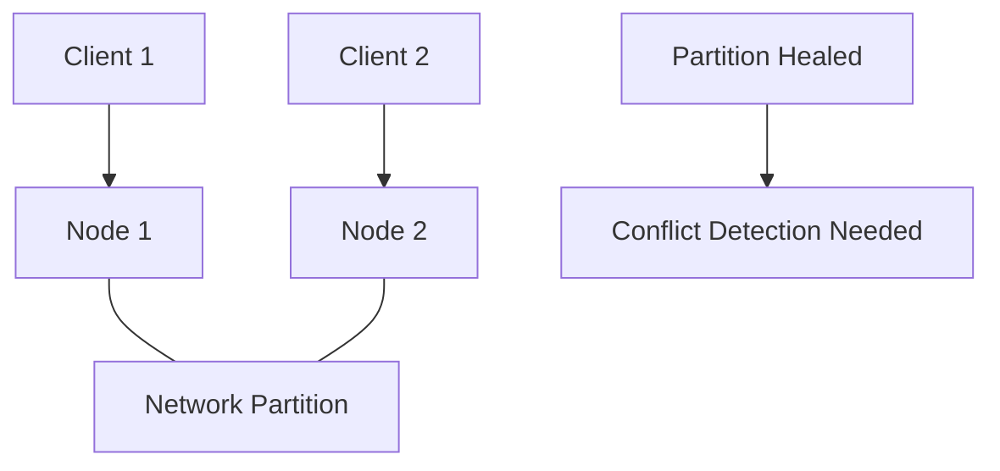

# Redis Conflict Resolution

## Introduction

When working with Redis in distributed environments, conflicts can arise when multiple clients attempt to modify the same data simultaneously. Unlike traditional databases with built-in transaction mechanisms, Redis offers a different approach to handling conflicts. This guide explores how Redis manages conflicting operations and provides strategies for implementing effective conflict resolution in your applications.

## Understanding Redis Conflicts

Redis is designed for speed and simplicity, which influences how it handles concurrent operations. Let's examine when conflicts can occur and Redis's built-in mechanisms for dealing with them.

### When Do Conflicts Occur?

Conflicts in Redis typically happen in scenarios such as:

- Multiple clients updating the same key simultaneously
- Replication lag between primary and replica nodes
- Redis Cluster node failures and partition events
- Applications implementing optimistic locking patterns

### Redis's Default Behavior

By default, Redis follows a "last writer wins" approach, where the most recent operation takes precedence. This simple strategy works well for many use cases but may not be sufficient for applications requiring more sophisticated conflict resolution.

## Basic Conflict Prevention Techniques

Before diving into complex resolution strategies, let's explore Redis commands that can help prevent conflicts in the first place.

### Atomic Operations

Redis provides atomic operations that execute without interruption, reducing the chance of conflicts:

```redis
> INCR counter
(integer) 1

> INCRBY counter 5
(integer) 6

> HINCRBY user:1000 points 50
(integer) 50
```

### Watch-Multi-Exec Pattern

The `WATCH` command enables optimistic locking, allowing you to monitor keys for changes:

```redis
> WATCH inventory:item:123
OK

> GET inventory:item:123
"10"

> MULTI
OK

> DECRBY inventory:item:123 3
QUEUED

> EXEC
(nil)  // Another client modified the key, transaction aborted
```

In this example, the transaction fails because another client modified the watched key before the `EXEC` command was executed.

## Advanced Conflict Resolution Strategies

For applications requiring more sophisticated conflict handling, consider these advanced patterns:

### Versioning and Timestamps

Implement a versioning system to track changes:

```redis
> HSET product:xyz version 1 price 19.99 stock 100
(integer) 3

> WATCH product:xyz
OK

> HGET product:xyz version
"1"

> MULTI
OK

> HINCRBY product:xyz version 1
QUEUED

> HSET product:xyz price 24.99
QUEUED

> EXEC
1) (integer) 2
2) OK
```

### Logical Clocks with Redis

Implement logical clocks (like [Lamport timestamps](https://en.wikipedia.org/wiki/Lamport_timestamp)) to establish causality between operations:

```redis
> HSET document:abc clock 1 content "Initial content" last_editor "user:123"
(integer) 3

// Client 1
> HGET document:abc clock
"1"

// Client 1 updates with higher clock
> HMSET document:abc clock 2 content "Updated content" last_editor "user:123"
OK

// Client 2 attempts update with lower clock (conflict detected)
> HGET document:abc clock
"2"
// Client 2 must merge or discard changes since its clock value is lower
```

### CRDT Implementation with Redis

Conflict-free Replicated Data Types (CRDTs) offer a mathematical approach to conflict resolution. Here's a simple counter CRDT implementation:

```redis
// Initialize counter for two clients
> HSET counter client:1 0 client:2 0
(integer) 2

// Client 1 increments its counter
> HINCRBY counter client:1 5
(integer) 5

// Client 2 increments its counter
> HINCRBY counter client:2 3
(integer) 3

// Get the total counter value (sum of all client counters)
> HGETALL counter
1) "client:1"
2) "5"
3) "client:2"
4) "3"

// Application logic: total = 5 + 3 = 8
```

This approach allows independent updates without conflicts, as each client modifies only its own counter.

## Practical Implementation: Shopping Cart Example

Let's implement a conflict-resistant shopping cart using Redis:

```javascript
// Add item to cart with timestamp
async function addToCart(userId, itemId, quantity, timestamp) {
  const cartKey = `cart:${userId}`;
  const itemKey = `${itemId}`;
  
  // Get current item data if it exists
  const currentData = await redis.hget(cartKey, itemKey);
  
  if (currentData) {
    const parsedData = JSON.parse(currentData);
    
    // Only update if our timestamp is newer
    if (timestamp > parsedData.timestamp) {
      const newData = JSON.stringify({
        quantity,
        timestamp
      });
      await redis.hset(cartKey, itemKey, newData);
      return true;
    }
    return false; // Conflict detected, older timestamp
  } else {
    // New item, no conflict
    const newData = JSON.stringify({
      quantity,
      timestamp
    });
    await redis.hset(cartKey, itemKey, newData);
    return true;
  }
}
```

Client usage example:

```javascript
// Client 1: Add item with current timestamp
const timestamp1 = Date.now();
await addToCart("user123", "item456", 2, timestamp1);

// Client 2: Add same item with newer timestamp
const timestamp2 = Date.now();
await addToCart("user123", "item456", 3, timestamp2);

// Result: quantity will be 3 (from Client 2)
```

## Redis Cluster Considerations

When using Redis Cluster, additional conflict scenarios can arise due to partitioning:



### Cluster Conflict Resolution Strategies

1. **Wait for majority confirmation:**

```javascript
// Configure Redis client with WAIT
const redis = new Redis({
  // ... connection config
  waitForReplication: true,
  minReplicas: 2,
  replicaTimeout: 1000
});

// Usage
await redis.set("key", "value");
await redis.wait(2, 1000); // Wait for 2 replicas to confirm within 1000ms
```

2. **Use logical partitioning for different data types:**

```redis
// Ensure users are assigned to keys that map to the same Redis node
> SET user:{userId}:profile {...}
> SET user:{userId}:settings {...}
> SET user:{userId}:cart {...}
```

## Summary

Redis conflict resolution requires understanding Redis's eventual consistency model and implementing appropriate strategies based on your application's requirements:

1. **For simple cases:** Rely on Redis atomic operations and the "last writer wins" approach
2. **For moderate consistency needs:** Use optimistic locking with WATCH-MULTI-EXEC
3. **For complex scenarios:** Implement versioning, logical clocks, or CRDTs

The best approach depends on your specific requirements for data consistency, performance, and complexity.

## Additional Resources

- [Redis Documentation on Transactions](https://redis.io/topics/transactions)
- [Distributed Systems: Principles and Patterns](https://redis.io/topics/distcache)
- [CRDTs and Distributed Consensus](https://redis.io/topics/cluster-spec)

## Exercises

1. Implement a distributed counter using Redis that handles concurrent increments without conflicts.
2. Create a shopping cart system that merges items when a user works from multiple devices.
3. Design a collaborative editing system that uses timestamps to resolve text conflicts.
4. Implement a leaderboard that correctly handles score updates during network partitions.