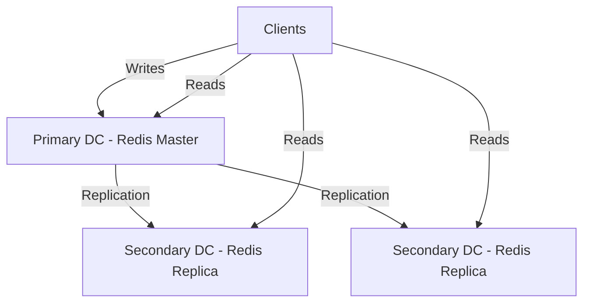
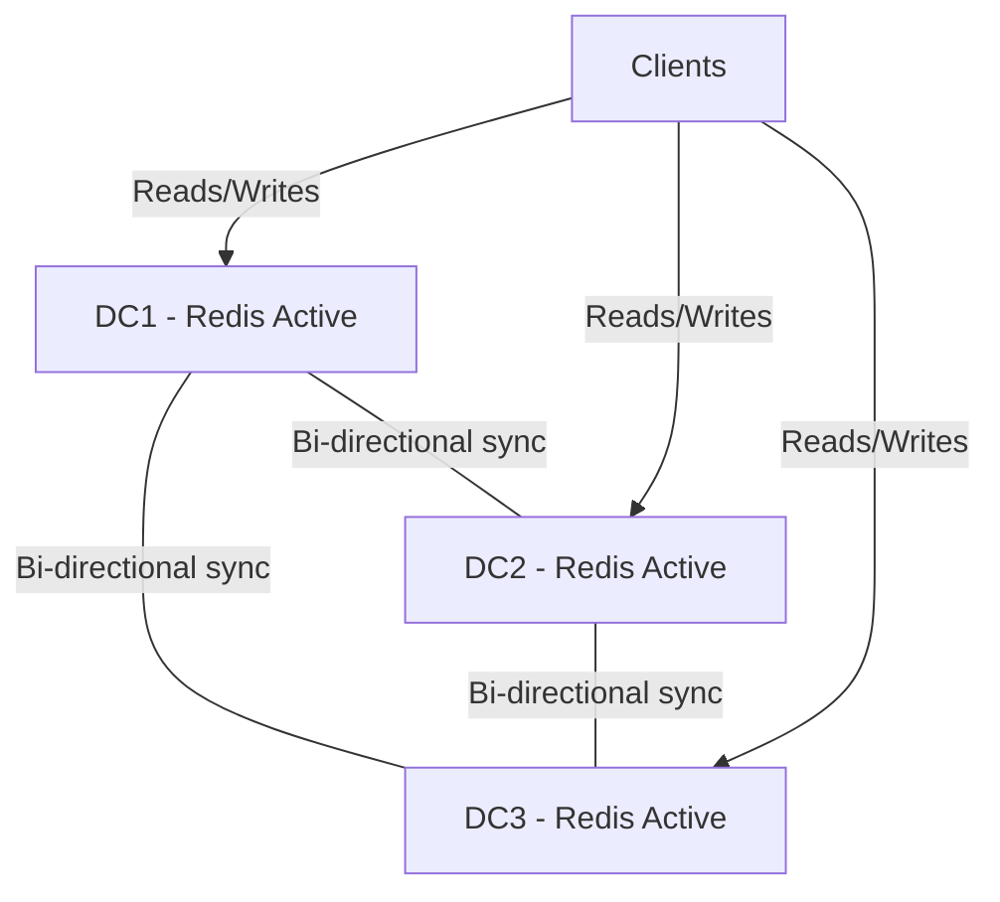
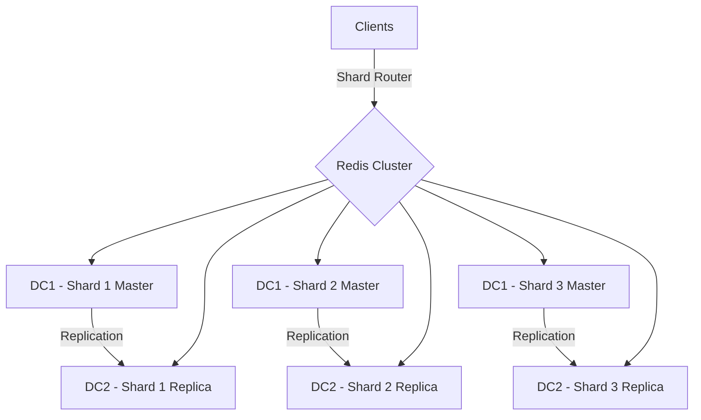

# Redis Multi-DC Operations

## Introduction

Running Redis across multiple data centers (Multi-DC) is a critical consideration for applications that demand high availability, disaster recovery capabilities, and low-latency access for geographically distributed users. In this guide, we'll explore how to effectively implement and manage Redis across multiple data centers, the challenges involved, and the solutions Redis offers to address these challenges.

Multi-DC Redis deployments help with:

- **Disaster Recovery**: If one data center fails, your application can continue operating from another location
- **Geographic Distribution**: Serve data with lower latency by placing Redis instances closer to users
- **High Availability**: Maintain service continuity even during regional outages
- **Data Locality**: Meet data residency requirements by keeping specific data in designated regions

Let's dive into the world of Redis Multi-DC operations and learn how to implement robust, globally distributed Redis systems.

## Redis Multi-DC Architectures

There are several approaches to implementing Redis across multiple data centers:

### 1. Active-Passive Replication

In this setup, one Redis instance in the primary data center serves all write operations, while instances in secondary data centers serve as read-only replicas.



**Advantages**:
- Simple to set up
- Consistent data model

**Disadvantages**:
- Higher write latency for users far from the primary DC
- Single point of failure for write operations

### 2. Active-Active Replication (Redis Enterprise)

Redis Enterprise provides active-active deployment capabilities through its Conflict-Free Replicated Data Types (CRDT) technology, allowing writes to any Redis instance in any data center.



**Advantages**:
- Low latency for local users
- No single point of failure
- Continued operation during network partitions

**Disadvantages**:
- Potential for conflicts that need resolution
- Limited to specific data types that support CRDTs
- Requires Redis Enterprise (commercial)

### 3. Sharded Architecture

Data is partitioned across multiple Redis instances, with each shard replicated to secondary data centers.



**Advantages**:
- Distributes data and load
- Scales horizontally

**Disadvantages**:
- Increased complexity
- Multi-key operations across shards can be challenging

## Implementing Redis Replication Across Data Centers

Let's look at how to set up basic Redis replication across multiple data centers using open-source Redis.

### Step 1: Configure the Redis Master

On your primary Redis instance in Data Center 1:

```bash
# Edit redis.conf on master
$ vim /etc/redis/redis.conf

# Configure the following settings
bind 0.0.0.0
protected-mode yes
requirepass "strong_password"
masterauth "strong_password"
```

### Step 2: Configure Redis Replicas

On your Redis instances in secondary data centers:

```bash
# Edit redis.conf on replicas
$ vim /etc/redis/redis.conf

# Configure the following settings
replicaof <master_ip> 6379
masterauth "strong_password"
requirepass "strong_password"
```

### Step 3: Testing Replication

After restarting all Redis instances, verify that replication is working:

```bash
# On master
$ redis-cli -a "strong_password"
127.0.0.1:6379> INFO replication
# Replication
role:master
connected_replicas:2
replica0:ip=<replica1_ip>,port=6379,state=online,offset=1234,lag=0
replica1:ip=<replica2_ip>,port=6379,state=online,offset=1234,lag=1

# On replica
$ redis-cli -a "strong_password"
127.0.0.1:6379> INFO replication
# Replication
role:slave
master_host:<master_ip>
master_port:6379
master_link_status:up
```

## Handling Multi-DC Challenges

### Latency Management

Network latency between data centers can impact Redis performance. Here are strategies to address this:

1. **Use Redis Pipelining**: Batch multiple commands to reduce round trips

```javascript
// Example in Node.js using ioredis
const pipeline = redis.pipeline();
for (let i = 0; i < 100; i++) {
  pipeline.set(`key${i}`, `value${i}`);
}
pipeline.exec().then(results => {
  console.log('All operations completed');
});
```

2. **Local Caching**: Cache frequently accessed data at the application level

```javascript
// Simple application-level cache
const localCache = {};

async function getData(key) {
  // Check local cache first
  if (localCache[key] && localCache[key].expiry > Date.now()) {
    return localCache[key].value;
  }
  
  // Fetch from Redis if not in cache
  const value = await redis.get(key);
  
  // Update local cache
  localCache[key] = {
    value,
    expiry: Date.now() + 60000 // Cache for 1 minute
  };
  
  return value;
}
```

### Network Partition Handling

Network partitions between data centers require careful planning:

1. **Set Appropriate Timeouts**:

```bash
# On master redis.conf
repl-timeout 60
```

2. **Monitor Replication Lag**:

```bash
# Check replication lag
$ redis-cli -a "strong_password" INFO replication | grep lag
```

3. **Implement Circuit Breakers** in your application:

```javascript
// Example circuit breaker pattern
class RedisCircuitBreaker {
  constructor(redisClient) {
    this.redis = redisClient;
    this.failures = 0;
    this.threshold = 5;
    this.open = false;
    this.resetTimeout = 30000; // 30 seconds
  }
  
  async execute(command, ...args) {
    if (this.open) {
      throw new Error('Circuit is open, Redis commands not allowed');
    }
    
    try {
      const result = await this.redis[command](...args);
      this.failures = 0;
      return result;
    } catch (error) {
      this.failures++;
      
      if (this.failures >= this.threshold) {
        this.open = true;
        setTimeout(() => {
          this.open = false;
          this.failures = 0;
        }, this.resetTimeout);
      }
      
      throw error;
    }
  }
}
```

## Redis Enterprise Multi-DC Features

Redis Enterprise provides advanced Multi-DC capabilities:

### Active-Active Geo-Distribution (CRDTs)

Redis Enterprise's active-active geo-distribution uses CRDTs to automatically resolve conflicts in a deterministic way:

```javascript
// Connect to local Redis Enterprise instance
const Redis = require('ioredis');
const redis = new Redis({
  host: 'localhost',
  port: 6379,
  password: 'password'
});

// Use a CRDT-based data structure (e.g., CRDT Counter)
async function incrementCounter() {
  // Increments will be merged automatically across data centers
  await redis.incr('visitor_count');
}

async function getCount() {
  // Will return the merged count from all data centers
  return await redis.get('visitor_count');
}
```

### Geo-Distributed Redis Cluster

Redis Enterprise allows setting up a single logical cluster across multiple geographic regions:

```bash
# Using rladmin (Redis Enterprise admin tool)
$ rladmin cluster create name multi_dc_cluster username admin@example.com password YourPassword

# Add another cluster to form a geo-distributed deployment
$ rladmin cluster join name multi_dc_cluster username admin@example.com password YourPassword url https://cluster2.example.com:8080
```

## Monitoring Multi-DC Redis

Proper monitoring is essential for Multi-DC Redis deployments:

### Key Metrics to Monitor

1. **Replication Lag**: How far behind replicas are from the master
2. **Cross-DC Latency**: Network latency between data centers
3. **Command Execution Time**: How long commands take to process
4. **Memory Usage**: Across all Redis instances
5. **Connection Count**: Number of client connections

### Monitoring Tools

1. **Redis INFO Command**:

```bash
$ redis-cli -a "password" INFO | grep -E "connected_replicas|master_link_status"
```

2. **Redis Enterprise Metrics** (for enterprise installations):

```bash
$ rladmin info cluster | grep -E "shards|nodes"
```

3. **Prometheus with Redis Exporter**:

```yaml
# prometheus.yml configuration
scrape_configs:
  - job_name: 'redis'
    static_configs:
      - targets: ['redis-exporter-dc1:9121', 'redis-exporter-dc2:9121']
```

## Real-World Use Case: Global Session Store

Let's implement a global session store using Redis across multiple data centers:

```javascript
// Session store implementation with multi-DC support
const express = require('express');
const session = require('express-session');
const RedisStore = require('connect-redis').default;
const Redis = require('ioredis');
const app = express();

// Create Redis client based on user's region
function getRedisClient(userRegion) {
  const redisConfig = {
    // Choose the closest Redis instance based on user region
    'us-east': { host: 'redis-us-east.example.com', port: 6379 },
    'us-west': { host: 'redis-us-west.example.com', port: 6379 },
    'eu-central': { host: 'redis-eu.example.com', port: 6379 },
    'asia-east': { host: 'redis-asia.example.com', port: 6379 }
  };
  
  // Default to US East if region unknown
  const config = redisConfig[userRegion] || redisConfig['us-east'];
  return new Redis({
    host: config.host,
    port: config.port,
    password: 'your_password',
    retryStrategy: (times) => {
      // Exponential backoff with max 2 seconds
      return Math.min(times * 100, 2000);
    }
  });
}

// Middleware to determine user's region (simplified)
app.use((req, res, next) => {
  // In real-world, use IP geolocation service
  const ipAddress = req.ip;
  // This is a simplified example - use a proper geolocation service
  req.userRegion = ipAddress.startsWith('192.168') ? 'us-east' : 'eu-central';
  next();
});

// Configure session with dynamic Redis client
app.use((req, res, next) => {
  // Create Redis client for user's region
  const redisClient = getRedisClient(req.userRegion);
  
  // Create new session store for this request
  const store = new RedisStore({ client: redisClient });
  
  // Configure session middleware
  session({
    store: store,
    secret: 'your_session_secret',
    resave: false,
    saveUninitialized: false,
    cookie: { secure: true, maxAge: 86400000 } // 1 day
  })(req, res, next);
});

app.get('/', (req, res) => {
  // Session is now stored in the closest Redis DC
  req.session.visits = (req.session.visits || 0) + 1;
  res.send(`Visit count: ${req.session.visits} (Served from: ${req.userRegion})`);
});

app.listen(3000, () => {
  console.log('Server running on port 3000');
});
```

## Best Practices for Redis Multi-DC

1. **Use Redis Enterprise** for mission-critical applications requiring active-active replication

2. **Implement Proper Timeout Handling**:

```javascript
// Example with timeout handling
const Redis = require('ioredis');
const redis = new Redis({
  host: 'redis.example.com',
  port: 6379,
  password: 'your_password',
  connectTimeout: 10000,
  commandTimeout: 5000,
  retryStrategy: (times) => {
    const delay = Math.min(times * 50, 2000);
    return delay;
  }
});

// Handle timeout errors
redis.on('error', (err) => {
  if (err.message.includes('timeout')) {
    console.error('Redis command timed out, failing over...');
    // Implement failover logic
  }
});
```

3. **Design for Eventual Consistency** when using multi-master setups:

```javascript
// Example: Last-write-wins strategy with timestamps
async function updateUserProfile(userId, profile) {
  const now = Date.now();
  const key = `user:${userId}`;
  
  // Get current timestamp if exists
  const currentTimestamp = await redis.hget(key, 'timestamp') || 0;
  
  // Only update if our data is newer
  if (now > currentTimestamp) {
    await redis.hmset(key, {
      ...profile,
      timestamp: now
    });
    return true;
  }
  
  return false; // Update rejected (someone else updated more recently)
}
```

4. **Implement Smart Routing** to direct clients to the closest Redis instance

5. **Regular Backup Across All Data Centers**:

```bash
# Set up RDB backups on all instances
$ redis-cli -a "password" CONFIG SET dir /backup
$ redis-cli -a "password" CONFIG SET dbfilename redis-backup.rdb
$ redis-cli -a "password" BGSAVE
```

## Summary

Redis Multi-DC operations provide powerful capabilities for building globally distributed, highly available Redis deployments. In this guide, we've explored:

- Different Multi-DC architectures (active-passive, active-active, sharded)
- How to implement basic replication across data centers
- Advanced features available in Redis Enterprise
- Techniques for handling latency and network partitions
- A real-world example of a global session store
- Best practices for reliable Multi-DC Redis operations

By properly implementing Redis across multiple data centers, you can achieve greater resilience, lower latency for global users, and better disaster recovery capabilities for your applications.

## Additional Resources

- [Redis Replication Documentation](https://redis.io/topics/replication)
- [Redis Enterprise Multi-DC](https://redis.com/redis-enterprise/technology/active-active-geo-distribution/)
- [Redis Cluster Tutorial](https://redis.io/topics/cluster-tutorial)

## Exercises

1. Set up a basic master-replica Redis configuration between two machines to simulate cross-DC replication.

2. Implement a simple circuit breaker pattern for Redis commands in your preferred programming language.

3. Create a Redis cluster with shards distributed across multiple "simulated" data centers (can be done on a single machine with different ports).

4. Design an application that intelligently routes Redis commands to the nearest Redis instance based on latency measurements.

5. Implement a caching strategy that combines local application caching with Redis to minimize cross-DC traffic.