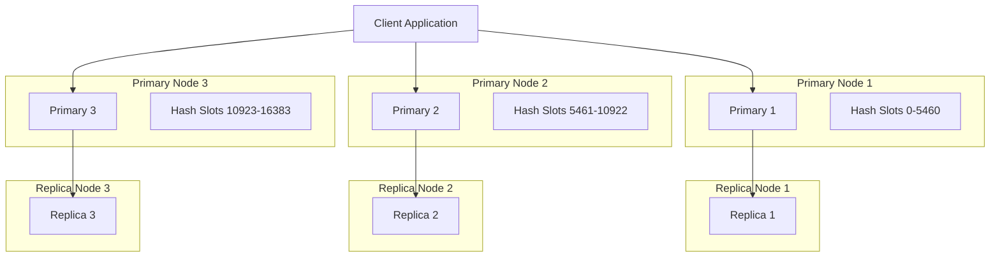

# Redis Cluster

Redis Cluster is a distributed implementation of Redis that allows you to spread your data across multiple Redis instances, providing improved performance, scalability, and high availability. This guide will help you understand how Redis Cluster works, when to use it, and how to set it up.

## Introduction to Redis Cluster

As your application grows, a single Redis instance might not be sufficient to handle your data volume or provide the reliability you need. Redis Cluster solves these challenges by:

- **Horizontally scaling** your Redis setup across multiple machines
- **Automatically sharding** your data across multiple nodes
- Providing **high availability** through replica nodes
- Continuing to operate when some nodes fail (**fault tolerance**)

## How Redis Cluster Works

Redis Cluster partitions your data into different slots. Let's understand the core concepts:

### Key Concepts

1. **Sharding**: Data is automatically split across multiple nodes
2. **Hash Slots**: Redis Cluster uses 16,384 hash slots to organize data
3. **Node Roles**: Primary nodes handle write operations, while replica nodes provide redundancy
4. **Automatic Failover**: If a primary node fails, a replica takes over automatically

### Cluster Topology

Redis Cluster typically consists of at least 3 primary nodes (masters) and their replicas:



## Setting Up Redis Cluster

Let's walk through setting up a minimal Redis Cluster with three primary nodes and three replica nodes.

### Prerequisites

- Redis version 3.0 or higher
- Six Redis instances on one or more machines
- Network connectivity between all nodes

### Step 1: Configure Redis Instances

Create a configuration file for each Redis instance. Here's an example for the first node (`redis-7000.conf`):

```
port 7000
cluster-enabled yes
cluster-config-file nodes-7000.conf
cluster-node-timeout 5000
appendonly yes
```

Create similar configuration files for all six nodes, changing the port numbers (7000, 7001, 7002, 7003, 7004, 7005).

### Step 2: Start Redis Instances

Launch each Redis server with its respective configuration:

```bash
redis-server ./redis-7000.conf
redis-server ./redis-7001.conf
redis-server ./redis-7002.conf
redis-server ./redis-7003.conf
redis-server ./redis-7004.conf
redis-server ./redis-7005.conf
```

### Step 3: Create the Cluster

Use the `redis-cli` utility to create the cluster:

```bash
redis-cli --cluster create 127.0.0.1:7000 127.0.0.1:7001 127.0.0.1:7002 \
                          127.0.0.1:7003 127.0.0.1:7004 127.0.0.1:7005 \
                          --cluster-replicas 1
```

This command sets up a cluster with the first three nodes as primaries and the last three as replicas.

Sample output:

```
>>> Performing hash slots allocation on 6 nodes...
Master[0] -> Slots 0 - 5460
Master[1] -> Slots 5461 - 10922
Master[2] -> Slots 10923 - 16383
Adding replica 127.0.0.1:7003 to 127.0.0.1:7000
Adding replica 127.0.0.1:7004 to 127.0.0.1:7001
Adding replica 127.0.0.1:7005 to 127.0.0.1:7002
>>> Trying to optimize slaves allocation for anti-affinity
[OK] All 16384 slots covered.
```

## Interacting with Redis Cluster

Working with a Redis Cluster is slightly different from a standalone Redis instance.

### Connect to the Cluster

Using `redis-cli` in cluster mode:

```bash
redis-cli -c -p 7000
```

The `-c` flag enables cluster mode, which automatically redirects commands to the appropriate node.

### Basic Operations

Redis Cluster supports most Redis commands. Let's try some basic operations:

```bash
# Set a key
127.0.0.1:7000> SET user:1000 "John Doe"
-> Redirected to slot [8008] located at 127.0.0.1:7001
OK

# Get a key
127.0.0.1:7001> GET user:1000
"John Doe"

# Set another key
127.0.0.1:7001> SET product:2000 "Laptop"
-> Redirected to slot [5474] located at 127.0.0.1:7001
OK
```

Notice how Redis Cluster redirects your commands to the appropriate node based on the key's hash slot.

## Hash Slots and Key Distribution

Redis Cluster uses a hash slot algorithm to determine where keys are stored:

```
HASH_SLOT = CRC16(key) mod 16384
```

### Hash Tags for Related Data

If you need multiple keys to be stored on the same node (for multi-key operations), you can use hash tags:

```bash
127.0.0.1:7000> SET {user:1000}:name "John"
127.0.0.1:7000> SET {user:1000}:email "john@example.com"
```

Keys with the same hash tag (text between `{}`) will be assigned to the same hash slot and therefore the same node.

## Cluster Management Commands

Redis provides several commands to manage and inspect your cluster:

### Check Cluster Status

```bash
127.0.0.1:7000> CLUSTER INFO
cluster_state:ok
cluster_slots_assigned:16384
cluster_slots_ok:16384
cluster_slots_pfail:0
cluster_slots_fail:0
cluster_known_nodes:6
cluster_size:3
cluster_current_epoch:6
cluster_my_epoch:1
cluster_stats_messages_ping_sent:115
cluster_stats_messages_pong_sent:121
```

### List Cluster Nodes

```bash
127.0.0.1:7000> CLUSTER NODES
a5b544a2939d9b31ffd6a77a624a55052f842266 127.0.0.1:7001@17001 master - 0 1590839805759 2 connected 5461-10922
7c8c69dfab4ef6200ac8eae9f7b38e7fd0ef1464 127.0.0.1:7005@17005 slave 6a7709abbe018e87e23b4a5933b5d89d674f0e2e 0 1590839806767 6 connected
6a7709abbe018e87e23b4a5933b5d89d674f0e2e 127.0.0.1:7002@17002 master - 0 1590839805000 3 connected 10923-16383
36991703d006313b56b62cbe13a24f34efca40d0 127.0.0.1:7000@17000 myself,master - 0 1590839805000 1 connected 0-5460
c396cafc79a0c168b3d640e5f8be89dabf7a8918 127.0.0.1:7003@17003 slave 36991703d006313b56b62cbe13a24f34efca40d0 0 1590839806000 4 connected
66944cc83022e1d01bd99de992e0f1eb497d3b96 127.0.0.1:7004@17004 slave a5b544a2939d9b31ffd6a77a624a55052f842266 0 1590839806267 5 connected
```

## High Availability and Failover

One of the key benefits of Redis Cluster is automatic failover when a primary node goes down.

### Simulating a Failover

Let's see what happens when a primary node fails:

1. First, check which node is handling a specific key:

```bash
127.0.0.1:7000> SET testkey "value"
-> Redirected to slot [8539] located at 127.0.0.1:7001
OK
```

2. Shut down the responsible primary node (7001 in this case):

```bash
redis-cli -p 7001 SHUTDOWN
```

3. Try to access the key again:

```bash
127.0.0.1:7000> GET testkey
-> Redirected to slot [8539] located at 127.0.0.1:7004
"value"
```

Notice how the replica (7004) has been promoted to primary and now handles requests for that key!

## Scaling Redis Cluster

As your data grows, you might need to add more nodes to your cluster.

### Adding a New Node

To add a new primary node:

1. Start a new Redis instance with cluster mode enabled
2. Add it to the cluster:

```bash
redis-cli --cluster add-node 127.0.0.1:7006 127.0.0.1:7000
```

3. Rebalance the cluster to assign slots to the new node:

```bash
redis-cli --cluster reshard 127.0.0.1:7000
```

### Adding a Replica Node

To add a new replica:

```bash
redis-cli --cluster add-node 127.0.0.1:7007 127.0.0.1:7000 --cluster-slave --cluster-master-id <node-id>
```

Replace `<node-id>` with the ID of the primary node this replica should replicate.

## Practical Example: Session Store

Let's see how Redis Cluster can be used as a distributed session store for a web application:

```javascript
const Redis = require('ioredis');

// Create a Redis Cluster client
const cluster = new Redis.Cluster([
  { port: 7000, host: '127.0.0.1' },
  { port: 7001, host: '127.0.0.1' },
  { port: 7002, host: '127.0.0.1' }
]);

// Store a session
async function storeSession(sessionId, userData) {
  await cluster.hmset(`session:${sessionId}`, userData);
  await cluster.expire(`session:${sessionId}`, 3600); // Expire in 1 hour
}

// Retrieve a session
async function getSession(sessionId) {
  return await cluster.hgetall(`session:${sessionId}`);
}

// Example usage
async function example() {
  await storeSession('abc123', {
    username: 'user123',
    lastLogin: Date.now(),
    preferences: JSON.stringify({ theme: 'dark' })
  });
  
  const session = await getSession('abc123');
  console.log('Retrieved session:', session);
}

example().catch(console.error);
```

## Limitations and Considerations

While Redis Cluster offers many benefits, it's important to be aware of its limitations:

1. **Multi-key operations**: Operations involving multiple keys are only supported when all keys belong to the same hash slot
2. **Transaction limitations**: `WATCH` command is not supported in cluster mode
3. **Complexity**: Managing a cluster is more complex than a single Redis instance
4. **Memory overhead**: Cluster management requires additional memory
5. **Network traffic**: Nodes communicate frequently, generating internal network traffic

## Monitoring Redis Cluster

For production use, you should monitor your Redis Cluster's health and performance:

1. Use the `CLUSTER INFO` command to check cluster state
2. Monitor memory usage on all nodes
3. Track Redis metrics like operations per second, latency, etc.
4. Consider using tools like Redis Sentinel alongside Cluster for enhanced monitoring

## Summary

Redis Cluster is a powerful solution for scaling Redis horizontally, providing:

- Data sharding across multiple nodes
- High availability through primary-replica architecture
- Automatic failover when nodes go down
- The ability to scale out as your data grows

By spreading your data across multiple nodes, Redis Cluster allows you to overcome the memory limitations of a single server and build more robust Redis-based applications.

## Further Learning

To deepen your understanding of Redis Cluster:

1. Experiment with setting up a local cluster
2. Practice adding and removing nodes
3. Simulate node failures to observe automatic failover
4. Implement a simple application that uses Redis Cluster

## Exercise

1. Set up a minimal Redis Cluster with three primary nodes and no replicas
2. Write a script that stores 10,000 keys in the cluster
3. Use the `CLUSTER KEYSLOT` command to check how keys are distributed
4. Add a fourth primary node and observe how the cluster rebalances

## Additional Resources

- [Redis Cluster Specification](https://redis.io/topics/cluster-spec)
- [Redis Cluster Tutorial](https://redis.io/topics/cluster-tutorial)
- [Redis Cluster Command Reference](https://redis.io/commands#cluster)