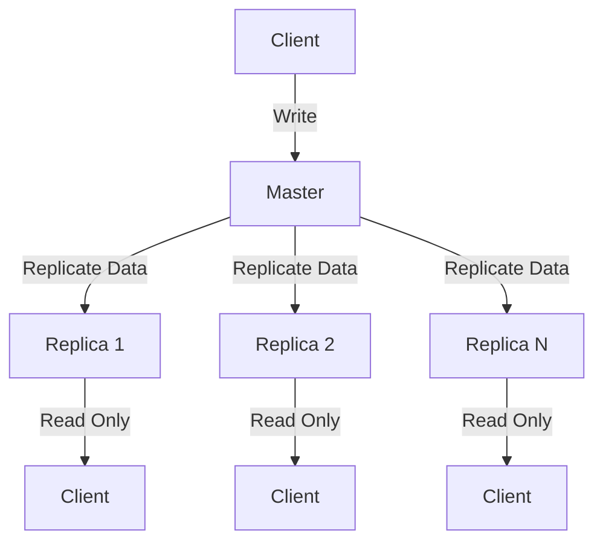

# Redis Replication

## Introduction

Redis replication is a powerful feature that allows you to create copies (replicas) of a Redis server. This capability is fundamental for building robust, scalable, and highly available Redis deployments. In this guide, we'll explore how Redis replication works, why it's essential, and how to implement it in your applications.

## What is Redis Replication?

Redis replication is a master-slave architecture where data from one Redis server (the master) is copied to one or more Redis servers (the replicas). This provides several benefits:

- **Data redundancy**: Protect against data loss if the master server fails
- **Read scalability**: Distribute read operations across multiple replicas
- **Geographical distribution**: Place replicas closer to users for faster response times
- **Backup operations**: Perform backups using replicas without affecting the master's performance

## How Redis Replication Works

Redis replication operates on an asynchronous basis, meaning the master doesn't wait for replica acknowledgment before responding to clients. Here's a simplified view of the process:



The replication process involves these steps:

1. **Initial Synchronization**: When a replica connects to a master, it performs a full synchronization
2. **Ongoing Replication**: After the initial sync, the master sends a stream of commands to keep replicas updated
3. **Automatic Reconnection**: If the connection is lost, replicas automatically try to reconnect

## Setting Up Redis Replication

Setting up basic replication in Redis is surprisingly simple. Here's how to do it:

### Method 1: Configuration File

In the replica's `redis.conf` file, add:

```
replicaof <master-ip> <master-port>
```

For example:

```
replicaof 192.168.1.100 6379
```

### Method 2: Redis CLI Command

Alternatively, you can use the `REPLICAOF` command (or `SLAVEOF` in older Redis versions):

```
redis-cli> REPLICAOF 192.168.1.100 6379
```

### Verifying Replication Status

You can check if replication is working using the `INFO replication` command:

```
redis-cli> INFO replication
```

Output on the master:

```
# Replication
role:master
connected_replicas:1
slave0:ip=192.168.1.101,port=6379,state=online,offset=1751,lag=0
```

Output on the replica:

```
# Replication
role:slave
master_host:192.168.1.100
master_port:6379
master_link_status:up
master_last_io_seconds_ago:5
master_sync_in_progress:0
```

## Practical Examples

Let's walk through some practical examples of Redis replication in action.

### Example 1: Basic Master-Replica Setup

1. Start a Redis server as the master:

```bash
redis-server --port 6379
```

2. Start another Redis server as a replica:

```bash
redis-server --port 6380 --replicaof 127.0.0.1 6379
```

3. Test the replication by writing to the master and reading from the replica:

```bash
# Write to master
redis-cli -p 6379> SET mykey "Hello Replication"
OK

# Read from replica
redis-cli -p 6380> GET mykey
"Hello Replication"

# Try writing to replica
redis-cli -p 6380> SET anotherkey "test"
(error) READONLY You can't write against a read only replica.
```

### Example 2: Node.js Application Using Replication

Here's how you might structure a Node.js application to take advantage of Redis replication:

```javascript
const Redis = require('ioredis');

// Create connections to Redis servers
const master = new Redis({
  port: 6379,
  host: '192.168.1.100'
});

const replica = new Redis({
  port: 6379,
  host: '192.168.1.101'
});

async function example() {
  // Write operations go to master
  await master.set('user:1001', JSON.stringify({
    name: 'John Doe',
    email: 'john@example.com'
  }));
  
  // Read operations can be distributed to replicas
  const userData = await replica.get('user:1001');
  console.log('User data:', JSON.parse(userData));
  
  // For critical reads where you need the most up-to-date data
  // you might still want to read from the master
  const criticalData = await master.get('last_system_update');
  console.log('Critical data:', criticalData);
}

example().catch(console.error);
```

## Advanced Replication Features

### Read-Only Replicas

By default, replicas are read-only, preventing clients from writing data directly to them. This can be changed, but it's generally not recommended:

```
replica-read-only yes
```

### Replica Persistence

Replicas can have persistence enabled or disabled independently of the master:

```
appendonly yes
```

### Replication Timeouts

You can configure how long a master waits before considering a replica disconnected:

```
repl-timeout 60
```

### Partial Resynchronization

Redis supports partial resynchronization after disconnections, avoiding full resyncs when possible:

```
repl-backlog-size 1mb
```

## Common Challenges and Solutions

### Replication Lag

In high-traffic scenarios, replicas may fall behind the master. To monitor this:

```
redis-cli> INFO replication
```

Look for the `lag` value in the output. To reduce lag:
- Ensure adequate network bandwidth
- Use more powerful hardware for replicas
- Consider using Redis Enterprise for advanced replication features

### Handling Failover

Basic Redis replication doesn't automatically promote a replica if the master fails. For automatic failover, you'll need Redis Sentinel or Redis Cluster, which we'll cover in separate guides.

### Security Considerations

To secure the replication connection, consider:

1. Using a replication password:

```
masterauth <password>
```

2. Enabling TLS for replication traffic (Redis 6.0+):

```
tls-replication yes
```

## Best Practices

1. **Always have multiple replicas** for critical production environments
2. **Place replicas in different failure domains** (different servers, racks, or data centers)
3. **Monitor replication lag** to ensure replicas aren't falling too far behind
4. **Test failover procedures** regularly
5. **Consider using Redis Sentinel** for automated failover
6. **Balance read operations** across replicas for optimal performance

## Summary

Redis replication is a foundational feature for building reliable and scalable Redis deployments. It provides data redundancy, improved read performance, and enables geographical distribution of your Redis infrastructure.

In this guide, we've covered:
- Basic concepts of Redis replication
- How to set up master-replica architecture
- Practical examples of replication in action
- Advanced configuration options
- Common challenges and solutions
- Best practices for production environments

## Practice Exercises

1. Set up a Redis master with two replicas on your local machine using different ports
2. Write a script that writes data to the master and verifies it can be read from the replicas
3. Simulate a master failure by stopping the master process and observe what happens to the replicas
4. Configure a replica with a different persistence mode than the master and observe the differences

## Additional Resources

- [Redis Documentation on Replication](https://redis.io/topics/replication)
- [Redis High Availability Architecture](https://redis.io/topics/sentinel)
- [Redis Cluster Tutorial](https://redis.io/topics/cluster-tutorial)

In the next guide, we'll explore Redis Sentinel, which builds on replication to provide automated failover capabilities for your Redis deployment.