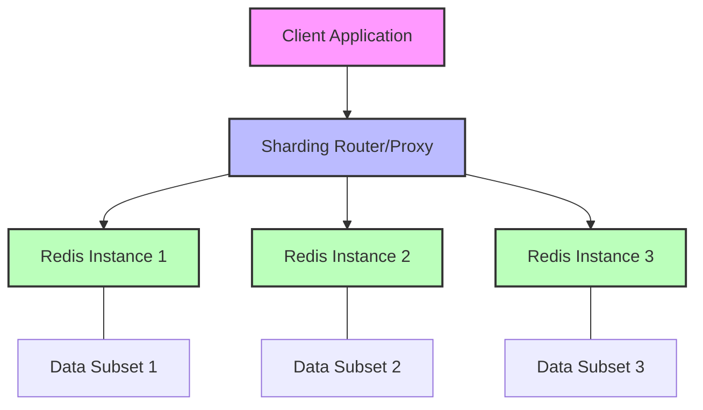
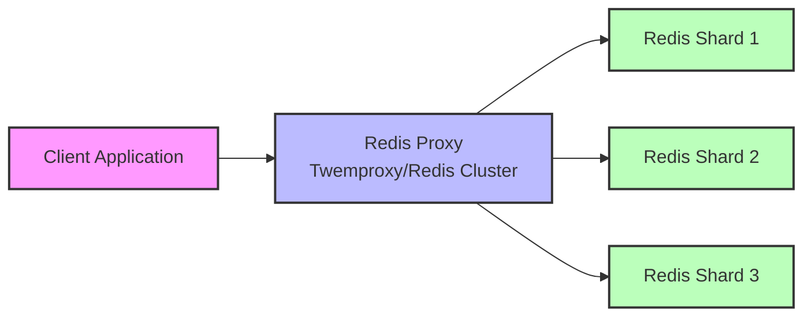
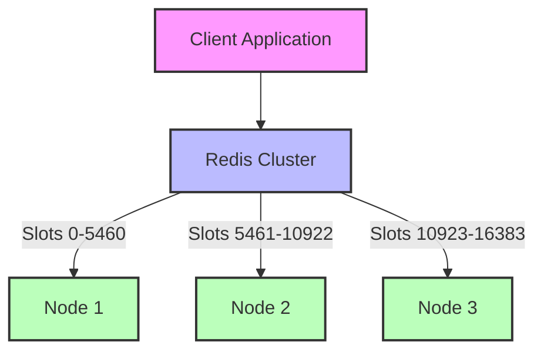

# Redis Sharding

## Introduction

When your Redis instance starts hitting performance limits or memory constraints, sharding becomes an essential scaling technique. Redis sharding is the process of splitting your data across multiple Redis instances, allowing you to overcome the memory limitations of a single server and improve overall throughput.

In this tutorial, we'll explore various Redis sharding strategies, implementation approaches, and best practices to help you scale your Redis infrastructure effectively.

## What is Sharding?

Sharding is a database partitioning technique that distributes data across multiple servers. Instead of storing all your data in a single Redis instance, you split it across multiple instances, with each instance storing a subset of your data.



### Benefits of Redis Sharding

- **Increased Memory Capacity**: Overcome the memory limitations of a single server
- **Improved Performance**: Distribute workload across multiple servers
- **Higher Availability**: System can continue operating even if some shards fail
- **Horizontal Scalability**: Add more shards as your data and traffic grow

## Sharding Strategies

Let's explore the main strategies for implementing Redis sharding:

### 1. Client-Side Sharding

In client-side sharding, the application code determines which Redis instance to use for each key.

#### Implementation Example

```javascript
const Redis = require('ioredis');

// Create connections to multiple Redis instances
const redisNodes = [
  new Redis(6379, 'redis-node-1'),
  new Redis(6379, 'redis-node-2'),
  new Redis(6379, 'redis-node-3'),
];

// Simple hash function to determine which shard to use
function getShardIndex(key) {
  let hash = 0;
  for (let i = 0; i < key.length; i++) {
    hash += key.charCodeAt(i);
  }
  return hash % redisNodes.length;
}

// Function to set a key-value pair
function set(key, value) {
  const shardIndex = getShardIndex(key);
  return redisNodes[shardIndex].set(key, value);
}

// Function to get a value by key
function get(key) {
  const shardIndex = getShardIndex(key);
  return redisNodes[shardIndex].get(key);
}

// Usage example
async function main() {
  await set('user:1000', JSON.stringify({ name: 'John', age: 30 }));
  const userData = await get('user:1000');
  console.log('Retrieved data:', userData);
}

main().catch(console.error);
```

#### Pros and Cons

✅ **Pros**:
- Simple to implement
- No additional infrastructure required
- Full control over sharding logic

❌ **Cons**:
- Sharding logic must be implemented in every application
- Difficult to rebalance data when adding or removing nodes
- No support for operations across multiple keys on different shards

### 2. Proxy-Based Sharding

In proxy-based sharding, a middleware service sits between your application and Redis instances, routing commands to the appropriate shard.



Popular proxy solutions include:
- **Twemproxy (nutcracker)**: A lightweight proxy developed by Twitter
- **Redis Cluster Proxy**: An official proxy for Redis Cluster

#### Example: Using Twemproxy

First, set up Twemproxy with a configuration file (`nutcracker.yml`):

```yaml
redis_sharded:
  listen: 127.0.0.1:6390
  hash: fnv1a_64
  distribution: ketama
  auto_eject_hosts: true
  redis: true
  servers:
    - 127.0.0.1:6379:1 redis1
    - 127.0.0.1:6380:1 redis2
    - 127.0.0.1:6381:1 redis3
```

Then, your application can connect to Twemproxy as if it were a single Redis instance:

```javascript
const Redis = require('ioredis');

// Connect to Twemproxy instead of directly to Redis instances
const redis = new Redis(6390, '127.0.0.1');

async function main() {
  // Set a key (Twemproxy will route to the appropriate shard)
  await redis.set('user:1000', JSON.stringify({ name: 'John', age: 30 }));
  
  // Get the value (Twemproxy knows which shard has this key)
  const userData = await redis.get('user:1000');
  console.log('Retrieved data:', userData);
}

main().catch(console.error);
```

#### Pros and Cons

✅ **Pros**:
- Application code doesn't need to handle sharding logic
- Consistent sharding across different applications
- Can add or remove Redis nodes without changing application code

❌ **Cons**:
- Additional infrastructure component to maintain
- Potential single point of failure
- Some Redis commands might not be supported
- Performance overhead from the proxy layer

### 3. Redis Cluster

Redis Cluster is the official sharding solution built into Redis (available since Redis 3.0). It provides automatic data sharding across multiple Redis nodes with high availability.

#### Setting up Redis Cluster

Here's a basic example of setting up a three-node Redis Cluster:

1. Create configuration files for each node:

`redis-6379.conf`:
```
port 6379
cluster-enabled yes
cluster-config-file nodes-6379.conf
cluster-node-timeout 5000
appendonly yes
```

`redis-6380.conf`:
```
port 6380
cluster-enabled yes
cluster-config-file nodes-6380.conf
cluster-node-timeout 5000
appendonly yes
```

`redis-6381.conf`:
```
port 6381
cluster-enabled yes
cluster-config-file nodes-6381.conf
cluster-node-timeout 5000
appendonly yes
```

2. Start each Redis instance:

```bash
redis-server ./redis-6379.conf
redis-server ./redis-6380.conf
redis-server ./redis-6381.conf
```

3. Create the cluster:

```bash
redis-cli --cluster create 127.0.0.1:6379 127.0.0.1:6380 127.0.0.1:6381
```

4. Connect to the cluster and use it:

```javascript
const Redis = require('ioredis');

// Create a Redis Cluster client
const cluster = new Redis.Cluster([
  { host: '127.0.0.1', port: 6379 },
  { host: '127.0.0.1', port: 6380 },
  { host: '127.0.0.1', port: 6381 }
]);

async function main() {
  // Set a key (cluster will route to the appropriate node)
  await cluster.set('user:1000', JSON.stringify({ name: 'John', age: 30 }));
  
  // Get the value
  const userData = await cluster.get('user:1000');
  console.log('Retrieved data:', userData);
}

main().catch(console.error);
```

#### How Redis Cluster Works

Redis Cluster doesn't use consistent hashing but a different form of sharding called hash slots. There are 16384 hash slots in Redis Cluster, and each key is mapped to a slot using CRC16(key) % 16384.



Redis Cluster also provides:
- Automatic failover
- Cluster reconfiguration when nodes are added or removed
- Replication (each master can have multiple replicas)

#### Pros and Cons

✅ **Pros**:
- Built into Redis
- Automatic failover and replication
- Supports most Redis commands
- Good performance (no proxy overhead)
- Automatic resharding capabilities

❌ **Cons**:
- More complex to set up and maintain
- Multi-key operations are only supported when all keys are in the same hash slot
- Client must be cluster-aware
- Minimum of three master nodes required

## Hash Tags: Controlling Key Distribution

In Redis Cluster, you can ensure that multiple keys are stored in the same hash slot using hash tags. Any substring within curly braces `{...}` in a key name is used to calculate the hash slot.

```javascript
// These keys will be in the same hash slot because they share the same hash tag {user:1000}
cluster.set('{user:1000}:name', 'John');
cluster.set('{user:1000}:age', '30');
cluster.set('{user:1000}:email', 'john@example.com');

// Now you can use multi-key operations like MGET
const [name, age, email] = await cluster.mget(
  '{user:1000}:name',
  '{user:1000}:age',
  '{user:1000}:email'
);
```

## Practical Examples

### Example 1: Sharded Counters

Imagine you're building a social media platform and need to track view counts for millions of posts:

```javascript
// Using Redis Cluster
const cluster = new Redis.Cluster([
  { host: '127.0.0.1', port: 6379 },
  { host: '127.0.0.1', port: 6380 },
  { host: '127.0.0.1', port: 6381 }
]);

// Increment view count for a post
async function incrementViewCount(postId) {
  const count = await cluster.incr(`post:${postId}:views`);
  return count;
}

// Get top 10 posts by view count (challenging with sharding!)
// This requires application-level aggregation
async function getTopPosts(postIds) {
  // Get view counts for all posts
  const pipeline = cluster.pipeline();
  
  postIds.forEach(postId => {
    pipeline.get(`post:${postId}:views`);
  });
  
  const results = await pipeline.exec();
  
  // Process results and sort
  const postViews = postIds.map((postId, index) => {
    const [err, views] = results[index];
    return {
      postId,
      views: err ? 0 : parseInt(views || 0)
    };
  });
  
  return postViews.sort((a, b) => b.views - a.views).slice(0, 10);
}
```

### Example 2: Sharded Rate Limiting

Implement a distributed rate limiter to restrict API calls per user:

```javascript
const cluster = new Redis.Cluster([
  { host: '127.0.0.1', port: 6379 },
  { host: '127.0.0.1', port: 6380 },
  { host: '127.0.0.1', port: 6381 }
]);

// Check if a user has exceeded their rate limit
async function checkRateLimit(userId, limit = 100, windowSeconds = 3600) {
  const key = `ratelimit:${userId}`;
  
  // Get current count
  const count = await cluster.get(key) || 0;
  
  if (count >= limit) {
    return false; // Rate limit exceeded
  }
  
  // Increment counter and set expiry
  await cluster.multi()
    .incr(key)
    .expire(key, windowSeconds)
    .exec();
  
  return true; // Request allowed
}

// Usage in an API endpoint
async function handleApiRequest(userId, requestData) {
  const allowed = await checkRateLimit(userId);
  
  if (!allowed) {
    return { error: 'Rate limit exceeded. Try again later.' };
  }
  
  // Process the API request...
  return { success: true, data: 'API response' };
}
```

## Best Practices for Redis Sharding

1. **Choose the right sharding strategy** based on your application's needs:
   - Use Redis Cluster for most production workloads
   - Consider client-side sharding for simpler use cases
   - Use proxy-based solutions when you need to support non-cluster-aware clients

2. **Plan your key space** carefully:
   - Use key prefixes consistently
   - Be mindful of hash tags in Redis Cluster
   - Group related data that needs multi-key operations

3. **Monitor shard distribution**:
   - Ensure data is distributed evenly across shards
   - Watch for "hot spots" (shards with higher load)

4. **Plan for growth**:
   - Start with more shards than you currently need
   - Set up procedures for adding new shards
   - Test resharding operations before doing them in production

5. **Handle cross-shard operations**:
   - Minimize operations that need data from multiple shards
   - Implement application-level aggregation when necessary
   - Consider denormalizing data to avoid cross-shard operations

## Common Challenges and Solutions

### Challenge 1: Resharding Data

When adding or removing nodes, you need to redistribute data across the cluster.

**Solution**:
- With Redis Cluster, use the `redis-cli --cluster reshard` command
- For client-side sharding, implement a migration script that reads from the old shard and writes to the new one
- Consider using consistent hashing to minimize the keys that need to be moved

### Challenge 2: Cross-Shard Transactions

Redis transactions (MULTI/EXEC) cannot span multiple shards.

**Solution**:
- Design your key space to keep related data on the same shard using hash tags
- Implement application-level transactions with compensation logic for failures
- Consider using Redis Streams for complex workflows across shards

### Challenge 3: Managing Hot Spots

Some shards may receive more traffic than others, creating performance bottlenecks.

**Solution**:
- Monitor key access patterns and redistribution data if necessary
- Use Redis replication to create read replicas for hot shards
- Consider implementing application-level caching for frequently accessed data

## Summary

Redis sharding is a powerful technique for scaling your Redis infrastructure horizontally. We've covered several approaches to implement sharding:

1. **Client-side sharding**: Simple but requires managing sharding logic in your application
2. **Proxy-based sharding**: Uses middleware like Twemproxy to route requests
3. **Redis Cluster**: The official Redis solution with automatic failover

Each approach has its own advantages and challenges, so choose the one that best fits your application's requirements and your team's operational expertise.

Remember that while sharding solves scaling issues, it also introduces complexity, especially for operations that need to access data across multiple shards. Plan your data model and access patterns carefully to minimize these challenges.

## Further Learning Resources

1. [Redis Cluster Specification](https://redis.io/topics/cluster-spec)
2. [Redis Cluster Tutorial](https://redis.io/topics/cluster-tutorial)
3. [Twemproxy Documentation](https://github.com/twitter/twemproxy)
4. [Redis Cluster Proxy](https://github.com/RedisLabs/redis-cluster-proxy)

## Practice Exercises

1. Set up a three-node Redis Cluster on your local machine and experiment with adding and resharding keys.
2. Implement a client-side sharding strategy with a consistent hashing algorithm.
3. Build a simple leaderboard application that works efficiently with sharded Redis.
4. Create a rate-limiting system that scales across multiple Redis instances.
5. Benchmark the performance difference between a single Redis instance and a sharded setup for your specific workload.