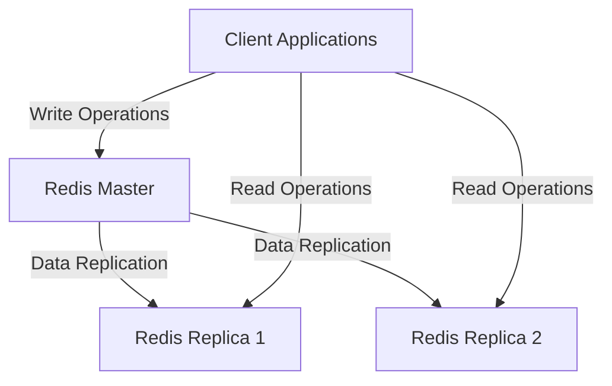
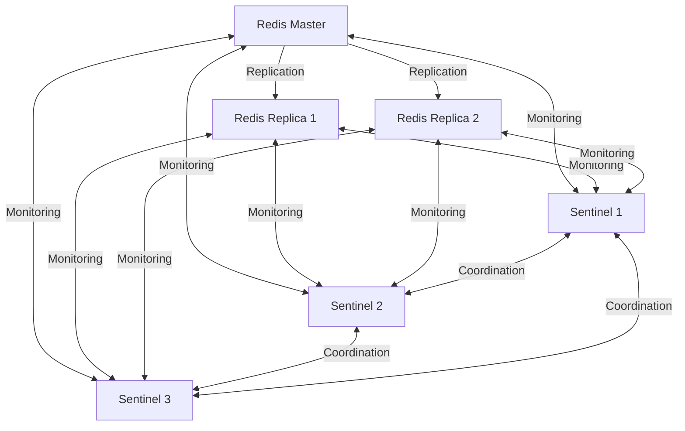
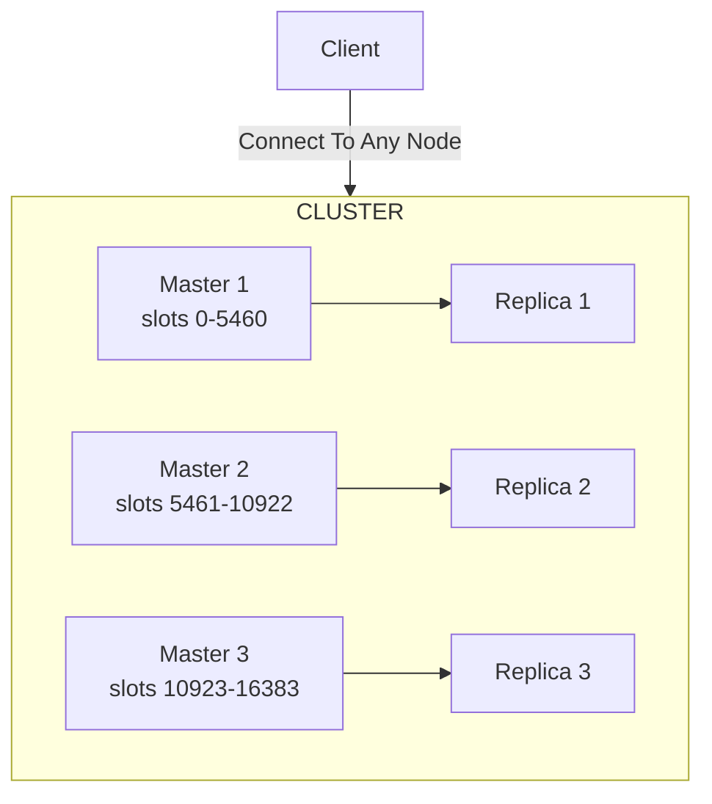

# Redis High Availability

## Introduction

High Availability (HA) is a critical aspect of any production-ready Redis deployment. In simple terms, high availability ensures that your Redis service remains operational even when individual components fail. This is especially important for applications where Redis serves as a primary database or a critical caching layer.

In this guide, we'll explore Redis high availability options, including replication, Redis Sentinel, and Redis Cluster. You'll learn how to implement each approach and understand when to use one over the others.

## Why Redis High Availability Matters

Before diving into implementation details, let's understand why high availability matters for Redis:

1. **Downtime Prevention**: Ensures your application continues to function even if a Redis instance fails
2. **Data Safety**: Prevents data loss through replication and persistence strategies
3. **Scalability**: Allows your Redis deployment to handle growing workloads
4. **Client Continuity**: Provides transparent failover so clients can continue operations with minimal disruption

## Redis Replication: The Foundation of High Availability

At the core of Redis high availability is replication - a mechanism where data from one Redis server (the master) is copied to one or more Redis servers (the replicas).

### How Redis Replication Works

Redis replication operates with a simple master-replica model:



### Setting Up Basic Redis Replication

Let's set up a basic master-replica configuration:

1. Start two Redis instances on different ports (assuming Redis is installed):

```bash
# Start master on port 6379 (default)
redis-server --port 6379

# Start replica on port 6380
redis-server --port 6380
```

2. Connect the replica to the master:

```bash
# Connect to the replica
redis-cli -p 6380

# Configure it to replicate from the master
127.0.0.1:6380> REPLICAOF 127.0.0.1 6379
OK
```

3. Verify the replication status:

```bash
# On the master
redis-cli -p 6379 INFO replication
```

Output:
```
# Replication
role:master
connected_replicas:1
slave0:ip=127.0.0.1,port=6380,state=online,offset=42,lag=0
...
```

### Testing Replication

Now, let's see replication in action:

```bash
# On the master
redis-cli -p 6379 SET mykey "Hello Redis HA"
```

Check the key on the replica:

```bash
redis-cli -p 6380 GET mykey
```

Output:
```
"Hello Redis HA"
```

### Limitations of Basic Replication

While basic replication provides data redundancy, it has limitations:

1. **No Automatic Failover**: If the master fails, manual intervention is needed to promote a replica
2. **Split-Brain Risk**: Without proper management, multiple nodes might act as masters
3. **Client Reconfiguration**: Clients need to be reconfigured to use the new master after failover

This is where Redis Sentinel comes in.

## Redis Sentinel: Automated Failover for Redis

Redis Sentinel provides monitoring, notification, and automatic failover capabilities for Redis deployments.

### How Sentinel Works

Sentinel monitors Redis master and replica instances and performs automatic failover when the master becomes unavailable:



### Setting Up Redis Sentinel

1. First, set up a Redis replication environment (as shown earlier)

2. Create a Sentinel configuration file (sentinel.conf):

```
port 26379
sentinel monitor mymaster 127.0.0.1 6379 2
sentinel down-after-milliseconds mymaster 5000
sentinel failover-timeout mymaster 60000
sentinel parallel-syncs mymaster 1
```

Key configuration parameters:
- `monitor mymaster 127.0.0.1 6379 2`: Monitor a master called "mymaster" at 127.0.0.1:6379, requiring 2 sentinels to agree for failover
- `down-after-milliseconds mymaster 5000`: Consider the master down after 5 seconds of non-responsiveness
- `failover-timeout mymaster 60000`: Maximum time for failover
- `parallel-syncs mymaster 1`: Number of replicas to reconfigure simultaneously during failover

3. Start three Sentinel instances for quorum:

```bash
redis-sentinel sentinel1.conf
redis-sentinel sentinel2.conf
redis-sentinel sentinel3.conf
```

### Testing Sentinel Failover

To test failover, shut down the master:

```bash
redis-cli -p 6379 DEBUG sleep 30
# Or kill the master process
```

Sentinel will:
1. Detect the master is down
2. Select a replica to promote
3. Reconfigure other replicas to use the new master
4. Notify clients of the topology change (through client libraries)

You'll see output like this in Sentinel logs:

```
+sdown master mymaster 127.0.0.1 6379
+odown master mymaster 127.0.0.1 6379 #quorum 2/2
+try-failover master mymaster 127.0.0.1 6379
+vote-for-leader 5adf007f6bd5d4c17c7b41d37b33d8a9a1a097be 1
+elected-leader master mymaster 127.0.0.1 6379
+failover-state-select-slave master mymaster 127.0.0.1 6379
+selected-slave slave 127.0.0.1:6380
+failover-state-send-slaveof-noone slave 127.0.0.1:6380
+failover-state-wait-promotion slave 127.0.0.1:6380
+promoted-slave slave 127.0.0.1:6380
+failover-state-reconf-slaves master mymaster 127.0.0.1 6379
+slave-reconf-sent slave 127.0.0.1:6381
+slave-reconf-inprog slave 127.0.0.1:6381
+slave-reconf-done slave 127.0.0.1:6381
+failover-end master mymaster 127.0.0.1 6379
```

### Connecting Applications to Sentinel

Applications connect to Sentinel rather than directly to Redis, allowing Sentinel to direct them to the current master:

```javascript
// Node.js example with ioredis
const Redis = require('ioredis');

// Create a client connecting to sentinels
const redis = new Redis({
  sentinels: [
    { host: '127.0.0.1', port: 26379 },
    { host: '127.0.0.1', port: 26380 },
    { host: '127.0.0.1', port: 26381 }
  ],
  name: 'mymaster' // The name of the master set
});

// Use redis as normal
redis.set('key', 'value');
redis.get('key').then(result => console.log(result));
```

## Redis Cluster: Sharding and High Availability

While Sentinel addresses high availability, it doesn't solve scaling challenges. Redis Cluster solves both by partitioning data across multiple nodes.

### How Redis Cluster Works

Redis Cluster divides the keyspace into 16,384 hash slots and distributes them across master nodes:



Key features:
- **Sharding**: Data is automatically partitioned across nodes
- **Built-in Replication**: Each master has at least one replica
- **Automatic Failover**: Replicas are promoted if masters fail
- **No Central Authority**: Nodes communicate in a peer-to-peer fashion

### Setting Up Redis Cluster

1. Create configuration files for each node:

`node1.conf`:
```
port 7001
cluster-enabled yes
cluster-config-file node1.conf
cluster-node-timeout 5000
appendonly yes
```

Create similar files for nodes 2-6, changing the port numbers (7002-7006).

2. Start all Redis instances:

```bash
redis-server ./node1.conf
redis-server ./node2.conf
# ... and so on for all nodes
```

3. Create the cluster (Redis 5.0+):

```bash
redis-cli --cluster create 127.0.0.1:7001 127.0.0.1:7002 127.0.0.1:7003 \
  127.0.0.1:7004 127.0.0.1:7005 127.0.0.1:7006 \
  --cluster-replicas 1
```

This creates a cluster with 3 masters and 3 replicas (one replica per master).

4. Verify the cluster status:

```bash
redis-cli -p 7001 cluster info
redis-cli -p 7001 cluster nodes
```

### Using Redis Cluster in Applications

When using Redis Cluster, clients need to be cluster-aware:

```javascript
// Node.js example with ioredis
const Redis = require('ioredis');

// Create a Redis Cluster client
const cluster = new Redis.Cluster([
  { port: 7001, host: '127.0.0.1' },
  { port: 7002, host: '127.0.0.1' },
  { port: 7003, host: '127.0.0.1' }
]);

// Use as normal
cluster.set('key', 'value');
cluster.get('key').then(result => console.log(result));
```

### Key Distribution and Multi-Key Operations

Redis Cluster uses hash slots to determine where keys are stored. This affects multi-key operations:

```bash
# These keys will likely be on different nodes
redis-cli -p 7001 -c SET key1 "value1"
redis-cli -p 7001 -c SET key2 "value2"

# This will fail if the keys are on different nodes
redis-cli -p 7001 -c MGET key1 key2
```

To ensure keys are stored on the same node, use hash tags:

```bash
# These keys will be on the same node due to the {user} hash tag
redis-cli -p 7001 -c SET "{user}:name" "John"
redis-cli -p 7001 -c SET "{user}:email" "john@example.com"

# This will succeed
redis-cli -p 7001 -c MGET "{user}:name" "{user}:email"
```

## Choosing the Right High Availability Solution

When deciding between replication, Sentinel, and Cluster:

| Feature | Replication | Sentinel | Cluster |
|---------|------------|----------|---------|
| Automatic Failover | ❌ | ✅ | ✅ |
| Horizontal Scaling | ❌ | ❌ | ✅ |
| Setup Complexity | Low | Medium | High |
| Client Complexity | Low | Medium | High |
| Multi-Key Operations | ✅ | ✅ | Limited |

Choose:
- **Basic Replication**: For simple read scaling with manual failover
- **Sentinel**: When you need automatic failover but not sharding
- **Cluster**: When you need both high availability and horizontal scaling

## Persistence and High Availability

High availability doesn't guarantee data safety without persistence. Configure Redis persistence alongside HA:

```
# Add to your Redis configuration
appendonly yes
appendfsync everysec
```

Options:
- **RDB**: Point-in-time snapshots (faster recovery, potential data loss)
- **AOF**: Append-only file (minimal data loss, slower recovery)
- **Combined**: Both methods together (balanced approach)

## Practical Example: E-commerce Session Store

Let's implement a high-availability Redis solution for an e-commerce website's session store:

### Requirements:
- High availability for user sessions
- Fast reads for product pages
- No horizontal scaling needed initially

### Solution: Redis with Sentinel

```javascript
// Node.js example for an e-commerce session store
const express = require('express');
const session = require('express-session');
const Redis = require('ioredis');
const RedisStore = require('connect-redis')(session);

const app = express();

// Create Redis client with Sentinel
const redisClient = new Redis({
  sentinels: [
    { host: '127.0.0.1', port: 26379 },
    { host: '127.0.0.1', port: 26380 },
    { host: '127.0.0.1', port: 26381 }
  ],
  name: 'mymaster'
});

// Use Redis for session storage
app.use(session({
  store: new RedisStore({ client: redisClient }),
  secret: 'your-secret-key',
  resave: false,
  saveUninitialized: false,
  cookie: { secure: process.env.NODE_ENV === 'production' }
}));

// Handle session data
app.get('/api/cart', (req, res) => {
  // Get or initialize cart
  req.session.cart = req.session.cart || [];
  res.json(req.session.cart);
});

app.post('/api/cart/add', (req, res) => {
  const { productId, quantity } = req.body;
  
  // Initialize cart if needed
  req.session.cart = req.session.cart || [];
  
  // Add item to cart
  req.session.cart.push({ productId, quantity });
  
  res.json(req.session.cart);
});

app.listen(3000, () => {
  console.log('Server running on port 3000');
});
```

## Best Practices for Redis High Availability

1. **Use Odd Number of Sentinel Instances**: For proper quorum decisions
2. **Distribute Across Failure Domains**: Place nodes on different servers/racks/data centers
3. **Monitor All Components**: Set up monitoring for Redis, Sentinel, and the network
4. **Test Failover Regularly**: Practice makes perfect
5. **Configure Timeout Parameters Carefully**: Avoid both premature and delayed failover
6. **Implement Connection Pooling**: Reduce connection overhead
7. **Enable Persistence**: Combine high availability with data durability
8. **Backup Regularly**: High availability is not a substitute for backups

## Common Pitfalls and Troubleshooting

### Split-Brain Syndrome
Problem: Multiple masters active simultaneously
Solution: Proper quorum settings in Sentinel/Cluster and reliable networking

### Replication Lag
Problem: Replicas falling behind the master
Solution: Monitor `master_repl_offset` and `slave_repl_offset`, optimize network, and reduce write load

### Network Partitions
Problem: Nodes can't communicate due to network issues
Solution: Use multiple network paths and proper timeout configurations

### Memory Management
Problem: Redis running out of memory
Solution: Set appropriate `maxmemory` and eviction policies

## Summary

Redis offers multiple complementary approaches to high availability:

1. **Basic Replication**: Provides data redundancy and read scaling
2. **Redis Sentinel**: Adds automatic monitoring, notification, and failover
3. **Redis Cluster**: Combines high availability with horizontal scaling through sharding

The best solution depends on your specific requirements for reliability, scalability, and operational complexity. Most production deployments should implement at least Redis Sentinel to ensure continuous operation.

## Exercises and Further Learning

### Exercises

1. Set up a Redis master with two replicas and verify replication works by writing to the master and reading from replicas
2. Configure Redis Sentinel and practice triggering a manual failover
3. Create a small Redis Cluster and experiment with key distribution using hash tags
4. Write a simple application that connects to Redis via Sentinel and handles failover events

### Further Resources

- [Redis Documentation on Replication](https://redis.io/topics/replication)
- [Redis Sentinel Documentation](https://redis.io/topics/sentinel)
- [Redis Cluster Tutorial](https://redis.io/topics/cluster-tutorial)
- [Redis Persistence Guide](https://redis.io/topics/persistence)
- Books:
  - "Redis in Action" by Josiah L. Carlson
  - "Redis Essentials" by Maxwell Dayvson Da Silva and Hugo Lopes Tavares

Remember, high availability is not a set-it-and-forget-it feature but requires ongoing monitoring, testing, and maintenance to ensure it works when you need it most.