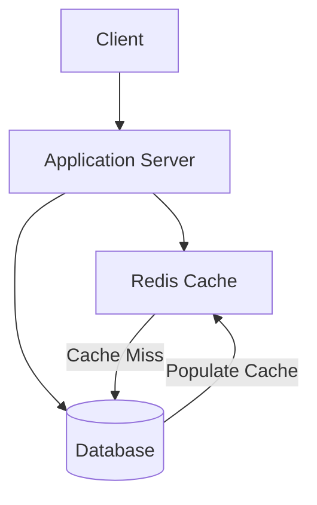
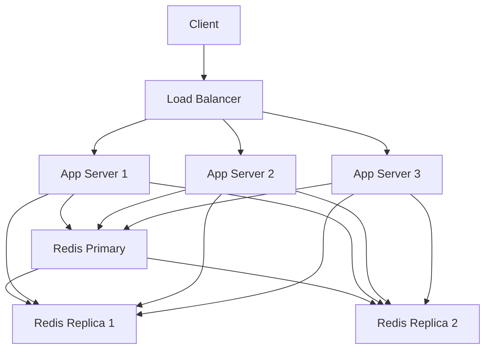
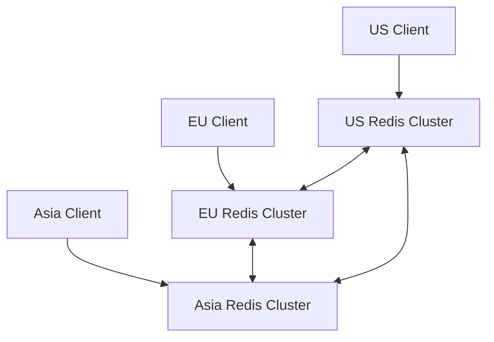

# Redis Scaling

## Introduction

As your application grows, the demands on your Redis instance will increase. More users mean more data, more operations, and potentially slower response times. Redis scaling strategies help you maintain performance while handling this growth.

In this tutorial, we'll explore various methods to scale Redis, from simple configuration optimizations to advanced deployment architectures. By the end, you'll understand how to keep your Redis infrastructure running smoothly even as your application's demands increase.

## Why Scale Redis?

Before diving into scaling techniques, let's understand when and why you might need to scale:

- **Memory limitations**: When your dataset exceeds available RAM
- **CPU bottlenecks**: When a single CPU core can't handle the processing load
- **Network saturation**: When network I/O becomes a limiting factor
- **High availability requirements**: When you need failover capabilities
- **Geographic distribution**: When users are spread across different regions

## Vertical Scaling (Scaling Up)

Vertical scaling means increasing the resources of your existing Redis server.

### Memory Optimization

Redis is an in-memory database, so memory usage is often the first bottleneck you'll encounter.

#### Memory Usage Analysis

Before optimizing, check your current memory usage:

```bash
redis-cli info memory
```

This command returns detailed memory statistics:

```
# Memory
used_memory:1032024
used_memory_human:1007.84K
used_memory_rss:9297920
used_memory_rss_human:8.87M
mem_fragmentation_ratio:9.01
...
```

#### Data Structure Optimization

Choose efficient data structures for your use case:

```javascript
// Less efficient for small numbers
client.hset("user:123", "visits", "1");

// More efficient for simple counters
client.incr("user:123:visits");
```

#### Memory-Saving Options

Configure Redis to use less memory:

```bash
# In redis.conf
maxmemory 2gb
maxmemory-policy allkeys-lru
```

Then enable data compression:

```bash
# Enable compression for strings larger than 20 bytes
redis-cli config set activedefrag yes
redis-cli config set active-defrag-threshold-lower 10
redis-cli config set active-defrag-threshold-upper 100
```

### Hardware Upgrade

When optimizations aren't enough, upgrade your server's hardware:

- Increase RAM (most important for Redis)
- Upgrade to faster CPUs
- Use faster storage (SSDs for persistence)
- Improve network bandwidth

## Horizontal Scaling (Scaling Out)

When a single Redis instance isn't enough, you can distribute your data across multiple instances.

### Redis Replication

Replication creates read replicas that duplicate your primary Redis instance.

#### Setting Up a Replica

On the replica server:

```bash
# In redis.conf of the replica
replicaof primary_ip primary_port
```

Or at runtime:

```bash
redis-cli replicaof 192.168.1.100 6379
```

Verify replication status:

```bash
redis-cli info replication
```

Example output:

```
# Replication
role:replica
master_host:192.168.1.100
master_port:6379
master_link_status:up
...
```

#### Read Scaling with Replicas

Use replicas to offload read operations:

```javascript
const Redis = require('ioredis');

// Primary for writes
const primaryClient = new Redis({
  host: 'primary.redis.example.com',
  port: 6379
});

// Replica for reads
const replicaClient = new Redis({
  host: 'replica.redis.example.com',
  port: 6379
});

// Use primary for writes
await primaryClient.set('user:123:status', 'active');

// Use replica for reads
const status = await replicaClient.get('user:123:status');
```

### Redis Partitioning (Sharding)

Partitioning divides your data across multiple Redis instances, allowing you to exceed the memory limits of a single machine.

#### Client-Side Partitioning

Implement consistent hashing in your application:

```javascript
const Redis = require('ioredis');

// Set up multiple Redis servers
const shards = [
  new Redis({ host: 'redis-1.example.com', port: 6379 }),
  new Redis({ host: 'redis-2.example.com', port: 6379 }),
  new Redis({ host: 'redis-3.example.com', port: 6379 })
];

// Simple sharding function
function getShardForKey(key) {
  const hash = require('crypto')
    .createHash('md5')
    .update(key)
    .digest('hex');
  
  // Convert first 4 chars of hash to a number and get modulo
  const shardIndex = parseInt(hash.substr(0, 4), 16) % shards.length;
  return shards[shardIndex];
}

// Usage
async function setUserData(userId, data) {
  const key = `user:${userId}`;
  const shard = getShardForKey(key);
  return await shard.hset(key, data);
}

async function getUserData(userId) {
  const key = `user:${userId}`;
  const shard = getShardForKey(key);
  return await shard.hgetall(key);
}
```

#### Redis Cluster

Redis Cluster is Redis's built-in sharding solution with automatic failover:

```bash
# Create a cluster with 6 nodes (3 masters, 3 replicas)
redis-cli --cluster create \
  127.0.0.1:7000 127.0.0.1:7001 127.0.0.1:7002 \
  127.0.0.1:7003 127.0.0.1:7004 127.0.0.1:7005 \
  --cluster-replicas 1
```

Connecting to a Redis Cluster:

```javascript
const Redis = require('ioredis');

// Connect to any node in the cluster
const cluster = new Redis.Cluster([
  { host: '127.0.0.1', port: 7000 },
  { host: '127.0.0.1', port: 7001 },
  { host: '127.0.0.1', port: 7002 }
]);

// Use normally - cluster manages key distribution
await cluster.set('user:123:last_login', Date.now());
const lastLogin = await cluster.get('user:123:last_login');
```

## High Availability with Redis Sentinel

Redis Sentinel provides monitoring and automatic failover for Redis deployments.

### Setting Up Sentinel

Create a `sentinel.conf` file:

```
sentinel monitor mymaster 127.0.0.1 6379 2
sentinel down-after-milliseconds mymaster 5000
sentinel failover-timeout mymaster 60000
sentinel parallel-syncs mymaster 1
```

Run sentinel:

```bash
redis-server sentinel.conf --sentinel
```

### Connecting to Sentinel

```javascript
const Redis = require('ioredis');

const redis = new Redis({
  sentinels: [
    { host: 'sentinel-1.example.com', port: 26379 },
    { host: 'sentinel-2.example.com', port: 26379 },
    { host: 'sentinel-3.example.com', port: 26379 }
  ],
  name: 'mymaster' // Master name defined in sentinel.conf
});

// Use redis client normally - it will connect to the current master
await redis.set('key', 'value');
```

## Redis Architectural Patterns

Let's look at different Redis scaling architectures for various use cases.

### Caching Layer Architecture



#### Implementation Example

```javascript
async function getUserById(userId) {
  const cacheKey = `user:${userId}`;
  
  // Try to get from cache first
  let userData = await redisClient.get(cacheKey);
  
  if (userData) {
    console.log('Cache hit!');
    return JSON.parse(userData);
  }
  
  console.log('Cache miss!');
  
  // Get from database
  userData = await database.query('SELECT * FROM users WHERE id = ?', [userId]);
  
  // Store in cache for future requests (expire after 1 hour)
  await redisClient.set(cacheKey, JSON.stringify(userData), 'EX', 3600);
  
  return userData;
}
```

### Read-Heavy Workload Architecture



#### Implementation Example

```javascript
// Write to primary
async function updateUserPreference(userId, preference, value) {
  await primaryRedis.hset(`user:${userId}:preferences`, preference, value);
  return true;
}

// Read from replica (round-robin between replicas)
let currentReplica = 0;
const replicas = [replica1, replica2];

async function getUserPreference(userId, preference) {
  // Simple round-robin between replicas
  const replica = replicas[currentReplica];
  currentReplica = (currentReplica + 1) % replicas.length;
  
  return await replica.hget(`user:${userId}:preferences`, preference);
}
```

### Global Distribution Architecture



## Performance Benchmarking

Always benchmark before and after implementing scaling solutions.

### Using redis-benchmark

```bash
# Test SET operations with 100,000 requests using 50 parallel connections
redis-benchmark -h redis.example.com -p 6379 -t set -n 100000 -c 50
```

Example output:

```
====== SET ======
  100000 requests completed in 1.89 seconds
  50 parallel clients
  3 bytes payload
  keep alive: 1
  99.99% <= 1 milliseconds
  100.00% <= 1 milliseconds
  52910.05 requests per second
```

### Custom Benchmarking

For your specific workload, create a custom benchmark:

```javascript
const Redis = require('ioredis');
const redis = new Redis();

async function benchmark() {
  const iterations = 10000;
  console.time('benchmark');
  
  for (let i = 0; i < iterations; i++) {
    await redis.set(`benchmark:key:${i}`, `value:${i}`);
  }
  
  console.timeEnd('benchmark');
}

benchmark().catch(console.error);
```

## Common Scaling Challenges

### Consistency vs. Performance Trade-offs

- **Strong consistency**: Use WAIT command to ensure replication
- **Eventual consistency**: Allow replicas to lag for better performance

```javascript
// Strong consistency - wait for replication to at least 1 replica
await redis.set('important-key', 'value');
await redis.wait(1, 1000); // Wait for 1 replica with 1000ms timeout

// Eventual consistency - don't wait for replication
await redis.set('less-important-key', 'value');
```

### Managing Failovers

Keep your application resilient during Redis failovers:

```javascript
const Redis = require('ioredis');

const redis = new Redis({
  sentinels: [
    { host: 'sentinel1', port: 26379 },
    { host: 'sentinel2', port: 26379 },
    { host: 'sentinel3', port: 26379 }
  ],
  name: 'mymaster',
  maxRetriesPerRequest: 3,
  retryStrategy(times) {
    const delay = Math.min(times * 50, 2000);
    return delay;
  }
});

// Listen for failover events
redis.on('error', (error) => {
  console.error('Redis error:', error);
});

redis.on('+failover-end', () => {
  console.log('Failover completed, Redis is available again');
});
```

## Summary

Redis scaling is essential for growing applications. We've covered multiple strategies:

1. **Vertical scaling**: Memory optimization and hardware upgrades
2. **Replication**: Creating read replicas to distribute read operations
3. **Partitioning/Sharding**: Distributing data across multiple Redis instances
4. **Redis Cluster**: Native sharding with automatic failover
5. **Redis Sentinel**: High availability through monitoring and automatic failover

The best scaling strategy depends on your specific needs:
- For mostly reads with some writes: Use primary-replica replication
- For large datasets exceeding single server capacity: Use Redis Cluster or client-side sharding
- For high availability requirements: Use Redis Sentinel
- For global applications: Use geo-distributed Redis instances

Remember that scaling also introduces complexity. Start simple and scale as needed, based on careful monitoring and benchmarking.

## Exercises

1. Set up a Redis primary with two replicas on your local machine.
2. Implement a simple client-side sharding strategy with three Redis instances.
3. Benchmark the performance difference between a single Redis instance and a sharded setup.
4. Create a caching layer for a database-backed application using Redis.
5. Implement a failover strategy using Redis Sentinel.

## Additional Resources

- [Redis Documentation on Replication](https://redis.io/topics/replication)
- [Redis Cluster Tutorial](https://redis.io/topics/cluster-tutorial)
- [Redis Sentinel Documentation](https://redis.io/topics/sentinel)
- [Redis Persistence Options](https://redis.io/topics/persistence)
- [Redis Administration](https://redis.io/topics/admin)