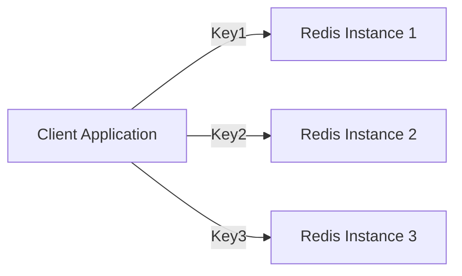
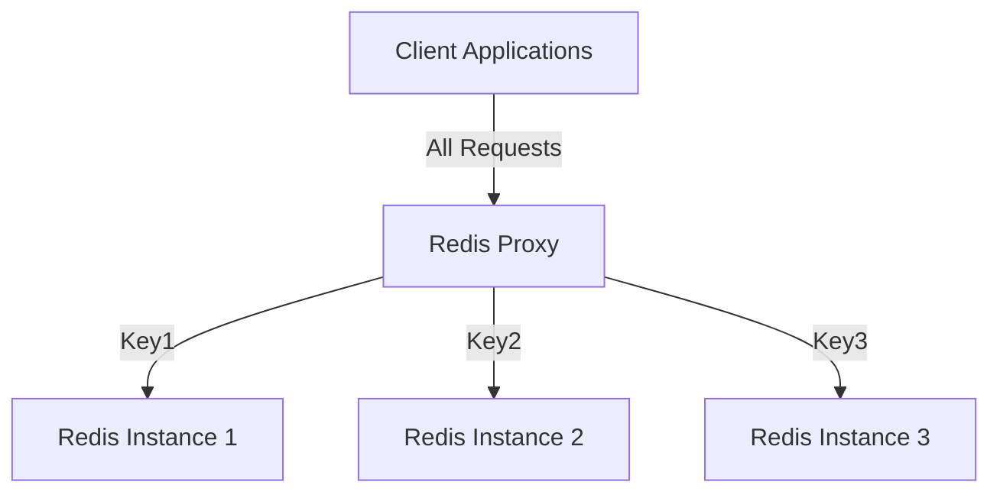
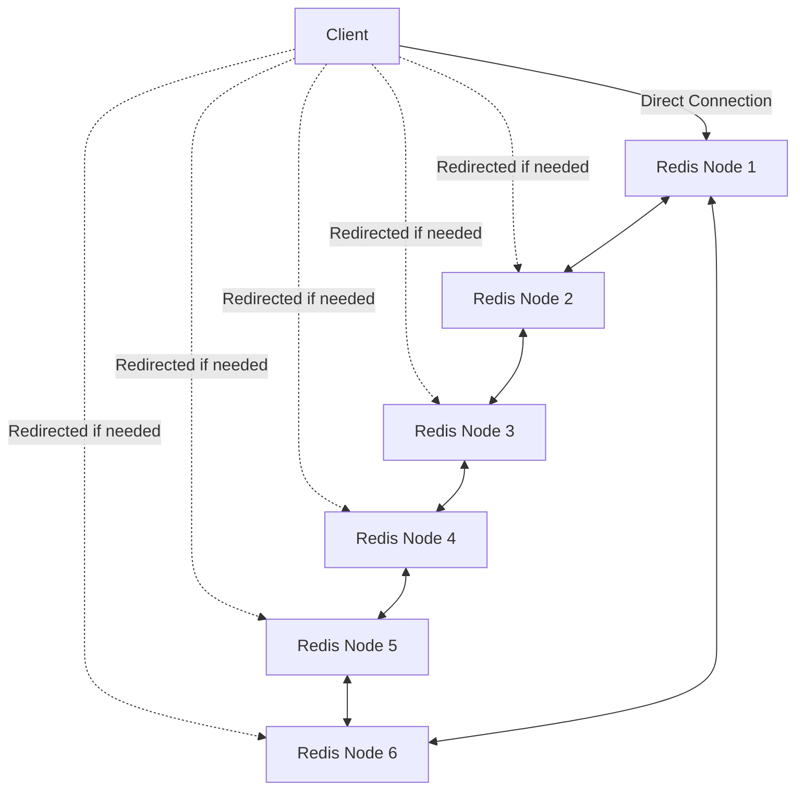
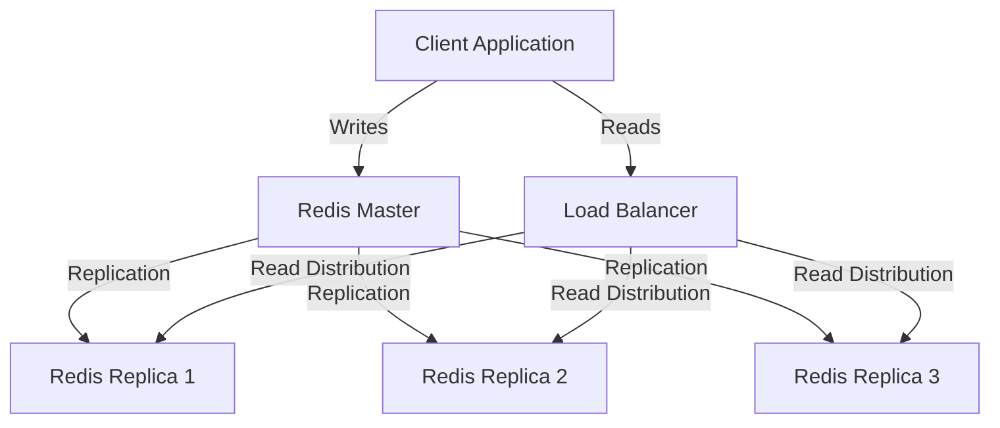

# Redis Load Balancing

## Introduction

Redis is a powerful in-memory data structure store that can be used as a database, cache, message broker, and more. As your application grows and user traffic increases, a single Redis instance might not be sufficient to handle the load. This is where Redis load balancing comes into play.

Load balancing in Redis distributes the workload across multiple Redis instances to improve performance, availability, and reliability. By splitting the data and queries across multiple servers, you can prevent any single instance from becoming a bottleneck and ensure your application remains responsive even during high traffic periods.

## Why Redis Load Balancing?

Before diving into implementation details, let's understand why load balancing is crucial for Redis deployments:

1. **Increased Throughput**: Multiple Redis instances can handle more operations per second than a single instance.
2. **Better Scalability**: As your data size or traffic grows, you can add more Redis instances to the cluster.
3. **Higher Availability**: If one Redis instance fails, others can continue serving requests.
4. **Reduced Latency**: Load balancing helps distribute traffic geographically closer to users.
5. **Resource Optimization**: Efficiently utilize available hardware resources.

## Redis Load Balancing Approaches

There are several approaches to implementing load balancing with Redis. Let's explore the most common ones:

### 1. Client-Side Partitioning

In client-side partitioning, the application code decides which Redis instance to use for each operation based on a consistent hashing algorithm or other distribution strategies.



#### Implementation Example

Here's a simple example using Node.js with the `ioredis` library:

```javascript
const Redis = require('ioredis');

// Create connections to multiple Redis instances
const redisNodes = [
  new Redis(6379, 'redis-server-1'),
  new Redis(6379, 'redis-server-2'),
  new Redis(6379, 'redis-server-3')
];

// Simple hash function to determine which Redis instance to use
function getNodeIndex(key) {
  let hash = 0;
  for (let i = 0; i < key.length; i++) {
    hash += key.charCodeAt(i);
  }
  return hash % redisNodes.length;
}

// Function to set a value
async function setValue(key, value) {
  const nodeIndex = getNodeIndex(key);
  return await redisNodes[nodeIndex].set(key, value);
}

// Function to get a value
async function getValue(key) {
  const nodeIndex = getNodeIndex(key);
  return await redisNodes[nodeIndex].get(key);
}

// Example usage
async function example() {
  await setValue('user:1001', JSON.stringify({ name: 'John', age: 30 }));
  const user = await getValue('user:1001');
  console.log('Retrieved user:', JSON.parse(user));
}

example();
```

#### Pros and Cons

**Pros:**
- Simple to implement
- No additional middleware needed
- Fine-grained control over data distribution

**Cons:**
- Client needs to manage connections to all Redis instances
- Adding or removing instances requires client-side changes
- Less flexibility for dynamic scaling

### 2. Proxy-Based Load Balancing

In this approach, a proxy server sits between clients and Redis instances, routing requests to the appropriate Redis server.



#### Popular Redis Proxies

1. **Twemproxy (nutcracker)**: A fast, lightweight proxy developed by Twitter
2. **Redis Cluster Proxy**: Official proxy for Redis Cluster
3. **HAProxy**: A general-purpose TCP/HTTP load balancer
4. **Envoy**: Modern service proxy

#### Twemproxy Example

Here's how to set up Twemproxy:

```bash
# Install Twemproxy
sudo apt-get install twemproxy

# Create a configuration file
cat > /etc/nutcracker/nutcracker.yml << EOF
redis_cluster:
  listen: 127.0.0.1:6390
  hash: fnv1a_64
  distribution: ketama
  auto_eject_hosts: true
  redis: true
  server_retry_timeout: 2000
  server_failure_limit: 1
  servers:
   - 127.0.0.1:6379:1
   - 127.0.0.1:6380:1
   - 127.0.0.1:6381:1
EOF

# Start Twemproxy
nutcracker -c /etc/nutcracker/nutcracker.yml
```

Now clients can connect to the proxy at `127.0.0.1:6390` and the proxy will distribute commands to the appropriate Redis instance.

#### Client Code Example (Python)

```python
import redis

# Connect to Twemproxy instead of directly to Redis
r = redis.Redis(host='127.0.0.1', port=6390)

# Set some values
r.set('user:1001', 'John')
r.set('user:1002', 'Mary')
r.set('user:1003', 'Bob')

# Get values
print(f"User 1001: {r.get('user:1001').decode('utf-8')}")
print(f"User 1002: {r.get('user:1002').decode('utf-8')}")
print(f"User 1003: {r.get('user:1003').decode('utf-8')}")

# Output:
# User 1001: John
# User 1002: Mary
# User 1003: Bob
```

#### Pros and Cons

**Pros:**
- Clients only need to connect to the proxy
- Easier to add or remove Redis instances
- Centralized configuration

**Cons:**
- Additional network hop
- Potential single point of failure
- May add latency

### 3. Redis Cluster

Redis Cluster is the official Redis solution for distributed Redis installations. It automatically shards data across multiple Redis nodes and provides high availability.



#### Setting Up Redis Cluster

Here's how to set up a basic Redis Cluster with three master nodes:

```bash
# Create directories for each Redis instance
mkdir -p /tmp/redis-cluster/{7000,7001,7002}

# Create configuration for each instance
for port in 7000 7001 7002; do
cat > /tmp/redis-cluster/${port}/redis.conf << EOF
port ${port}
cluster-enabled yes
cluster-config-file nodes-${port}.conf
cluster-node-timeout 5000
appendonly yes
dir /tmp/redis-cluster/${port}
EOF
done

# Start Redis instances
for port in 7000 7001 7002; do
  redis-server /tmp/redis-cluster/${port}/redis.conf &
done

# Create the cluster
redis-cli --cluster create 127.0.0.1:7000 127.0.0.1:7001 127.0.0.1:7002 --cluster-replicas 0
```

#### Client Example (Node.js)

```javascript
const Redis = require('ioredis');

// Create a Redis Cluster client
const cluster = new Redis.Cluster([
  { host: '127.0.0.1', port: 7000 },
  { host: '127.0.0.1', port: 7001 },
  { host: '127.0.0.1', port: 7002 }
]);

// Example operations
async function example() {
  // Set some values
  await cluster.set('user:1001', 'John');
  await cluster.set('product:2001', 'Laptop');
  await cluster.set('order:3001', 'Order #3001');
  
  // Get the values
  const user = await cluster.get('user:1001');
  const product = await cluster.get('product:2001');
  const order = await cluster.get('order:3001');
  
  console.log('User:', user);
  console.log('Product:', product);
  console.log('Order:', order);
  
  // Close the connection
  cluster.disconnect();
}

example();
```

#### Pros and Cons

**Pros:**
- Native Redis solution
- Automatic sharding
- High availability with automatic failover
- No additional middleware required

**Cons:**
- More complex setup
- Limited to 16,384 hash slots
- Multi-key operations only work on keys in the same hash slot

## Advanced Redis Load Balancing Patterns

Let's explore some advanced patterns for Redis load balancing:

### Read-Write Splitting

For applications with heavy read loads, you can set up a master-replica architecture where writes go to the master and reads are distributed across replicas.



#### Java Implementation Example

```java
import redis.clients.jedis.Jedis;
import redis.clients.jedis.JedisPool;
import redis.clients.jedis.JedisPoolConfig;
import java.util.concurrent.ThreadLocalRandom;

public class RedisReadWriteSplitting {
    private JedisPool masterPool;
    private JedisPool[] replicaPools;
    
    public RedisReadWriteSplitting() {
        // Initialize connection pools
        masterPool = new JedisPool(new JedisPoolConfig(), "redis-master.example.com", 6379);
        
        replicaPools = new JedisPool[3];
        replicaPools[0] = new JedisPool(new JedisPoolConfig(), "redis-replica-1.example.com", 6379);
        replicaPools[1] = new JedisPool(new JedisPoolConfig(), "redis-replica-2.example.com", 6379);
        replicaPools[2] = new JedisPool(new JedisPoolConfig(), "redis-replica-3.example.com", 6379);
    }
    
    public void set(String key, String value) {
        try (Jedis jedis = masterPool.getResource()) {
            jedis.set(key, value);
        }
    }
    
    public String get(String key) {
        // Randomly select a replica for reading
        int replicaIndex = ThreadLocalRandom.current().nextInt(replicaPools.length);
        try (Jedis jedis = replicaPools[replicaIndex].getResource()) {
            return jedis.get(key);
        }
    }
    
    public void close() {
        masterPool.close();
        for (JedisPool pool : replicaPools) {
            pool.close();
        }
    }
    
    public static void main(String[] args) {
        RedisReadWriteSplitting redis = new RedisReadWriteSplitting();
        redis.set("key1", "value1");
        System.out.println("Value from replica: " + redis.get("key1"));
        redis.close();
    }
}
```

### Consistent Hashing with Virtual Nodes

To improve the distribution of keys and handle node additions or removals gracefully, consistent hashing with virtual nodes is often used.

```javascript
const crypto = require('crypto');
const Redis = require('ioredis');

class ConsistentHashRing {
  constructor(physicalNodes, vnodesCount = 160) {
    this.vnodesCount = vnodesCount;
    this.ring = {};
    this.sortedKeys = [];
    this.nodes = {};
    
    physicalNodes.forEach(node => {
      this.addNode(node);
    });
  }
  
  addNode(node) {
    this.nodes[node.name] = node;
    
    // Add virtual nodes
    for (let i = 0; i < this.vnodesCount; i++) {
      const virtualNodeKey = `${node.name}-${i}`;
      const hash = this._hashKey(virtualNodeKey);
      this.ring[hash] = node.name;
      this.sortedKeys.push(hash);
    }
    
    this.sortedKeys.sort((a, b) => a - b);
  }
  
  removeNode(nodeName) {
    if (!this.nodes[nodeName]) return;
    
    delete this.nodes[nodeName];
    
    // Remove virtual nodes
    this.sortedKeys = [];
    const newRing = {};
    
    Object.keys(this.ring).forEach(hash => {
      if (this.ring[hash] !== nodeName) {
        newRing[hash] = this.ring[hash];
        this.sortedKeys.push(parseInt(hash));
      }
    });
    
    this.ring = newRing;
    this.sortedKeys.sort((a, b) => a - b);
  }
  
  getNode(key) {
    if (this.sortedKeys.length === 0) return null;
    
    const hash = this._hashKey(key);
    
    // Find the first point on the ring with a value larger than hash
    const pos = this._findPosition(hash);
    
    // If we're at the end of the ring, return the first node
    const nodeName = this.ring[this.sortedKeys[pos]];
    return this.nodes[nodeName];
  }
  
  _findPosition(hash) {
    let position = 0;
    
    // Binary search for faster lookup
    let low = 0;
    let high = this.sortedKeys.length - 1;
    
    while (low <= high) {
      const mid = Math.floor((low + high) / 2);
      const midVal = this.sortedKeys[mid];
      
      if (midVal === hash) {
        return mid;
      }
      
      if (midVal > hash) {
        high = mid - 1;
      } else {
        low = mid + 1;
      }
    }
    
    // If we found a position, or we're at the end of the array
    if (low >= this.sortedKeys.length) {
      position = 0; // Wrap around to the beginning
    } else {
      position = low;
    }
    
    return position;
  }
  
  _hashKey(key) {
    return parseInt(crypto.createHash('md5').update(key).digest('hex').substring(0, 8), 16);
  }
}

// Example usage
const redisNodes = [
  { name: 'redis1', client: new Redis(6379, 'redis-server-1') },
  { name: 'redis2', client: new Redis(6379, 'redis-server-2') },
  { name: 'redis3', client: new Redis(6379, 'redis-server-3') }
];

const ring = new ConsistentHashRing(redisNodes);

// Set a value
async function setValue(key, value) {
  const node = ring.getNode(key);
  return await node.client.set(key, value);
}

// Get a value
async function getValue(key) {
  const node = ring.getNode(key);
  return await node.client.get(key);
}

// Example
async function runExample() {
  await setValue('user:1001', 'John');
  console.log(`Value for user:1001: ${await getValue('user:1001')}`);
  
  // Add a new node
  const newNode = { name: 'redis4', client: new Redis(6379, 'redis-server-4') };
  ring.addNode(newNode);
  console.log('Added a new node');
  
  // Some keys will now map to the new node
  console.log(`Value for user:1001 after rebalancing: ${await getValue('user:1001')}`);
}

runExample();
```

## Performance Considerations

When implementing Redis load balancing, keep these performance tips in mind:

1. **Connection Pooling**: Maintain a pool of Redis connections to reduce connection overhead.
2. **Monitoring**: Set up proper monitoring to detect hotspots or uneven load distribution.
3. **Locality Awareness**: Place Redis instances geographically close to your application servers.
4. **Caching Results**: For read-heavy operations, consider an additional layer of local caching.
5. **Key Design**: Structure your keys to facilitate efficient partitioning.

## Real-World Example: Session Storage

Let's implement a session storage system using Redis load balancing:

```javascript
const express = require('express');
const Redis = require('ioredis');
const session = require('express-session');
const RedisStore = require('connect-redis')(session);

const app = express();

// Create a Redis Cluster client
const redisCluster = new Redis.Cluster([
  { host: 'redis-1.example.com', port: 6379 },
  { host: 'redis-2.example.com', port: 6379 },
  { host: 'redis-3.example.com', port: 6379 }
]);

// Set up session middleware with Redis store
app.use(session({
  store: new RedisStore({ client: redisCluster }),
  secret: 'your-secret-key',
  resave: false,
  saveUninitialized: false,
  cookie: { secure: true, maxAge: 86400000 } // 1 day
}));

// Example route that uses session
app.get('/', (req, res) => {
  // Increment views
  req.session.views = (req.session.views || 0) + 1;
  
  res.send(`You have visited this page ${req.session.views} times`);
});

// Start the server
app.listen(3000, () => {
  console.log('Server running on port 3000');
});
```

This example demonstrates storing session data across multiple Redis instances using Redis Cluster. The load balancing happens automatically, and the application code doesn't need to know which Redis instance is storing a particular session.

## Common Challenges and Solutions

### Challenge: Hot Keys

Some keys might be accessed much more frequently than others, creating hotspots.

**Solution:**
- Implement key-specific caching for hot keys
- Consider replicating hot keys across multiple instances
- Use Redis module RedisBloom for probabilistic data structures

### Challenge: Data Consistency

With multiple Redis instances, ensuring data consistency can be tricky.

**Solution:**
- Use Redis transactions (MULTI/EXEC) for operations on a single instance
- Consider Redis Cluster for stronger consistency guarantees
- Implement application-level compensation mechanisms

### Challenge: Monitoring and Debugging

Tracking issues across a distributed Redis setup can be difficult.

**Solution:**
- Use Redis INFO command to monitor each instance
- Implement centralized logging
- Set up Redis slowlog for performance debugging
- Use tools like Redis-Sentinel or Prometheus with Redis exporter

## Summary

Redis load balancing is essential for scaling Redis deployments as your application grows. We've covered several approaches to implement load balancing:

1. **Client-side partitioning**: Simple but less flexible
2. **Proxy-based load balancing**: Easy to configure but adds a network hop
3. **Redis Cluster**: Native Redis solution with automatic sharding and high availability
4. **Advanced patterns**: Read-write splitting and consistent hashing

Each approach has its strengths and trade-offs, so choose the one that best fits your application's needs. Remember to consider factors like throughput requirements, data consistency needs, and operational complexity when designing your Redis load-balancing strategy.

## Additional Resources

- [Redis Official Documentation on Redis Cluster](https://redis.io/topics/cluster-tutorial)
- [Redis Replication Guide](https://redis.io/topics/replication)
- [Twemproxy GitHub Repository](https://github.com/twitter/twemproxy)
- [HAProxy Configuration for Redis](http://cbonte.github.io/haproxy-dconv/2.2/configuration.html#4-balance)

## Exercises

1. Set up a three-node Redis Cluster and write a simple client application to interact with it.
2. Implement client-side partitioning with a consistent hashing algorithm.
3. Configure Twemproxy to load balance between multiple Redis instances and benchmark its performance.
4. Design a system that uses read-write splitting to optimize for heavy read workloads.
5. Simulate a node failure in your Redis setup and observe how the load balancing mechanism handles it.