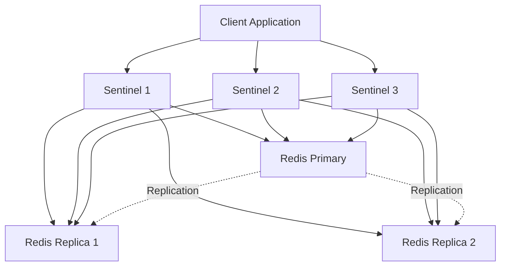
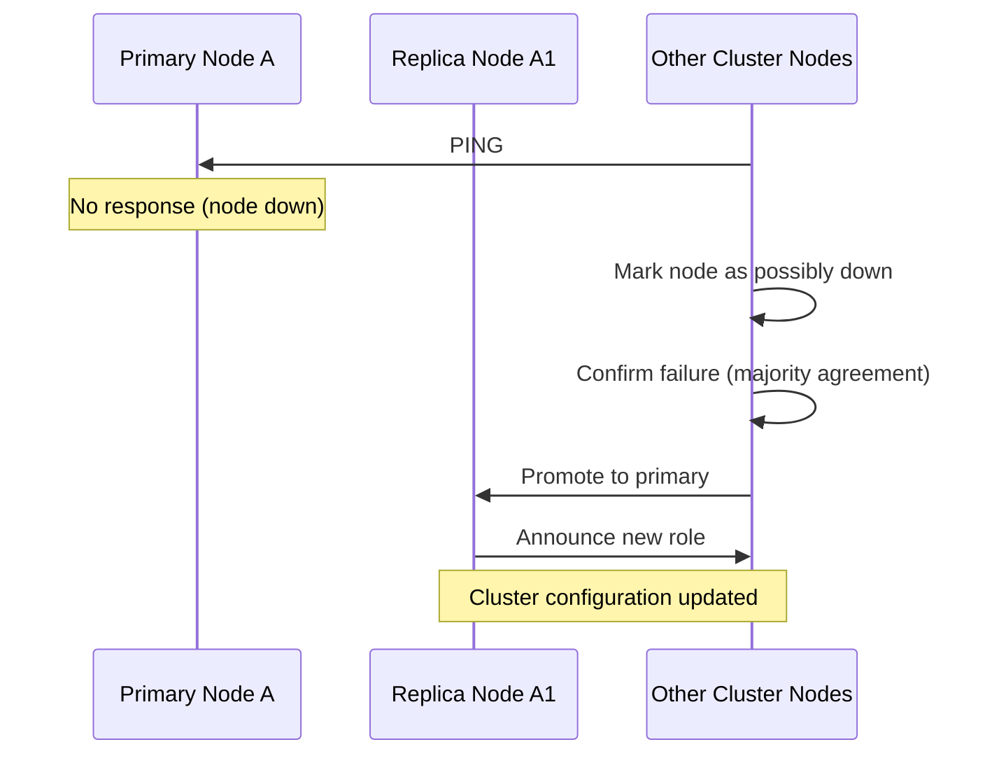
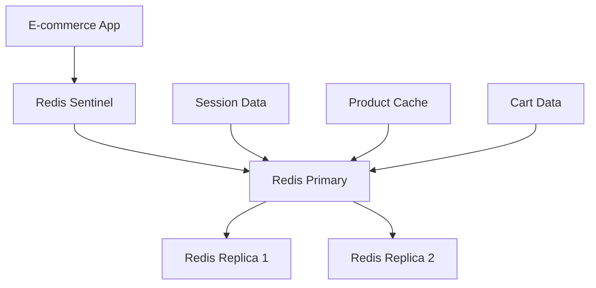

# Redis Failover

## Introduction

In production environments, ensuring your Redis instances remain available during hardware failures, network issues, or maintenance periods is critical. Redis failover is the process of automatically switching to a redundant or standby Redis server when the primary system becomes unavailable. This guide will walk you through Redis failover concepts, implementation strategies, and best practices to maintain high availability for your Redis deployments.

## Why Failover Matters

Imagine your application suddenly loses connection to its Redis instance. Without proper failover mechanisms:

- User sessions could be lost
- Cache data becomes unavailable
- Queue processing stops
- Your application might crash or become unresponsive

A proper failover strategy ensures that when problems occur, your system can automatically recover with minimal downtime.

## Redis Replication: The Foundation of Failover

Before understanding failover, we need to grasp Redis replication.

### How Redis Replication Works

Redis replication allows you to create copies (replicas) of a Redis instance (primary). In a primary-replica setup:

1. The primary Redis instance processes write commands from clients
2. Replicas connect to the primary and receive a copy of the data
3. Replicas can serve read requests, distributing the read load

Let's set up a basic Redis replication:

```bash
# On the primary Redis instance
$ redis-cli
127.0.0.1:6379> INFO replication
# Replication
role:master
connected_slaves:0

# On the replica Redis instance
$ redis-cli
127.0.0.1:6380> REPLICAOF 127.0.0.1 6379
OK

# Check replication status on the primary
127.0.0.1:6379> INFO replication
# Replication
role:master
connected_slaves:1
slave0:ip=127.0.0.1,port=6380,state=online,offset=42,lag=0
```

While replication provides data redundancy, it doesn't automatically handle failover. If the primary fails, manual intervention is required to promote a replica to become the new primary.

## Failover Approaches in Redis

Redis offers several approaches to implement failover:

1. Redis Sentinel
2. Redis Cluster
3. Orchestration tools (like Kubernetes)

Let's explore each method.

## Redis Sentinel: Automated Failover

Redis Sentinel is the official solution for Redis high availability. It's a distributed system that monitors Redis instances and performs automatic failover when needed.

### How Sentinel Works



Sentinel provides:

1. **Monitoring**: Continuously checks if primaries and replicas are working as expected
2. **Notification**: Alerts administrators about problems
3. **Automatic failover**: Promotes a replica to primary when the original primary fails
4. **Configuration provider**: Clients connect to Sentinels to find the current primary address

### Setting Up Redis Sentinel

Let's implement a basic Sentinel setup with one primary and two replicas:

1. First, set up your Redis instances (one primary, two replicas)

2. Create a `sentinel.conf` file:

```conf
# sentinel.conf
port 26379
sentinel monitor mymaster 127.0.0.1 6379 2
sentinel down-after-milliseconds mymaster 5000
sentinel failover-timeout mymaster 60000
sentinel parallel-syncs mymaster 1
```

3. Start Sentinel instances:

```bash
$ redis-server sentinel.conf --sentinel
```

For high availability, run at least 3 Sentinel instances on different machines.

### Simulating Failover with Sentinel

Let's see what happens during a failover:

```bash
# Shut down the primary
$ redis-cli -p 6379 DEBUG sleep 30

# Check Sentinel logs
$ tail -f sentinel.log
... # Sentinel detects the primary is down
... # A new primary is elected
... # Configuration is updated
```

### Connecting Applications to Sentinel

Applications need to be Sentinel-aware. Here's how to connect using Redis clients:

```javascript
// Node.js example with ioredis
const Redis = require('ioredis');

const redis = new Redis({
  sentinels: [
    { host: '127.0.0.1', port: 26379 },
    { host: '127.0.0.1', port: 26380 },
    { host: '127.0.0.1', port: 26381 }
  ],
  name: 'mymaster' // The Sentinel master name
});

redis.set('key', 'value', (err) => {
  // This automatically connects to the current primary
  console.log('Value set on the current primary');
});
```

```python
# Python example with redis-py
from redis.sentinel import Sentinel

sentinel = Sentinel([
    ('127.0.0.1', 26379),
    ('127.0.0.1', 26380),
    ('127.0.0.1', 26381)
], socket_timeout=0.1)

# Get the current primary
master = sentinel.master_for('mymaster', socket_timeout=0.1)
master.set('key', 'value')  # This goes to the primary

# Get a replica for read operations
slave = sentinel.slave_for('mymaster', socket_timeout=0.1)
value = slave.get('key')    # This goes to a replica
```

## Redis Cluster: Sharding with Automatic Failover

Redis Cluster is a distributed implementation that provides:
- Data sharding across multiple Redis nodes
- Built-in failover capabilities
- No need for external Sentinel processes

### Setting Up Redis Cluster

1. Configure Redis instances for cluster mode:

```conf
# In redis.conf for each node
port 7000  # Different for each node
cluster-enabled yes
cluster-config-file nodes.conf
cluster-node-timeout 5000
```

2. Start the Redis nodes:

```bash
$ redis-server ./redis-7000.conf
$ redis-server ./redis-7001.conf
# ... and so on for all nodes
```

3. Create the cluster:

```bash
$ redis-cli --cluster create 127.0.0.1:7000 127.0.0.1:7001 \
  127.0.0.1:7002 127.0.0.1:7003 127.0.0.1:7004 127.0.0.1:7005 \
  --cluster-replicas 1
```

This creates a cluster with 3 primary nodes and 3 replica nodes (one replica per primary).

### Automatic Failover in Redis Cluster

Redis Cluster automatically handles failover when a primary node goes down:

1. Cluster nodes ping each other
2. If a primary node doesn't respond within the configured timeout
3. Its replicas detect the failure
4. One replica gets promoted to primary
5. The cluster continues to operate



### Connecting to Redis Cluster

Applications need to use cluster-aware clients:

```javascript
// Node.js with ioredis
const Redis = require('ioredis');

const cluster = new Redis.Cluster([
  { port: 7000, host: '127.0.0.1' },
  { port: 7001, host: '127.0.0.1' }
  // Only need to specify a few nodes, client will discover the rest
]);

cluster.set('key', 'value', (err) => {
  console.log('Key stored in the appropriate shard');
});
```

```python
# Python with redis-py-cluster
from rediscluster import RedisCluster

startup_nodes = [
    {"host": "127.0.0.1", "port": 7000},
    {"host": "127.0.0.1", "port": 7001}
]

rc = RedisCluster(startup_nodes=startup_nodes, decode_responses=True)
rc.set('key', 'value')
```

## Orchestration-Based Failover

Modern container orchestration platforms like Kubernetes can handle Redis failover:

1. Deploy Redis with StatefulSets
2. Use readiness/liveness probes to detect failures
3. Leverage operators like Redis Operator or Redis Enterprise Operator

Example Kubernetes manifest (simplified):

```yaml
apiVersion: apps/v1
kind: StatefulSet
metadata:
  name: redis
spec:
  serviceName: "redis"
  replicas: 3
  selector:
    matchLabels:
      app: redis
  template:
    metadata:
      labels:
        app: redis
    spec:
      containers:
      - name: redis
        image: redis:6.2
        ports:
        - containerPort: 6379
          name: redis
        readinessProbe:
          exec:
            command: ["redis-cli", "ping"]
```

## Best Practices for Redis Failover

1. **Use multiple Sentinels**: Run at least 3 Sentinel instances on different machines
2. **Tune timeouts carefully**: Balance between quick failover and avoiding false positives
3. **Test failover regularly**: Simulate failures to ensure your system recovers properly
4. **Monitor the entire system**: Use tools like Prometheus and Grafana
5. **Implement client-side retry logic**: Handle temporary disconnections gracefully
6. **Back up your data**: Failover doesn't protect against data corruption
7. **Document procedures**: Have clear manual recovery procedures

## Common Failover Issues and Solutions

| Issue | Cause | Solution |
|-------|-------|----------|
| Split-brain | Network partition causing multiple primaries | Use quorum settings in Sentinel |
| Data loss | Asynchronous replication | Use WAIT command for critical writes |
| Flapping | Unstable network causing repeated failovers | Increase detection timeouts |
| Client disconnections | Clients not reconnecting after failover | Use client libraries with failover support |

## Real-World Example: E-commerce Application

Let's look at how a typical e-commerce application might implement Redis failover:



In this setup:
- The app connects to Redis through Sentinel
- Session data, product caches, and cart data are stored in Redis
- If the primary fails, Sentinel promotes a replica
- The application continues to function with minimal disruption

## Summary

Redis failover is essential for maintaining high availability in production environments. In this guide, we've covered:

- The importance of Redis failover
- Redis replication as the foundation for failover
- Redis Sentinel for automated monitoring and failover
- Redis Cluster for sharded data with built-in failover
- Orchestration-based approaches with Kubernetes
- Best practices and common issues

By implementing proper failover strategies, you can ensure your Redis deployments remain resilient and available, even when facing hardware failures, network issues, or during maintenance.

## Additional Resources

Here are some exercises to reinforce your understanding:

1. Set up a Redis primary with two replicas on your local machine
2. Configure a three-node Sentinel system and test failover
3. Create a simple Redis Cluster with three primaries and three replicas
4. Write a client application that handles Redis failover gracefully
5. Design a backup strategy for your Redis deployment

## Further Reading

- [Redis Documentation on Replication](https://redis.io/topics/replication)
- [Redis Sentinel Documentation](https://redis.io/topics/sentinel)
- [Redis Cluster Tutorial](https://redis.io/topics/cluster-tutorial)
- [Redis High Availability on Kubernetes](https://kubernetes.io/docs/tutorials/)