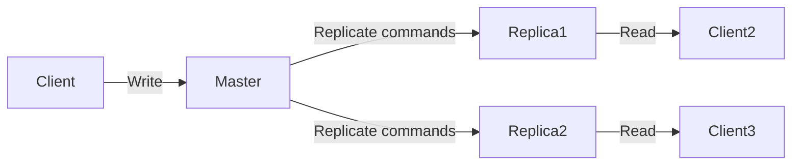

# Redis-to-Redis Replication

## Introduction

Redis replication is a powerful feature that allows you to create copies (replicas) of a Redis server instance. The primary purpose of replication is to improve system reliability, fault tolerance, and performance. 

In a Redis replication setup, data written to the primary node (master) is automatically synchronized to one or more secondary nodes (replicas/slaves). This creates a distributed system where:

- The master handles write operations
- Replicas can handle read operations, distributing the read workload
- If the master fails, a replica can be promoted to become the new master

This guide will walk you through how Redis replication works, how to set it up, and how to use it effectively in real-world applications.

## How Redis Replication Works

Redis uses an asynchronous replication mechanism, which means:

1. The master Redis instance accepts write commands from clients
2. The master executes these commands on its dataset
3. The master sends the commands to replicas
4. Replicas apply these commands to their own dataset



### Key Replication Concepts

- **Asynchronous replication**: The master doesn't wait for replicas to acknowledge data reception before responding to clients
- **Non-blocking on master**: The master continues to serve requests even when replicating to slaves
- **One-way replication**: Data flows only from master to replicas (replicas are read-only by default)
- **Many-to-one**: A master can have multiple replicas
- **Daisy chaining**: Replicas can have their own replicas (sub-replicas)

## Setting Up Redis Replication

### Basic Master-Replica Setup

Setting up replication is straightforward. Here's a simple example:

1. Start your master Redis instance normally:

```bash
redis-server --port 6379
```

2. Configure and start the replica either using the `redis.conf` file:

```
replicaof 127.0.0.1 6379
```

Or at runtime through the Redis CLI:

```bash
redis-cli -p 6380
> REPLICAOF 127.0.0.1 6379
OK
```

3. Verify the replication status on the master:

```bash
redis-cli -p 6379
> INFO replication
# Replication
role:master
connected_slaves:1
slave0:ip=127.0.0.1,port=6380,state=online,offset=42,lag=0
...
```

And on the replica:

```bash
redis-cli -p 6380
> INFO replication
# Replication
role:slave
master_host:127.0.0.1
master_port:6379
master_link_status:up
...
```

### Full Replication Workflow

Let's see what happens when a new replica connects to a master:

1. The replica connects to the master and issues the `SYNC` command
2. The master starts a background process to save its data to an RDB file
3. The master buffers all new commands received from clients
4. When the RDB file is ready, the master sends it to the replica
5. The replica loads the RDB file into memory
6. The master sends the buffered commands to the replica
7. The master streams new commands as they arrive

This process ensures the replica has an exact copy of the master's data.

## Replication Configuration Options

Redis offers several configuration parameters to fine-tune replication:

```bash
# In redis.conf

# Replica-related settings
replica-serve-stale-data yes     # Continue serving queries when disconnected from master
replica-read-only yes            # Make replica instance read-only
replica-priority 100             # Priority for promotion when using Redis Sentinel
min-replicas-to-write 3          # Minimum number of replicas to accept writes
min-replicas-max-lag 10          # Maximum allowed replica lag (in seconds)
```

### Security Considerations

Redis replication can be secured using:

```bash
# On master, require password for replication
masterauth "your_strong_password"

# On replica, provide auth credentials for master
masterauth "your_strong_password"
```

For encrypted replication traffic, consider using:
- SSH tunneling
- SSL proxy
- Redis 6.0+ TLS support

## Practical Examples

### Example 1: Basic Data Replication

Let's see replication in action with a simple example:

```bash
# On master (port 6379)
redis-cli -p 6379
> SET greeting "Hello, Redis Replication!"
OK

# On replica (port 6380)
redis-cli -p 6380
> GET greeting
"Hello, Redis Replication!"

# Try to write to replica
> SET newkey "This won't work"
(error) READONLY You can't write against a read only replica.
```

### Example 2: Handling Replica Disconnection and Reconnection

If a replica gets disconnected:

```bash
# On replica
redis-cli -p 6380
> DEBUG SLEEP 30  # Simulate network issue for 30 seconds

# On master, make changes during disconnection
redis-cli -p 6379
> SET new_data "Created during replica downtime"
OK

# After replica reconnects
redis-cli -p 6380
> GET new_data
"Created during replica downtime"
```

The replica automatically performs a partial resynchronization when possible, or full resynchronization if necessary.

### Example 3: Setting Up Replication with Docker

Here's how to set up Redis replication using Docker:

```bash
# Start master
docker run --name redis-master -d redis

# Get master IP
MASTER_IP=$(docker inspect --format '{{ .NetworkSettings.IPAddress }}' redis-master)

# Start replica
docker run --name redis-replica -d redis redis-server --replicaof $MASTER_IP 6379
```

## Advanced Replication Techniques

### Disk-less Replication

Starting from Redis 2.8.18, Redis supports disk-less replication, where the RDB file is sent directly to replicas without touching the disk:

```
repl-diskless-sync yes
repl-diskless-sync-delay 5  # Wait for more replicas to appear
```

This is useful when:
- Disk I/O is slow or constrained
- You have many replicas connecting simultaneously 

### Read-Write Splitting

A common pattern is to use replicas for read queries and the master for writes:

```javascript
// Pseudo-code for a Node.js application
const writeClient = createRedisClient({ port: 6379 });  // Master
const readClient = createRedisClient({ port: 6380 });   // Replica

// Write operations go to master
function storeData(key, value) {
  return writeClient.set(key, value);
}

// Read operations go to replica
function retrieveData(key) {
  return readClient.get(key);
}
```

This pattern improves performance by:
- Distributing read load across multiple nodes
- Allowing the master to focus on write operations
- Reducing network latency by placing replicas closer to users

## Common Issues and Solutions

### Handling Replication Lag

Replication lag occurs when replicas fall behind the master:

```bash
redis-cli -p 6379
> INFO replication
# Look for "slave0:...lag=X" where X is seconds of lag
```

To address lag issues:
- Ensure sufficient network bandwidth between master and replicas
- Consider reducing the master's write load
- Scale horizontally with more replicas
- Use `min-replicas-max-lag` to prevent accepting writes when lag is high

### Handling Full Resynchronization

Full resynchronizations are resource-intensive. To minimize them:
- Increase `repl-backlog-size` on master (default: 1MB)
- Ensure stable network connections
- Monitor `sync_partial_ok` and `sync_partial_err` metrics

```bash
# Increase replication backlog (in redis.conf)
repl-backlog-size 100mb
```

## Summary

Redis replication is a powerful feature that enables you to build more reliable, scalable, and performant Redis deployments. Key takeaways:

- Redis replication is asynchronous and doesn't block the master
- Setting up basic replication requires minimal configuration
- Replicas are read-only by default, enabling read-write splitting
- Redis offers several configurations to fine-tune replication behavior
- Replication is the foundation for more advanced high-availability features like Redis Sentinel and Redis Cluster

## Practice Exercises

1. Set up a master with two replicas on your local machine using different ports
2. Write a simple script that performs writes on the master and reads from replicas
3. Simulate a network partition and observe how replication recovers
4. Configure Redis replication with authentication
5. Experiment with disk-less replication and measure its performance impact

## Additional Resources

- [Redis Documentation: Replication](https://redis.io/topics/replication)
- [Redis Command Reference: REPLICAOF](https://redis.io/commands/replicaof)
- [Redis High Availability](https://redis.io/topics/sentinel)
- [Replication Manager for Redis](https://github.com/RedisLabs/redis-raft)