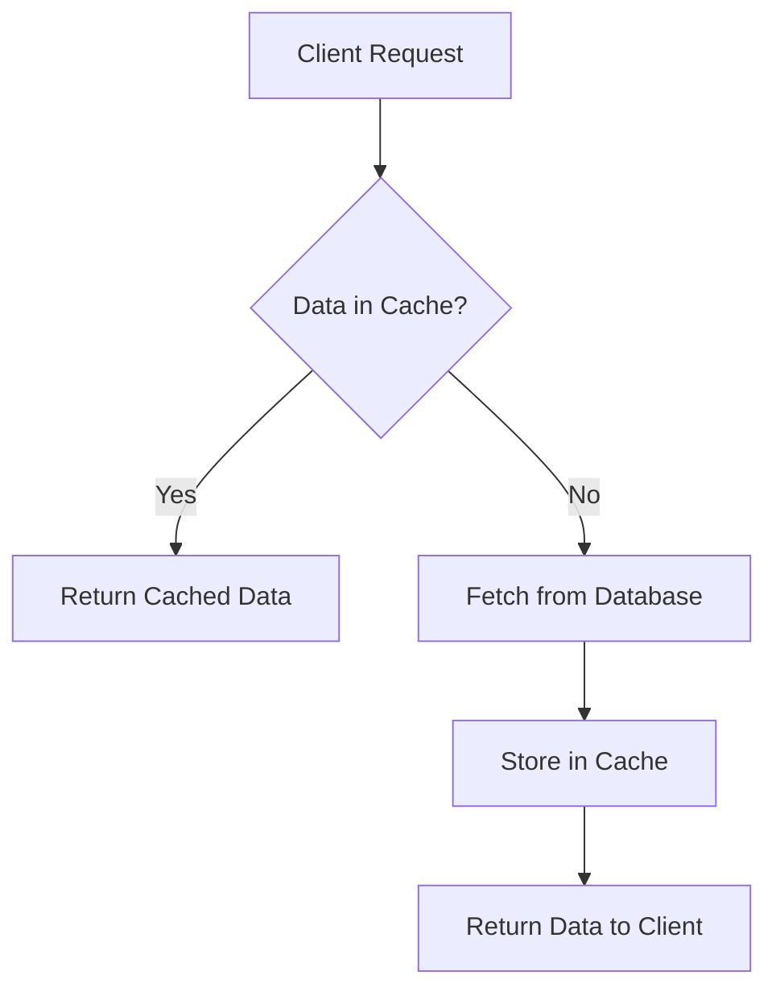

# Redis Caching

## Introduction

Redis (Remote Dictionary Server) is an in-memory data structure store that can be used as a database, cache, message broker, and more. One of its most popular use cases is as a caching layer in modern applications. In this guide, we'll explore how to implement effective caching strategies with Redis to improve your application's performance and reduce load on your primary database.

Caching is a technique that stores frequently accessed data in a high-speed data storage layer (like Redis), making subsequent requests for that same data much faster. By keeping frequently accessed data in memory, Redis dramatically reduces data access latency compared to retrieving the same data from disk-based databases.

## Why Use Redis for Caching?

Redis offers several advantages that make it ideal for caching:

1. **Speed**: Redis operates primarily in-memory, offering sub-millisecond response times.
2. **Versatility**: It supports various data structures (strings, hashes, lists, sets, etc.).
3. **Built-in expiration**: Redis can automatically remove cached items after a specified time.
4. **Distributed architecture**: Redis can be configured for high availability and scalability.
5. **Atomic operations**: Redis provides atomic operations on complex data types.
6. **Persistence options**: You can configure Redis to persist data to disk if needed.

## Basic Redis Caching Pattern

The simplest caching pattern with Redis follows this flow:



Let's implement this pattern in code:

```javascript
const redis = require('redis');
const { promisify } = require('util');
const client = redis.createClient();

// Promisify Redis commands
const getAsync = promisify(client.get).bind(client);
const setexAsync = promisify(client.setex).bind(client);

async function getUserById(userId) {
  // Try to get user from cache
  const cachedUser = await getAsync(`user:${userId}`);
  
  if (cachedUser) {
    console.log('Cache hit!');
    return JSON.parse(cachedUser);
  }
  
  console.log('Cache miss! Fetching from database...');
  
  // Simulate database query
  const user = await fetchUserFromDatabase(userId);
  
  // Store in cache with expiration (3600 seconds = 1 hour)
  await setexAsync(`user:${userId}`, 3600, JSON.stringify(user));
  
  return user;
}

// Mock database function
async function fetchUserFromDatabase(userId) {
  // In a real app, this would be a database query
  return { id: userId, name: 'John Doe', email: 'john@example.com' };
}

// Usage example
async function main() {
  // First call - will be a cache miss
  console.log(await getUserById(42));
  
  // Second call - will be a cache hit
  console.log(await getUserById(42));
}

main().catch(console.error);
```

Output:
```
Cache miss! Fetching from database...
{ id: 42, name: 'John Doe', email: 'john@example.com' }
Cache hit!
{ id: 42, name: 'John Doe', email: 'john@example.com' }
```

## Cache Expiration Strategies

Redis provides several ways to handle cache expiration:

### Time-Based Expiration

The most common approach is to set an expiration time for cache entries:

```javascript
// Set a key with 30 minute expiration
await setexAsync('mykey', 1800, 'myvalue');

// Alternative approach
await setAsync('mykey', 'myvalue');
await expireAsync('mykey', 1800);
```

### Manual Invalidation

For data that changes infrequently or on specific events, you can manually invalidate the cache:

```javascript
async function updateUser(userId, userData) {
  // Update in database
  await updateUserInDatabase(userId, userData);
  
  // Invalidate cache
  await delAsync(`user:${userId}`);
  
  return { success: true };
}
```

### Pattern-Based Invalidation

You can delete multiple related keys using pattern matching:

```javascript
// Delete all product keys for a specific category
await delAsync(`product:category:${categoryId}:*`);
```

## Cache-Aside Pattern

The cache-aside (or lazy loading) pattern is one of the most common caching strategies:

```javascript
async function getProductDetails(productId) {
  const cacheKey = `product:${productId}`;
  
  // Try to get from cache
  let product = await getAsync(cacheKey);
  
  if (product) {
    return JSON.parse(product);
  }
  
  // If not in cache, get from database
  product = await fetchProductFromDatabase(productId);
  
  // Store in cache (no expiration in this example)
  await setAsync(cacheKey, JSON.stringify(product));
  
  return product;
}
```

## Write-Through Caching

In write-through caching, data is written to both the cache and the database simultaneously:

```javascript
async function createProduct(productData) {
  // Write to database
  const product = await saveProductToDatabase(productData);
  
  // Write to cache
  await setAsync(`product:${product.id}`, JSON.stringify(product));
  
  return product;
}
```

## Cache Stampede Protection

Cache stampede (or cache avalanche) occurs when many requests try to access an expired key simultaneously, causing multiple database hits. Here's how to prevent it:

```javascript
async function getUserWithStampedeProtection(userId) {
  const cacheKey = `user:${userId}`;
  
  // Try to get from cache
  let user = await getAsync(cacheKey);
  
  if (user) {
    return JSON.parse(user);
  }
  
  // Use a lock to prevent multiple simultaneous database queries
  const lockKey = `lock:${cacheKey}`;
  const lockAcquired = await setAsync(lockKey, '1', 'NX', 'PX', 10000); // 10-second lock
  
  if (!lockAcquired) {
    // Someone else is fetching the data, wait and retry
    await new Promise(resolve => setTimeout(resolve, 50));
    return getUserWithStampedeProtection(userId);
  }
  
  try {
    // Double-check cache after acquiring lock
    user = await getAsync(cacheKey);
    if (user) {
      return JSON.parse(user);
    }
    
    // Fetch from database
    user = await fetchUserFromDatabase(userId);
    
    // Update cache with 1-hour expiration
    await setexAsync(cacheKey, 3600, JSON.stringify(user));
    
    return user;
  } finally {
    // Release lock
    await delAsync(lockKey);
  }
}
```

## Practical Example: Caching API Responses

Let's implement a more complete example using Express.js to cache API responses:

```javascript
const express = require('express');
const redis = require('redis');
const { promisify } = require('util');

const app = express();
const client = redis.createClient();
const getAsync = promisify(client.get).bind(client);
const setexAsync = promisify(client.setex).bind(client);

// Middleware for Redis caching
const cacheMiddleware = (duration) => {
  return async (req, res, next) => {
    // Create a unique key based on the request URL
    const cacheKey = `api:${req.originalUrl}`;
    
    try {
      // Check if the response is in cache
      const cachedResponse = await getAsync(cacheKey);
      
      if (cachedResponse) {
        // Return cached response
        const data = JSON.parse(cachedResponse);
        return res.json(data);
      }
      
      // If not in cache, modify res.json to cache the response
      const originalJson = res.json;
      res.json = function(data) {
        // Cache the data
        setexAsync(cacheKey, duration, JSON.stringify(data))
          .catch(err => console.error('Redis caching error:', err));
        
        // Call the original json method
        return originalJson.call(this, data);
      };
      
      next();
    } catch (err) {
      console.error('Redis middleware error:', err);
      next();
    }
  };
};

// Example route with caching (cache for 5 minutes)
app.get('/api/products', cacheMiddleware(300), async (req, res) => {
  try {
    // Simulate slow database query
    await new Promise(resolve => setTimeout(resolve, 1000));
    
    // Return data
    res.json({
      products: [
        { id: 1, name: 'Laptop', price: 1299 },
        { id: 2, name: 'Smartphone', price: 799 },
        { id: 3, name: 'Headphones', price: 249 }
      ]
    });
  } catch (err) {
    res.status(500).json({ error: 'Internal server error' });
  }
});

app.listen(3000, () => {
  console.log('Server listening on port 3000');
});
```

## Monitoring and Managing Redis Cache

It's important to monitor your Redis cache to ensure optimal performance:

### Key Statistics

```javascript
async function getCacheStats() {
  const infoAsync = promisify(client.info).bind(client);
  const dbSizeAsync = promisify(client.dbsize).bind(client);
  
  const info = await infoAsync();
  const keyCount = await dbSizeAsync();
  
  console.log(`Total keys in database: ${keyCount}`);
  console.log(`Memory used: ${info.match(/used_memory_human:(\S+)/)[1]}`);
  
  return { keyCount, info };
}
```

### Finding Large Keys

You can use the Redis CLI to find large keys that might be consuming too much memory:

```bash
redis-cli --bigkeys
```

### Implementing Cache Cleanup

Periodically cleaning up unused keys can help maintain Redis performance:

```javascript
async function cleanupOldKeys(pattern, maxAge) {
  const scanAsync = promisify(client.scan).bind(client);
  const timeAsync = promisify(client.time).bind(client);
  const ttlAsync = promisify(client.ttl).bind(client);
  
  const now = (await timeAsync())[0]; // Current Redis server time in seconds
  
  let cursor = '0';
  
  do {
    // Scan for keys matching the pattern
    const result = await scanAsync(cursor, 'MATCH', pattern, 'COUNT', 100);
    cursor = result[0];
    const keys = result[1];
    
    for (const key of keys) {
      const ttl = await ttlAsync(key);
      
      // If key has no expiration and is older than maxAge, delete it
      if (ttl === -1) {
        // We would need additional logic to determine key age
        // This is a simplified example
        await delAsync(key);
      }
    }
  } while (cursor !== '0');
}
```

## Best Practices for Redis Caching

1. **Set appropriate TTLs**: Choose expiration times that balance freshness with performance.
2. **Use consistent key naming conventions**: Adopt a clear pattern like `entity:id:field`.
3. **Keep values small**: Large values can impact Redis performance.
4. **Consider compression**: For larger values, compress data before storing.
5. **Implement circuit breakers**: Handle Redis failures gracefully.
6. **Monitor cache hit rates**: Optimize based on actual usage patterns.
7. **Be careful with KEYS command**: In production, use SCAN instead.
8. **Plan for cache warming**: Pre-populate cache for critical data.

## Advanced Redis Caching Techniques

### Cache Segmentation

For different types of data, you can use different caching strategies:

```javascript
// Frequently changing data - short TTL
await setexAsync('market:prices', 60, JSON.stringify(prices)); // 1 minute

// Relatively stable data - longer TTL
await setexAsync('product:details:123', 86400, JSON.stringify(product)); // 1 day

// User session data - medium TTL
await setexAsync('session:user:456', 3600, JSON.stringify(session)); // 1 hour
```

### Using Redis Hash for Efficient Partial Updates

Redis hashes are memory-efficient and allow updating parts of cached objects:

```javascript
// Store user profile as hash
await hmsetAsync(`user:profile:${userId}`, {
  name: 'John Doe',
  email: 'john@example.com',
  lastLogin: Date.now()
});

// Update just the lastLogin field
await hsetAsync(`user:profile:${userId}`, 'lastLogin', Date.now());

// Get entire profile
const profile = await hgetallAsync(`user:profile:${userId}`);

// Get just the name
const name = await hgetAsync(`user:profile:${userId}`, 'name');
```

### Two-Level Caching Strategy

For very high-traffic applications, you can implement a two-level cache:

```javascript
async function getUserData(userId) {
  // Check local application memory cache first (e.g., using Node.js Map)
  if (localCache.has(`user:${userId}`)) {
    return localCache.get(`user:${userId}`);
  }
  
  // Check Redis cache
  const cachedUser = await getAsync(`user:${userId}`);
  if (cachedUser) {
    const userData = JSON.parse(cachedUser);
    // Update local cache with short TTL
    localCache.set(`user:${userId}`, userData);
    return userData;
  }
  
  // Fetch from database
  const userData = await fetchUserFromDatabase(userId);
  
  // Update Redis cache
  await setexAsync(`user:${userId}`, 3600, JSON.stringify(userData));
  
  // Update local cache
  localCache.set(`user:${userId}`, userData);
  
  return userData;
}
```

## Summary

Redis caching is a powerful technique to improve application performance by storing frequently accessed data in memory. We've covered:

- Basic Redis caching patterns (cache-aside, write-through)
- Cache expiration strategies
- Preventing cache stampedes
- Practical implementation with Express.js
- Monitoring and maintenance
- Best practices and advanced techniques

By implementing these Redis caching strategies, you can significantly reduce database load and improve response times in your applications.

## Exercises

1. Implement a cache-aside pattern for a simple blog application.
2. Create a caching middleware for an Express.js API that includes cache invalidation on data updates.
3. Build a system that uses Redis pub/sub to invalidate cached entries across multiple application instances.
4. Implement a rate-limiting system using Redis to protect your APIs.
5. Create a two-level caching system with both memory cache and Redis cache for ultra-fast responses.

## Additional Resources

- [Redis Official Documentation](https://redis.io/documentation)
- [Redis Data Types](https://redis.io/topics/data-types-intro)
- [Redis Persistence](https://redis.io/topics/persistence)
- [Redis Pub/Sub](https://redis.io/topics/pubsub)
- [Redis Transactions](https://redis.io/topics/transactions)