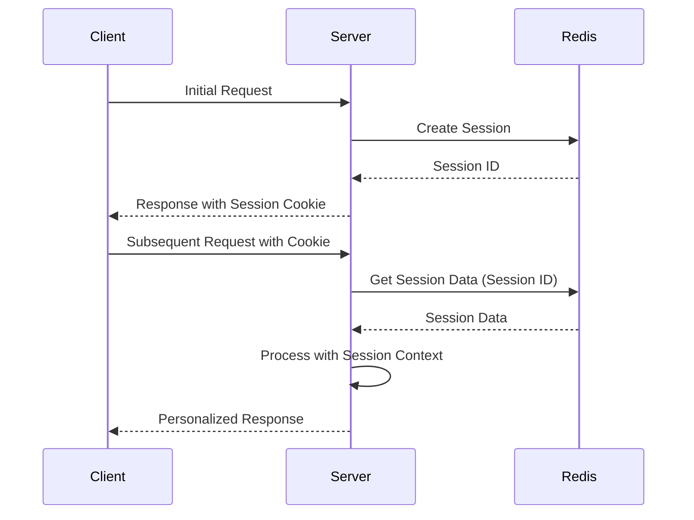

# Redis Session Storage

## Introduction

Session management is a fundamental concept in web development. When users interact with a web application, maintaining state between HTTP requests is essential for creating personalized experiences. Traditional session storage methods like server memory or file systems have limitations, especially in distributed environments.

Redis, an in-memory data structure store, offers an excellent solution for session storage with its speed, persistence options, and built-in expiration mechanisms. In this guide, we'll explore how to implement Redis-based session storage in web applications, why it's beneficial, and examine real-world patterns.

## Why Use Redis for Session Storage?

Before diving into implementation, let's understand the benefits of using Redis for session management:

1. **Performance**: Redis operates in-memory, providing sub-millisecond response times.
2. **Scalability**: Unlike in-memory session storage, Redis allows multiple application servers to share session data.
3. **Persistence**: Redis offers options to persist session data to disk, preventing data loss during restarts.
4. **Automatic Expiration**: Built-in expiration functionality makes session timeout management straightforward.
5. **Data Structure Flexibility**: Store simple or complex session data using Redis' versatile data structures.

## Basic Concept: How Session Storage Works

Let's visualize the typical flow of session management with Redis:



## Implementing Redis Session Storage

Let's implement session storage with Redis in various programming environments.

### Node.js Implementation

Here's how to implement Redis session storage in an Express.js application:

1. First, install the required packages:

```bash
npm install express express-session connect-redis redis
```

2. Create a basic Express application with Redis session storage:

```javascript
const express = require('express');
const session = require('express-session');
const Redis = require('redis');
const connectRedis = require('connect-redis');

const app = express();
const port = 3000;

// Initialize Redis client
const redisClient = Redis.createClient({
  host: 'localhost',
  port: 6379
});

redisClient.on('error', (err) => {
  console.error('Redis error:', err);
});

// Initialize Redis store
const RedisStore = connectRedis(session);

// Configure session middleware
app.use(
  session({
    store: new RedisStore({ client: redisClient }),
    secret: 'your_secret_key',
    resave: false,
    saveUninitialized: false,
    cookie: {
      secure: false, // Set to true in production with HTTPS
      httpOnly: true,
      maxAge: 1000 * 60 * 30 // 30 minutes
    }
  })
);

// Simple route to demonstrate session usage
app.get('/', (req, res) => {
  // Initialize visit count if not exists
  if (!req.session.visitCount) {
    req.session.visitCount = 0;
  }
  
  // Increment visit count
  req.session.visitCount++;
  
  res.send(`You have visited this page ${req.session.visitCount} time(s).`);
});

app.listen(port, () => {
  console.log(`Server running on http://localhost:${port}`);
});
```

When a user visits the root URL, their visit count is stored in Redis. Let's examine what happens:

1. The Redis client connects to the Redis server.
2. The `express-session` middleware uses the Redis store to save session data.
3. Each session gets a unique ID stored in a cookie on the client side.
4. The actual session data is stored in Redis with the session ID as the key.

### Python Implementation

Here's a similar implementation using Flask:

```python
from flask import Flask, session
from redis import Redis
import flask_session

app = Flask(__name__)

# Configure Redis session storage
app.config['SESSION_TYPE'] = 'redis'
app.config['SESSION_REDIS'] = Redis(host='localhost', port=6379)
app.config['SESSION_PERMANENT'] = False
app.config['SESSION_USE_SIGNER'] = True
app.config['SESSION_KEY_PREFIX'] = 'flask_session:'
app.config['SECRET_KEY'] = 'your_secret_key'

# Initialize the Flask-Session extension
flask_session.Session(app)

@app.route('/')
def index():
    # Initialize or increment visit count
    if not session.get('visit_count'):
        session['visit_count'] = 0
    session['visit_count'] += 1
    
    return f"You have visited this page {session['visit_count']} time(s)."

if __name__ == '__main__':
    app.run(debug=True, port=3000)
```

## Examining Redis Session Data

When using Redis for session storage, each session is typically stored as a hash or a string. Let's see what this looks like in Redis:

```bash
# Connect to Redis CLI
redis-cli

# List all session keys (example for Express.js with connect-redis)
KEYS "sess:*"

# Get contents of a specific session
GET "sess:AbCdEfGhIjKlMnOpQrStUv"
```

Sample output:

```
1) "sess:AbCdEfGhIjKlMnOpQrStUv"

"{\"cookie\":{\"originalMaxAge\":1800000,\"expires\":\"2023-07-01T12:30:00.000Z\",\"secure\":false,\"httpOnly\":true,\"path\":\"/\"},\"visitCount\":3}"
```

## Advanced Patterns

Let's explore some advanced patterns for using Redis session storage effectively.

### Pattern 1: Session Expiration Strategies

Redis provides built-in key expiration that works perfectly with sessions:

```javascript
// Node.js example setting custom expiration
const TWO_HOURS = 1000 * 60 * 60 * 2;

app.use(
  session({
    store: new RedisStore({ 
      client: redisClient,
      // TTL in seconds (optional, uses cookie maxAge by default)
      ttl: TWO_HOURS / 1000
    }),
    // ... other options
    cookie: {
      maxAge: TWO_HOURS
    }
  })
);
```

### Pattern 2: Handling Session Data in Microservices

In a microservices architecture, sharing session data between services requires special consideration:

```javascript
// Service A - Authentication Service
app.post('/login', (req, res) => {
  // Authenticate user
  const user = authenticateUser(req.body.username, req.body.password);
  
  if (user) {
    // Store minimal user info in session
    req.session.userId = user.id;
    req.session.role = user.role;
    
    // Store detailed profile in Redis separately with longer expiration
    redisClient.setEx(`user_profile:${user.id}`, 86400 * 7, JSON.stringify(user));
    
    res.json({ success: true });
  } else {
    res.status(401).json({ success: false });
  }
});

// Service B - Profile Service
app.get('/profile', (req, res) => {
  if (!req.session.userId) {
    return res.status(401).json({ error: 'Not authenticated' });
  }
  
  // Get detailed profile from Redis
  redisClient.get(`user_profile:${req.session.userId}`, (err, profile) => {
    if (err || !profile) {
      return res.status(404).json({ error: 'Profile not found' });
    }
    
    res.json(JSON.parse(profile));
  });
});
```

### Pattern 3: Session Clustering and Replication

For high-availability setups, Redis offers several options:

```javascript
// Using Redis Sentinel for high availability
const redisClient = Redis.createClient({
  sentinel: {
    sentinels: [
      { host: 'sentinel-1', port: 26379 },
      { host: 'sentinel-2', port: 26379 },
      { host: 'sentinel-3', port: 26379 }
    ],
    name: 'mymaster'
  }
});

// Then use with session store as usual
const store = new RedisStore({ client: redisClient });
```

## Performance Considerations

When implementing Redis session storage, keep these performance tips in mind:

1. **Session Size**: Keep sessions small. Large sessions consume more memory and increase network transfer time.
2. **Connection Pooling**: Use connection pooling to avoid creating new connections for each request.
3. **Serialization**: Be mindful of serialization/deserialization overhead, especially with complex objects.

Example optimizing session size:

```javascript
// Bad practice - storing entire user object
req.session.user = {
  id: 1001,
  username: 'johndoe',
  email: 'john@example.com',
  preferences: { /* large object */ },
  permissions: [ /* long array */ ],
  activityHistory: [ /* even longer array */ ]
};

// Better practice - store only essential data
req.session.userId = 1001;
req.session.username = 'johndoe';

// Store the rest in Redis separately if needed
redisClient.setEx(`user:${userId}:preferences`, 86400, JSON.stringify(preferences));
```

## Security Best Practices

When implementing session storage, security is paramount:

1. **Set Secure and HttpOnly Flags**: Prevent JavaScript access and require HTTPS.
2. **Use Strong Session Secrets**: Generate cryptographically secure random secrets.
3. **Implement Proper Session Regeneration**: Create new session IDs after authentication state changes.

Example of session regeneration after login:

```javascript
app.post('/login', (req, res) => {
  // Authenticate user
  if (authenticateUser(req.body.username, req.body.password)) {
    // Regenerate session after successful login
    const oldSession = { ...req.session };
    req.session.regenerate((err) => {
      if (err) {
        return res.status(500).json({ error: 'Session error' });
      }
      
      // Copy needed properties from old session
      req.session.userId = oldSession.userId || authenticatedUser.id;
      req.session.authenticated = true;
      
      res.json({ success: true });
    });
  } else {
    res.status(401).json({ success: false });
  }
});
```

## Practical Example: Shopping Cart

Let's implement a basic shopping cart using Redis session storage:

```javascript
// Add routes for shopping cart functionality
app.get('/cart', (req, res) => {
  // Initialize cart if it doesn't exist
  if (!req.session.cart) {
    req.session.cart = [];
  }
  
  res.json({ items: req.session.cart });
});

app.post('/cart/add', express.json(), (req, res) => {
  const { productId, name, price, quantity } = req.body;
  
  // Validate input
  if (!productId || !name || !price || !quantity) {
    return res.status(400).json({ error: 'Invalid product data' });
  }
  
  // Initialize cart if it doesn't exist
  if (!req.session.cart) {
    req.session.cart = [];
  }
  
  // Check if product already exists in cart
  const existingItemIndex = req.session.cart.findIndex(item => item.productId === productId);
  
  if (existingItemIndex >= 0) {
    // Update quantity if product exists
    req.session.cart[existingItemIndex].quantity += quantity;
  } else {
    // Add new item to cart
    req.session.cart.push({ productId, name, price, quantity });
  }
  
  // Save session
  req.session.save(err => {
    if (err) {
      return res.status(500).json({ error: 'Failed to update cart' });
    }
    res.json({ items: req.session.cart });
  });
});

app.delete('/cart/:productId', (req, res) => {
  const { productId } = req.params;
  
  if (!req.session.cart) {
    return res.json({ items: [] });
  }
  
  // Remove item from cart
  req.session.cart = req.session.cart.filter(item => item.productId !== productId);
  
  req.session.save(err => {
    if (err) {
      return res.status(500).json({ error: 'Failed to update cart' });
    }
    res.json({ items: req.session.cart });
  });
});
```

## Debugging Redis Sessions

When troubleshooting Redis sessions, these commands are invaluable:

```bash
# Monitor Redis commands in real-time
redis-cli MONITOR

# Get TTL (Time To Live) for a session key
redis-cli TTL "sess:AbCdEfGhIjKlMnOpQrStUv"

# Check Redis memory usage
redis-cli INFO memory
```

## Summary

Redis session storage provides a robust, scalable solution for managing user sessions in web applications. Key takeaways include:

1. Redis offers performance advantages through in-memory operations with persistence options.
2. Session data can be shared across multiple application servers in distributed environments.
3. Built-in expiration mechanisms simplify session lifecycle management.
4. Various client libraries make Redis session integration straightforward in most programming languages.
5. Proper security practices are essential when implementing any session management system.

By implementing Redis for session storage, your applications gain improved performance, better scalability, and enhanced reliability for user state management.

## Exercises

Try these exercises to reinforce your understanding:

1. Implement a basic login system with Redis session storage that includes "remember me" functionality.
2. Create a rate-limiting system using Redis to prevent brute force login attempts.
3. Build a multi-step form that stores intermediate data in Redis sessions.
4. Implement session sharing between a main application and a microservice.
5. Add session analytics to track user behavior across requests.

## Additional Resources

- [Redis Documentation](https://redis.io/documentation)
- [Express Session Documentation](https://github.com/expressjs/session)
- [Connect Redis GitHub Repository](https://github.com/tj/connect-redis)
- [Flask-Session Documentation](https://flask-session.readthedocs.io/)
- [Redis Security Best Practices](https://redis.io/topics/security)