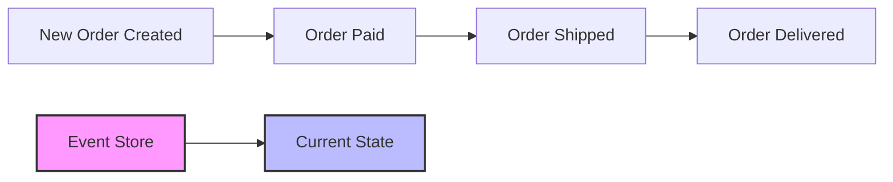
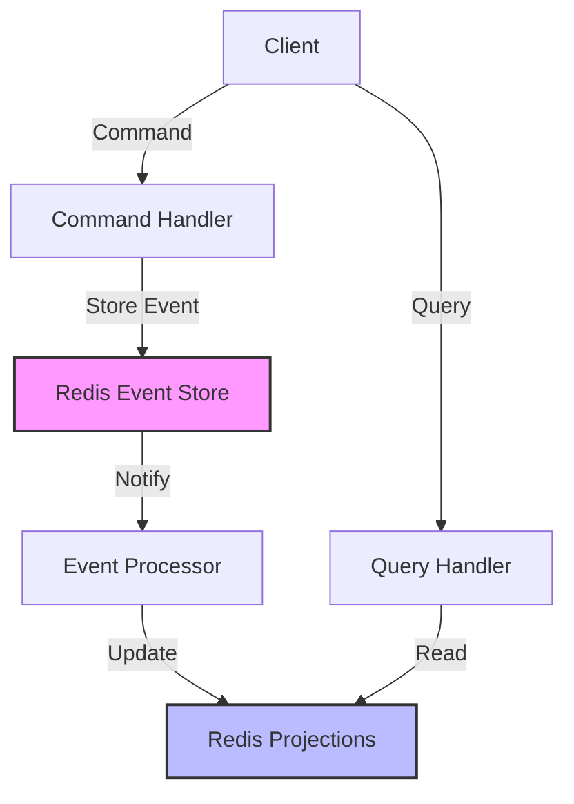

# Redis Event Sourcing

## Introduction

Event Sourcing is a powerful architectural pattern that changes how we think about state in our applications. Instead of storing the current state of an entity, event sourcing stores a sequence of state-changing events. Redis, with its speed and versatile data structures, provides an excellent foundation for implementing event sourcing patterns.

In this guide, we'll explore how Redis can be leveraged for event sourcing, providing you with a solid understanding of both the theoretical concepts and practical implementation details.

## What is Event Sourcing?

Event sourcing is an architectural pattern where:

1. Changes to application state are stored as a sequence of events
2. These events are the source of truth for the system
3. Current state can be reconstructed by replaying events
4. Historical state can be determined at any point in time

Let's visualize this concept:



## Why Redis for Event Sourcing?

Redis offers several features that make it ideal for implementing event sourcing:

- **Low Latency**: Redis provides sub-millisecond response times for read/write operations
- **Atomic Operations**: Redis commands are atomic, reducing concurrency issues
- **Persistence Options**: Redis supports various persistence mechanisms for durability
- **Pub/Sub Capabilities**: Redis pub/sub enables real-time event notification
- **Sorted Sets**: Perfect for time-ordered event sequences
- **Streams**: Purpose-built for event processing (introduced in Redis 5.0)

## Basic Redis Event Sourcing Implementation

Let's start with a simple implementation using Redis Lists to store events.

### Step 1: Define Event Structure

Events should be structured with at least:
- Event ID
- Timestamp
- Event Type
- Entity ID
- Payload (the data for the event)

Here's how you might represent an event in JSON:

```json
{
  "eventId": "evt-123456",
  "timestamp": 1625097600000,
  "eventType": "USER_REGISTERED",
  "entityId": "user-789",
  "payload": {
    "username": "johndoe",
    "email": "john@example.com",
    "registrationSource": "web"
  }
}
```

### Step 2: Storing Events in Redis

We'll use Redis Lists to store events for each entity:

```javascript
// Store a new event
async function storeEvent(entityId, eventType, payload) {
  const eventId = `evt-${Date.now()}-${Math.random().toString(36).substr(2, 9)}`;
  const timestamp = Date.now();
  
  const event = JSON.stringify({
    eventId,
    timestamp,
    eventType,
    entityId,
    payload
  });
  
  // Add to entity's event stream
  await redis.rpush(`events:${entityId}`, event);
  
  // Add to event type stream for querying
  await redis.rpush(`events:type:${eventType}`, event);
  
  // Publish event for real-time consumers
  await redis.publish('events', event);
  
  return { eventId, timestamp };
}

// Example usage
await storeEvent(
  'user-789', 
  'USER_REGISTERED', 
  {
    username: 'johndoe',
    email: 'john@example.com',
    registrationSource: 'web'
  }
);
```

### Step 3: Reconstructing Entity State

To get the current state of an entity, we need to replay all its events:

```javascript
async function getEntityState(entityId) {
  // Get all events for entity
  const events = await redis.lrange(`events:${entityId}`, 0, -1);
  
  // Initial state
  let state = {};
  
  // Apply each event to build current state
  for (const eventJson of events) {
    const event = JSON.parse(eventJson);
    state = applyEvent(state, event);
  }
  
  return state;
}

function applyEvent(state, event) {
  // Create a new state object (immutability)
  const newState = { ...state };
  
  switch (event.eventType) {
    case 'USER_REGISTERED':
      // Initialize user
      return {
        ...newState,
        id: event.entityId,
        username: event.payload.username,
        email: event.payload.email,
        createdAt: event.timestamp,
        isActive: true
      };
    
    case 'USER_EMAIL_CHANGED':
      // Update email
      return {
        ...newState,
        email: event.payload.newEmail,
        emailUpdatedAt: event.timestamp
      };
      
    case 'USER_DEACTIVATED':
      // Deactivate user
      return {
        ...newState,
        isActive: false,
        deactivatedAt: event.timestamp,
        deactivationReason: event.payload.reason
      };
    
    // Handle other event types
    default:
      return newState;
  }
}

// Example usage
const userState = await getEntityState('user-789');
console.log(userState);
// Output:
// {
//   id: 'user-789',
//   username: 'johndoe',
//   email: 'john@example.com',
//   createdAt: 1625097600000,
//   isActive: true
// }
```

## Advanced: Using Redis Streams

Redis Streams (introduced in Redis 5.0) are purpose-built for event processing and offer advantages over Lists:

- Unique message IDs with timestamps
- Consumer groups for parallel processing
- Stream trimming for managing size
- More efficient memory usage

Let's implement the same pattern with Streams:

```javascript
// Store a new event using Redis Streams
async function storeEventWithStreams(entityId, eventType, payload) {
  const eventId = `evt-${Date.now()}-${Math.random().toString(36).substr(2, 9)}`;
  
  // Event data as fields
  const eventData = {
    eventId,
    timestamp: Date.now().toString(),
    eventType,
    entityId,
    payload: JSON.stringify(payload)
  };
  
  // Add to entity's event stream
  const entityStreamId = await redis.xadd(`stream:entity:${entityId}`, '*', eventData);
  
  // Add to event type stream
  await redis.xadd(`stream:type:${eventType}`, '*', eventData);
  
  // Add to global event stream
  await redis.xadd('stream:events', '*', eventData);
  
  return { eventId, streamId: entityStreamId };
}

// Reconstruct entity state using streams
async function getEntityStateFromStreams(entityId) {
  // Get all events for entity from stream
  const events = await redis.xrange(`stream:entity:${entityId}`, '-', '+');
  
  // Initial state
  let state = {};
  
  // Apply each event to build current state
  for (const [streamId, fields] of events) {
    // Convert Redis response to event object
    const event = {
      streamId,
      eventId: fields.eventId,
      timestamp: parseInt(fields.timestamp),
      eventType: fields.eventType,
      entityId: fields.entityId,
      payload: JSON.parse(fields.payload)
    };
    
    state = applyEvent(state, event);
  }
  
  return state;
}

// Example usage
await storeEventWithStreams(
  'user-790', 
  'USER_REGISTERED', 
  {
    username: 'janedoe',
    email: 'jane@example.com',
    registrationSource: 'mobile'
  }
);

// Later retrieve state
const userState = await getEntityStateFromStreams('user-790');
```

## Projections with Redis Hashes

In an event sourcing system, projections are derived read models built from events. Redis Hashes provide an efficient way to store these projections:

```javascript
// Update projection when processing events
async function updateUserProjection(event) {
  if (event.entityId.startsWith('user-')) {
    const userId = event.entityId;
    
    switch (event.eventType) {
      case 'USER_REGISTERED':
        // Create user projection
        await redis.hset(
          `projection:user:${userId}`,
          'id', userId,
          'username', event.payload.username,
          'email', event.payload.email,
          'createdAt', event.timestamp,
          'isActive', '1'
        );
        break;
        
      case 'USER_EMAIL_CHANGED':
        // Update email in projection
        await redis.hset(
          `projection:user:${userId}`,
          'email', event.payload.newEmail,
          'emailUpdatedAt', event.timestamp
        );
        break;
        
      case 'USER_DEACTIVATED':
        // Update active status
        await redis.hset(
          `projection:user:${userId}`,
          'isActive', '0',
          'deactivatedAt', event.timestamp
        );
        break;
    }
  }
}

// Query projection directly (much faster than replaying events)
async function getUserProjection(userId) {
  const userData = await redis.hgetall(`projection:user:${userId}`);
  
  // Convert string values to appropriate types
  if (userData.createdAt) userData.createdAt = parseInt(userData.createdAt);
  if (userData.emailUpdatedAt) userData.emailUpdatedAt = parseInt(userData.emailUpdatedAt);
  if (userData.deactivatedAt) userData.deactivatedAt = parseInt(userData.deactivatedAt);
  if (userData.isActive) userData.isActive = userData.isActive === '1';
  
  return userData;
}
```

## Event Sourcing with CQRS

Event Sourcing pairs naturally with Command Query Responsibility Segregation (CQRS). In this pattern:

- Commands generate events (write model)
- Events update projections (read model)
- Queries read from projections, not event store

Let's see how this looks with Redis:



Implementation example:

```javascript
// Command Handler
async function handleRegisterUserCommand(command) {
  // Validate command
  validateRegisterUserCommand(command);
  
  // Generate userId
  const userId = `user-${Date.now()}-${Math.random().toString(36).substr(2, 9)}`;
  
  // Store event
  await storeEventWithStreams(
    userId,
    'USER_REGISTERED',
    {
      username: command.username,
      email: command.email,
      registrationSource: command.source
    }
  );
  
  return userId;
}

// Event Processor (listening to events)
redis.xread('BLOCK', 0, 'STREAMS', 'stream:events', '$', (err, streams) => {
  if (err) {
    console.error('Error reading stream:', err);
    return;
  }
  
  for (const [streamName, messages] of streams) {
    for (const [messageId, fields] of messages) {
      const event = {
        streamId: messageId,
        eventId: fields.eventId,
        timestamp: parseInt(fields.timestamp),
        eventType: fields.eventType,
        entityId: fields.entityId,
        payload: JSON.parse(fields.payload)
      };
      
      // Update projections based on event
      updateProjections(event);
    }
  }
});

// Query Handler
async function handleGetUserQuery(userId) {
  // Read from projection (not event store)
  return await getUserProjection(userId);
}
```

## Snapshots for Performance

For entities with many events, replaying all events can be slow. Snapshots solve this:

```javascript
// Create a snapshot of entity state
async function createSnapshot(entityId) {
  // Get current state by replaying events
  const state = await getEntityStateFromStreams(entityId);
  
  // Store state and last processed event ID
  const events = await redis.xrange(`stream:entity:${entityId}`, '-', '+');
  const lastEventId = events.length > 0 ? events[events.length - 1][0] : '0-0';
  
  await redis.hset(
    `snapshot:${entityId}`,
    'state', JSON.stringify(state),
    'lastEventId', lastEventId,
    'createdAt', Date.now().toString()
  );
  
  return { state, lastEventId };
}

// Get entity state using snapshots for efficiency
async function getEntityStateWithSnapshot(entityId) {
  // Check for snapshot
  const snapshot = await redis.hgetall(`snapshot:${entityId}`);
  
  if (!snapshot.state) {
    // No snapshot, replay all events
    return await getEntityStateFromStreams(entityId);
  }
  
  // Parse snapshot state
  let state = JSON.parse(snapshot.state);
  const lastSnapshotEventId = snapshot.lastEventId;
  
  // Get only events after the snapshot
  const newEvents = await redis.xrange(
    `stream:entity:${entityId}`, 
    `(${lastSnapshotEventId}`, // '(' means exclusive
    '+'
  );
  
  // Apply only new events to the snapshot state
  for (const [streamId, fields] of newEvents) {
    const event = {
      streamId,
      eventId: fields.eventId,
      timestamp: parseInt(fields.timestamp),
      eventType: fields.eventType,
      entityId: fields.entityId,
      payload: JSON.parse(fields.payload)
    };
    
    state = applyEvent(state, event);
  }
  
  return state;
}
```

## Real-World Example: E-Commerce Order Processing

Let's build a complete order processing system using Redis event sourcing:

```javascript
// Events in our domain
const ORDER_EVENTS = {
  ORDER_CREATED: 'ORDER_CREATED',
  PAYMENT_RECEIVED: 'PAYMENT_RECEIVED',
  ORDER_SHIPPED: 'ORDER_SHIPPED',
  ORDER_DELIVERED: 'ORDER_DELIVERED',
  ORDER_CANCELLED: 'ORDER_CANCELLED',
  REFUND_ISSUED: 'REFUND_ISSUED'
};

// Command: Create Order
async function createOrder(userId, items, shippingAddress) {
  const orderId = `order-${Date.now()}`;
  
  // Calculate totals
  const subtotal = items.reduce((sum, item) => sum + (item.price * item.quantity), 0);
  const tax = subtotal * 0.1; // 10% tax
  const total = subtotal + tax;
  
  // Store order created event
  await storeEventWithStreams(
    orderId,
    ORDER_EVENTS.ORDER_CREATED,
    {
      userId,
      items,
      shippingAddress,
      subtotal,
      tax,
      total,
      status: 'created'
    }
  );
  
  return orderId;
}

// Command: Process Payment
async function processPayment(orderId, paymentMethod, amount) {
  // Store payment received event
  await storeEventWithStreams(
    orderId,
    ORDER_EVENTS.PAYMENT_RECEIVED,
    {
      paymentMethod,
      amount,
      transactionId: `tx-${Date.now()}`,
      status: 'completed'
    }
  );
}

// Command: Ship Order
async function shipOrder(orderId, trackingNumber, carrier) {
  await storeEventWithStreams(
    orderId,
    ORDER_EVENTS.ORDER_SHIPPED,
    {
      trackingNumber,
      carrier,
      shippedAt: Date.now()
    }
  );
}

// Apply function for order events
function applyOrderEvent(state, event) {
  const newState = { ...state };
  
  switch (event.eventType) {
    case ORDER_EVENTS.ORDER_CREATED:
      return {
        ...event.payload,
        id: event.entityId,
        createdAt: event.timestamp,
        history: [{
          status: 'created',
          timestamp: event.timestamp
        }]
      };
      
    case ORDER_EVENTS.PAYMENT_RECEIVED:
      return {
        ...newState,
        paymentDetails: event.payload,
        status: 'paid',
        paidAt: event.timestamp,
        history: [
          ...newState.history || [],
          {
            status: 'paid',
            timestamp: event.timestamp
          }
        ]
      };
      
    case ORDER_EVENTS.ORDER_SHIPPED:
      return {
        ...newState,
        shippingDetails: event.payload,
        status: 'shipped',
        history: [
          ...newState.history || [],
          {
            status: 'shipped',
            timestamp: event.timestamp
          }
        ]
      };
      
    case ORDER_EVENTS.ORDER_DELIVERED:
      return {
        ...newState,
        status: 'delivered',
        deliveredAt: event.timestamp,
        history: [
          ...newState.history || [],
          {
            status: 'delivered',
            timestamp: event.timestamp
          }
        ]
      };
      
    case ORDER_EVENTS.ORDER_CANCELLED:
      return {
        ...newState,
        status: 'cancelled',
        cancellationReason: event.payload.reason,
        cancelledAt: event.timestamp,
        history: [
          ...newState.history || [],
          {
            status: 'cancelled',
            reason: event.payload.reason,
            timestamp: event.timestamp
          }
        ]
      };
      
    default:
      return newState;
  }
}

// Usage example
async function processOrderWorkflow() {
  // Create order
  const orderId = await createOrder(
    'user-123',
    [
      { productId: 'product-1', name: 'Widget', price: 19.99, quantity: 2 },
      { productId: 'product-2', name: 'Gadget', price: 29.99, quantity: 1 }
    ],
    {
      street: '123 Main St',
      city: 'Anytown',
      state: 'CA',
      zip: '12345',
      country: 'US'
    }
  );
  
  console.log(`Order created: ${orderId}`);
  
  // View order state
  let orderState = await getEntityStateWithSnapshot(orderId);
  console.log('Order created state:', orderState);
  
  // Process payment
  await processPayment(orderId, 'credit_card', orderState.total);
  orderState = await getEntityStateWithSnapshot(orderId);
  console.log('Order after payment:', orderState);
  
  // Ship order
  await shipOrder(orderId, '1Z999AA10123456784', 'UPS');
  orderState = await getEntityStateWithSnapshot(orderId);
  console.log('Order after shipping:', orderState);
}
```

## Benefits and Considerations

### Benefits of Redis Event Sourcing

1. **Complete Audit Trail**: Every change is stored as an immutable event
2. **Time Travel**: Replay events to any point in time
3. **Performance**: Redis is extremely fast for both reads and writes
4. **Scalability**: Event-based systems naturally scale horizontally
5. **Resilience**: Events can be replayed to recover from failures

### Considerations and Challenges

1. **Event Schema Evolution**: How to handle changes to event structures
2. **Eventual Consistency**: Projections might lag behind event store
3. **Storage Growth**: Events accumulate over time, requiring management
4. **Replay Performance**: Large event streams can be slow to replay
5. **Redis Persistence**: Configure appropriate persistence for your needs

## Summary

Redis provides a powerful foundation for implementing event sourcing patterns:

1. **Event Storage**: Redis Lists or Streams store event sequences
2. **Projections**: Redis Hashes store derived state for efficient querying
3. **Pub/Sub**: Redis Pub/Sub enables real-time event notifications
4. **Snapshots**: Redis Hashes store snapshots for performance optimization

Event sourcing with Redis offers a robust approach to building systems with complete audit trails, temporal query capabilities, and resilient state management.

## Exercises

1. Implement a simple blog post system using Redis event sourcing, with events like `POST_CREATED`, `POST_EDITED`, and `POST_PUBLISHED`.

2. Add a snapshot mechanism to your implementation that creates snapshots after every 10 events.

3. Create a projection that keeps track of all posts by a specific author, updated in real-time as events occur.

4. Implement a "time travel" feature that reconstructs entity state at a specific point in time.

5. Explore how you would handle event schema evolution when adding new fields to existing event types.

## Additional Resources

- [Redis Official Documentation](https://redis.io/documentation)
- [Redis Streams Introduction](https://redis.io/topics/streams-intro)
- [Event Sourcing Pattern](https://martinfowler.com/eaaDev/EventSourcing.html) by Martin Fowler
- [CQRS Pattern](https://martinfowler.com/bliki/CQRS.html) by Martin Fowler
- [Implementing Domain-Driven Design](https://www.amazon.com/Implementing-Domain-Driven-Design-Vaughn-Vernon/dp/0321834577) by Vaughn Vernon