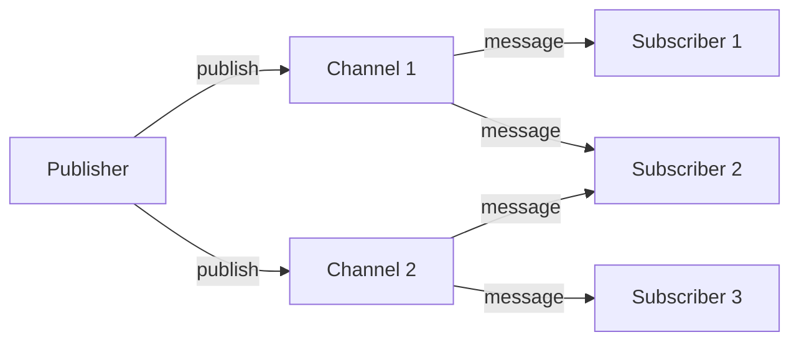
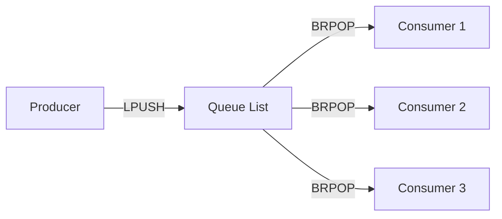
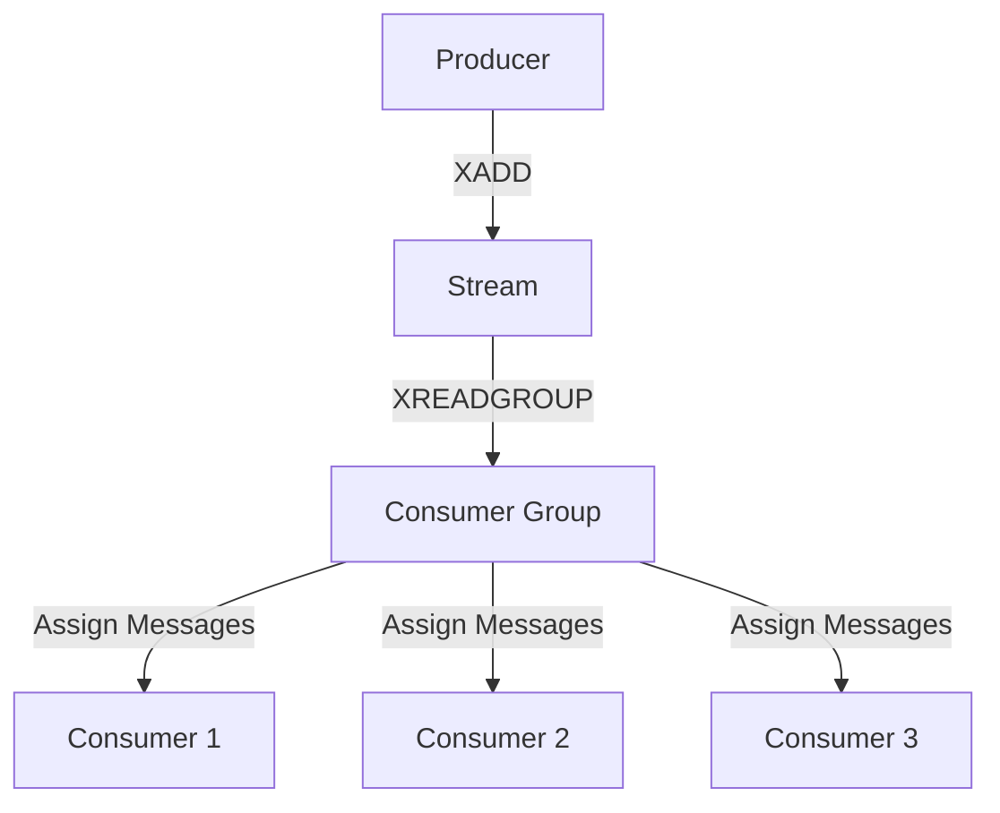
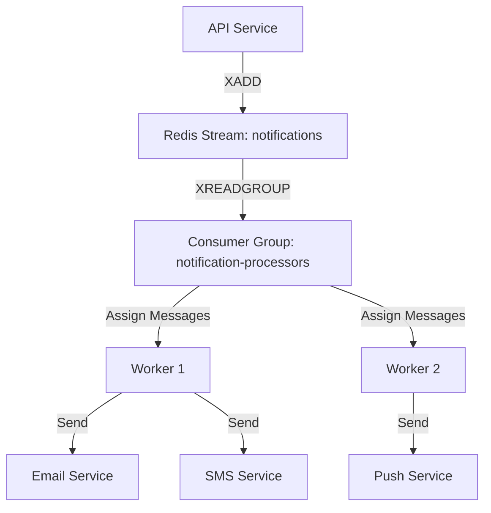

# Redis Message Broker

## Introduction

A message broker is a software intermediary that enables applications, systems, and services to communicate with each other by translating messages between formal messaging protocols. Redis, primarily known as an in-memory data store, can function as a lightweight and efficient message broker, making it an excellent choice for implementing communication patterns between distributed application components.

In this guide, we'll explore how to use Redis as a message broker, examining different messaging patterns, their implementation, advantages, and real-world use cases. By the end, you'll understand how to integrate Redis messaging capabilities into your applications to enable reliable communication between components.

## Why Use Redis as a Message Broker?

Before diving into implementation details, let's understand why Redis makes an excellent choice for message brokering:

- **Speed**: As an in-memory data store, Redis offers extremely low latency
- **Simplicity**: Redis has a straightforward API and requires minimal configuration
- **Versatility**: Supports multiple messaging patterns (Pub/Sub, Queues, Streams)
- **Lightweight**: Minimal resource footprint compared to dedicated message brokers
- **Scalability**: Can handle millions of messages per second
- **Persistence**: Optional persistence ensures message durability

While Redis may not offer all the features of dedicated message brokers like RabbitMQ or Apache Kafka, its simplicity and performance make it ideal for many messaging scenarios.

## Core Redis Messaging Patterns

Redis supports three primary messaging patterns:

1. **Publish/Subscribe (Pub/Sub)**: For broadcasting messages to multiple subscribers
2. **List-based Queues**: For simple point-to-point messaging and work queues
3. **Redis Streams**: For advanced stream processing with consumer groups

Let's explore each pattern in detail.

## Pattern 1: Pub/Sub (Publish/Subscribe)

The Pub/Sub pattern allows publishers to send messages to channels without knowledge of subscribers. Subscribers can listen to specific channels and receive all messages published to those channels.

### How Pub/Sub Works in Redis



### Basic Pub/Sub Implementation

Here's a simple example using Node.js with the `redis` package:

#### Publisher Example

```javascript
const redis = require('redis');

async function publishExample() {
  // Create a Redis client for publishing
  const publisher = redis.createClient();
  
  // Connect to Redis
  await publisher.connect();
  
  // Publish a message to a channel
  const channel = 'notifications';
  const message = JSON.stringify({
    type: 'alert',
    text: 'System maintenance scheduled',
    priority: 'high'
  });
  
  await publisher.publish(channel, message);
  console.log(`Published message to ${channel}`);
  
  // Close the connection
  await publisher.quit();
}

publishExample().catch(console.error);
```

#### Subscriber Example

```javascript
const redis = require('redis');

async function subscribeExample() {
  // Create a Redis client for subscribing
  const subscriber = redis.createClient();
  
  // Connect to Redis
  await subscriber.connect();
  
  // Subscribe to a channel
  await subscriber.subscribe('notifications', (message) => {
    const data = JSON.stringify(message);
    console.log(`Received message: ${data}`);
    console.log(`Message type: ${data.type}`);
    console.log(`Message text: ${data.text}`);
  });
  
  console.log('Subscribed to notifications channel');
  
  // Keep the connection open to receive messages
  // In a real application, you would handle disconnection differently
}

subscribeExample().catch(console.error);
```

### Pub/Sub Characteristics

- **No message persistence**: Messages are not stored and are lost if no subscribers are active
- **Fire-and-forget**: Publishers don't know if messages were delivered
- **Broadcast model**: All subscribers receive all messages
- **No message acknowledgment**: No way to confirm message processing

### Ideal Use Cases for Pub/Sub

- Real-time notifications
- Live dashboards or monitoring
- Chat applications
- Broadcasting configuration changes

## Pattern 2: List-based Queues

Redis lists can be used to implement simple queues for reliable point-to-point messaging, where messages are processed exactly once by a single consumer.

### How List-based Queues Work



Redis commands like `LPUSH` (left push) and `BRPOP` (blocking right pop) allow implementing reliable queues where multiple consumers can process messages from a single queue.

### Basic Queue Implementation

#### Producer Example

```javascript
const redis = require('redis');

async function producerExample() {
  const client = redis.createClient();
  await client.connect();
  
  const queueName = 'tasks:queue';
  const task = JSON.stringify({
    id: 'task-123',
    type: 'image-processing',
    data: {
      imagePath: '/uploads/image1.jpg',
      filters: ['grayscale', 'blur']
    }
  });
  
  // Push to the left side of the list
  await client.lPush(queueName, task);
  console.log(`Task added to queue ${queueName}`);
  
  await client.quit();
}

producerExample().catch(console.error);
```

#### Consumer Example

```javascript
const redis = require('redis');

async function consumerExample() {
  const client = redis.createClient();
  await client.connect();
  
  const queueName = 'tasks:queue';
  
  console.log(`Waiting for tasks from ${queueName}...`);
  
  // Process tasks in a loop
  while (true) {
    try {
      // Block until a message is available (timeout after 5 seconds)
      const result = await client.brPop(queueName, 5);
      
      if (result) {
        const [queue, taskJson] = result;
        const task = JSON.parse(taskJson);
        
        console.log(`Processing task: ${task.id}`);
        
        // Process the task (in a real app, this might be more complex)
        await processTask(task);
        
        console.log(`Task ${task.id} completed`);
      }
    } catch (err) {
      console.error('Error processing task:', err);
    }
  }
}

async function processTask(task) {
  // Simulate processing time
  console.log(`Applying ${task.data.filters.join(', ')} to ${task.data.imagePath}`);
  await new Promise(resolve => setTimeout(resolve, 1000));
}

consumerExample().catch(console.error);
```

### Queue Characteristics

- **Message durability**: Messages persist in Redis until processed
- **Work distribution**: Each message is processed by exactly one consumer
- **Consumer competition**: Multiple consumers can compete for messages
- **FIFO processing**: First in, first out order (by default)

### Ideal Use Cases for Queues

- Task queues for background jobs
- Work distribution systems
- Batch processing
- Rate limiting and throttling

## Pattern 3: Redis Streams

Introduced in Redis 5.0, Streams provide the most advanced messaging capabilities, combining features of both pub/sub and queues with additional benefits like message persistence, consumer groups, and message acknowledgment.

### How Redis Streams Work



### Basic Streams Implementation

#### Producer with Streams

```javascript
const redis = require('redis');

async function streamProducerExample() {
  const client = redis.createClient();
  await client.connect();
  
  const streamKey = 'orders:stream';
  
  // Create an order
  const order = {
    orderId: 'ord-456',
    userId: 'user-789',
    items: ['product-1', 'product-2'],
    total: 67.99
  };
  
  // Add to stream with auto-generated ID
  const id = await client.xAdd(streamKey, '*', {
    orderId: order.orderId,
    userId: order.userId,
    items: JSON.stringify(order.items),
    total: order.total.toString()
  });
  
  console.log(`Added order to stream with ID: ${id}`);
  
  await client.quit();
}

streamProducerExample().catch(console.error);
```

#### Consumer Group with Streams

```javascript
const redis = require('redis');

async function streamConsumerExample() {
  const client = redis.createClient();
  await client.connect();
  
  const streamKey = 'orders:stream';
  const groupName = 'order-processors';
  const consumerName = `consumer-${Math.floor(Math.random() * 1000)}`;
  
  try {
    // Create consumer group (OK if already exists)
    await client.xGroupCreate(streamKey, groupName, '0', {
      MKSTREAM: true
    }).catch(() => console.log('Group already exists'));
    
    console.log(`Consumer ${consumerName} waiting for messages...`);
    
    // Process messages in a loop
    while (true) {
      try {
        // Read new messages for this consumer
        const streams = await client.xReadGroup(
          groupName,
          consumerName,
          [
            {
              key: streamKey,
              id: '>' // Only new messages
            }
          ],
          {
            COUNT: 1,    // Process one message at a time
            BLOCK: 5000  // Block for 5 seconds
          }
        );
        
        // Process messages if any received
        if (streams && streams.length > 0) {
          const messages = streams[0].messages;
          
          for (const message of messages) {
            const { id, message: data } = message;
            
            console.log(`Processing order: ${data.orderId}`);
            
            // Process the order
            await processOrder(data);
            
            // Acknowledge the message
            await client.xAck(streamKey, groupName, id);
            console.log(`Acknowledged message ${id}`);
          }
        }
      } catch (err) {
        console.error('Error processing message:', err);
      }
    }
  } catch (err) {
    console.error('Failed to set up consumer:', err);
    await client.quit();
  }
}

async function processOrder(data) {
  // Parse the items JSON string back to an array
  const items = JSON.parse(data.items);
  
  console.log(`Processing order ${data.orderId} for user ${data.userId}`);
  console.log(`Items: ${items.join(', ')}`);
  console.log(`Total: $${data.total}`);
  
  // Simulate processing time
  await new Promise(resolve => setTimeout(resolve, 1000));
}

streamConsumerExample().catch(console.error);
```

### Stream Characteristics

- **Persistence**: Messages remain in the stream until explicitly trimmed
- **Message IDs**: Each message has a unique ID for tracking
- **Consumer groups**: Multiple consumers can work together as a group
- **Message acknowledgment**: Explicit acknowledgment ensures processing
- **Last position tracking**: Consumers can pick up from where they left off
- **Reprocessing capability**: Unacknowledged messages can be reprocessed

### Ideal Use Cases for Streams

- Event sourcing
- Activity feeds
- IoT data processing
- Log processing
- Real-time analytics
- Reliable work queues with acknowledgment

## Comparing Redis Messaging Patterns

| Feature | Pub/Sub | List-based Queues | Streams |
|---------|---------|-------------------|---------|
| Message persistence | No | Yes | Yes |
| Delivery guarantee | At-most-once | At-least-once | Exactly-once (with proper acks) |
| Multiple consumers per message | Yes | No | Configurable |
| Consumer groups | No | No | Yes |
| Backpressure handling | No | Yes | Yes |
| Message acknowledgment | No | Implicit | Explicit |
| Ordering guarantee | Yes | Yes | Yes |
| Message history | No | No | Yes |
| Complexity | Low | Low | Medium |

## Real-world Application: Notification Service

Let's build a simple notification service that demonstrates the use of Redis as a message broker. This service will:

1. Accept notification requests
2. Process notifications in the background
3. Deliver notifications through different channels (email, SMS, push)

### Architecture



### Notification Producer

```javascript
const redis = require('redis');
const express = require('express');

async function startNotificationAPI() {
  // Create Redis client
  const client = redis.createClient();
  await client.connect();
  
  // Create Express app
  const app = express();
  app.use(express.json());
  
  // API endpoint to send notifications
  app.post('/api/notifications', async (req, res) => {
    try {
      const { userId, type, message, channels } = req.body;
      
      // Validate request
      if (!userId || !message || !channels || !Array.isArray(channels)) {
        return res.status(400).json({ error: 'Invalid notification request' });
      }
      
      // Add notification to Redis Stream
      const id = await client.xAdd(
        'notifications:stream',
        '*',
        {
          userId,
          type: type || 'info',
          message,
          channels: JSON.stringify(channels),
          timestamp: Date.now().toString()
        }
      );
      
      console.log(`Notification queued with ID: ${id}`);
      
      return res.status(202).json({
        id,
        status: 'queued',
        message: 'Notification has been queued for delivery'
      });
    } catch (error) {
      console.error('Failed to queue notification:', error);
      return res.status(500).json({ error: 'Failed to process notification' });
    }
  });
  
  // Start server
  const PORT = process.env.PORT || 3000;
  app.listen(PORT, () => {
    console.log(`Notification API running on port ${PORT}`);
  });
}

startNotificationAPI().catch(console.error);
```

### Notification Consumer

```javascript
const redis = require('redis');

async function startNotificationWorker() {
  // Create Redis client
  const client = redis.createClient();
  await client.connect();
  
  const streamKey = 'notifications:stream';
  const groupName = 'notification-processors';
  const consumerName = `worker-${Math.floor(Math.random() * 1000)}`;
  
  try {
    // Create consumer group if it doesn't exist
    await client.xGroupCreate(streamKey, groupName, '0', {
      MKSTREAM: true
    }).catch(() => console.log('Group already exists'));
    
    console.log(`Notification worker ${consumerName} started`);
    
    // Process notifications in a loop
    while (true) {
      try {
        // Read new notifications
        const streams = await client.xReadGroup(
          groupName,
          consumerName,
          [
            {
              key: streamKey,
              id: '>' // Only new messages
            }
          ],
          {
            COUNT: 5,    // Process 5 at a time
            BLOCK: 5000  // Block for 5 seconds
          }
        );
        
        // Process notifications if any received
        if (streams && streams.length > 0) {
          const messages = streams[0].messages;
          
          for (const message of messages) {
            const { id, message: notification } = message;
            
            try {
              console.log(`Processing notification ${id} for user ${notification.userId}`);
              
              // Parse channels
              const channels = JSON.parse(notification.channels);
              
              // Process each channel
              for (const channel of channels) {
                await sendNotification(channel, notification);
              }
              
              // Acknowledge after successful processing
              await client.xAck(streamKey, groupName, id);
              console.log(`Notification ${id} processed successfully`);
            } catch (err) {
              console.error(`Error processing notification ${id}:`, err);
              // In production, you'd implement retry logic or dead letter queue
            }
          }
        }
      } catch (err) {
        console.error('Error reading from stream:', err);
      }
    }
  } catch (err) {
    console.error('Failed to set up worker:', err);
    await client.quit();
  }
}

async function sendNotification(channel, notification) {
  // In a real implementation, these would connect to actual services
  switch (channel.toLowerCase()) {
    case 'email':
      console.log(`EMAIL to User ${notification.userId}: ${notification.message}`);
      await simulateDelivery(500);
      break;
    case 'sms':
      console.log(`SMS to User ${notification.userId}: ${notification.message}`);
      await simulateDelivery(300);
      break;
    case 'push':
      console.log(`PUSH to User ${notification.userId}: ${notification.message}`);
      await simulateDelivery(200);
      break;
    default:
      console.log(`Unknown channel: ${channel}`);
  }
}

async function simulateDelivery(ms) {
  return new Promise(resolve => setTimeout(resolve, ms));
}

startNotificationWorker().catch(console.error);
```

## Best Practices for Redis Message Brokers

### General Best Practices

1. **Use appropriate pattern** for your use case:
   - Pub/Sub for real-time broadcasting
   - Lists for simple work queues
   - Streams for reliable messaging with acknowledgments

2. **Implement proper error handling**:
   - Handle Redis connection errors
   - Implement retries for failed operations
   - Use circuit breakers for dependent services

3. **Monitor Redis performance**:
   - Watch memory usage
   - Monitor queue lengths
   - Set up alerts for abnormal patterns

4. **Use Redis persistence** for critical messages:
   - Configure AOF (Append-Only File) persistence
   - Enable RDB snapshots
   - Consider Redis Cluster for high availability

### Pattern-Specific Best Practices

#### For Pub/Sub

- Keep messages small and serialized (JSON/Protocol Buffers)
- Implement heartbeat mechanisms for critical subscribers
- Use channel naming conventions (e.g., namespacing)

#### For List-based Queues

- Implement visibility timeouts for long-running tasks
- Use separate lists for different priorities
- Consider using reliable queue patterns with backup lists

#### For Streams

- Set appropriate stream length limits with MAXLEN
- Use consumer groups for parallel processing
- Implement periodic checks for pending messages
- Process messages idempotently for retry safety

## Common Challenges and Solutions

### Challenge 1: Message Loss

**Solution**:
- For critical messages, use Streams with persistence enabled
- Implement acknowledgment-based processing
- Periodically check for pending messages

### Challenge 2: High Memory Usage

**Solution**:
- Set appropriate MAXLEN for streams
- Trim lists periodically
- Monitor memory usage and implement alerting

### Challenge 3: Scaling Consumers

**Solution**:
- Use consumer groups with Streams
- Implement worker pools with dynamic scaling
- Balance processing across multiple Redis instances

### Challenge 4: Message Ordering

**Solution**:
- Use a single partition (stream/list) for strict ordering
- Implement sequence numbers if using multiple streams
- Consider using hash tags with Redis Cluster

## Summary

Redis provides multiple ways to implement message broker patterns, each with different trade-offs:

- **Pub/Sub**: Simple, lightweight broadcasting without persistence
- **List-based Queues**: Simple, reliable point-to-point messaging
- **Streams**: Advanced, reliable messaging with consumer groups and acknowledgments

The choice of pattern depends on your specific requirements for reliability, persistence, scalability, and message delivery guarantees. For simple, real-time broadcasting, Pub/Sub is sufficient. For reliable work queues, List-based queues work well. For more complex scenarios requiring message history, acknowledgments, and consumer groups, Streams are the best choice.

Redis as a message broker shines in scenarios where simplicity, performance, and low latency are priorities. While it may not replace dedicated message brokers for all use cases, it provides an excellent lightweight alternative that leverages Redis' speed and simplicity.

## Exercises

1. **Basic Pub/Sub**:
   Implement a simple chat application using Redis Pub/Sub where users can join different chat rooms.

2. **Work Queue**:
   Create a background job processor using Redis lists to handle image resizing tasks.

3. **Event Sourcing**:
   Use Redis Streams to implement an event sourcing pattern for user activity tracking.

4. **Reliability Testing**:
   Implement a notification system with Redis Streams and test its behavior during network failures.

5. **Performance Benchmarking**:
   Compare the throughput of different Redis messaging patterns under various loads.

## Additional Resources

- [Redis Official Documentation on Pub/Sub](https://redis.io/topics/pubsub)
- [Redis Streams Introduction](https://redis.io/topics/streams-intro)
- [Redis Queue Patterns](https://redis.com/redis-best-practices/messaging-patterns/redis-queue/)
- [Redis University Courses](https://university.redis.com/)
- [Node.js Redis Client Documentation](https://github.com/redis/node-redis)