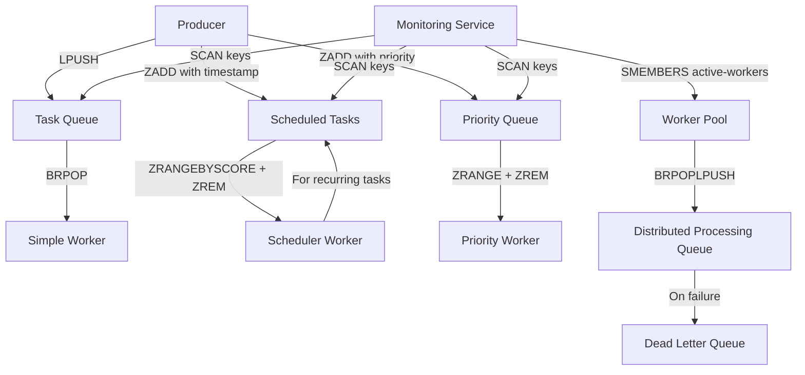

# Redis Task Scheduling

## Introduction

Task scheduling is a critical component in modern applications, allowing developers to execute code at specific times or in response to certain events. Redis, primarily known as an in-memory data store, can be effectively used as a lightweight and efficient task scheduler for many applications.

In this guide, we'll explore how to implement various task scheduling patterns using Redis. We'll cover delayed execution, recurring jobs, priority queues, and distributed workloads - all powered by Redis's speed and versatility.

## Why Use Redis for Task Scheduling?

Before diving into implementation details, let's understand why Redis makes an excellent choice for task scheduling:

- **Performance**: Redis is incredibly fast, with operations typically measured in microseconds
- **Simplicity**: Redis provides primitive operations that can be combined to create scheduling patterns
- **Reliability**: Redis offers persistence options to prevent task loss during restarts
- **Scalability**: Redis can handle thousands of scheduled tasks per second
- **Visibility**: Redis allows easy inspection of pending and processing tasks

## Basic Concepts

### Redis Data Structures for Scheduling

Redis offers several data structures that are particularly useful for task scheduling:

- **Lists**: For simple FIFO (First-In-First-Out) job queues
- **Sorted Sets**: Perfect for time-based scheduling with scores as timestamps
- **Pub/Sub**: For immediate notification of events
- **Hashes**: For storing job details and metadata

### Task Queue vs. Scheduled Tasks

It's important to distinguish between these two patterns:

1. **Task Queue**: Tasks that should be executed as soon as possible, in sequence
2. **Scheduled Tasks**: Tasks that should be executed at a specific future time

Redis can handle both patterns effectively, as we'll see in the implementations below.

## Simple Task Queue Implementation

Let's start with a basic task queue implementation using Redis lists:

```javascript
// Using Node.js with the ioredis client
const Redis = require('ioredis');
const redis = new Redis();

// Producer: Add a task to the queue
async function enqueueTask(queueName, taskData) {
  const task = JSON.stringify(taskData);
  await redis.lpush(queueName, task);
  console.log(`Task added to queue ${queueName}`);
}

// Consumer: Process tasks from the queue
async function processQueue(queueName) {
  while (true) {
    // BRPOP blocks until an element is available, then returns and removes it
    const result = await redis.brpop(queueName, 0);
    
    if (result) {
      const [queue, taskJSON] = result;
      const task = JSON.parse(taskJSON);
      
      console.log(`Processing task from ${queue}:`, task);
      
      try {
        // Process the task (implementation depends on your use case)
        await processTask(task);
        console.log('Task completed successfully');
      } catch (error) {
        console.error('Error processing task:', error);
        // Optionally handle failed tasks (retry, move to dead letter queue, etc.)
      }
    }
  }
}

// Example task processing function
async function processTask(task) {
  // This would contain your actual task execution logic
  console.log(`Executing task: ${task.name}`);
  await new Promise(resolve => setTimeout(resolve, 1000)); // Simulate work
  console.log(`Task execution completed for: ${task.name}`);
}

// Example usage
enqueueTask('simple-tasks', { name: 'send-welcome-email', user: 'user123', template: 'welcome' });
processQueue('simple-tasks');
```

**Output:**
```
Task added to queue simple-tasks
Processing task from simple-tasks: { name: 'send-welcome-email', user: 'user123', template: 'welcome' }
Executing task: send-welcome-email
Task execution completed for: send-welcome-email
Task completed successfully
```

This basic implementation demonstrates:
- Using `LPUSH` to add tasks to the queue
- Using `BRPOP` to wait for and retrieve tasks
- Processing tasks as they arrive

## Delayed Task Scheduling

For tasks that need to be executed at a specific time in the future, Redis sorted sets are an excellent choice:

```javascript
const Redis = require('ioredis');
const redis = new Redis();

// Schedule a task to run at a specific time
async function scheduleTask(taskData, executeAt) {
  const taskId = `task:${Date.now()}:${Math.random().toString(36).substring(2, 10)}`;
  const score = executeAt.getTime();
  
  // Store task details in a hash
  await redis.hset(
    taskId,
    'data', JSON.stringify(taskData),
    'status', 'scheduled',
    'createdAt', Date.now()
  );
  
  // Add to the sorted set with the execution timestamp as score
  await redis.zadd('scheduled-tasks', score, taskId);
  
  console.log(`Task ${taskId} scheduled for ${executeAt.toISOString()}`);
  return taskId;
}

// Worker to process tasks that are due
async function processScheduledTasks() {
  while (true) {
    const now = Date.now();
    
    // Get tasks that are due (score <= current time)
    const tasks = await redis.zrangebyscore('scheduled-tasks', 0, now);
    
    if (tasks.length === 0) {
      // No tasks due yet, wait a bit
      await new Promise(resolve => setTimeout(resolve, 1000));
      continue;
    }
    
    for (const taskId of tasks) {
      // Atomically remove the task from the scheduled set
      // Only proceed if removal was successful (prevents race conditions)
      const removed = await redis.zrem('scheduled-tasks', taskId);
      
      if (removed === 1) {
        // Get task details
        const taskDetails = await redis.hgetall(taskId);
        
        if (!taskDetails.data) {
          console.error(`Task ${taskId} data not found`);
          continue;
        }
        
        try {
          // Update status to processing
          await redis.hset(taskId, 'status', 'processing', 'startedAt', Date.now());
          
          // Process the task
          const taskData = JSON.parse(taskDetails.data);
          console.log(`Executing scheduled task ${taskId}:`, taskData);
          
          await processTask(taskData);
          
          // Update status to completed
          await redis.hset(taskId, 'status', 'completed', 'completedAt', Date.now());
          console.log(`Task ${taskId} completed successfully`);
          
          // Optionally remove the task data after completion
          // await redis.del(taskId);
        } catch (error) {
          console.error(`Error processing task ${taskId}:`, error);
          await redis.hset(
            taskId, 
            'status', 'failed',
            'error', error.message,
            'failedAt', Date.now()
          );
        }
      }
    }
  }
}

// Example task processing function
async function processTask(task) {
  console.log(`Executing task: ${task.name}`);
  await new Promise(resolve => setTimeout(resolve, 1000)); // Simulate work
  console.log(`Task execution completed for: ${task.name}`);
}

// Example usage
const futureTime = new Date();
futureTime.setSeconds(futureTime.getSeconds() + 10); // 10 seconds from now

scheduleTask({ name: 'send-reminder-email', user: 'user456', template: 'reminder' }, futureTime);
processScheduledTasks();
```

**Output:**
```
Task task:1644329404123:x8j2m9p7 scheduled for 2022-02-08T15:03:24.123Z
[10 seconds later]
Executing scheduled task task:1644329404123:x8j2m9p7: { name: 'send-reminder-email', user: 'user456', template: 'reminder' }
Executing task: send-reminder-email
Task execution completed for: send-reminder-email
Task task:1644329404123:x8j2m9p7 completed successfully
```

This implementation:
- Uses sorted sets with timestamps as scores
- Stores task details in Redis hashes
- Periodically checks for due tasks
- Updates task status throughout processing
- Prevents race conditions when multiple workers are running

## Recurring Jobs

For tasks that need to run on a schedule (like cron jobs), we can extend our delayed task implementation:

```javascript
const Redis = require('ioredis');
const redis = new Redis();

// Schedule a recurring task
async function scheduleRecurringTask(taskData, interval, initialDelay = 0) {
  const taskId = `recurring:${Date.now()}:${Math.random().toString(36).substring(2, 10)}`;
  
  // Store task details and recurrence information
  await redis.hset(
    taskId,
    'data', JSON.stringify(taskData),
    'interval', interval,
    'status', 'scheduled',
    'createdAt', Date.now()
  );
  
  // Schedule the first execution
  const firstRun = Date.now() + initialDelay;
  await redis.zadd('scheduled-tasks', firstRun, taskId);
  
  console.log(`Recurring task ${taskId} scheduled, first run in ${initialDelay}ms, then every ${interval}ms`);
  return taskId;
}

// Enhanced worker to handle recurring tasks
async function processScheduledTasksWithRecurrence() {
  while (true) {
    const now = Date.now();
    
    // Get tasks that are due
    const tasks = await redis.zrangebyscore('scheduled-tasks', 0, now);
    
    if (tasks.length === 0) {
      await new Promise(resolve => setTimeout(resolve, 1000));
      continue;
    }
    
    for (const taskId of tasks) {
      const removed = await redis.zrem('scheduled-tasks', taskId);
      
      if (removed === 1) {
        const taskDetails = await redis.hgetall(taskId);
        
        if (!taskDetails.data) {
          console.error(`Task ${taskId} data not found`);
          continue;
        }
        
        // Check if this is a recurring task
        const isRecurring = taskId.startsWith('recurring:') && taskDetails.interval;
        
        try {
          await redis.hset(taskId, 'status', 'processing', 'startedAt', Date.now());
          
          const taskData = JSON.parse(taskDetails.data);
          console.log(`Executing ${isRecurring ? 'recurring ' : ''}task ${taskId}:`, taskData);
          
          await processTask(taskData);
          
          await redis.hset(taskId, 'status', 'completed', 'completedAt', Date.now());
          console.log(`Task ${taskId} completed successfully`);
          
          // If recurring, schedule the next execution
          if (isRecurring) {
            const interval = parseInt(taskDetails.interval, 10);
            const nextRun = Date.now() + interval;
            
            console.log(`Rescheduling recurring task ${taskId} for ${new Date(nextRun).toISOString()}`);
            await redis.zadd('scheduled-tasks', nextRun, taskId);
            await redis.hset(taskId, 'status', 'scheduled', 'lastRun', Date.now());
          }
        } catch (error) {
          console.error(`Error processing task ${taskId}:`, error);
          await redis.hset(
            taskId, 
            'status', 'failed',
            'error', error.message,
            'failedAt', Date.now()
          );
          
          // Even if it fails, reschedule recurring tasks
          if (isRecurring) {
            const interval = parseInt(taskDetails.interval, 10);
            const nextRun = Date.now() + interval;
            
            console.log(`Rescheduling recurring task ${taskId} despite failure for ${new Date(nextRun).toISOString()}`);
            await redis.zadd('scheduled-tasks', nextRun, taskId);
            await redis.hset(taskId, 'status', 'scheduled', 'lastRun', Date.now());
          }
        }
      }
    }
  }
}

// Example usage
scheduleRecurringTask(
  { name: 'cleanup-expired-sessions', action: 'cleanup' },
  60000,  // Run every minute
  5000    // First run after 5 seconds
);

processScheduledTasksWithRecurrence();
```

**Output:**
```
Recurring task recurring:1644329604123:j2k4l5m6 scheduled, first run in 5000ms, then every 60000ms
[5 seconds later]
Executing recurring task recurring:1644329604123:j2k4l5m6: { name: 'cleanup-expired-sessions', action: 'cleanup' }
Executing task: cleanup-expired-sessions
Task execution completed for: cleanup-expired-sessions
Task recurring:1644329604123:j2k4l5m6 completed successfully
Rescheduling recurring task recurring:1644329604123:j2k4l5m6 for 2022-02-08T15:07:09.123Z
[60 seconds later]
Executing recurring task recurring:1644329604123:j2k4l5m6: { name: 'cleanup-expired-sessions', action: 'cleanup' }
...
```

This implementation:
- Adds interval information to task metadata
- Automatically reschedules recurring tasks after execution
- Handles failure cases by still rescheduling the task
- Maintains a consistent schedule regardless of execution time

## Priority Queue Implementation

Sometimes tasks need to be processed based on priority rather than just timing. Redis sorted sets can be used for priority queues as well:

```javascript
const Redis = require('ioredis');
const redis = new Redis();

// Enqueue a task with priority (lower number = higher priority)
async function enqueuePriorityTask(queueName, taskData, priority = 10) {
  const taskId = `task:${Date.now()}:${Math.random().toString(36).substring(2, 10)}`;
  
  // Store task details
  await redis.hset(
    taskId,
    'data', JSON.stringify(taskData),
    'priority', priority,
    'status', 'queued',
    'queuedAt', Date.now()
  );
  
  // Add to the priority queue (sorted set)
  await redis.zadd(`priority-queue:${queueName}`, priority, taskId);
  
  console.log(`Task ${taskId} added to priority queue ${queueName} with priority ${priority}`);
  return taskId;
}

// Process tasks from a priority queue
async function processPriorityQueue(queueName) {
  const queueKey = `priority-queue:${queueName}`;
  
  while (true) {
    // Get the highest priority task (lowest score)
    const tasks = await redis.zrange(queueKey, 0, 0);
    
    if (tasks.length === 0) {
      // No tasks available, wait a bit
      await new Promise(resolve => setTimeout(resolve, 1000));
      continue;
    }
    
    const taskId = tasks[0];
    
    // Try to remove it from the queue (atomic operation)
    const removed = await redis.zrem(queueKey, taskId);
    
    if (removed === 1) {
      const taskDetails = await redis.hgetall(taskId);
      
      if (!taskDetails.data) {
        console.error(`Task ${taskId} data not found`);
        continue;
      }
      
      try {
        await redis.hset(taskId, 'status', 'processing', 'startedAt', Date.now());
        
        const taskData = JSON.parse(taskDetails.data);
        console.log(`Processing priority task ${taskId} (priority ${taskDetails.priority}):`, taskData);
        
        await processTask(taskData);
        
        await redis.hset(taskId, 'status', 'completed', 'completedAt', Date.now());
        console.log(`Priority task ${taskId} completed successfully`);
      } catch (error) {
        console.error(`Error processing task ${taskId}:`, error);
        await redis.hset(
          taskId, 
          'status', 'failed',
          'error', error.message,
          'failedAt', Date.now()
        );
        
        // You could implement retry logic here if needed
      }
    }
  }
}

// Example usage
// Add some tasks with different priorities
enqueuePriorityTask('email-notifications', { name: 'password-reset', user: 'user789' }, 1);  // Highest priority
enqueuePriorityTask('email-notifications', { name: 'weekly-newsletter', user: 'user012' }, 5);  // Medium priority
enqueuePriorityTask('email-notifications', { name: 'promotional-offer', user: 'user345' }, 10);  // Lowest priority

// Start processing the queue
processPriorityQueue('email-notifications');
```

**Output:**
```
Task task:1644330004123:a1b2c3d4 added to priority queue email-notifications with priority 1
Task task:1644330004124:e5f6g7h8 added to priority queue email-notifications with priority 5
Task task:1644330004125:i9j0k1l2 added to priority queue email-notifications with priority 10
Processing priority task task:1644330004123:a1b2c3d4 (priority 1): { name: 'password-reset', user: 'user789' }
Executing task: password-reset
Task execution completed for: password-reset
Priority task task:1644330004123:a1b2c3d4 completed successfully
Processing priority task task:1644330004124:e5f6g7h8 (priority 5): { name: 'weekly-newsletter', user: 'user012' }
...
```

## Distributed Task Processing

For high-throughput applications, we can use multiple worker processes to handle tasks. Redis provides the atomicity we need to ensure tasks are processed exactly once:

```javascript
const Redis = require('ioredis');
const { v4: uuidv4 } = require('uuid');
const os = require('os');

// Create a unique worker ID
const workerId = `worker:${os.hostname()}:${process.pid}:${uuidv4()}`;

// Function to start a worker
function startWorker(queueName) {
  const redis = new Redis();
  
  console.log(`Starting worker ${workerId} for queue ${queueName}`);
  
  // Register this worker as active
  redis.sadd('active-workers', workerId);
  redis.hset(`worker:${workerId}`, 
    'queue', queueName,
    'started', Date.now(),
    'host', os.hostname(),
    'pid', process.pid
  );
  
  // Cleanup on exit
  process.on('SIGTERM', async () => {
    console.log(`Worker ${workerId} shutting down`);
    await redis.srem('active-workers', workerId);
    await redis.del(`worker:${workerId}`);
    process.exit(0);
  });
  
  // Start processing loop
  processQueue(redis, queueName, workerId);
}

// Process tasks from a queue
async function processQueue(redis, queueName, workerId) {
  const processingSet = `processing:${workerId}`;
  
  while (true) {
    try {
      // Atomic operation: move a task from the queue to our processing set
      // This script is equivalent to a reliable queue implementation with BRPOPLPUSH
      // but using a blocking call for efficiency
      const task = await redis.brpoplpush(queueName, processingSet, 5);
      
      if (!task) {
        // Timeout reached, try again
        continue;
      }
      
      let taskData;
      try {
        taskData = JSON.parse(task);
        console.log(`Worker ${workerId} processing task:`, taskData);
        
        // Update worker status
        await redis.hset(`worker:${workerId}`, 
          'currentTask', task,
          'taskStarted', Date.now()
        );
        
        // Process the task
        await processTask(taskData);
        
        console.log(`Worker ${workerId} completed task successfully`);
      } catch (error) {
        console.error(`Worker ${workerId} encountered an error:`, error);
        
        // Move to a dead-letter queue for inspection
        await redis.lpush(`${queueName}:failed`, task);
        await redis.hset(`failed:${Date.now()}`, 
          'task', task,
          'error', error.message,
          'worker', workerId
        );
      } finally {
        // Always remove the task from our processing set
        await redis.lrem(processingSet, 1, task);
        
        // Update worker status
        await redis.hdel(`worker:${workerId}`, 'currentTask', 'taskStarted');
      }
    } catch (error) {
      console.error(`Worker ${workerId} loop error:`, error);
      // Brief pause on error to prevent tight loop
      await new Promise(resolve => setTimeout(resolve, 1000));
    }
  }
}

// Example task processing function
async function processTask(task) {
  console.log(`Executing task: ${task.name}`);
  await new Promise(resolve => setTimeout(resolve, 
    // Simulate variable work time
    Math.floor(Math.random() * 2000) + 500
  ));
  console.log(`Task execution completed for: ${task.name}`);
  
  // Simulate occasional failures
  if (Math.random() < 0.1) {
    throw new Error('Random task failure');
  }
}

// Example producer to generate tasks
async function produceTasks(queueName, count) {
  const redis = new Redis();
  
  for (let i = 0; i < count; i++) {
    const task = {
      id: `task-${i}`,
      name: `job-${i}`,
      data: { value: Math.floor(Math.random() * 100) },
      createdAt: Date.now()
    };
    
    await redis.lpush(queueName, JSON.stringify(task));
    console.log(`Added task to queue ${queueName}:`, task.name);
    
    // Add some randomness to task creation
    await new Promise(resolve => setTimeout(resolve, Math.floor(Math.random() * 500)));
  }
}

// Start multiple workers
for (let i = 0; i < 3; i++) {
  startWorker('distributed-tasks');
}

// Generate some tasks
produceTasks('distributed-tasks', 10);
```

**Output:**
```
Starting worker worker:macbook-pro:12345:a1b2c3d4-e5f6-g7h8-i9j0-k1l2m3n4o5p6 for queue distributed-tasks
Starting worker worker:macbook-pro:12346:q7r8s9t0-u1v2-w3x4-y5z6-a7b8c9d0e1f2 for queue distributed-tasks
Starting worker worker:macbook-pro:12347:g3h4i5j6-k7l8-m9n0-o1p2-q3r4s5t6u7v8 for queue distributed-tasks
Added task to queue distributed-tasks: job-0
Worker worker:macbook-pro:12345:a1b2c3d4-e5f6-g7h8-i9j0-k1l2m3n4o5p6 processing task: { id: 'task-0', name: 'job-0', data: { value: 42 }, createdAt: 1644330304123 }
Added task to queue distributed-tasks: job-1
Worker worker:macbook-pro:12346:q7r8s9t0-u1v2-w3x4-y5z6-a7b8c9d0e1f2 processing task: { id: 'task-1', name: 'job-1', data: { value: 27 }, createdAt: 1644330304623 }
...
```

This implementation provides:
- Reliable task distribution across multiple workers
- Handling of worker crashes without losing tasks
- Task failure handling with dead-letter queues
- Worker status monitoring
- Atomic operations to ensure each task is processed exactly once

## Architecture Diagram

Here's a visualization of how these Redis task scheduling patterns fit together:



## Rate Limiting with Redis

As a bonus implementation, let's see how to use Redis for rate limiting, which is often needed alongside task scheduling:

```javascript
const Redis = require('ioredis');
const redis = new Redis();

// Simple sliding window rate limiter
async function rateLimitAction(key, limit, windowSeconds) {
  const now = Date.now();
  const windowMs = windowSeconds * 1000;
  
  // Add the current timestamp to the sorted set
  await redis.zadd(key, now, `${now}-${Math.random().toString(36).substring(2, 10)}`);
  
  // Remove timestamps outside the window
  await redis.zremrangebyscore(key, 0, now - windowMs);
  
  // Count remaining elements in the window
  const count = await redis.zcard(key);
  
  // Check if we're over the limit
  const allowed = count <= limit;
  
  // Set the expiry on the key to auto-cleanup
  await redis.expire(key, windowSeconds);
  
  return {
    allowed,
    current: count,
    limit,
    remaining: Math.max(0, limit - count),
    reset: Math.floor((now + windowMs) / 1000)
  };
}

// Example usage for limiting task creation
async function createTaskWithRateLimit(userId, taskData) {
  // Limit to 10 tasks per minute per user
  const rateLimit = await rateLimitAction(`rate-limit:create-task:${userId}`, 10, 60);
  
  if (!rateLimit.allowed) {
    console.log(`Rate limit exceeded for user ${userId}. Try again in ${Math.ceil((rateLimit.reset - Date.now()/1000))} seconds`);
    return null;
  }
  
  // Proceed with task creation
  const taskId = await enqueueTask('user-tasks', taskData);
  console.log(`Task ${taskId} created for user ${userId}. Rate limit: ${rateLimit.remaining} tasks remaining`);
  return taskId;
}

// Example task enqueue function
async function enqueueTask(queueName, taskData) {
  const redis = new Redis();
  const taskId = `task:${Date.now()}:${Math.random().toString(36).substring(2, 10)}`;
  
  const task = {
    id: taskId,
    ...taskData,
    createdAt: Date.now()
  };
  
  await redis.lpush(queueName, JSON.stringify(task));
  return taskId;
}

// Example: Simulate a user creating multiple tasks
async function simulateUserActions() {
  const userId = 'user123';
  
  for (let i = 0; i < 15; i++) {
    await createTaskWithRateLimit(userId, {
      name: `task-${i}`,
      action: 'process-data'
    });
    
    // Small delay between attempts
    await new Promise(resolve => setTimeout(resolve, 500));
  }
}

simulateUserActions();
```

**Output:**
```
Task task:1644330604123:a7b8c9d0 created for user user123. Rate limit: 9 tasks remaining
Task task:1644330604623:e1f2g3h4 created for user user123. Rate limit: 8 tasks remaining
...
Task task:1644330609123:i5j6k7l8 created for user user123. Rate limit: 0 tasks remaining
Rate limit exceeded for user user123. Try again in 55 seconds
...
```

## Advanced Patterns: Debouncing and Throttling

In some scenarios, you need to handle high-frequency task generation with patterns like debouncing or throttling:

```javascript
const Redis = require('ioredis');
const redis = new Redis();

// Debounce function - only schedules the last task in a burst
async function debounceTask(key, taskData, waitMs) {
  // Get the current scheduled task ID if it exists
  const existingTaskId = await redis.get(`debounce:${key}`);
  
  if (existingTaskId) {
    // Cancel the existing task
    await redis.zrem('scheduled-tasks', existingTaskId);
    console.log(`Cancelled existing task ${existingTaskId} for key ${key}`);
  }
  
  // Schedule a new task
  const executeAt = new Date(Date.now() + waitMs);
  const taskId = await scheduleTask(taskData, executeAt);
  
  // Store this task as the current one for this key
  await redis.set(`debounce:${key}`, taskId, 'PX', waitMs + 1000);
  
  return taskId;
}

// Throttle function - ensures minimum time between tasks
async function throttleTask(key, taskData, throttleMs) {
  // Check when the last task was executed
  const lastExecution = await redis.get(`throttle:${key}`);
  
  if (lastExecution) {
    const timeSinceLast = Date.now() - parseInt(lastExecution, 10);
    
    if (timeSinceLast < throttleMs) {
      // It's too soon, schedule for later
      const executeAt = new Date(parseInt(lastExecution, 10) + throttleMs);
      const taskId = await scheduleTask(taskData, executeAt);
      console.log(`Throttled task ${taskId} for key ${key}, scheduled for ${executeAt.toISOString()}`);
      return taskId;
    }
  }
  
  // We can execute right away
  const taskId = await enqueueTask('immediate-tasks', taskData);
  
  // Update the last execution time
  await redis.set(`throttle:${key}`, Date.now(), 'PX', throttleMs + 10000);
  
  console.log(`Immediate execution of task ${taskId} for key ${key}`);
  return taskId;
}

// Example schedule task function (simplified from earlier examples)
async function scheduleTask(taskData, executeAt) {
  const taskId = `task:${Date.now()}:${Math.random().toString(36).substring(2, 10)}`;
  const score = executeAt.getTime();
  
  await redis.hset(
    taskId,
    'data', JSON.stringify(taskData),
    'status', 'scheduled',
    'createdAt', Date.now()
  );
  
  await redis.zadd('scheduled-tasks', score, taskId);
  
  console.log(`Task ${taskId} scheduled for ${executeAt.toISOString()}`);
  return taskId;
}

// Example enqueue task function (from earlier)
async function enqueueTask(queueName, taskData) {
  const taskId = `task: