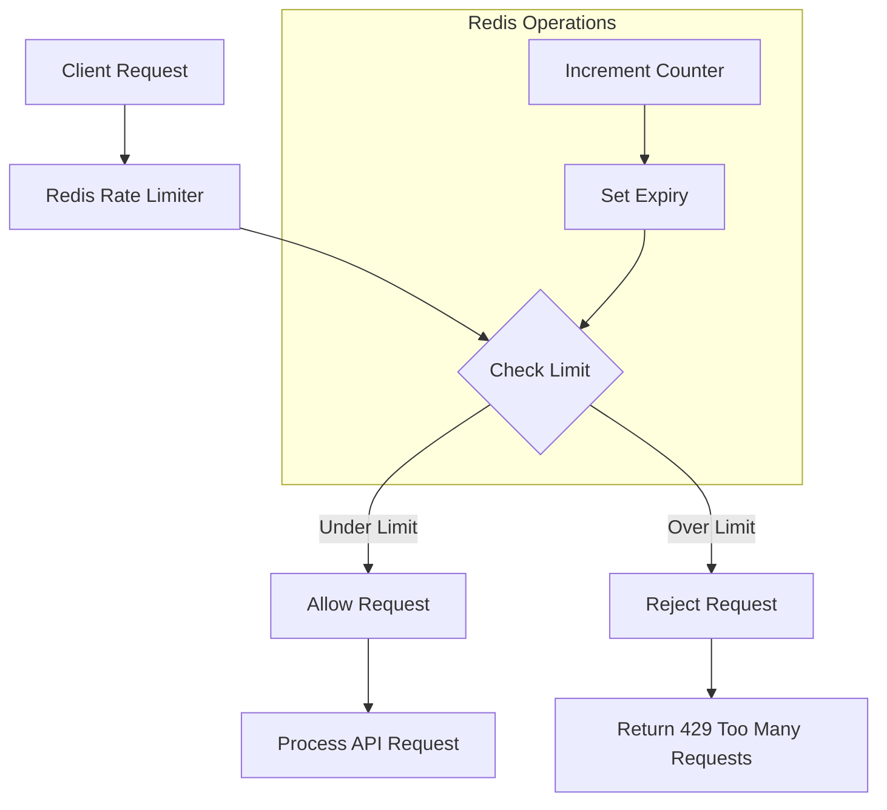

# Redis Rate Limiting

## Introduction

Rate limiting is a crucial technique in modern web applications that restricts the number of requests a client can make to an API within a specific time window. Properly implemented rate limiting helps:

- Prevent abuse and DoS attacks
- Ensure fair usage of resources
- Maintain service availability during traffic spikes
- Control costs in pay-per-use infrastructure

Redis, with its high-performance in-memory data structure store, provides an excellent foundation for implementing rate limiting solutions. Its atomic operations, expiration capabilities, and distributed nature make it particularly well-suited for this task.

In this guide, we'll explore different Redis-based rate limiting strategies, from simple counters to more sophisticated algorithms.

## Understanding Rate Limiting Concepts

Before diving into implementation, let's understand the core concepts:

### Key Components of Rate Limiting

1. **Request identifier**: A way to identify the source of requests (typically IP address, API key, or user ID)
2. **Counter**: Tracking how many requests have been made
3. **Time window**: The period over which requests are counted
4. **Limit**: Maximum number of requests allowed in the time window
5. **Response**: How to handle requests that exceed the limit

### Common Rate Limiting Algorithms

Let's explore the most popular rate limiting algorithms that can be implemented with Redis:

#### 1. Fixed Window
Simple counting of requests within fixed time intervals (e.g., 100 requests per minute).

#### 2. Sliding Window
More granular approach that considers timing of individual requests within a rolling window.

#### 3. Token Bucket
Adds tokens at a fixed rate to a bucket with limited capacity.

#### 4. Leaky Bucket
Processes requests at a constant rate, queueing or dropping excess requests.

## Implementing Rate Limiting with Redis

Let's implement each of these algorithms using Redis.

### Fixed Window Rate Limiting

This is the simplest approach where we count requests within discrete time intervals.

```javascript
const redis = require('redis');
const client = redis.createClient();

async function fixedWindowRateLimiter(userId, maxRequests, windowSizeInSeconds) {
  const key = `ratelimit:fixed:${userId}:${Math.floor(Date.now() / (windowSizeInSeconds * 1000))}`;
  
  // Increment the counter for the current window
  const requestCount = await client.incr(key);
  
  // If this is the first request in this window, set the expiration
  if (requestCount === 1) {
    await client.expire(key, windowSizeInSeconds);
  }
  
  // Check if the request exceeds the rate limit
  const isAllowed = requestCount <= maxRequests;
  
  return {
    isAllowed,
    currentCount: requestCount,
    limit: maxRequests,
    remainingRequests: Math.max(0, maxRequests - requestCount),
    windowSizeInSeconds
  };
}

// Example usage:
async function handleRequest(req, res) {
  const userId = req.headers['user-id'] || req.ip;
  const rateLimitResult = await fixedWindowRateLimiter(userId, 100, 60);
  
  if (!rateLimitResult.isAllowed) {
    res.status(429).json({
      error: 'Too Many Requests',
      retryAfter: rateLimitResult.windowSizeInSeconds
    });
    return;
  }
  
  // Add rate limit headers
  res.setHeader('X-RateLimit-Limit', rateLimitResult.limit);
  res.setHeader('X-RateLimit-Remaining', rateLimitResult.remainingRequests);
  
  // Process the actual request...
  res.json({ success: true });
}
```

**Fixed Window Example Input/Output**:

Input:
- User ID: `user123`
- Rate limit: 100 requests per 60 seconds
- Make 101 requests in a minute

Output:
- First 100 requests: Allowed with decreasing `X-RateLimit-Remaining` header
- 101st request: Status 429 (Too Many Requests) response

**Pros and Cons of Fixed Window**:

✅ Simple to implement and understand  
✅ Predictable memory usage  
❌ Allows potential traffic spikes at window boundaries  
❌ Not as accurate for very strict rate limiting needs  

### Sliding Window Rate Limiting

For a more precise approach, we can use Redis sorted sets to implement a sliding window.

```javascript
const redis = require('redis');
const client = redis.createClient();

async function slidingWindowRateLimiter(userId, maxRequests, windowSizeInSeconds) {
  const now = Date.now();
  const key = `ratelimit:sliding:${userId}`;
  const windowMillis = windowSizeInSeconds * 1000;
  
  // Add the current timestamp to the sorted set
  await client.zAdd(key, { score: now, value: now.toString() });
  
  // Remove timestamps outside the current window
  await client.zRemRangeByScore(key, 0, now - windowMillis);
  
  // Get the current count of requests within the window
  const requestCount = await client.zCard(key);
  
  // Set the expiration on the whole key to auto-cleanup
  await client.expire(key, windowSizeInSeconds);
  
  // Check if the request exceeds the rate limit
  const isAllowed = requestCount <= maxRequests;
  
  return {
    isAllowed,
    currentCount: requestCount,
    limit: maxRequests,
    remainingRequests: Math.max(0, maxRequests - requestCount),
    windowSizeInSeconds
  };
}
```

**Sliding Window Example Input/Output**:

Input:
- User ID: `user123`
- Rate limit: 100 requests per 60 seconds
- Make 50 requests now, then 60 requests 30 seconds later

Output:
- First 50 requests: Allowed
- Next 50 requests: Allowed (total: 100)
- Next 10 requests: Rejected, as the sliding window still contains 100 requests

**Pros and Cons of Sliding Window**:

✅ More accurate than fixed window  
✅ Prevents traffic spikes at window boundaries  
❌ Uses more memory (stores each request timestamp)  
❌ Slightly more complex to implement  

### Token Bucket Rate Limiting

Token bucket allows for handling burst traffic while maintaining long-term rate limits.

```javascript
const redis = require('redis');
const client = redis.createClient();

async function tokenBucketRateLimiter(userId, maxTokens, refillRate) {
  const key = `ratelimit:token:${userId}`;
  const now = Date.now();
  
  // Get the current bucket state or create a new one
  const bucketExists = await client.exists(key);
  
  if (!bucketExists) {
    // Initialize a new bucket with maximum tokens
    await client.hSet(key, {
      tokens: maxTokens.toString(),
      lastRefillTime: now.toString()
    });
    await client.expire(key, 3600); // Auto-cleanup after 1 hour of inactivity
    
    return {
      isAllowed: true,
      remainingTokens: maxTokens - 1,
      maxTokens
    };
  }
  
  // Get current bucket state
  const bucket = await client.hGetAll(key);
  let tokens = parseInt(bucket.tokens);
  const lastRefillTime = parseInt(bucket.lastRefillTime);
  
  // Calculate token refill
  const timePassed = now - lastRefillTime;
  const tokensToAdd = Math.floor((timePassed / 1000) * refillRate);
  
  if (tokensToAdd > 0) {
    // Refill tokens (but don't exceed max)
    tokens = Math.min(maxTokens, tokens + tokensToAdd);
    await client.hSet(key, 'lastRefillTime', now.toString());
  }
  
  // Check if we can consume a token
  const isAllowed = tokens > 0;
  
  if (isAllowed) {
    // Consume one token
    tokens--;
    await client.hSet(key, 'tokens', tokens.toString());
  }
  
  return {
    isAllowed,
    remainingTokens: tokens,
    maxTokens
  };
}
```

**Token Bucket Example Input/Output**:

Input:
- User ID: `user123`
- Max tokens: 10
- Refill rate: 1 token per second
- Make 15 requests in rapid succession

Output:
- First 10 requests: Allowed (consuming all tokens)
- Next 5 requests: Rejected
- After waiting 5 seconds: Next 5 requests would be allowed (5 tokens refilled)

**Pros and Cons of Token Bucket**:

✅ Allows for burst traffic  
✅ Smoothly handles varying traffic patterns  
✅ Provides good user experience for legitimate users  
❌ Requires more complex math and state management  
❌ Memory usage increases with number of users  

### Leaky Bucket Rate Limiting with Redis

The leaky bucket algorithm can be implemented using Redis lists as queues.

```javascript
const redis = require('redis');
const client = redis.createClient();

async function leakyBucketRateLimiter(userId, capacity, processingRate) {
  const key = `ratelimit:leaky:${userId}`;
  const now = Date.now();
  
  // Get the last processing time and queue length
  const bucketExists = await client.exists(key);
  
  if (!bucketExists) {
    // Initialize the bucket
    await client.hSet(key, {
      lastProcessingTime: now.toString(),
      queueSize: '1'
    });
    await client.expire(key, 3600); // Auto-cleanup after 1 hour
    
    return { isAllowed: true };
  }
  
  // Get current bucket state
  const bucket = await client.hGetAll(key);
  const lastProcessingTime = parseInt(bucket.lastProcessingTime);
  let queueSize = parseInt(bucket.queueSize);
  
  // Calculate how many requests would have been processed since last check
  const timePassed = (now - lastProcessingTime) / 1000;
  const processedItems = Math.floor(timePassed * processingRate);
  
  // Update queue size
  queueSize = Math.max(0, queueSize - processedItems);
  
  // Check if we can add a new request
  const isAllowed = queueSize < capacity;
  
  if (isAllowed) {
    // Add request to the queue
    queueSize++;
  }
  
  // Update bucket state
  await client.hSet(key, {
    lastProcessingTime: now.toString(),
    queueSize: queueSize.toString()
  });
  
  return {
    isAllowed,
    queueSize,
    capacity
  };
}
```

**Leaky Bucket Example Input/Output**:

Input:
- User ID: `user123`
- Bucket capacity: 5
- Processing rate: 1 request per second
- Send 8 requests in rapid succession

Output:
- First 5 requests: Allowed (filling the bucket)
- Next 3 requests: Rejected (bucket full)
- After 3 seconds: Next 3 requests would be allowed (3 processed out)

**Pros and Cons of Leaky Bucket**:

✅ Ensures constant outflow rate  
✅ Good for API endpoints with consistent processing capacity  
✅ Can be implemented as a queue for delayed processing  
❌ Doesn't allow for any burst capacity  
❌ Can lead to unnecessary throttling during traffic spikes  

## Rate Limiting Across Multiple Redis Instances

For distributed environments, we need to ensure rate limiting works consistently across multiple Redis nodes:

```javascript
const Redis = require('ioredis');

// Create a Redis Cluster client
const cluster = new Redis.Cluster([
  { host: 'redis-node-1', port: 6379 },
  { host: 'redis-node-2', port: 6379 },
  { host: 'redis-node-3', port: 6379 }
]);

async function distributedRateLimiter(userId, maxRequests, windowSizeInSeconds) {
  // Use a consistent hashing algorithm to ensure requests for the same user
  // are routed to the same Redis node
  const key = `ratelimit:${userId}:${Math.floor(Date.now() / (windowSizeInSeconds * 1000))}`;
  
  // Use Lua script for atomic operations
  const luaScript = `
    local current = redis.call('incr', KEYS[1])
    if current == 1 then
      redis.call('expire', KEYS[1], ARGV[1])
    end
    return current
  `;
  
  // Execute the script atomically
  const requestCount = await cluster.eval(
    luaScript,
    1,
    key,
    windowSizeInSeconds.toString()
  );
  
  const isAllowed = requestCount <= maxRequests;
  
  return {
    isAllowed,
    currentCount: requestCount,
    limit: maxRequests,
    remainingRequests: Math.max(0, maxRequests - requestCount)
  };
}
```

## Visualizing Rate Limiting with Redis

Let's visualize how these algorithms work:



## Implementing Rate Limiting Middleware

Here's a practical example of how to implement a reusable rate limiting middleware in Express:

```javascript
const redis = require('redis');
const client = redis.createClient();

function createRateLimiter(options = {}) {
  const {
    windowSizeInSeconds = 60,
    maxRequests = 100,
    keyGenerator = (req) => req.ip,
    statusCode = 429,
    message = 'Too Many Requests',
    headers = true
  } = options;

  return async function rateLimiterMiddleware(req, res, next) {
    const key = `ratelimit:${keyGenerator(req)}:${Math.floor(Date.now() / (windowSizeInSeconds * 1000))}`;
    
    try {
      // Increment the counter for the current window
      const requestCount = await client.incr(key);
      
      // If this is the first request in this window, set the expiration
      if (requestCount === 1) {
        await client.expire(key, windowSizeInSeconds);
      }
      
      // Set rate limit headers
      if (headers) {
        res.setHeader('X-RateLimit-Limit', maxRequests);
        res.setHeader('X-RateLimit-Remaining', Math.max(0, maxRequests - requestCount));
        res.setHeader('X-RateLimit-Reset', Math.ceil(Date.now() / 1000) + windowSizeInSeconds);
      }
      
      // Check if the request exceeds the rate limit
      if (requestCount > maxRequests) {
        return res.status(statusCode).json({
          error: message,
          retryAfter: windowSizeInSeconds
        });
      }
      
      next();
    } catch (err) {
      // Redis errors should not block the request
      console.error('Rate limiter error:', err);
      next();
    }
  };
}

// Usage in Express app:
const express = require('express');
const app = express();

// Global rate limiter
app.use(createRateLimiter({ maxRequests: 1000, windowSizeInSeconds: 60 }));

// Route-specific stricter rate limiter
app.post('/api/expensive-operation', 
  createRateLimiter({ maxRequests: 10, windowSizeInSeconds: 60 }),
  (req, res) => {
    res.json({ success: true });
  }
);
```

## Rate Limiting Best Practices

When implementing Redis-based rate limiting, keep these best practices in mind:

1. **Use Lua scripts** for atomic operations to prevent race conditions
2. **Include appropriate headers** (X-RateLimit-Limit, X-RateLimit-Remaining, X-RateLimit-Reset)
3. **Provide clear error messages** to help users understand the limits
4. **Consider different limits** for different endpoints based on resource intensity
5. **Implement exponential backoff** for clients repeatedly exceeding limits
6. **Monitor your rate limiting** to adjust thresholds as needed
7. **Use a fallback mechanism** if Redis is temporarily unavailable
8. **Set appropriate TTL values** to prevent memory leaks
9. **Consider user-specific limits** for different tiers of service

## Advanced Rate Limiting Scenarios

### Tiered Rate Limiting

For services with different user tiers, implement variable rate limits:

```javascript
async function tieredRateLimiter(userId, tier, windowSizeInSeconds) {
  // Define limits per tier
  const tierLimits = {
    free: 100,
    basic: 500,
    premium: 2000,
    enterprise: 10000
  };
  
  const maxRequests = tierLimits[tier] || tierLimits.free;
  const key = `ratelimit:${userId}:${Math.floor(Date.now() / (windowSizeInSeconds * 1000))}`;
  
  // Implement rate limiting logic as before
  // ...
  
  return {
    isAllowed,
    limit: maxRequests,
    tier
  };
}
```

### Adaptive Rate Limiting

Adjust limits based on server load or other metrics:

```javascript
async function adaptiveRateLimiter(userId, windowSizeInSeconds) {
  // Get current server load
  const serverLoad = await getServerLoad();
  
  // Adjust rate limits based on server load
  let maxRequests;
  if (serverLoad > 0.8) {
    maxRequests = 20;  // Strict during high load
  } else if (serverLoad > 0.5) {
    maxRequests = 50;  // Moderate during medium load
  } else {
    maxRequests = 100; // Normal during low load
  }
  
  // Implement rate limiting logic as before
  // ...
}
```

## Summary

Redis provides powerful capabilities for implementing various rate limiting strategies. In this guide, we've explored:

- Basic concepts of rate limiting
- Different algorithms (Fixed Window, Sliding Window, Token Bucket, Leaky Bucket)
- Practical implementations with Redis
- Distributed rate limiting considerations
- Best practices and advanced scenarios

By implementing appropriate rate limiting with Redis, you can protect your APIs from abuse, ensure fair resource allocation, and maintain service stability even during traffic spikes.

## Exercises

1. Implement a combined rate limiter that applies different limits to different endpoints.
2. Create a dynamic rate limiter that adjusts limits based on time of day.
3. Extend the middleware to handle custom response messages for different rate limit violations.
4. Implement a "courtesy" system that allows a small number of bursts for otherwise well-behaved clients.
5. Add telemetry to track rate limit usage and violations over time.

## Additional Resources

- [Redis Documentation](https://redis.io/documentation)
- [IETF Draft: RateLimit Header Fields for HTTP](https://datatracker.ietf.org/doc/draft-ietf-httpapi-ratelimit-headers/)
- [System Design: API Rate Limiter](https://github.com/donnemartin/system-design-primer/blob/master/solutions/system_design/web_crawler/README.md)