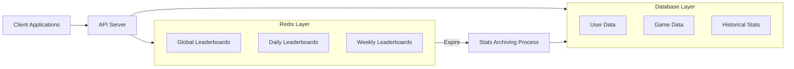

# Redis Leaderboards

## Introduction

Leaderboards are a vital component in many applications, from gaming platforms to fitness apps and educational systems. They display ranked lists of users based on their scores or achievements, fostering competition and engagement. However, implementing leaderboards that can efficiently handle millions of users while providing real-time updates presents significant technical challenges.

This is where Redis excels. Redis, an in-memory data structure store, offers a powerful data type called **sorted sets** that makes implementing high-performance leaderboards remarkably straightforward. In this tutorial, we'll explore how to build robust leaderboards using Redis, understand the underlying concepts, and examine practical applications.

## Prerequisites

Before diving in, you should have:
- Basic understanding of Redis concepts
- Redis installed locally or access to a Redis instance
- Basic knowledge of a programming language (we'll use Python in our examples)
- Redis client library for your language installed

## Understanding Redis Sorted Sets

At the heart of Redis leaderboards are **sorted sets** (ZSETs). A sorted set is a collection of unique members (strings) where each member is associated with a score (a floating-point number). What makes sorted sets special is that they're always kept ordered by score.

Key properties of sorted sets that make them perfect for leaderboards:

1. **Automatic ordering**: Elements are always sorted by score
2. **O(log(N)) complexity**: Operations like adding/updating scores and retrieving ranges are very efficient
3. **Bidirectional access**: Easy to get top scores or bottom scores
4. **Unique members**: Each member (e.g., user) can only appear once in the set

## Basic Leaderboard Implementation

Let's start with a simple leaderboard implementation. We'll use Python with the `redis-py` library, but the concepts apply to any language.

First, let's create a connection to Redis:

```python
import redis

# Connect to Redis
r = redis.Redis(host='localhost', port=6379, db=0)
```

### Adding Scores to the Leaderboard

To add a player with a score to our leaderboard:

```python
def add_score(leaderboard_name, player_name, score):
    """Add a score for a player to the leaderboard"""
    r.zadd(leaderboard_name, {player_name: score})
    
# Example usage
add_score('game:leaderboard', 'player1', 100)
add_score('game:leaderboard', 'player2', 125)
add_score('game:leaderboard', 'player3', 75)
add_score('game:leaderboard', 'player4', 150)
```

If a player already exists in the leaderboard, Redis will update their score.

### Retrieving the Top Players

To get the top N players:

```python
def get_top_players(leaderboard_name, n=10):
    """Get the top N players from the leaderboard"""
    # Use ZREVRANGE to get players sorted by highest score first
    return r.zrevrange(leaderboard_name, 0, n-1, withscores=True)
    
# Example usage
top_players = get_top_players('game:leaderboard', 3)
print("Top 3 players:")
for i, (player, score) in enumerate(top_players, 1):
    print(f"{i}. {player.decode('utf-8')}: {int(score)}")
```

Output:
```
Top 3 players:
1. player4: 150
2. player2: 125
3. player1: 100
```

### Getting a Player's Rank

To find out a player's position in the leaderboard:

```python
def get_player_rank(leaderboard_name, player_name):
    """Get a player's rank in the leaderboard (0-based)"""
    # ZREVRANK gives rank in descending order (highest score = rank 0)
    rank = r.zrevrank(leaderboard_name, player_name)
    return rank + 1 if rank is not None else None  # Convert to 1-based ranking

# Example usage
player3_rank = get_player_rank('game:leaderboard', 'player3')
print(f"player3 rank: {player3_rank}")
```

Output:
```
player3 rank: 4
```

### Getting Players Around a Specific Rank

To show players near a specific player (creating a "neighborhood" view):

```python
def get_player_neighborhood(leaderboard_name, player_name, distance=2):
    """Get players around the specified player"""
    player_rank = r.zrevrank(leaderboard_name, player_name)
    
    if player_rank is None:
        return []
        
    # Calculate the range to fetch
    start = max(0, player_rank - distance)
    end = player_rank + distance
    
    return r.zrevrange(leaderboard_name, start, end, withscores=True)

# Example usage
neighborhood = get_player_neighborhood('game:leaderboard', 'player1')
print("
Neighborhood around player1:")
for player, score in neighborhood:
    player_name = player.decode('utf-8')
    if player_name == 'player1':
        print(f"** {player_name}: {int(score)} **")
    else:
        print(f"{player_name}: {int(score)}")
```

Output:
```
Neighborhood around player1:
player4: 150
player2: 125
** player1: 100 **
player3: 75
```

## Advanced Leaderboard Features

Now that we have the basics, let's explore some advanced features.

### Time-based Leaderboards

Often, you'll want separate leaderboards for different time periods (daily, weekly, monthly). Redis makes this easy:

```python
import time
from datetime import datetime

def get_leaderboard_key(period='all_time'):
    """Generate a leaderboard key based on time period"""
    if period == 'daily':
        return f"leaderboard:daily:{datetime.now().strftime('%Y-%m-%d')}"
    elif period == 'weekly':
        # Get ISO calendar week
        year, week, _ = datetime.now().isocalendar()
        return f"leaderboard:weekly:{year}-{week}"
    elif period == 'monthly':
        return f"leaderboard:monthly:{datetime.now().strftime('%Y-%m')}"
    else:
        return "leaderboard:all_time"

def add_score_with_time(player_name, score):
    """Add scores to various time-based leaderboards"""
    # Add to all time leaderboard
    r.zadd(get_leaderboard_key('all_time'), {player_name: score})
    
    # Add to daily leaderboard
    r.zadd(get_leaderboard_key('daily'), {player_name: score})
    
    # Add to weekly leaderboard
    r.zadd(get_leaderboard_key('weekly'), {player_name: score})
    
    # Add to monthly leaderboard
    r.zadd(get_leaderboard_key('monthly'), {player_name: score})
    
    # Set expiry for temporary leaderboards
    r.expire(get_leaderboard_key('daily'), 60*60*24*2)  # 2 days
    r.expire(get_leaderboard_key('weekly'), 60*60*24*8)  # 8 days
    r.expire(get_leaderboard_key('monthly'), 60*60*24*32)  # 32 days
```

### Incrementing Scores

In many applications, you'll want to increment a player's score rather than setting it:

```python
def increment_score(leaderboard_name, player_name, increment):
    """Increment a player's score in the leaderboard"""
    return r.zincrby(leaderboard_name, increment, player_name)

# Example usage
new_score = increment_score('game:leaderboard', 'player1', 50)
print(f"player1's new score: {int(new_score)}")
```

Output:
```
player1's new score: 150
```

### Getting Leaderboard Size

To get the total number of players in a leaderboard:

```python
def get_leaderboard_size(leaderboard_name):
    """Get the total number of players in the leaderboard"""
    return r.zcard(leaderboard_name)

# Example
size = get_leaderboard_size('game:leaderboard')
print(f"Total players in leaderboard: {size}")
```

Output:
```
Total players in leaderboard: 4
```

### Getting Players by Score Range

To get all players within a certain score range:

```python
def get_players_by_score_range(leaderboard_name, min_score, max_score):
    """Get players with scores between min_score and max_score"""
    return r.zrevrangebyscore(leaderboard_name, max_score, min_score, withscores=True)

# Example
players = get_players_by_score_range('game:leaderboard', 100, 140)
print("
Players with scores between 100 and 140:")
for player, score in players:
    print(f"{player.decode('utf-8')}: {int(score)}")
```

Output:
```
Players with scores between 100 and 140:
player2: 125
player1: 100
```

## Real-world Applications

Let's explore some practical applications of Redis leaderboards with more complex examples.

### Gaming Leaderboards

```python
# Example: A multiplayer game with multidimensional leaderboards

# Add scores for various game statistics
def update_player_stats(player_id, kills=0, deaths=0, assists=0, score=0):
    # Update kills leaderboard
    if kills > 0:
        r.zincrby('leaderboard:kills', kills, player_id)
    
    # Update K/D ratio leaderboard (if deaths > 0)
    if deaths > 0:
        current_kills = int(r.zscore('leaderboard:kills', player_id) or 0)
        kd_ratio = current_kills / deaths
        r.zadd('leaderboard:kd_ratio', {player_id: kd_ratio})
    
    # Update score leaderboard
    if score > 0:
        r.zincrby('leaderboard:score', score, player_id)
    
    # Update "MVP points" (weighted formula)
    mvp_points = kills * 3 - deaths * 1 + assists * 1.5 + score * 0.1
    r.zincrby('leaderboard:mvp', mvp_points, player_id)

# Example usage
update_player_stats('user123', kills=5, deaths=2, assists=3, score=200)
```

### Fitness App Challenge Leaderboards

```python
# Example: A fitness app with challenges and friends leaderboards

def record_daily_steps(user_id, steps, friends_list=None):
    today = datetime.now().strftime('%Y-%m-%d')
    
    # Update global steps leaderboard
    r.zadd(f'steps:global:{today}', {user_id: steps})
    
    # Update monthly leaderboard
    month = datetime.now().strftime('%Y-%m')
    current_monthly = int(r.zscore(f'steps:monthly:{month}', user_id) or 0)
    r.zadd(f'steps:monthly:{month}', {user_id: current_monthly + steps})
    
    # Update friends leaderboard if provided
    if friends_list:
        # Create a temporary leaderboard with just friends
        temp_key = f'temp:friends:{user_id}:{int(time.time())}'
        
        # Add the user and their friends to the temporary leaderboard
        r.zadd(temp_key, {user_id: steps})
        
        # Get today's steps for each friend
        for friend_id in friends_list:
            friend_steps = int(r.zscore(f'steps:global:{today}', friend_id) or 0)
            r.zadd(temp_key, {friend_id: friend_steps})
        
        # Set expiry on the temporary leaderboard
        r.expire(temp_key, 3600)  # Expire after 1 hour
        
        return temp_key
        
    return f'steps:global:{today}'
```

### Education Platform Leaderboards

```python
# Example: An educational platform with course completion leaderboards

def update_student_progress(student_id, course_id, module_id, score):
    # Update score for this specific module
    r.zadd(f'scores:course:{course_id}:module:{module_id}', {student_id: score})
    
    # Update overall course score (average of all modules)
    all_module_scores = []
    for key in r.scan_iter(f'scores:course:{course_id}:module:*'):
        module_score = r.zscore(key, student_id)
        if module_score is not None:
            all_module_scores.append(module_score)
    
    if all_module_scores:
        avg_score = sum(all_module_scores) / len(all_module_scores)
        r.zadd(f'scores:course:{course_id}', {student_id: avg_score})
    
    # Update completion percentage
    total_modules = get_total_modules(course_id)  # Assume this function exists
    completion_pct = (len(all_module_scores) / total_modules) * 100
    r.zadd(f'completion:course:{course_id}', {student_id: completion_pct})
```

## Performance Considerations

Redis leaderboards are incredibly efficient, but here are some tips for optimal performance:

1. **Limit range queries**: When retrieving leaderboard data, always specify a reasonable range rather than retrieving the entire leaderboard.

2. **Use pipelines**: When making multiple Redis calls, use pipelining to reduce network overhead:

```python
def add_bulk_scores(leaderboard_name, player_scores):
    """Add multiple scores efficiently using a pipeline"""
    pipe = r.pipeline()
    for player, score in player_scores.items():
        pipe.zadd(leaderboard_name, {player: score})
    return pipe.execute()
    
# Example
add_bulk_scores('game:leaderboard', {
    'player5': 110,
    'player6': 95,
    'player7': 200
})
```

3. **Consider using Redis Cluster**: For very large leaderboards (millions of users), Redis Cluster provides horizontal scalability.

4. **Set appropriate TTLs**: For time-based leaderboards, set appropriate expiration times to avoid consuming unnecessary memory.

## Architectural Patterns

Let's visualize how Redis leaderboards fit into a typical application architecture:



In this architecture:
1. Redis handles all real-time leaderboard operations
2. The main database stores permanent user data and historical statistics
3. Time-based leaderboards expire automatically
4. An archiving process can optionally persist historical leaderboard data

## Summary

Redis sorted sets provide an elegant and efficient solution for implementing leaderboards of all types. We've explored:

- Basic leaderboard operations like adding scores and retrieving rankings
- Advanced features like time-based leaderboards and score increments
- Real-world applications in gaming, fitness, and education
- Performance considerations and architectural patterns

By leveraging Redis for your leaderboard needs, you can build highly scalable applications that handle millions of users with millisecond-level performance.

## Exercises

To reinforce your understanding:

1. Implement a daily, weekly, and all-time leaderboard system for a simple game
2. Create a "friends-only" leaderboard view that shows a user's ranking among their friends
3. Build a leaderboard with multiple dimensions (e.g., different metrics for the same users)
4. Implement pagination for a large leaderboard
5. Create a leaderboard that automatically decays scores over time

## Additional Resources

- [Redis Sorted Sets Documentation](https://redis.io/docs/data-types/sorted-sets/)
- [Redis-py Library](https://github.com/redis/redis-py)
- [Redis University](https://university.redis.com/) for more in-depth Redis learning