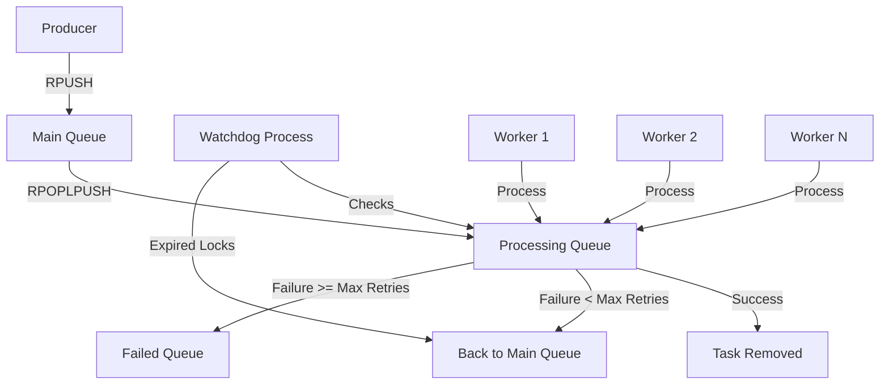

# Redis Queues

## Introduction

When building modern applications, you'll often encounter scenarios where tasks should be processed asynchronously rather than immediately. Whether it's sending emails, processing uploads, or executing long-running calculations, performing these operations in the background improves user experience and application responsiveness.

Redis, an in-memory data structure store, offers excellent capabilities for implementing reliable queuing systems. In this tutorial, we'll explore how to leverage Redis to create robust message queues that enable asynchronous task processing in your applications.

## What is a Redis Queue?

A Redis queue is a data structure pattern that uses Redis to store messages or tasks that need to be processed later. By using Redis as the infrastructure for your queues, you get:

- **High performance**: Redis operates in-memory for extremely fast operations
- **Persistence**: Redis can be configured to persist data to disk to prevent data loss
- **Reliability**: Tasks won't be lost even if your workers crash
- **Scalability**: Multiple producers and consumers can work with the same queue
- **Visibility**: You can inspect queue state in real-time

Let's understand how queues work in Redis and then explore different implementation patterns.

## Basic Queue Implementation

The simplest Redis queue can be implemented using Redis Lists. Redis Lists are essentially linked lists that allow efficient insertion at both ends.

### Key Commands for List-Based Queues

- `LPUSH`: Add an item to the left (head) of the list
- `RPUSH`: Add an item to the right (tail) of the list
- `LPOP`: Remove and return an item from the left (head) of the list
- `RPOP`: Remove and return an item from the right (tail) of the list
- `BLPOP`: Blocking version of LPOP (waits if list is empty)
- `BRPOP`: Blocking version of RPOP (waits if list is empty)

### Producer-Consumer Pattern

Let's implement a simple task queue using the producer-consumer pattern:

```javascript
// Producer: Add a task to the queue
const enqueueTask = async (redis, queueName, taskData) => {
  const taskString = JSON.stringify(taskData);
  return await redis.rpush(queueName, taskString);
};

// Consumer: Process a task from the queue
const processNextTask = async (redis, queueName, timeout = 0) => {
  // BLPOP blocks until an element is available
  const result = await redis.blpop(queueName, timeout);
  
  if (!result) {
    return null; // No task available within timeout
  }
  
  // BLPOP returns [key, value]
  const [_, taskString] = result;
  return JSON.parse(taskString);
};
```

### Example Usage

Let's see how you might use this in an Express.js application to process image uploads:

```javascript
// app.js
const express = require('express');
const Redis = require('ioredis');
const multer = require('multer');

const app = express();
const redis = new Redis();
const upload = multer({ dest: 'uploads/' });

// Queue name
const IMAGE_PROCESSING_QUEUE = 'image:processing:queue';

// API endpoint to upload images
app.post('/upload', upload.single('image'), async (req, res) => {
  try {
    const imageTask = {
      imageId: Math.random().toString(36).substring(2, 15),
      filePath: req.file.path,
      timestamp: Date.now(),
      userId: req.body.userId
    };
    
    // Add task to queue
    await enqueueTask(redis, IMAGE_PROCESSING_QUEUE, imageTask);
    
    res.status(200).json({ 
      message: 'Image uploaded and queued for processing',
      taskId: imageTask.imageId
    });
  } catch (error) {
    res.status(500).json({ error: error.message });
  }
});

app.listen(3000, () => {
  console.log('Server running on port 3000');
});
```

And in a separate worker process:

```javascript
// worker.js
const Redis = require('ioredis');
const redis = new Redis();

const IMAGE_PROCESSING_QUEUE = 'image:processing:queue';

async function startWorker() {
  console.log('Image processing worker started');
  
  while (true) {
    try {
      // Wait for new tasks with BLPOP (blocking operation)
      const task = await processNextTask(redis, IMAGE_PROCESSING_QUEUE, 0);
      
      if (task) {
        console.log(`Processing image: ${task.imageId}`);
        
        // Simulate image processing
        await processImage(task);
        
        console.log(`Completed processing image: ${task.imageId}`);
      }
    } catch (error) {
      console.error('Error processing task:', error);
    }
  }
}

async function processImage(task) {
  // Simulate processing time
  await new Promise(resolve => setTimeout(resolve, 2000));
  // In a real application, you would process the image here
}

startWorker();
```

This simple implementation works, but it has limitations. For instance, if a worker crashes while processing a task, that task is lost. Let's see how to overcome this and implement more advanced patterns.

## Reliable Queues with Redis

To build reliable queues that can handle failures, we need additional mechanisms:

1. **Acknowledgment**: Tasks aren't removed from the queue until explicitly acknowledged
2. **Visibility timeout**: If a worker crashes, tasks become available again after a timeout
3. **Retries**: Automatically retry failed tasks a limited number of times
4. **Dead-letter queues**: Move permanently failing tasks to a separate queue for inspection

Let's implement a more reliable queue:

```javascript
// Reliable queue implementation
const PROCESSING_SUFFIX = ':processing';
const FAILED_SUFFIX = ':failed';

// Enqueue a new task
const enqueueReliableTask = async (redis, queueName, taskData) => {
  const taskString = JSON.stringify({
    ...taskData,
    id: crypto.randomUUID(),
    attempts: 0,
    maxAttempts: 3,
    addedAt: Date.now()
  });
  
  return await redis.rpush(queueName, taskString);
};

// Get a task for processing with reliability guarantees
const getTaskForProcessing = async (redis, queueName, visibilityTimeout = 30) => {
  // Move a task from the main queue to the processing queue
  const taskString = await redis.rpoplpush(
    queueName,
    queueName + PROCESSING_SUFFIX
  );
  
  if (!taskString) {
    return null; // No tasks available
  }
  
  const task = JSON.parse(taskString);
  
  // Set expiration for this task in the processing queue
  await redis.set(
    `${queueName}:lock:${task.id}`,
    '1',
    'EX',
    visibilityTimeout
  );
  
  return task;
};

// Acknowledge successful processing
const acknowledgeTask = async (redis, queueName, taskId) => {
  // Find and remove the task from the processing queue
  const processingQueue = queueName + PROCESSING_SUFFIX;
  const tasks = await redis.lrange(processingQueue, 0, -1);
  
  for (let i = 0; i < tasks.length; i++) {
    const task = JSON.parse(tasks[i]);
    
    if (task.id === taskId) {
      // Remove this specific task from the processing queue
      await redis.lrem(processingQueue, 1, tasks[i]);
      // Remove the lock
      await redis.del(`${queueName}:lock:${taskId}`);
      return true;
    }
  }
  
  return false;
};

// Handle failed tasks
const markTaskAsFailed = async (redis, queueName, taskId) => {
  const processingQueue = queueName + PROCESSING_SUFFIX;
  const failedQueue = queueName + FAILED_SUFFIX;
  const tasks = await redis.lrange(processingQueue, 0, -1);
  
  for (let i = 0; i < tasks.length; i++) {
    const taskString = tasks[i];
    const task = JSON.parse(taskString);
    
    if (task.id === taskId) {
      // Increment attempts
      task.attempts += 1;
      const updatedTaskString = JSON.stringify(task);
      
      // Remove from processing queue
      await redis.lrem(processingQueue, 1, taskString);
      
      // Remove the lock
      await redis.del(`${queueName}:lock:${taskId}`);
      
      if (task.attempts < task.maxAttempts) {
        // Re-queue for another attempt
        await redis.lpush(queueName, updatedTaskString);
      } else {
        // Move to failed queue for later analysis
        await redis.rpush(failedQueue, updatedTaskString);
      }
      
      return true;
    }
  }
  
  return false;
};
```

### Handling Timeouts Automatically

In a production system, you'll need a separate process that checks for tasks with expired locks and returns them to the main queue:

```javascript
// watchdog.js
const Redis = require('ioredis');
const redis = new Redis();

const QUEUE_NAME = 'email:sending:queue';
const PROCESSING_SUFFIX = ':processing';

async function recoveryWatchdog() {
  console.log('Starting recovery watchdog');
  
  while (true) {
    try {
      const processingQueue = QUEUE_NAME + PROCESSING_SUFFIX;
      const tasks = await redis.lrange(processingQueue, 0, -1);
      
      for (const taskString of tasks) {
        const task = JSON.parse(taskString);
        const lockKey = `${QUEUE_NAME}:lock:${task.id}`;
        
        // Check if the lock still exists
        const lockExists = await redis.exists(lockKey);
        
        if (!lockExists) {
          console.log(`Recovering timed out task: ${task.id}`);
          
          // Remove from processing queue
          await redis.lrem(processingQueue, 1, taskString);
          
          // Increment attempts
          task.attempts += 1;
          const updatedTaskString = JSON.stringify(task);
          
          if (task.attempts < task.maxAttempts) {
            // Re-queue for another attempt
            await redis.lpush(QUEUE_NAME, updatedTaskString);
          } else {
            // Move to failed queue
            await redis.rpush(QUEUE_NAME + ':failed', updatedTaskString);
          }
        }
      }
    } catch (error) {
      console.error('Error in recovery watchdog:', error);
    }
    
    // Check every 5 seconds
    await new Promise(resolve => setTimeout(resolve, 5000));
  }
}

recoveryWatchdog();
```

## Advanced Queue Patterns

Let's explore some more advanced queue patterns you can implement with Redis.

### Priority Queues

Priority queues process items based on their importance rather than their order of arrival.

```javascript
// Implementing a priority queue using sorted sets
const enqueuePriorityTask = async (redis, queueName, taskData, priority = 0) => {
  const taskId = crypto.randomUUID();
  
  // Store task data in a hash
  await redis.hset(
    `${queueName}:tasks`,
    taskId,
    JSON.stringify({
      ...taskData,
      id: taskId,
      addedAt: Date.now()
    })
  );
  
  // Add to sorted set with priority as score
  return await redis.zadd(queueName, priority, taskId);
};

const getHighestPriorityTask = async (redis, queueName) => {
  // Get transaction to ensure atomicity
  const multi = redis.multi();
  
  // Get the highest priority task (lowest score)
  multi.zrange(queueName, 0, 0);
  // Remove it from the sorted set
  multi.zremrangebyrank(queueName, 0, 0);
  
  const results = await multi.exec();
  
  // No tasks available
  if (!results[0][1] || results[0][1].length === 0) {
    return null;
  }
  
  const taskId = results[0][1][0];
  const taskString = await redis.hget(`${queueName}:tasks`, taskId);
  
  if (!taskString) {
    return null;
  }
  
  // Clean up the hash
  await redis.hdel(`${queueName}:tasks`, taskId);
  
  return JSON.parse(taskString);
};
```

### Delayed Queues

Delayed queues allow tasks to be processed at a specific time in the future:

```javascript
// Scheduling a task for future execution
const scheduleTask = async (redis, queueName, taskData, executeAt) => {
  const taskId = crypto.randomUUID();
  
  // Store task data
  await redis.hset(
    `${queueName}:tasks`,
    taskId,
    JSON.stringify({
      ...taskData,
      id: taskId,
      scheduledFor: executeAt,
      addedAt: Date.now()
    })
  );
  
  // Add to sorted set with execution timestamp as score
  return await redis.zadd(`${queueName}:scheduled`, executeAt, taskId);
};

// Worker to move due tasks to the actual queue
async function scheduledTasksWorker(redis, queueName) {
  while (true) {
    const now = Date.now();
    
    // Find tasks that are due
    const dueTasks = await redis.zrangebyscore(
      `${queueName}:scheduled`,
      0,
      now
    );
    
    if (dueTasks.length > 0) {
      // Start a pipeline for better performance
      const pipeline = redis.pipeline();
      
      for (const taskId of dueTasks) {
        // Get task data
        const taskString = await redis.hget(`${queueName}:tasks`, taskId);
        
        if (taskString) {
          // Move to the actual processing queue
          pipeline.rpush(queueName, taskString);
          // Remove from the scheduled sorted set
          pipeline.zrem(`${queueName}:scheduled`, taskId);
          // Clean up the hash
          pipeline.hdel(`${queueName}:tasks`, taskId);
        }
      }
      
      await pipeline.exec();
    }
    
    // Check every second
    await new Promise(resolve => setTimeout(resolve, 1000));
  }
}
```

### Fan-Out Pattern

The fan-out pattern distributes tasks to multiple queues or workers:

```javascript
// Distributing a task to multiple queues
const fanOutTask = async (redis, queues, taskData) => {
  const pipeline = redis.pipeline();
  const taskString = JSON.stringify({
    ...taskData,
    id: crypto.randomUUID(),
    addedAt: Date.now()
  });
  
  // Add the task to all specified queues
  for (const queueName of queues) {
    pipeline.rpush(queueName, taskString);
  }
  
  return await pipeline.exec();
};
```

## Visualizing Redis Queue Flow

Here's a diagram showing the flow of tasks through a reliable Redis queue system:



## Best Practices for Redis Queues

### 1. Use Appropriate Data Structures

- **Lists**: For simple FIFO queues
- **Sorted Sets**: For priority queues or delayed tasks
- **Hashes**: For storing task details separately from queue positions

### 2. Consider Persistence Configuration

Configure Redis persistence to prevent data loss:

- **RDB**: Point-in-time snapshots at specified intervals
- **AOF**: Append-only file that logs every write operation
- **Combined approach**: Use both for maximum data safety

Example Redis configuration for queue persistence:

```
# Save a snapshot every 60 seconds if at least 1000 keys changed
save 60 1000

# Enable AOF
appendonly yes

# fsync policy: everysec provides good performance with reasonable safety
appendfsync everysec
```

### 3. Monitor Queue Health

Track metrics like:
- Queue length
- Processing time
- Error rates
- Worker status

You can implement a simple queue monitoring API:

```javascript
// Get current queue statistics
const getQueueStats = async (redis, queueName) => {
  const pipeline = redis.pipeline();
  
  // Get counts for each queue
  pipeline.llen(queueName);                  // Main queue
  pipeline.llen(queueName + ':processing');  // Processing queue
  pipeline.llen(queueName + ':failed');      // Failed queue
  
  const results = await pipeline.exec();
  
  return {
    waiting: results[0][1],
    processing: results[1][1],
    failed: results[2][1],
    total: results[0][1] + results[1][1] + results[2][1]
  };
};
```

### 4. Implement Circuit Breakers

If a service consistently fails, stop sending tasks to it for a cooldown period:

```javascript
// Simple circuit breaker
class CircuitBreaker {
  constructor(redis, serviceName, threshold = 5, cooldownPeriod = 60) {
    this.redis = redis;
    this.serviceName = serviceName;
    this.threshold = threshold;
    this.cooldownPeriod = cooldownPeriod; // seconds
    this.counterKey = `circuit:${serviceName}:failures`;
    this.stateKey = `circuit:${serviceName}:state`;
  }
  
  async recordFailure() {
    const multi = this.redis.multi();
    multi.incr(this.counterKey);
    multi.expire(this.counterKey, this.cooldownPeriod * 2);
    const results = await multi.exec();
    
    const failureCount = results[0][1];
    
    if (failureCount >= this.threshold) {
      await this.redis.set(this.stateKey, 'open', 'EX', this.cooldownPeriod);
    }
  }
  
  async recordSuccess() {
    await this.redis.del(this.counterKey);
  }
  
  async isOpen() {
    return await this.redis.exists(this.stateKey) === 1;
  }
}
```

## Real-World Examples

Let's look at some practical applications of Redis queues:

### Email Sending Service

```javascript
// Email sending worker
async function startEmailWorker(redis) {
  const EMAIL_QUEUE = 'email:sending:queue';
  
  console.log('Starting email worker');
  
  while (true) {
    try {
      // Get task with 30 second visibility timeout
      const task = await getTaskForProcessing(redis, EMAIL_QUEUE, 30);
      
      if (task) {
        console.log(`Sending email to: ${task.recipient}`);
        
        try {
          // Simulate sending email
          await sendEmail(task.recipient, task.subject, task.body);
          
          // Acknowledge successful processing
          await acknowledgeTask(redis, EMAIL_QUEUE, task.id);
          console.log(`Email sent successfully to: ${task.recipient}`);
        } catch (error) {
          console.error(`Failed to send email: ${error.message}`);
          // Mark as failed for retry or dead-letter queue
          await markTaskAsFailed(redis, EMAIL_QUEUE, task.id);
        }
      } else {
        // No pending tasks, wait before polling again
        await new Promise(resolve => setTimeout(resolve, 1000));
      }
    } catch (error) {
      console.error('Worker error:', error);
      await new Promise(resolve => setTimeout(resolve, 5000));
    }
  }
}

async function sendEmail(recipient, subject, body) {
  // Simulate email sending with occasional failures
  await new Promise(resolve => setTimeout(resolve, 500));
  
  // Randomly fail 10% of the time
  if (Math.random() < 0.1) {
    throw new Error('Email service temporarily unavailable');
  }
  
  console.log(`EMAIL SENT: To: ${recipient}, Subject: ${subject}`);
}
```

### Report Generation System

```javascript
// Web controller to request report generation
app.post('/reports/generate', async (req, res) => {
  try {
    const { reportType, parameters, userId } = req.body;
    
    // Validate required fields
    if (!reportType || !userId) {
      return res.status(400).json({ error: 'Missing required fields' });
    }
    
    // Create a report generation task
    const reportTask = {
      reportType,
      parameters,
      userId,
      requestedAt: new Date().toISOString()
    };
    
    // Add to queue with priority based on report type
    let priority = 10; // Default priority
    
    // Critical financial reports get higher priority
    if (reportType === 'financial-summary') {
      priority = 1;
    }
    
    const taskId = await enqueuePriorityTask(
      redis, 
      'reports:generation:queue', 
      reportTask, 
      priority
    );
    
    res.status(202).json({
      message: 'Report generation queued',
      estimatedCompletion: '5-10 minutes',
      statusUrl: `/reports/status/${taskId}`
    });
  } catch (error) {
    res.status(500).json({ error: error.message });
  }
});
```

## Using Redis Queue Libraries

While understanding the raw implementation is valuable, in production environments, you might want to use battle-tested libraries:

### Bull

[Bull](https://github.com/OptimalBits/bull) is a popular Node.js library that implements Redis-based queues with many advanced features:

```javascript
// Using Bull for queue management
const Queue = require('bull');

// Create a queue
const emailQueue = new Queue('email-sending', {
  redis: {
    port: 6379,
    host: 'localhost'
  }
});

// Add a job to the queue
await emailQueue.add({
  recipient: 'user@example.com',
  subject: 'Welcome to our platform',
  body: 'Thank you for signing up!'
}, {
  attempts: 3,
  backoff: {
    type: 'exponential',
    delay: 1000
  },
  removeOnComplete: true
});

// Process jobs
emailQueue.process(async (job) => {
  const { recipient, subject, body } = job.data;
  await sendEmail(recipient, subject, body);
  return { sent: true, timestamp: Date.now() };
});

// Listen for events
emailQueue.on('completed', (job, result) => {
  console.log(`Job ${job.id} completed with result:`, result);
});

emailQueue.on('failed', (job, error) => {
  console.error(`Job ${job.id} failed with error:`, error);
});
```

### Resque Libraries

In Ruby and other languages, Resque-style libraries offer similar functionality:

```ruby
# Ruby example with Resque
require 'resque'

class EmailJob
  @queue = :emails
  
  def self.perform(recipient, subject, body)
    # Send email logic here
    puts "Sending email to #{recipient}"
  end
end

# Enqueue a job
Resque.enqueue(EmailJob, "user@example.com", "Welcome", "Hello there!")
```

## Summary

Redis queues provide a powerful, flexible foundation for building asynchronous processing systems. In this tutorial, we've covered:

- Basic queue implementations using Redis Lists
- Reliable queue patterns with acknowledgments and retries
- Advanced queue patterns like priority and delayed queues
- Best practices for building production-grade queue systems
- Real-world examples showing how to apply these patterns

By implementing Redis queues in your applications, you can:
- Improve responsiveness by offloading heavy tasks
- Increase reliability with retry mechanisms
- Scale your processing power independently
- Better handle traffic spikes with buffering
- Create more resilient systems that can recover from failures

## Further Learning

To deepen your understanding of Redis queues, consider exploring these topics:

1. **Redis Streams**: A newer Redis data type designed specifically for queuing
2. **Pub/Sub**: Redis publish/subscribe for broadcasting messages
3. **Queue monitoring and dashboards**: Tools for visualizing queue health
4. **Distributed rate limiting**: Using Redis to control processing rates
5. **Job schedulers**: More advanced scheduling with cron-like syntax

## Exercises

1. Implement a simple worker pool that processes tasks from a Redis queue in parallel
2. Add a progress tracking mechanism to your queue implementation
3. Create a web dashboard that displays current queue statistics
4. Implement a rate-limited queue that processes no more than N tasks per minute
5. Build a job scheduler that allows recurring tasks at specified intervals